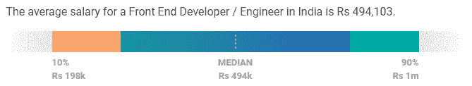
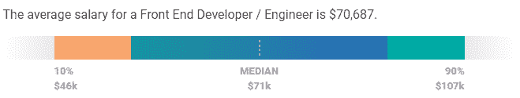
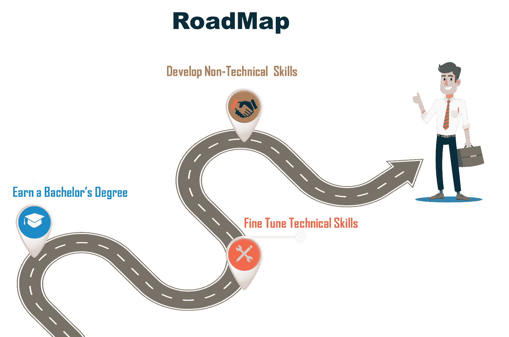
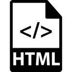

# 如何成为一名前端开发者？

> 原文：<https://www.edureka.co/blog/become-a-front-end-developer/>

据 [TechRepublic](https://www.techrepublic.com/) 报道，网页开发是 2019 年 10 大热门科技技能之一。在本文中，我们将了解如何成为一名前端开发人员。本博客中提到的所有重要工具和技术都包含在[全栈 Web 开发大师](https://www.edureka.co/masters-program/full-stack-developer-training)课程中。以下是我们将在本文中涉及的主题:

*   谁是前端开发人员？
*   [前端开发人员工作趋势](#job)
*   [前端开发人员薪资趋势](#salary)
*   [角色和职责](#roles)
*   [如何成为一名前端开发者？](#skills)
*   [雇佣前端开发人员的公司](#companies)

## 谁是前端开发人员？

前端开发人员是通过编程语言如  **[HTML](https://www.edureka.co/blog/what-is-html/) 、  [CSS](https://www.edureka.co/blog/what-is-css/) 和[JavaScript](https://www.edureka.co/blog/javascript-tutorial/)**来实现网页设计的人。前端开发人员负责网站的设计和外观。然而，后端开发人员在后台工作，比如数据库。如果你去任何一个网站，你都可以在  **导航、布局**中看到前端开发人员的工作，也可以看到一个网站与你的手机不同的外观。

网页设计是关于一个网站的外观，而  **前端开发** 则是设计如何在网站上实现。前端开发人员是负责实现的人。

## **前端开发人员工作趋势**

下表根据列出了美国不同地区的工作岗位数量。

| **地点** | **工作数量** |
| New York, NY | One thousand and forty-six |
| 华盛顿州西雅图 | Six hundred and ninety-eight |
| 加利福尼亚州旧金山 | Six hundred and fifty-nine |
| 伊利诺伊州芝加哥 | Five hundred and thirty-two |
| DC 华盛顿州 | Four hundred and seventy-eight |

来自  **美国劳工统计局** 的最新统计数据预测，到  **2026** ，与来自 **2016** 的数字相比，网络开发职位的数量将增长。

现在让我们来看看印度的工作岗位数量。

| **地点** | **工作数量** |
| 卡纳塔克邦班加罗尔 | One thousand six hundred and fifty-one |
| 泰伦加纳海得拉巴 | Six hundred and thirty-eight |
| 马哈拉施特拉邦浦那 | Six hundred and thirty-five |
| 泰米尔纳德邦钦奈 | Five hundred and eighty-seven |
| 孟买，马哈拉施特拉邦 | Five hundred and thirty-nine |

这些是前端开发人员的工作趋势。现在，让我们来看看不同的工资趋势。

## **前端开发人员薪资趋势**

一个前端开发人员的平均工资是[**印度**](https://www.payscale.com/research/IN/Job=Front_End_Developer_%2F_Engineer/Salary) 。

谈工资范围在  [**美国**](https://www.payscale.com/research/US/Job=Front_End_Developer_%2F_Engineer/Salary) 一个高级前端开发人员平均挣 101747 美元。然而，初级前端开发人员的平均收入为 **$70，687** 。

前端 web 开发人员拥有当今就业市场上最受欢迎的技能之一。根据  [Glassdoor](https://www.glassdoor.co.in/) 的数据，前端开发人员的全国收入中位数超过 7 万美元。在对顶尖技术人才竞争激烈的市场中，中位工资可能会超过 10 万美元。

您可以查看关于[前端开发人员](https://www.edureka.co/blog/front-end-developer-salary)薪资的文章，了解基于各种因素的不同薪资趋势。

## **角色和职责**

以下是前端开发人员的一些常见角色和职责:

*   **管理** 关于  **项目的复杂细节** 需要分析  **设计需求**，推荐  **技术方案** 使项目可扩展，  **可维护**，以及  **高效**。
*   解释需求和**创建项目计划**以满足进度和**质量目标**。
*   跨团队工作要  **识别**T5**解决问题**。
*   你需要**调试** 网站来修复代码中的错误，以确保它们对于网络管理员和最终用户来说是  **无错** 。
*   使用像个人电脑这样的工具和流行的软件，如  **文字处理器** 或  **记事本****编程语言编辑器**，以及不同的浏览器设置来检查跨平台的网站错误。
*   你必须具备几种  **编程语言** 的工作知识，并能适应软件的新版本。
*   熟练使用  **Office** 应用，并具备  **数据库和网络**方面的高级知识。

现在你已经了解了角色和职责，是时候了解你需要具备的不同技能了。

## **如何成为一名前端开发者？**

如果你看一下当前的前端开发人员的工作列表，你会看到有一个清晰和共同的技能池雇主正在寻找。现在大多数时候，人们都不知道从哪里开始，以及他们需要掌握什么技能才能胜任自己喜欢的工作。因此，这里有一个路线图，它将为您提供成为前端开发人员所需遵循的路径:

### ****

### **1。** **学士学位**

第一步是拿到计算机专业的学士学位。一旦你完成了毕业，你就可以掌握成为一名前端开发人员所需的重要技能

### **2。** **技术技能**

要成为一名前端开发人员，你需要掌握不同的技术技能。让我们来看看前端开发人员的 10 大重要技术[技能](https://www.edureka.co/blog/front-end-developer-skills):

*   **HTML/CSS**

**超文本标记语言** (HTML)是开发网站所需的最基本的积木。 **CSS** (层叠样式表)是用来呈现你用 HTML 创建的文档的语言。

HTML 用于创建页面的基础。而 CSS 用于创建页面的布局、颜色、字体和样式。这两种语言对于成为前端开发人员是绝对必要的。

*   **JavaScript/jQuery**

前端开发者的另一个重要工具是**JavaScript**(JS)。如果你想在你的网站上实现交互式功能，比如音频和视频，游戏，滚动能力，页面动画，JS 是你需要的工具。

JavaScript 由像  **jQuery 这样的库组成。** 它是一个插件和扩展的集合，可以让你在网站上更快更容易地使用 JS。  [jQuery](https://www.edureka.co/blog/jquery-tutorial/) 将需要多行 JS 代码的常见任务压缩成一种可以用一行代码执行的格式。

*   **框架**

**CSS** 和  **JavaScript 框架** 是通过提供通用功能来执行不同任务的 CSS 或 JS 文件的集合。您不是从一个空的文本文档开始，而是从一个已经包含大量 JavaScript 的代码文件开始。

*   **响应式设计**

我们使用电脑、手机和平板电脑等不同的小工具来浏览网页。网页会根据您使用的设备进行自我调整，而无需您付出任何额外的努力。这要归功于  **响应式设计**。它是  **CSS 框架** 的固有部分，类似于  **Bootstrap** 。

*   **版本控制/Git**

**版本控制** 是跟踪和  **控制对你的源代码的修改** 。这是一个工具，你可以使用它来跟踪以前所做的更改，这样你就可以回到你的工作的以前版本，并找出哪里出了问题，而不用把整个东西拆掉。

*   **测试/调试**

前端开发人员必须具备测试和调试代码的技能和能力。web 开发有不同的测试方法。

 [单元测试](https://www.edureka.co/blog/what-is-unit-testing)  是另一种方法，测试最小的代码位，并逐个检查它是否正确运行。测试是前端开发过程的一个重要部分，有一些框架可以帮助你。

*   **浏览器开发工具**

浏览器开发工具通常由一个检查器和一个 JavaScript 控制台组成。该检查器允许您查看页面上的运行时 HTML 是什么样子，页面上的每个元素都与什么 CSS 相关联，还允许您编辑您的  **HTML 和 CSS** ，并实时查看发生的变化。

*   **网页性能**

重要的是要确保你的网站运行顺畅，没有任何故障。  **网页性能** 定义了你的  **站点加载**所需的时间。

像  **咕噜**和  **大口** 这样的程序可以用来自动化图像优化、CSS 和 JS 缩小以及其他 web 性能杂务。这有助于提高网站的效率。

*   **CSS 预处理**

**CSS 预处理器** 是 CSS 的高级版本。这是用来增强 CSS 的初级类，以创建更好的网站版本。它不仅仅是一种改进样式元素的语言，它还帮助开发人员跳过像频繁编写  [**CSS 选择器**](https://www.edureka.co/blog/css-selectors/) 和颜色字符串这样的任务。

*   **命令行**

**GUI** 也是 web 开发和编码的重要组成部分。但是一个通用的 GUI 对于一些特定的应用程序来说会有它的局限性。有时，您可能需要打开计算机上的终端，在那里您可以输入键入的命令或命令行来获得您需要的内容。

## ****

尽管您的大部分工作都是通过 GUI 完成的，但是如果您掌握了命令行，您可以为您的前端技能增加重要的可信度。

这些是  **技术前端开发人员的一些技能**。除了这些，你还应该熟悉一些其他的  **非技术领域的** 对你的职业成长有帮助。

### **3。非技术技能**

我们有一个误解，认为开发者只需要有效地创建用户界面。但是要做出高效的产品，和客户沟通，把握思路也很重要。你应该精通  **言语和声音沟通技巧**。同样，要与团队合作，你也需要具备  **团队工作** 的基本经验。

所有开发人员都必须具备的一件事，无论职位描述还是官衔，那就是优秀的 **解题** 技能。从弄清楚如何最好地实现一个设计，到修复突然出现的错误，到弄清楚如何使你的前端代码与正在实现的后端代码一起工作，开发都是关于创造性地解决问题。

## **雇佣前端开发人员的公司**

一些招聘前端开发人员的顶级公司包括:

*   **凯捷**
*   IBM
*   埃森哲
*   **ICS 咨询服务**
*   **甲骨文**
*   **新软科技**
*   **Genpact**

说到这里，我们的文章就到此为止了。如果您想成为一名前端开发人员，我希望您了解路线图和需要掌握的技能。今天就从[前端开发实习](https://www.edureka.co/internship/full-stack-web-development)计划开始你的职业旅程。

*查看我们的  [全栈 Web 开发人员硕士课程](https://www.edureka.co/masters-program/full-stack-developer-training) ，该课程包含讲师指导的现场培训和真实项目体验。本培训使您精通使用后端和前端 web 技术的技能。它包括关于 Web 开发、jQuery、Angular、NodeJS、ExpressJS 和 MongoDB 的培训。*

有问题要问我们吗？请在这个博客的评论部分提到它，我们会给你回复。