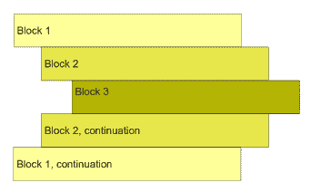
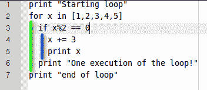
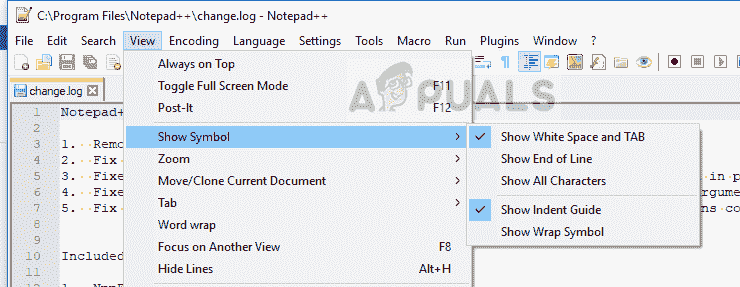

# 如何避免 Python 中的缩进错误

> 原文：<https://www.edureka.co/blog/indentation-error-in-python/>

Python 是当今编程世界中领先的新兴编程平台之一。凭借其大量的功能和极大的灵活性，如果知道如何操作，人们可以在这个平台上取得很大成就。在这个缩进错误中，Python 中的以下指针将被覆盖。

*   [缩进的小介绍](#ASmallIntroduction)
*   [Python 中缩进错误的原因](#ThecauseofIndentationErrorinPython)
*   [压痕错误的解决方案](#SolutiontotheIndentationError)
*   [第二种解决方案](##2Solution)
*   [结论](#Conclusion)

我们从所有专业水平和经验的程序员那里得到的最有趣的问题之一是如何修复 python 中的缩进错误，在本文中，我们将对此进行更详细的讨论。

让我们开始吧！

## **缩进的小介绍**

在我们深入到为什么会发生缩进错误的细节之前，让我们先熟悉一下 Python 的基本概念。

Python 作为一种编程语言在 1991 年首次推出，从那以后，世界各地的程序员都适应了它，并为 web 和移动设备创建了各种应用程序。在 Python 中，你输入的所有代码都是通过正确的**空格**排列的，因此，如果在任何情况下你有一个错误的缩进，整个代码都不会运行，解释器将简单地返回一个错误函数。

关于缩进错误的一个小常识是，无论你是编程专家还是新手，这种错误总会在某个时候发生。

Python 在安排代码时遵循了 **PEP8 whitespace** 道德规范，因此建议每次迭代之间应该有 4 个空格，任何没有这个的替换都将返回错误。

继续这篇关于 Python 中识别错误的文章

## **Python 中缩进错误的原因**

正如引言中提到的，缩进错误的主要原因之一是代码行之间缺少制表符或空格。由于 python 使用过程化语言，如果您错过了在代码行之间添加制表符或空格，那么您很可能会遇到这个错误。虽然在某些情况下，整个程序会正确运行，但在其他情况下，错误会在执行过程中出现，因此会暂停整个过程。

下面提到了 Python 中缩进错误的一些常见原因:

*   在编码的时候，你同时使用了制表符和空格。虽然理论上两者的作用是一样的，但是如果在代码中交替使用，解释器会弄不清使用哪种变化，从而返回一个错误。
*   编程时，你把缩进放在了错误的地方。由于 python 在安排代码时遵循严格的准则，如果您在错误的位置放置了任何缩进，缩进错误在大多数情况下是不可避免的。
*   有时，在完成一个长程序的过程中，我们往往会遗漏复合语句的缩进，例如 for、while 和 if，这在大多数情况下会导致缩进错误。
*   最后但同样重要的是，如果你忘记使用用户定义的类，那么很可能会弹出一个缩进错误。

**了解我们在顶级城市/国家的 Python 培训**

| **印度** | **美国** | **其他城市/国家** |
| [班加罗尔](https://www.edureka.co/python-programming-certification-training-bangalore) | [纽约](https://www.edureka.co/python-programming-certification-training-new-york-city) | [英国](https://www.edureka.co/python-programming-certification-training-uk) |
| [海德拉巴](https://www.edureka.co/python-programming-certification-training-hyderabad) | [芝加哥](https://www.edureka.co/python-programming-certification-training-chicago) | 伦敦 |
| [德里](https://www.edureka.co/python-programming-certification-training-delhi) | 亚特兰大 | [加拿大](https://www.edureka.co/python-programming-certification-training-canada) |
| [钦奈](https://www.edureka.co/python-programming-certification-training-chennai) | [休斯顿](https://www.edureka.co/python-programming-certification-training-houston) | [多伦多](https://www.edureka.co/python-programming-certification-training-toronto) |
| [孟买](https://www.edureka.co/python-programming-certification-training-mumbai) | 洛杉矶 | [澳大利亚](https://www.edureka.co/python-programming-certification-training-australia) |
| [浦那](https://www.edureka.co/python-programming-certification-training-pune) | [波士顿](https://www.edureka.co/python-programming-certification-training-boston) | 阿联酋 |
| 加尔各答 | [迈阿密](https://www.edureka.co/python-programming-certification-training-miami) | [迪拜](https://www.edureka.co/python-programming-certification-training-dubai) |
| 艾哈迈达巴德 | [旧金山](https://www.edureka.co/python-programming-certification-training-san-francisco) | [菲律宾](https://www.edureka.co/python-programming-certification-training-philippines) |

## **压痕错误的解决方案**

现在，您已经知道了为什么首先会产生这个错误，让我们来探索一些解决方案。

### **#1 解决方案**

虽然没有快速解决这个问题的方法，但是在寻找缩进错误的解决方案时，您需要记住的一件事是，您必须逐个检查每一行，找出哪一行包含错误。

在 Python 中，所有的代码行都是按照块来排列的，所以你更容易发现错误。例如，如果您在任一行中使用了 if 语句，那么下一行肯定有缩进。

看看下面的例子。

如果你需要关于缩进的正确形式的指导，看看下面的例子。

### **#2 溶液**

如果上面提到的解决方案对你不起作用，并且你很难找出你在哪一行漏掉了缩进，那么按照下面的步骤做。转到您的代码编辑器的设置，并启用显示标签和**空格**的选项。一旦这个特性被打开，你会在你的代码之间看到一个个小点，每个点代表一个空格或者一个制表符。如果您看到一个点在它应该在的地方不见了，那么这一行可能有缩进错误。

要启用该选项以查看选项卡或**空白区域**，请看下图。

解决这个问题的另一个选择是使用 Python 解释器中内置的缩进指南。

启用此选项将引导每一行代码，并显示您的错误所在。尽管考虑到您的程序包含多行代码，这种方法的效率非常低，但这是找到并修复所有现有错误的最可靠的方法。

**结论**

Python 是最流行和适应性最强的编程语言之一。它支持多种编程风格和语言，很容易成为全世界开发人员和编码人员的首选。但即便如此，Python 中的缩进错误，每个人偶尔都会遇到。

使用上面提到的解决方案，您可以轻松地修复 Python 中的缩进错误，并在未来继续高效地编程。万事如意。要了解更多信息，请加入我们的 [Python 大师课程](https://www.edureka.co/masters-program/python-developer-training)。

至此，我们结束了 Python 文章中的缩进错误。 *要深入了解 Python 及其各种应用，您可以立即注册参加在线直播的 [Python 培训](https://www.edureka.co/python-programming-certification-training)，该培训提供全天候支持和终身访问。*

如果你想在这个令人兴奋的领域拓展你的业务，试试我们的[人工智能课程](https://www.edureka.co/executive-programs/machine-learning-and-ai)。它是与瓦朗加尔的国家技术学院 E & ICT 学院合作提供的。这个执行硕士课程为学生提供了推进职业发展所需的工具、技术和工具的信息。

<iframe class="ginger-extension-definitionpopup" style="display: none;">
 </body> </html></iframe>