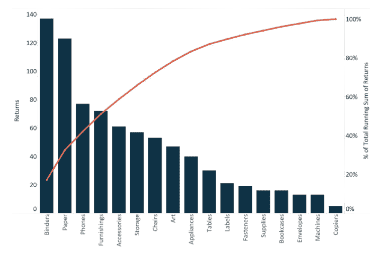
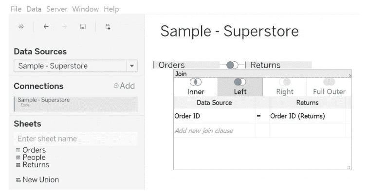
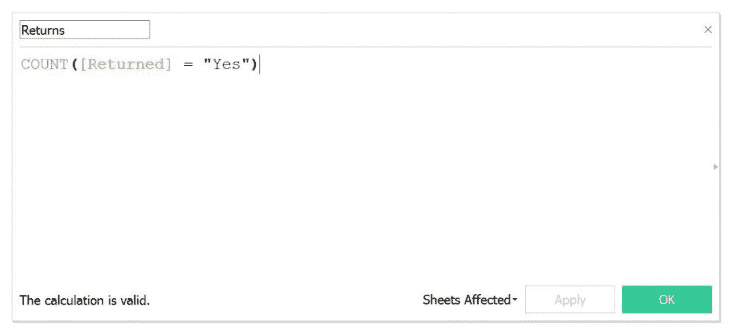
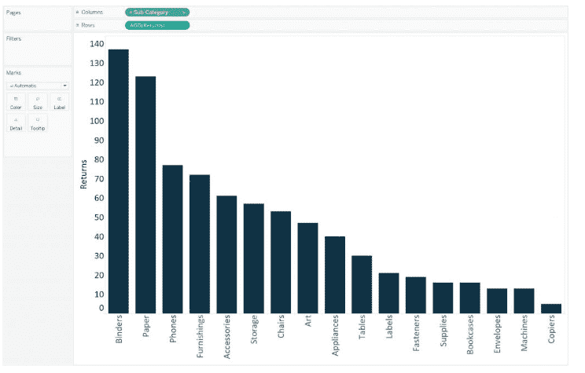
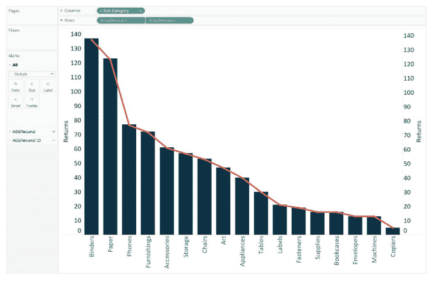
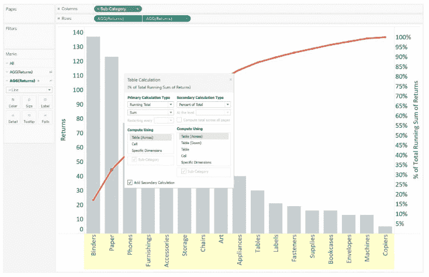
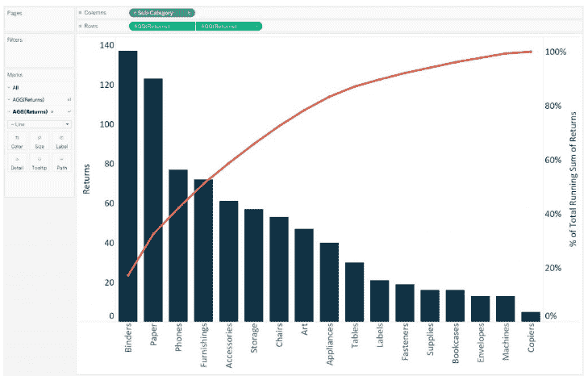

# 如何在 Tableau 中创建帕累托图？

> 原文：<https://www.edureka.co/blog/pareto-charts-tableau/>

一个 ***帕累托图*** 是双轴组合图。Tableau 中的[图表用于突出显示对所讨论的度量有最大影响的维度成员。它以维尔弗雷多·帕累托的名字命名。 这是你在任何](https://www.edureka.co/blog/tableau-charts/) [***Tableau 认证培训中学到的比较关键的东西之一。***](https://www.edureka.co/tableau-training-for-data-visualization)

那么，让我带你通过步骤来建立一个 ***帕累托图中的*** 。

*   [什么是帕累托图？](#whatisparetochart)
*   [左连接退货表到订单表](#leftjoin)

*   [创建一个计算字段来统计退货数量](#calculatedfield)
*   [构建帕累托图](#paretochart)

我们开始吧。

## **什么是帕累托图？**

帕累托图是 Tableau 中的双轴组合图。在其主轴上，条形用于显示每个维度的基本原始数量，通常按降序排序，在副轴上，线形图用于以百分比格式显示累积总量。现在，虽然这种图表类型有多种用途，但它最广为人知的是作为质量控制的七种基本工具的一部分。因此，它传统上用于确定最大的改进机会。

我将坚持质量控制方案。本文将使用 ***在 [Tableau 桌面](https://www.edureka.co/blog/tableau-tutorial/)上已经可用的示例超市*** 。我们将使用这个数据集来查看哪些产品子类别提供了最多的返回项目。最终的图表将如下图所示；

首先，本教程需要采取两个额外的步骤来准备数据。

## **1。将退货表连接到订单表**

在这一步中，您需要右键单击 Sample Superstore 数据连接并选择 *Edit data source* 。一个新的界面将会出现。

现在，您可以将*退货*表拖到*订单*表旁边，并在*订单 ID* 上设置一个左连接。

## **2。创建一个计算字段来计算退货数量**

用于计算的公式如下:

*计数([Returns] = "是")*

现在，我们已经准备好绘制帕累托图了。

## **3。构建帕累托图**

*   首先，你必须创建一个条形图，查看每个*产品子类*的退货数量，并按降序排列。您将在屏幕上看到以下结果。

*   其次，通过将*退货*度量从*度量架*拖到右轴，创建一个双轴组合图。将主轴上的标记类型更改回条形，将副轴更改为线条。 此时，viz 看起来会像下面这样；

*   现在是制作帕累托图的步骤。向此*添加一个表计算和一个二级表计算将返回*药丸。这将显示跨产品子类别的累计退货百分比。

*   要添加第一个表格计算，点击第二个返回药丸，将鼠标悬停在*快速表格计算*上，并选择*累计*。使用运行总计的表计算，您可以在结果上添加第二个表计算。 这就是我们如何计算每个产品子类别的原始运行总数，然后添加一个辅助计算来确定总数的累计百分比。

*   增加二次表计算，再次点击第二个*返回*小球，选择*编辑表计算*选项，勾选界面下方的*增加二次计算*复选框。将辅助计算类型更改为总计的*百分比。*这将显示总计的累计百分比。

在改变轴刻度线以获得更清晰的外观后，您将看到以下内容:

Tableau 中的这个 Pareto 图现在可用于绘制洞察力，例如，*“业务的三个退货率最高的产品子类别产生了大约 40%的总退货率。"*帕累托图通常是一种有效的方法，可以快速突出改进的潜力，并为企业提供一个衡量质量控制问题处理紧急程度的尺度。

[https://www.youtube.com/embed/8kfY5HU_0Ok](https://www.youtube.com/embed/8kfY5HU_0Ok)

希望你喜欢这篇文章。干杯！

*如果你希望掌握 Tableau，Edureka 有一个关于 **[Tableau 培训&认证](https://www.edureka.co/tableau-training-for-data-visualization)** 的策划课程，该课程深入涵盖了数据可视化的各种概念，包括条件格式、脚本、链接图表、仪表板集成、Tableau 与 R 的集成等等。它提供 24*7 支持，在整个学习期间为您提供指导。新的批次即将开始。*

*有问题吗？请在评论区提到它，我们会尽快回复您。*