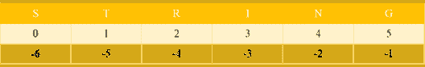

# 如何在 Python 中实现和使用字符串

> 原文：<https://www.edureka.co/blog/strings-in-python>

当我们在 Python 编程语言中播放字符串时，我们指的是连续存储在内存中的一组字符，我们可以对这组字符进行操作，例如，在索引处获取一个字符，替换一组字符，从大写转换为小写，反之亦然，等等。

*   Python 中的字符串是什么？
*   如何使用字符串、索引和切片？
*   拆分和连接字符串
*   Python 中对字符串的操作

## **Python 中的字符串是什么？**

Python 中的字符串是类的实例。这是一个内置的类，有许多帮助函数来操作字符串。字符串是不可变的，即 Python 中的字符串一旦创建就不能修改。如果修改一个字符串，它会在内存中创建一个新的字符串来存储修改后的字符串。

找出文字字符串的类型:函数 type()返回 python 中变量的类型

```
s1 = "Hello There!"
print(type(s1))
```

**输出:**

<>类‘str’

## 如何使用字符串、索引和切片？

初始化字符串的不同方式:

```
# Single quotes
str1 = 'Hi, Let us learn strings in Python'
print(str1)
# Double quotes
str1 = "Hi, Let us learn strings in Python"
print(str1)

# Single quotes within double, no need to escape them or match them
str1 = "Hello there, How's your friend? "

# Double quotes within single, no need to escape them or match them
str1 = 'Hello there, How is your friend "K"?'
str2 = 'Hello there, "How is your friend K?'
print(str1)
print(str2)

# triple quotes are multiline strings
str1 = '''Hello, welcome to
           strings in Python'''
print(str1)

str1 = """Hello, welcome to
           strings in Python"""
print(str1)
```

**输出:**

`Hi, Let us learn strings in Python`

`Hi, Let us learn strings in Python`

`Hello there, How is your friend "K"?`

`Hello there, "How is your friend K?`

`Hello, welcome to`

`           strings in Python`

`Hello, welcome to`

`           strings in Python`

**分度和切片**

*   标引用来指向一个字符串中的单个字符

*   拼接可用于根据拼接规则拾取 **子串** 或 **字符序列**

*   索引使用符号:**str**[**index**】其中 index 是从 **0** 到**len(str)–1**的数字

*   切片使用符号:**str****开始** : **停止** : **步进**】

    *   **start** :切片的开始索引，除非与 stop 相同，否则将包含该索引处的元素，默认为 0，即第一个索引。如果是负数，表示从末尾开始 n 项。

    *   **stop:** 切片的结束索引，它不包括该索引处的元素，默认为正在切片的序列的长度，即一直到并包括结尾。

    *   **第**步:指数增加的数量，默认为 1。如果是负的，你是在逆向切割 iterable。

*   切片作品超过一个 **列表** 也一样或者就此而言任何序列。在这个博客中，我们只关注字符串。

### ****

### **索引和切片示例:**

```
str1 = 'India, a nation of billion people'
print('str1: ', str1)

# print first character
print('Index 0: ', str1[0])

# print last character
print('Index -1: ', str1[-1])

# Slicing syntax [start : end : step]
# Slicing from 2nd to 4th character
print('Slice [1:5] = ', str1[1:5])

# Slicing 1st to 2nd last character
print('Slice [0:-2] = ', str1[0:-2])

# Splice a string to get characters at even index
print("Even index: ", str1[::2])

# Splice a string to get characters at odd index
print("Odd index: ", str1[1::2])

# Shortcut slicing to reverse a string
print('Reverse using slicing: ', str1[::-1])
```

**输出:**

`str1:  India, a nation of billion people`

`Index 0:  I`

`Index -1:  e`

`Slice [1:5] =  ndia`

`Slice [0:-2] =  India, a nation of billion peop`

`Even index:  Ida aino ilo epe`

`Odd index:  ni,anto fblinpol`

`Reverse using slicing:  elpoep noillib fo noitan a ,aidnI`

## **拆分和连接字符串**

*   **拆分字符串**

让我们直接看一个例子来理解如何把一个句子拆分成单词:

```
str1 = "This is the string we will split into a list of words"
# By default, split function splits on space 
list_of_words = str1.split()
print(list_of_words)
```

**输出:**

`['This', 'is', 'the', 'string', 'we', 'will', 'split', 'into', 'a', 'list', 'of', 'words']`

现在，让我们分开一个分隔符，比如说一个逗号:

```
str1 = "Literature, most generically, is any body of written works"
# Let us split on comma 
my_list = str1.split(',')
print(my_list)
```

**输出:**

`['Literature', ' most generically', ' is any body of written works']`

*   **连接字符串**

最简单的方法之一是使用可以连接两个字符串的'+'运算符:

```
str1 = 'Python'
str2 = 'Is Fun'
# Concatenate two strings
print(str1 + str2)
# More readable, concatenate 3 strings, str1, a space ' ' and str3
print(str1 + ' ' + str2)
```

**输出:**

`PythonIs Fun`

`Python Is Fun`

**关于串联的几个规则:**

*   串联仅适用于“str”对象
*   如果包含其他类型的对象，Python 将抛出错误。
*   与其他语言不同，Python 不会自动将其他类型转换为字符串
*   Python 要求使用 str()函数显式地将类型转换为字符串

以下代码失败:

```
str1 = 'Python'
str2 = ' Is Fun'
str3 = ' Percent'
print(str1 + str2 + 100 + str3)
```

**输出:**

```
---------------------------------------------------------------------------
TypeError                                 Traceback (most recent call last)
<ipython-input-32-0bf25e403437> in <module>
      2 str2 = 'Is Fun'
      3 str3 = 'Percent'
----> 4 print(str1 + str2 + 100 + str3)

TypeError: must be str, not int
```

通过将整数 100 显式转换为字符串来修复:

```
str1 = 'Python'
str2 = ' Is Fun'
str3 = ' Percent'
print(str1 + str2 + str(100) + str3)
```

**输出:**

`Python Is Fun 100 Percent`

### **连接字符串列表**

我们可以很容易地使用字符串列表来连接字符串

*   **join()** 函数可用于任何“str”类型的对象
*   join()只接受字符串列表，如果它包含非字符串项，python 将抛出一个错误

```
list_of_words = ['This', 'is', 'the', 'string', 'we', 'will', 'split', 'into', 'a', 'list', 'of', 'words']
# Start with empty string and use join function which is available on objects of type 'str' 
sentence = "".join(list_of_words)
print(sentence)
# Use a string with one space this time
sentence = " ".join(list_of_words)
print(sentence)
# Use a string with one hyphen/dash this time
sentence = "-".join(list_of_words)
print(sentence)
# You can observe that the string on which we call join is used to join the items in 'list_of_words'
```

**输出:**

`Thisisthestringwewillsplitintoalistofwords``This is the string we will split into a list of words`

## **Python 中对字符串的操作**

Python 的“str”类型有很多内置函数

*   **str.upper()**
*   **str.lower()**
*   **str.find()**
*   **str.replace()**
*   **str.split()**
*   **str.join()**
*   **更多更**

在上一节中，我们已经看到了 str.join()和 str.split()函数。我们将理解上面列出的其余函数。

```
# convert to upper case
print("python".upper())
# convert to lower case
print("PYTHON".lower())
# find index of 'th'
print('Python'.find('th'))
# replace substring '0' with '100'
print('Python Is Fun 0 Percent'.replace('0','100'))
```

**输出:**

`PYTHON`

`python`

`2`

`Python Is Fun 100 Percent`

至此，我们结束了 python 博客中的这个字符串。我希望你对 Python 中字符串的所有疑问现在都清楚了。

*要深入了解 Python 及其各种应用程序，您可以注册参加实时  **[Python 在线培训](https://www.edureka.co/python)** ，全天候支持，终身访问。*