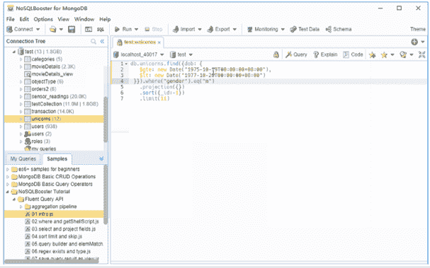
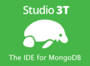
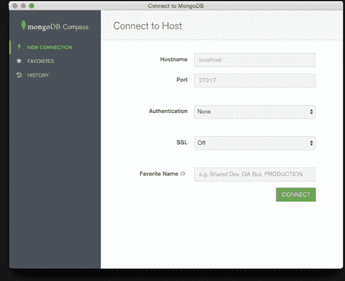
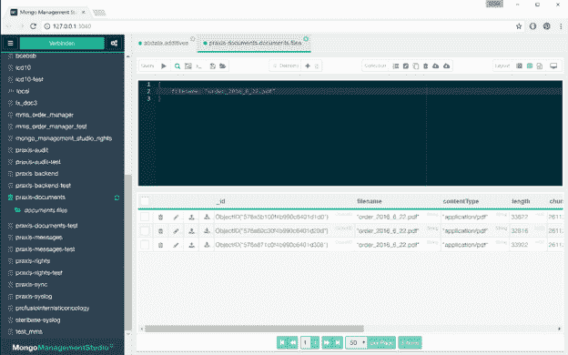

# 2019 年你需要检查的 7 个 MongoDB GUIs

> 原文：<https://www.edureka.co/blog/mongodb-guis>

MongoDB 是一个开源的关系数据库平台，已经在互联网上运行了很长时间。与市场上的其他关系数据库平台(如 MySQL)相比，它具有许多提供更高灵活性和通用性的特性。最突出的增加之一是包含了 GUI 或图形用户界面。在本文中，我们将列出 7 个最流行的 MongoDB GUIs:

## 下面是 MongoDB GUIs 列表

**NoSQLBooster**

NoSQLBooster 是 MongoDB 目前最流行的 GUI 之一。以前被称为 Mongo Booster，它是一个用于 MongoDB 的以 shell 为中心的跨平台 GUI 工具。它可以在线免费下载。

**特性**

1.  内置语言服务可以识别所有可能的完成、属性、变量、字段名、操作符，甚至是 MongoDB 集合名。

2.  它让程序员像 MongoDB shell 脚本中的构建块一样组装 npm 包。

3.  内置的可视化查询生成器有助于创建 tp 语句，即使您不了解 shell 命令及其语法。

4.  它可以将大多数 MongoDB 查询翻译成各种目标语言，包括 C#、Python、Javascript 等等。

**3T 工作室**

继 NoSQLBooster 之后，Studio 3T 是目前最流行的 MongoDB GUI。这个 GUI 是专门为在 MongoDB 平台上协作的团队构建的。

它最突出的一些特征包括:

1.  使用 Intellishell 并在平台上输入命令时实现自动完成。

2.  利用 SQL 和内部、外部连接来简化 MongoDB 中的查询。

3.  允许使用拖放字段直观地创建查询。

4.  可以为副本集和 MongoDB 实例建立安全连接。

机器人 3T

如果你是一个 MongoDB 爱好者，那么 Robo 3T，原名 Robomongo，是最适合你的 GUI 之一。Robo 3T 的特点在于它是轻量级的，是开源的，最重要的是具有跨平台支持。它还能够在其界面中嵌入 MongoShell，以支持基于 GUI 和 Shell 的交互。

Robo 3T 的一些最突出的特性包括:

1.  支持 MongoDB 4.0 及以上版本。

2.  安装后即可使用的嵌入式 shell 环境。

3.  异步非阻塞用户界面。

**核子数据库主**

Nucleon Database Master 是 MongoDB GUIs 世界的最新加入者之一。它无疑是当今市场上最强大、最易于使用的 MongoDB 管理工具之一。这种图形用户界面的特点在于，它使诸如查询、编辑、管理、监视和可视化关系型 NoSQL 数据库管理系统的操作更简单、更有效。

该图形用户界面的一些关键特性包括:

1.  支持 SQL、JSON 以及 LINQ 查询编辑器。

2.  允许用户以多种可用格式导出数据，包括 MS Office、PNG、XML、Doc、PDF、CSV、XPS 以及 dBase。

3.  它允许用户导入已经可用的数据，而没有任何大小限制。可用于导入的数据格式包括 XML、CSV 和 SQL 脚本等。

4.  该工具的其他一些显著特性包括突出显示代码、查找和替换文本以及最重要的自动代码完成。

**MongoDB 罗盘**

MongoDB Compass 是当今市场上另一个非常有效的 GUI。它最显著的特性之一是能够在不使用查询语言的情况下提供 MongoDB 模式的图形化视图。它还附带了一些功能，能够分析可用的文档，并通过内置的直观 UI 显示丰富的结构。

**特性**

1.  允许用户在任何给定的时间点直观地浏览数据。

2.  用户可以选择快速了解查询性能和服务器性能。

3.  在索引、文档验证等方面，它积极地帮助用户做出决策。

4.  它消除了编写命令行的需要。

**Mongo 管理工作室**

如果您正在寻找一款有效的 MongoDb 管理工具，那么这款工具正适合您。这个 GUI 最重要的特性之一是无需使用 MongoDB shell 就可以执行所有的 MongoDB 命令。

**特性**

1.  支持 MongoDB，3.0，3.2 以及 3.4。

2.  提供跨平台，使用户更容易在任何环境中运行它。

3.  通过使用这个 GUI，人们可以很容易地读写 GridFS 集合。

4.  它有一个内嵌编辑器，使得数据操作更加容易和有效。

**NoSQL 经理**

如果你需要一个能够将友好用户界面和 Shell 功能结合起来的图形用户界面，那么 NoSQL 管理器应该是你的首选。它最适合数据库开发人员和管理员，是目前性能最高的 GUI 之一。

**特性**

如果你正在寻找使用 NoSQL 管理器，这里有一些最突出的功能:

1.  与 GridFS 一起使用的文件管理器工具的可用性。

2.  支持副本集、共享集群连接以及独立主机。

3.  业余爱好者和专业人士都可以使用简单易用的文档查看器。

4.  内置了一个全功能的 MongoDB GUI shell，以及代码自动完成、语法突出显示等功能。

至此，我们结束了这个顶级的 MongoDB GUIs。我希望你有各种各样的图形用户界面可供选择。Edureka 还提供了 [***MongoDB 课程***。一定要看看，伙计们。](https://www.edureka.co/mongodb-certification-training)