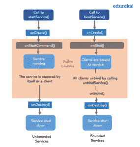
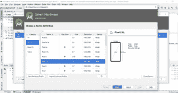
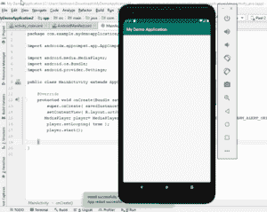
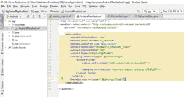
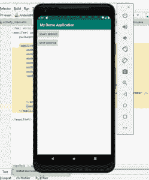

# Android 服务教程:如何在后台运行一个应用？

> 原文：<https://www.edureka.co/blog/android-service-tutorial/>

经常使用智能手机上的多个应用程序，您可能希望从一个应用程序切换到另一个应用程序，但也要确保所有应用程序在后台保持活动状态。这些无非是 *[安卓](https://www.edureka.co/blog/kotlin-android-tutorial/)* 提供的服务。因此，这篇关于 Android 服务教程的文章将帮助你理解如何使用这些服务。

我将涉及以下主题:

*   [什么是 Android 服务？](#What_are_Android_Services?)
*   [安卓服务生命周期](#Life_cycle)
*   [安卓服务方法](#Methods)
*   【Android 服务的骨架代码
*   [演示](#Demo)

## **什么是 Android 服务？**

服务基本上是一个过程。 *Android 服务*是一个在后台运行的组件，目的是在不与用户交互的情况下执行长时间运行的操作，即使应用程序被破坏，它也能工作。另一个应用程序组件可以启动一项服务，即使您切换到另一个应用程序，它也会继续在后台运行。

此外，一个组件可以将自己绑定到一个服务上，以便与它交互并执行进程间通信。

***注意:***Android . app . service 是 ContextWrapper 类的子类，Android service 不是线程或者单独的进程。

## **安卓服务生命周期**

Android 服务生命周期可以有两种形式的服务。服务的生命周期遵循两条不同的路径，即:

1.  [开始](#Started)
2.  [绑定](#Bound)

**开始**

当应用程序组件调用 *startService()* 方法时，服务被启动。一旦启动，服务可以无限期地在后台运行，即使负责启动的组件被销毁。它是通过使用 *stopService()* 方法停止的。服务也可以通过调用 *stopSelf()* 方法来停止自己。

**束缚**

当应用程序组件通过调用 *bindService()* 绑定到服务时，服务被绑定。绑定服务提供了一个客户端-服务器接口，允许组件与服务交互、发送请求和获取结果。它跨进程间通信(IPC)进行处理。客户端可以通过调用*unbindService()*方法解除服务的绑定。

****

转到本文关于 Android 服务的下一部分，让我们讨论服务类下不同的方法。

## **安卓服务教程:方法**

有几种方法可以让您轻松地对任何应用程序执行操作。其中一些是:

| 方法 | 描述 |
| **onStartCommand()** | 当任何其他组件(比如一个活动)请求启动服务时，通过调用  *startService()* 来调用该方法。当使用 *stopSelf()* 或*stop service()*方法完成相应的工作时，停止服务是您的责任。 |
| **onind()** | 当另一个组件想要通过调用  *bindService()* 与服务绑定时，调用此方法。要实现这一点，您必须提供一个客户端使用的接口，以便与服务进行通信。它返回一个*I binder*对象。如果不想允许绑定，那么返回  *null* 。 |
| **onUnbind()** | 当所有客户端都与服务发布的特定接口断开连接时，系统调用此方法。 |
| **onRebind()** | 当新的客户端连接到服务时调用此方法，在此之前已经通知所有客户端在*【onUnbind(Intent)*中断开连接。 |
| **onCreate()** | 当首次使用*onstart command()*或  *onBind()* 创建服务时，系统调用该方法。需要执行一次性设置。 |
| **onDestroy()** | 当服务不再被使用并且正在被销毁时，调用此方法。您的服务应该实现这一点，以便清理任何资源，如线程、注册的侦听器、接收器等。 |

## **骨架代码**

```
public class MainActivity extends Activity {

private TextView textView;
private BroadcastReceiver receiver = new BroadcastReceiver() {

@Override
public void onReceive(Context context, Intent intent) {
Bundle bundle = intent.getExtras();
if (bundle != null) {
String string = bundle.getString(DownloadService.FILEPATH);
int resultCode = bundle.getInt(DownloadService.RESULT);
if (resultCode == RESULT_OK) {
Toast.makeText(MainActivity.this, "Download complete. Download URI: " + string, Toast.LENGTH_LONG).show();
textView.setText("Download done");
} else {
Toast.makeText(MainActivity.this, "Download failed",
Toast.LENGTH_LONG).show();
textView.setText("Download failed");
}
}
}
};

@Override
public void onCreate(Bundle savedInstanceState) {
super.onCreate(savedInstanceState);
setContentView(R.layout.activity_main);
textView = (TextView) findViewById(R.id.status);
}

@Override
protected void onResume() {
super.onResume();
registerReceiver(receiver, new IntentFilter(
DownloadService.NOTIFICATION));
}
@Override
protected void onPause() {
super.onPause();
unregisterReceiver(receiver);
}

public void onClick(View view) {

Intent intent = new Intent(this, DownloadService.class);
// add infos for the service which file to download and where to store
intent.putExtra(DownloadService.FILENAME, "index.html");
intent.putExtra(DownloadService.URL, "www.edureka.co");
startService(intent);
textView.setText("Service started");
}
}
```

在这个例子中，你可以看到像 *onCreate()* 、 *onResume()* 、 *onPause()* 这样的方法。这些方法构成了 Android 中服务的结构。

现在，进入这个 Android 服务教程的实际部分，让我们看看如何创建和处理服务。

## **演示**

我们来看看如何在后台播放音乐。为了做到这一点，我将使用 *[和](https://www.edureka.co/blog/android-studio-tutorial/)和*工作室。

### **第一步**

创建一个新的空项目。给你的项目命名，点击 Java 文件夹，点击 *MainActivity* 。首先，添加 *MediaPlayer* ，这样你就可以导入播放器的细节，比如开始，设置循环等等。

```
package com.example.mydemoapplication;

import androidx.appcompat.app.AppCompatActivity;

public class MainActivity extends AppCompatActivity {

@Override
protected void onCreate(Bundle savedInstanceState) {
super.onCreate( savedInstanceState );
setContentView( R.layout.activity_main );

MediaPlayer player = MediaPlayer.create( this, Settings.System.DEFAULT_ALARM_ALERT_URI );
player.setLooping( true );
player.start();
}
}
```

***注意:如果是第一次使用，别忘了启用 BIOS。您可以通过重启系统来实现这一点。***

您必须添加一个虚拟设备。只需点击*打开 AVD 管理器。*



选择您喜欢的设备，您就可以开始了！



这只会在屏幕处于活动状态时运行，但是为了让这个应用程序在后台也能工作，您需要在 *activity_main.xml* 文件中再添加几行代码。

### **第二步**

一旦您运行相应的代码，您将能够运行该应用程序，并能够在后台播放音乐，即，如果打开任何其他应用程序，该音频仍将播放。

让我们看看如何做到这一点。

*   在 Java 文件夹中创建另一个类，并命名为。在这里，我把它叫做“ *MyService* ”。
*   这个类扩展了服务类。
*   一旦有了服务类方法，通过点击 ***alt+Enter 来实现这些方法。***
*   在此之后，您必须覆盖这些方法。因此，右键单击窗口以获得选项。
*   生成覆盖方法，选择 *onStartCommand()* ，和 *OnDestroy()。*
*   通过添加以下代码来编辑 *onStartCommand()* 方法。：

```
MediaPlayer player = MediaPlayer.create( this, Settings.System.DEFAULT_ALARM_ALERT_URI );
player.setLooping( true );
player.start();
```

***注意:*** 在*主活动中删除此代码。*

*   这将引发一个错误，要求您删除该语句。因此，删除 return 语句，将 MediaPlayer 声明为私有方法，并返回 *START_STICKY* 。这将返回开始状态。
*   在 *onDestroy()* 方法中添加 *player.stop()* 。

### **第三步**

进入 *res* 并进入 layouts，点击 *android_main.xml* 获取应用的 xml 文件。

*   移除 TextView，用 LinearLayout 和 add 按钮替换它。添加相应的代码。

```
<LinearLayout
  android:orientation="vertical"
  android:layout_width="match_parent"
  android:layout_height="wrap_content"
  android:layout_centerVertical="true"
  tools:ignore="MissingConstraints">
    <Button
  android:id="@+id/buttonStart"
  android:text="Start Service"
  android:layout_width="wrap_content"
  android:layout_height="match_parent"/>
    <Button
  android:id="@+id/buttonStop"
  android:text="Stop Service"
  android:layout_width="wrap_content"
  android:layout_height="match_parent"/>
</LinearLayout>
```

*   一旦你这样做了，回到 *MainActivity* 类并添加相应的代码，以便链接 XML 文件和 *MyServiceClass。*

```
package com.example.newproject;

import androidx.appcompat.app.AppCompatActivity;

public class MainActivity extends AppCompatActivity implements View.OnClickListener {
private Button start, stop;

@Override
protected void onCreate(Bundle savedInstanceState) {
super.onCreate( savedInstanceState );
setContentView( R.layout.activity_main );

start=(Button) findViewById( R.id.buttonStart );
stop= (Button) findViewById( R.id.buttonStop );

start.setOnClickListener( this );
stop.setOnClickListener( this );

}

@Override
public void onClick(View view) {
if(view == start){
startService(new Intent( this, MyServiceClass.class ) );
}else if (view == stop){
stopService(new Intent( this, MyServiceClass.class ) );

}
}
}
```

### **第四步**

一旦你完成了类的链接，让我们运行代码。

***注意:在 AndroidManifiest.xml 文件中添加服务类名。***



接下来，让我们运行代码。



一旦启动该服务，即使打开了另一个应用程序，它也将在后台运行。您可以通过点击按钮来启动或停止服务。

这是一个简单的演示，你已经学会了如何使用 Android 服务。

就这样，我们来到了这篇关于“Android 服务教程”的文章的结尾。我希望你清楚这篇博客的主题。

*现在你已经浏览了我们的 Android Services 教程博客，你可以查看 Edureka 的  [Android App 开发认证培训](https://www.edureka.co/android-development-certification-course)* 来快速开始你的学习。

*有什么疑问吗？不要忘记在这篇“Android 服务教程”博客的评论中提到它们。我们会回复你的。*