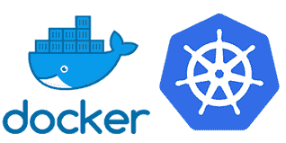

# DevOps 专业人员的重要先决条件是什么？

> 原文：<https://www.edureka.co/blog/prerequisites-for-devops/>

本文将讨论 DevOps 的先决条件，同时提供所有信息帮助您开始使用 [DevOps](https://www.edureka.co/blog/what-is-devops/) 。本文将涉及以下几点:

*   [什么是 DevOps？](#WhatisDevOps?)
*   谁是 DevOps 工程师？
*   [devo PS 工程师必备条件](#PrerequisitesofaDevOpsEngineer)

为了平稳高效地运行业务流程，软件开发方法需要不断更新。DevOps 就是这样一种工具，它确保了卓越、快捷和高效的服务，并让高端客户满意。DevOps 已经成为最近 IT 市场上的一个亮点。因此，在各种行业的组织中，对开发、监督和处理 DevOps 实践的工程师的需求正在增加。为了满足这一需求并提高自身的效率，组织正在招聘熟练的 DevOps 工程师。为了利用这个蓬勃发展的机会，人们必须知道 DevOps 做什么和需要的先决条件。

让我们更深入地了解开发运维的先决条件

## **什么是 DevOps？**

DevOps(开发操作)是一种创新的开发方法，它由几组同步的过程组成，以集成开发团队和过程来补充软件开发。DevOps 的需求量很大，因为它带来了高速度和准确性，在开发和 it 运营之间建立了一种关系，允许组织以比现有的传统软件开发方法相对更快的速度创建和修改他们的产品。

不同团队的强大联盟——开发、测试和运营——是其独特的概念。这种强有力的团队协作可以快速识别和解决错误。在 DevOps 场景中，代码被持续开发、测试、集成、部署和监控，以在更短的时间内提供标准输出。

让我们看看谁是 DevOps 工程师

## 谁是 DevOps 工程师？

事实上，DevOps 工程师没有正统的职业课程。他可以是一名 IT 专业人员——开发人员或系统管理员，以扩展对 DevOps 的巧妙渐进发展的责任。

DevOps 工程师的主要职责是-

*   IT 基础设施的管理
*   选择正确的部署模式
*   执行测试协议和关键监控

现在，让我们继续了解 DevOps 工程师的先决条件

## **devo PS 工程师必备条件**

由于 DevOps 工程师在任何组织中都扮演着非常关键的角色，因此一个人必须在各种技术和个人技能方面达到完美，如编码、流程再造和协作。DevOps 工程师的一些先决条件是-

#### **集装箱**

容器是 DevOps 工程师简历中最需要的资产之一。容器使开发人员能够从笔记本电脑上生成应用程序并将其安装到服务器上。这个工具改变了应用程序的创建、运行和发布的整个场景。由于能够提供精确和定向的环境，它已成为 DevOps 技术中最实用的进步之一。

#### **对编程语言的掌握**

DevOps 工程师必须具备 Java、Perl 和 Python 等某些基本编程语言的基础知识，因为这可以确保 DevOps 工程师很好地管理开发团队，从而实现应用程序安装、配置和验证的统一无故障流程。一个伟大的 DevOps 工程师也应该是一个脚本专家，因为他必须能够编写代码来自动化可重复的过程。

#### **理解工具和技术**

开发、测试、集成、观察、形成等各种具体操作依赖于各种 DevOps 工具。DevOps 工程师应该对 Ansible、Chef、Docker、ELK Stack GIT、Jenkins、Puppet、Selenium 和 Splunk 等流行工具有透彻的理解。他或她应该渴望学习新技术，提供新颖的解决方案和建议，并能适应挑战。

#### **DevOps 培训和认证**

DevOps 工程师相当关键和重要的资格之一是 DevOps 培训和认证。它提供了一个有效的途径来学习 DevOps 的各种流程——基础知识、DevOps 工具、生命周期、工作流和其他流程。海德拉巴是目前印度 DevOps 培训课程的中心。DevOps professional 认证是一个巨大的优势，因为它标志着技能的升级以及提高业务范围的能力。人们通过处理实时项目工作获得宝贵的实践经验，并在培训中接触到项目的真实环境。

#### **自动化工具知识**

全面掌握自动化工具和技术是非常必要的，因为现在一切都是自动化的，DevOps 工程师必须在开发、测试和操作的不同层面上熟练处理自动化流程。对基础设施自动化有清晰全面的了解，例如应用和系统的创建和配置、应用部署等。鼓励保持更好流程的能力。他或她必须对 Jenkins、Bamboo、Hudson 思想作品和其他工具有全面的了解才能前进。

#### **测试**

DevOps 工程师负责各级测试程序的正确管理。因此，对他或她来说，掌握测试工具和其他应用程序的知识是必不可少的。这也使他能够很容易地识别任何阶段的错误——因此调试和解决变得容易。

继续这篇关于 DevOps 先决条件的文章，

#### **出色的合作**

使 DevOps 工程师成为高效工程师的两项个人技能是——出色的协作和沟通技能，因为 DevOps 的目标是协作支持服务。优秀的沟通技巧有助于避免任何误解，并有助于敏捷运作。适应性强使 DevOps 工程师能够快速地获得新工作，并在需要时将他们的技能分享到各个领域。一个好的 DevOps 工程师必须是一个问题解决者，无论是在云端还是在现实生活中。

#### **掌握人脉**

DevOps 工程师还应掌握网络技术，因为高效的网络技术能够按照预期的设计和规划将最终开发、应用或服务提升到客户的环境中。

#### **逻辑态度**

良好的理性、逻辑和全面的观点也是成为一名成功的 DevOps 工程师所需的特质，因为有时为了组织的顺利和成功运作而做出即时决策是他或她的唯一责任。优秀的领导素质加上高超的沟通能力和专业技能是 DevOps 工程师成功的原因。

#### **激情**

作为一个对自己的工作充满热情的候选人，这是成功解除任何麻烦的最终关键，肯定会击中靶心。这是绝不能忽视的首要前提，即使是在数字云和编码的世界里。

这就把我们带到了这篇关于 DevOps 先决条件的文章的结尾。

*查看由 Edureka 提供的* *[DevOps 专业证书课程](https://www.edureka.co/executive-programs/purdue-devops)培训，edu reka 是一家值得信赖的在线学习公司，拥有遍布全球的 25 万多名满意的学习者。Edureka DevOps 认证培训课程帮助学员了解什么是 DevOps，并获得各种 devops 流程和工具方面的专业知识，例如 Puppet、Jenkins、Nagios、Ansible、Chef、Saltstack 和 GIT，用于自动化 SDLC 中的多个步骤。你也可以看看我们的 [DevOps 工程师课程](https://www.edureka.co/masters-program/devops-engineer-training)。它将帮助您获得 DevOps 工具方面的专业知识。*

*有问题吗？请在评论区提到它，我们会给你回复。*