# 有哪些常见的 Git 错误，如何修复？

> 原文：<https://www.edureka.co/blog/common-git-mistakes/>

随着 [***DevOps***](https://www.edureka.co/devops-certification-training) 技术的蓬勃发展，任何 it 人员都不可避免地要同时处理多个数据，而且您的数据会随着时间不断发展。跟踪数据中的每一个变化并准备好在需要时撤销或恢复任何不希望的变化也是非常重要的。

我必须承认，在 Git 中版本化我的数据允许我在项目开发中更具实验性。如果我搞砸了，我知道 git 总是有办法撤销和/或恢复我的项目版本到我搞砸之前的样子。每个 [Git 工作流](https://www.edureka.co/blog/how-to-use-github/)层都被设计为允许在下一阶段移动数据之前，对数据更改进行检查、修改和/或更正。以下是这篇博客中提到的错误:

**从索引** 中卸载文件/目录

在添加和/或修改文件时，您通常倾向于使用“git add”命令的默认行为，即将所有文件和目录添加到索引中。 很多时候，你会觉得有必要在提交文件之前最后一次卸载或修改某些文件。

**语法:** `git reset <filename/dirname>`

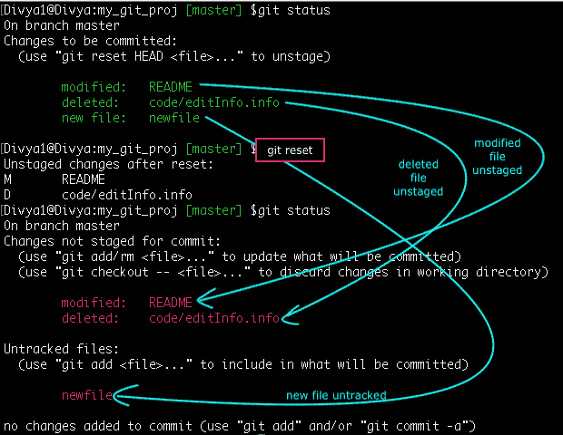

在提交到本地存储库之前，从索引区卸载文件为您提供了另一个重新处理数据的机会。

**编辑最后提交的消息**

**命令:** `git commit --amend` 您可以编辑最新的提交消息，而无需创建新消息。为了列出提交日志，我设置了一个别名“hist”:**命令:** `git config --global alias.hist 'log --pretty=format:"%C(yellow)%h%Creset %ad | %C(green)%s%Creset%C(red)%d%Creset %C(blue)[%an]" --graph --decorate --date=short'x`

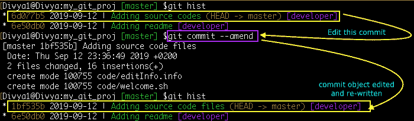

不要修改已经推送到远程存储库并与其他人共享的提交消息，因为这将使先前的提交历史无效，从而可能影响基于此的任何工作。

**忘记了上次提交的一些修改**

假设您忘记进行一些修改，并且已经提交了您的快照，并且您不想再次提交以突出您的错误。 **命令:** `git commit --amend`

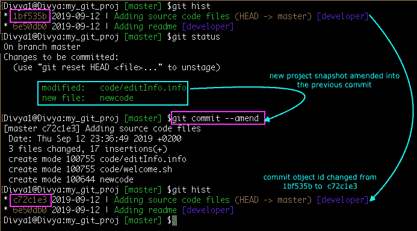

我强调了最近提交对象的 sha-1 id 是如何被重新创建和更改的。我假装进行了一次提交，将两个更改混合为一个。

## **放弃局部修改**

因此，这里有一个例子，我修改了“README”文件并将其暂存。接下来，我第二次修改了同一个文件，但是意识到我不想要第二次修改。 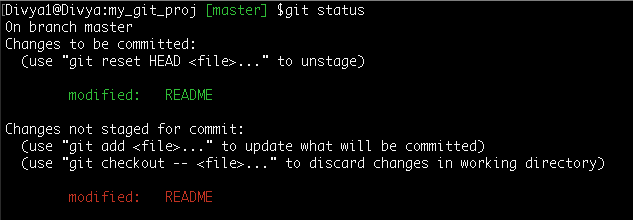 现在，让我不要手动撤消整个更改，我可以简单地提取文件的暂存版本。 **语法:**`git checkout -- <filename>`–本地修改一个文件`git checkout -- <dirname>`–本地修改目录中的所有文件

**命令:** `git checkout -- README` 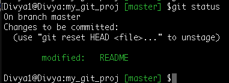

因此，我放弃了对文件的最后更改，接受了文件的暂存版本。在下一次提交时，只有文件的暂存版本进入本地存储库中。

## **向本地存储库提交个人数据**

我想从本地存储库中删除某些数据，但将文件保留在工作目录中。 **语法:** `git reset --mixed HEAD~` `git reset --mixed <commit-id>`

**命令:** `git reset --mixed HEAD~1` HEAD~1 表示当前分支头指向的最近提交之前的提交。

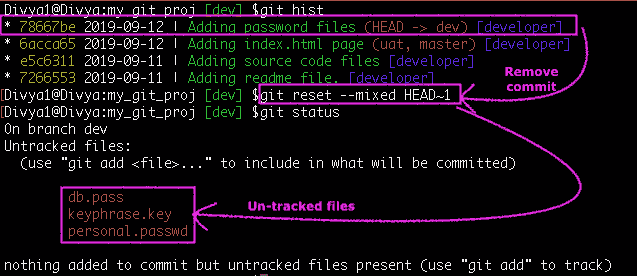

当前快照中的文件已从本地存储库和临时区域中删除。在全局中添加以下模式。gitignore 文件来排除它们被 git 跟踪。`vim ~/.gitignore_global``# password files #``*.pass``*.key``*.passwd`

这样，包含密码文件快照的提交将被删除，您将获得一个干净的临时区域。我的文件仍然存在于我的工作目录中，但不再存在于本地存储库中，也不会被推送到远程存储库中。

**注意:**如果您丢失了它们，git 无法为您找回它们，因为它对此一无所知。

## **用新提交替换最新提交**

**语法:** `git reset --soft [ <commit-id>/HEAD~n>]`

“–soft”选项只是从本地存储库中删除提交的文件，而这些文件仍存放在索引中，您可以在检查后重新提交它们。<commit-id>是要从本地存储库中删除的快照的 sha-1。其中 n 是头提交之前的提交次数</commit-id>

**命令** : `git reset --soft HEAD~1`

修改文件并再次登台 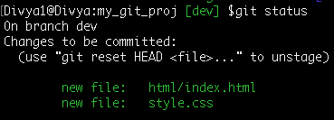

**命令:** `git commit -m 'Adding index.html and style.css'` 你的提交历史现在变成了:

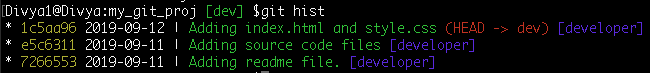

## **提交了错误的数据**

**语法:**`git reset --hard HEAD~n`–在最近提交的快照 `git reset --hard <commit-id>`之前将项目重置为“n”次提交–将项目重置为给定的提交 id 快照

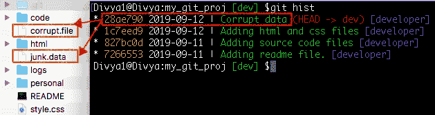

**命令:** `git reset --hard HEAD~1`

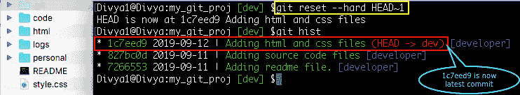 从本地存储库、暂存区以及工作目录中删除最新提交和损坏的文件。

注意:这是一个危险的命令，因为你最终会丢失工作目录中的文件。不建议在远程共享存储库中使用。

## **回到我原来的项目状态**

您可以跳转到项目在时间历史中的旧状态。如果您在最新版本中搞砸了，或者需要在旧的代码中进行增强，您可能想要从旧的项目快照中创建另一个分支，以便不妨碍您当前的工作。让我们看看如何: a .列出项目历史并决定较旧的提交 id，命令:`git hist` b .从提交 id: `git checkout -b old-state e7aa9a5` 中创建另一个分支 c .继续处理代码并在以后与“主”分支合并/重组。

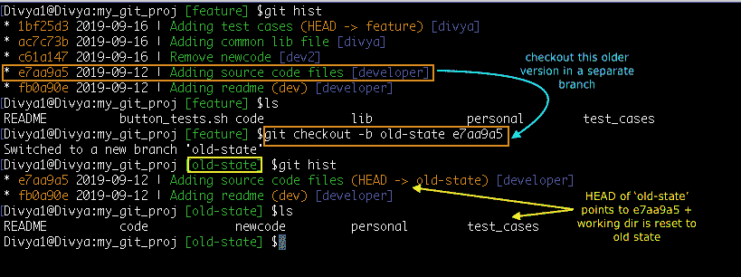

## **恢复删除的本地分支**

可以在参考分支上重新生成丢失的工作。比方说，我删除了分支‘old _ code’而没有与主分支合并，并且丢失了工作。不，我也没有将分支推送到远程存储库，然后呢？好吧，git 跟踪并记录每个引用的所有更改，让我们看看我的:`git reflog`

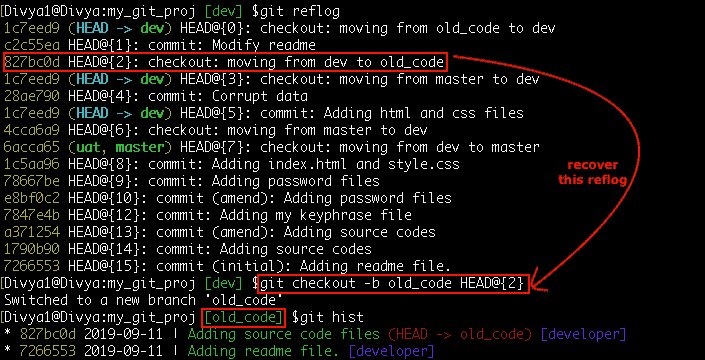

因此，HEAD@{2}是我移动到“old_code”分支时的指针，让我们恢复它:

语法:`git checkout -b <branch-name> <commit-id>` 命令:`git checkout -b old_code HEAD@{2}`

您现在必须在“old_code”分支中，并且在它创建时有您的最新工作。此外，头@{1}处的“reflog”指针是最近在“old_code”分支上进行的提交。要恢复这个唯一的提交，只需运行命令:`git reset --hard HEAD@{1}.`这也会恢复工作目录中修改过的文件。

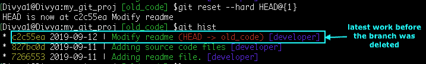

如果你想详细了解这个命令是如何工作的，以及你如何管理“reflog”条目，你也可以看看我之前关于从 git ref log中恢复被删除的分支的帖子。

## **撤销提交中所做的更改**

git revert 用于记录一些新的提交，以逆转一些早期提交的效果。 **语法:** `git revert <commit-id>` 从我的提交日志中，我想撤销在突出显示的提交 id 中所做的更改: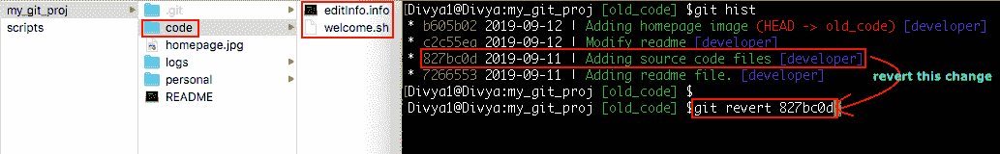

**命令:** `git revert 827bc0d`

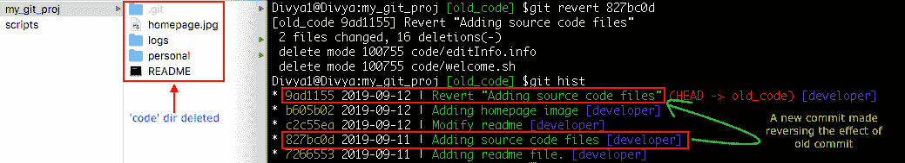

最好不要“硬”重置共享提交，而是“git revert”它们以保存历史，这样所有人都可以更容易地跟踪历史日志，以找出还原了什么、由谁还原以及为什么还原？

您可以使用相同的逻辑来引用关于 HEAD 指针的提交，而不是给出提交 id，如 HEAD~3 或 HEAD~4 等等。

## **给我的分支起了一个错误的名字**

您可以重命名本地分支名称。这种情况会发生很多次，您可能希望根据您正在处理的问题来重命名您的分支，而不必经历将所有工作从一个位置迁移到另一个位置的痛苦。例如，您可以在同一个分支上，也可以在不同的分支上，仍然能够重命名所需的分支，如下所示: **语法:** `git branch -m <old_name> <new_name>` **命令:** `git branch -m old_code old_#4920`

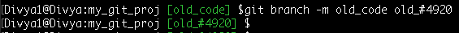

您可能想知道 git 是否跟踪这个重命名？是的，它指的是你的“reflog”条目，这是我的:

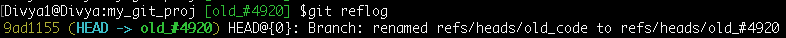

重命名分支不会影响其远程跟踪分支。我们将在远程部分看到如何替换远程存储库上的分支

## **在推送到远程之前重新排列历史日志**

我多么希望我能比别人更早地犯下某些错误，而不是犯下某些错误。交互式地重新排列和编辑旧的提交，以有效地修复或增强代码 **语法:** `git rebase -i <after-this-commit_id>` **命令:**`git rebase -i fb0a90e`–开始对在 commit-id fb0a90e 之后进行的提交进行重新调整

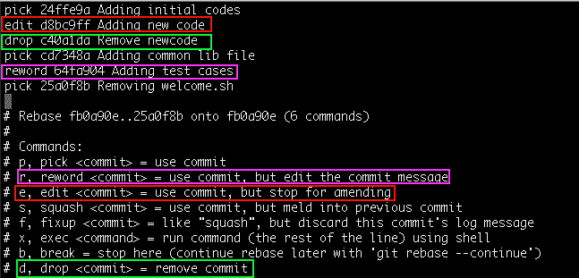

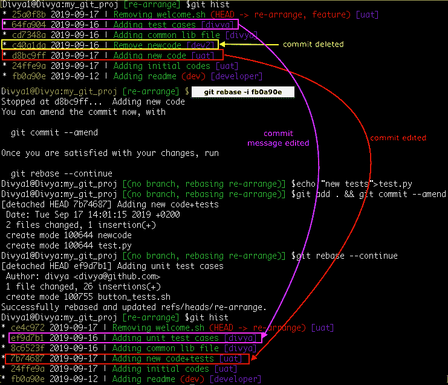

重新访问 [git rebase](https://git-scm.com/docs/git-rebase) 文档，了解'–交互式或-i' rebase 与常规 rebase 有何不同。

## **将不相关的更改提交到单个提交中**

在这种情况下，您需要将一个旧的隐藏提交分成多个逻辑提交。 **语法:** `git rebase -i <after-this-commit_id>` **命令:** `git rebase -i fb0a90e` 在 rebase 编辑器中，必须选择 e7aa9a5 commit id，并将其改为' edit '而不是' pick '。

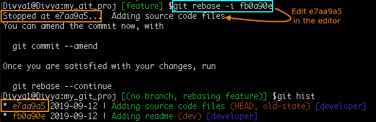

您现在将处于项目版本的提交 id-e7aa9a5 中。一、将提交历史和暂存区重置为之前的提交命令:`git reset HEAD~1` 二、编辑+暂存+单独提交文件 **命令:** `git add code && git commit -m 'Adding initial codes'` `git add newcode && git commit -m 'Adding new code'`

第三，继续 rebase，结束。

**命令** : `git rebase --continue` 四、查看有附加提交的历史。

**命令:** `git hist`

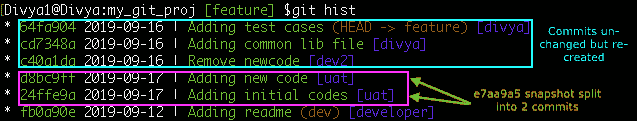

**在所有分支的所有提交中更改作者电子邮件**

很久以来，我一直在 git 中对我的项目文件进行版本控制和提交，但直到现在，我才意识到我的电子邮件 id 在我的提交历史日志中受到了损害，这些日志甚至发布在远程存储库上。当您最初在中设置配置时，任何人都可能会遇到这种情况。gitconfig "文件。令我欣慰的是，git 可以 ***重写*** 我们在创建提交对象时提供的环境变量。

首先，我得到一个*电子邮件 id*的列表，以决定我想要更改的: **命令:**`git log --all --pretty=format:"%an <%ae> %d"`——这将打印作者姓名<电子邮件 id >(引用名/分支名)

第二，我在每个分支上运行*每个提交，并用新的电子邮件 id **重写提交对象命令:**`git filter-branch --env-filter '``if [ "$GIT_AUTHOR_NAME" = "divya" ]``then``GIT_AUTHOR_EMAIL = "divya@github.com"``fi``' -- --all`*

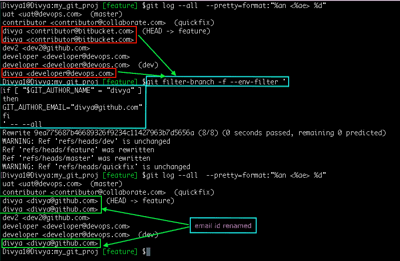

**失物招领文件**

假设你丢失了某个文件，你不记得它的名字，但能回忆起文件中的某些单词。在这种情况下，您可以遵循以下步骤- **步骤 1:** 使用搜索模式 **命令** : `git rev-list --all | xargs git grep -i 'timestamp'`列出所有曾经包含文件快照的提交

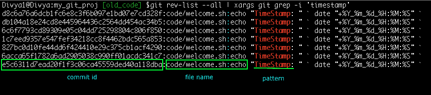 **第二步**:从这个高亮显示的 commit-id **语法:**git check out-b lost-found d 8 c 6a 6 DC B1 fc 6 e 8 c 3 f 6 b 097 E1 BD 07 e 7 CD 328 f

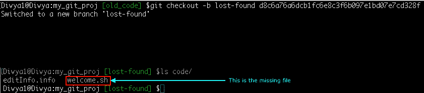

**忘记哪个分支有我的提交 id**

有时，在您检测到一个有问题的提交 id 后，您可能还想知道所有有这个提交的分支，以便您可以修复它们。在一个大型的多分支项目中，检查每个分支的历史是不太实际的。

我的导航构建应用程序中的一个错误提交曾经破坏了代码，当时我使用了[‘git 等分’命令来检测错误的提交 id](https://www.edureka.co/blog/git-bisect/)，然后使用命令:`git branch --contains <commit-id>`来列出有错误提交的分支。

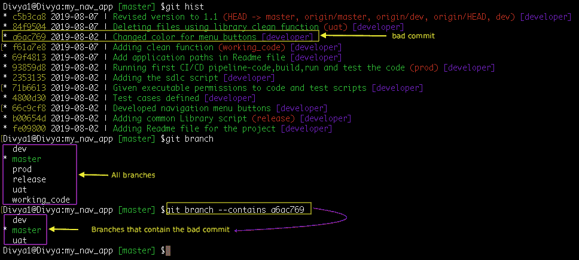

所以，现在我知道了仍然有错误提交的所有分支，我可以恢复或重置这个变更集。

**从历史记录中删除提交**

有时我觉得有必要从历史中抹去一个错误，不留任何痕迹。我不建议你在一个共享的分支上尝试这种特技，而只在你的本地分支上。 **语法:** `git rebase -i <commit-id>` **命令** : `git rebase -i 93859d8` 在 rebase 编辑器- >中用“删除”替换“编辑”以突出显示提交 id: 69f4813

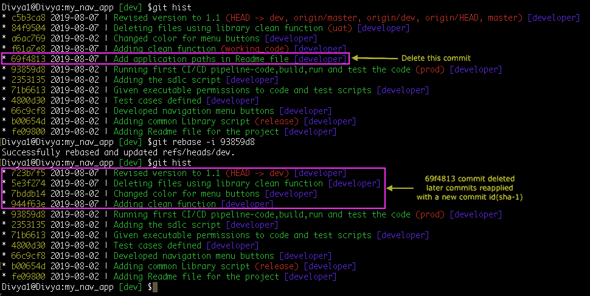

在某些情况下，这种重写可能会导致冲突。您必须解决冲突，然后继续前进。

**警告**:这是一个危险的命令，因为这会重写历史并可能丢失数据。这种分支不同于远程分支，必须使用`--force`或`--force-with-lease`选项进行推送。

**将错误的分支推到远程**

现在，我想做的是——我想删除一个[远程分支](https://www.edureka.co/blog/this-is-how-you-share-your-work-on-a-git-remote-repository/),并停止从我的本地分支跟踪它。与`--delete`选项一起使用的`git push`命令删除远程分支，这就是我如何获得克隆项目的本地副本——

`git clone https://github.com/greets/myProj.git`

一旦远程分支被删除，共享存储库中的其他人必须使用`--prune`选项刷新和更新他们的远程引用，以删除丢失的对象引用:`git fetch --prune -v origin`

在这篇文章中，我提到了 git 可以帮助您修复的一些常见错误或变化。每个代码都是独一无二的，都是以自己的方式开发的，所以也有不同的方法来解决问题。你可以参考官方的 git 文档来了解各种 git 命令是如何保护你的源代码的，以及如何以最好的方式使用这些命令。

现在你已经了解了常见的 Git 错误，看看 Edureka 的这个 [DevOps 培训](https://www.edureka.co/devops)，edu reka 是一家值得信赖的在线学习公司，在全球拥有超过 250，000 名满意的学习者。Edureka DevOps 认证培训课程帮助学员了解什么是 DevOps，并获得各种 DevOps 流程和工具方面的专业知识，例如 Puppet、Jenkins、Nagios、Ansible、Chef、Saltstack 和 GIT，用于自动化 SDLC 中的多个步骤。

有问题要问我们吗？请在“常见 Git 错误”的评论部分提到它，我们会回复你