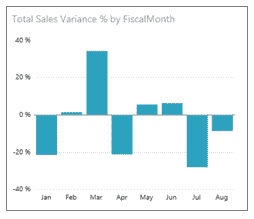
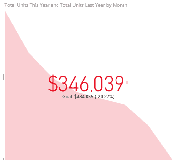
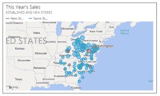
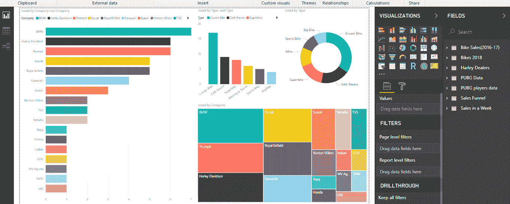

# 关于电源 BI 图表，您需要了解的一切

> 原文：<https://www.edureka.co/blog/popular-power-bi-charts/>

如今，Power BI 认证专家拥有与黄金同等的价值，主要是因为它旨在帮助个人或企业分析和可视化他们的数据，并从中获得洞察力。业务人员可以使用该工具创建交互式的、流行的功率 BI 图表，无论是技术性的还是非技术性的。拥有 [Power BI 认证](https://www.edureka.co/power-bi-certification-training)的业务分析师在 VMware、思科、戴尔等顶级公司工作。

本文将涉及以下几点:

*   [电力 BI 图表](#PowerBICharts)
*   [面积图](#AreaCharts)
*   [条形图/柱形图](#Bar/ColumnCharts)
*   [饼图/圆环图](#Pie/DonutCharts)
*   [漏斗图](#FunnelCharts)
*   [关键绩效指标](#KeyPerformanceIndicators)
*   [地图](#Maps)
*   [如何创建关于 Power BI 的报告？](#HowToCreateAReportOnPowerBI?)

那么让我们开始吧，

## **力量匕图表**

Power BI Charts 给你一个某个数据集的多视角视图。这些图表代表了来自给定数据集的不同发现和见解。图表可以为您提供带有单个可视化效果的报告，也可以提供充满可视化效果的页面。

功率 BI 图表不是静态的，而是高度交互式的&高度可定制，能够随着底层数据的变化而不断更新。您可以添加和删除数据，更改图表类型，并在模型中应用过滤器来发现见解和寻找答案。

因此，这里有几个流行的功率 BI 图表，你应该总是随手可得。

## **面积图**

现在，面积图是查看和比较跨时间序列的成交量趋势的绝佳选择。不仅如此，这些面积图也意味着代表物理上可数集合的单个系列。

基本面积图，也称为分层面积图，基于折线图。轴和线之间的区域用颜色填充以表示体积，线显示一段时间内的趋势。

面积图本质上强调了随时间变化的幅度。因此，它们主要用于引起对整个趋势总值的注意。

下一个流行的功率 BI 图表是，

**条形图/柱形图**

条形图是查看跨不同类别的特定值的标准。条形图无疑是所有 BI 平台上最常见的数据可视化之一。

可以快速突出类别之间的差异，显示趋势和离群值，一目了然地揭示历史高点和低点。

**饼图/圆环图**

饼图对于向其他可视化添加细节是非常强大的。饼图的角度决定了测量值。可以为饼图分配不同的颜色，以表示某个维度中的成员。

在显示部分与整体的关系方面，圆环图与饼图非常相似。唯一的区别是，中心是空白的，并允许我们查看它更像一个堆叠的条形图盘绕在自己身上的空间。

继续这篇流行的电力 BI 图表文章

**漏斗图**

漏斗图帮助你形象化一个有阶段或层次的过程。它描绘了从一个阶段到下一个阶段连续流动的项目。当各个阶段之间有连续的流程时，可以使用漏斗图，例如，销售流程从销售线索开始，经过潜在销售线索和无效销售线索的分离，最后到达采购完成。

接下来是本文的最后一部分，关于功率 BI 图

**关键绩效指标**

关键绩效指标显示实现可衡量目标的进度。KPI 主要回答 2 个问题:

*   我领先还是落后于什么？
*   我领先或落后了多远？

因此，KPI 可视化需要一个评估为值的基本度量和一个 *目标* 度量，以及一个 *阈值* 或 *目标* 。

**地图**

Power BI 中的地图用于将分类和定量信息与空间位置相关联。ArcGIS maps 和 Power BI 的结合将这些地图从地图上的点呈现提升到了一个全新的水平。

我们可用的选项有底图、位置类型、主题、符号样式和参考图层，它可以创建丰富多彩的地图视觉效果。权威数据层(如人口普查数据和空间分析)的结合传达了对数据的更深层次的理解。

让我们看看如何使用流行的 Power BI 图表创建报告，

**了解我们在顶级城市举办的 Power BI 培训课程**

| 印度 | 美国 | 其他国家 |
| [海德拉巴的 Power BI 培训](https://www.edureka.co/power-bi-certification-training-hyderabad) | [达拉斯的 Power BI 球场](https://www.edureka.co/power-bi-certification-training-dallas) | [墨尔本 Power BI 球场](https://www.edureka.co/power-bi-certification-training-melbourne) |
| [班加罗尔的 Power BI 培训](https://www.edureka.co/power-bi-certification-training-bangalore) | [夏洛特动力 BI 课程](https://www.edureka.co/power-bi-certification-training-charlotte) | [伦敦 Power BI 课程](https://www.edureka.co/power-bi-certification-training-london) |
| [在钦奈的电力 BI 培训](https://www.edureka.co/power-bi-certification-training-chennai) | [纽约的 Power BI 课程](https://www.edureka.co/power-bi-certification-training-new-york-city) | [悉尼 Power BI 球场](https://www.edureka.co/power-bi-certification-training-sydney) |

**如何创建关于 Power BI 的报告？**

如果你不打算自己建造任何东西，那么能量 BI 理论就没有多大用处。根据您的角色，您可能会将这些图表用于自己或与同事分享。无论哪种方式，您都希望了解在哪里使用哪个图表，或者至少了解如何与这些 Power BI 图表进行交互。

这个关于“Power BI 图表”的 Edureka 教程讲述了 Power BI 桌面上所有基本可视化的重要性。它将帮助您在 Power BI 桌面上创建有影响力的综合报告。

[https://www.youtube.com/embed/0avWOT2MpxY](https://www.youtube.com/embed/0avWOT2MpxY)

有许多方法可以创建图表，但首先，我们将从使用 Power BI 服务导入一个非常基本的 MS Excel 数据集开始。

如果您已经在 Power BI Desktop 中创建了 Power BI 报告，我建议您安装针对 Power BI 报告服务器优化的 Power BI Desktop 版本，以便您知道服务器和应用程序始终保持同步。您可以拥有两个版本

*   你可以连接到各种数据源。 从欢迎界面中，选择 ***获取数据*** 选项，导入您想要的文件。在本教程中，我将使用从 Kaggle 下载的 ***街头犯罪数据集*** 。
*   现在，进入**数据视图**，对你导入的数据进行必要的修改。
*   现在你可以开始设计你的报告了。

*   当你认为你已经完成时，继续**将报告发布**到 Power BI 网站。

这就把我们带到了这篇关于流行的功率 BI 图表的文章的结尾。

此外，如果您希望在商业智能领域发展，我们的[商业智能课程](https://www.edureka.co/masters-program/business-intelligence-certification) 将帮助您挖掘这些数据，并增强整个组织的决策过程。

*有问题吗？请在评论区提到它，我们会给你回复。*