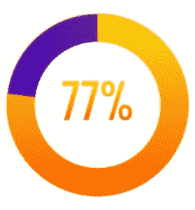
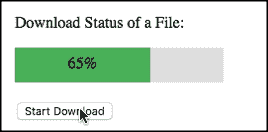

# 如何在 HTML 中创建进度条？

> 原文：<https://www.edureka.co/blog/html-progress-bar/>

进度条用于将任务期间的某些里程碑确定为一个百分比。您可以在 [HTML](https://www.edureka.co/blog/what-is-html/) 中创建一个进度条，指定任务的完成进度。进度条的值可以由 JavaScript 操作。在本文中，我们将看到如何在 HTML、CSS 和 JavaScript 的帮助下按照以下顺序创建一个进度条:

*   [如何在 HTML 中创建进度条？](#progressbar)
*   [进度条:示例](#example)

我们开始吧。

## **如何在 HTML 中创建进度条？**

进度条描述了正在执行的任何任务的进度。通常，这些条用于显示下载和上传状态。我们可以说进度条可以用来描述任何正在进行的事情的状态。



要使用 [JavaScript](https://www.edureka.co/blog/javascript-tutorial/) 创建一个基本的进度条，需要执行以下步骤:

*   **为你的进度条创建 HTML 结构-**HTML<进度> [标签](https://www.edureka.co/blog/html-meta-tags/)指定一个任务的完成进度。

```
<div id="Progress_Status">
<div id="myprogressBar"></div>
</div>
```

*   **添加 CSS-**下一步是在 [CSS](https://www.edureka.co/blog/animations-in-css/) 的帮助下添加进度条的背景颜色以及进度条中的进度状态。

```
#Progress_Status {
width: 50%;
background-color: #ddd;
}

#myprogressBar {
width: 1%;
height: 35px;
background-color: #4CAF50;
text-align: center;
line-height: 32px;
color: black;
}
```

*   **添加 JavaScript**——下一步是使用 [javascript 函数](https://www.edureka.co/blog/javascript-functions/) **更新**和**场景**创建一个动态动画进度条。

```
<script>
function update() {
var element = document.getElementById("myprogressBar");
var width = 1;
var identity = setInterval(scene, 10);
function scene() {
if (width >= 100) {
clearInterval(identity);
} else {
width++;
element.style.width = width + '%';
}
}
}
</script>
```

现在你知道了创建进度条的不同步骤，让我们继续，看看进度条的完整例子。

## **进度条:示例**

一旦完成了创建进度条的不同步骤，就该链接 HTML、CSS 和 [JavaScript 元素](https://www.edureka.co/blog/removing-elements-from-an-array-in-javascript/)了。下面的例子展示了链接上述 **HTML、CSS 和 JavaScript** 代码的进度条的完整代码:

```
<!DOCTYPE html>
<html>
<style>
#Progress_Status {
width: 50%;
background-color: #ddd;
}

#myprogressBar {
width: 2%;
height: 20px;
background-color: #4CAF50;
}
</style>
<body>

<h3>Example of Progress Bar Using JavaScript</h3>

<p>Download Status of a File:</p>

<div id="Progress_Status">
<div id="myprogressBar"></div>
</div>

<br>
<button onclick="update()">Start Download</button>

<script>
function update() {
var element = document.getElementById("myprogressBar");
var width = 1;
var identity = setInterval(scene, 10);
function scene() {
if (width >= 100) {
clearInterval(identity);
} else {
width++;
element.style.width = width + '%';
}
}
}
</script>

</body>
</html>
```

**输出:**



说到这里，我们的文章就到此为止了。我希望你理解了创建进度条所需的不同步骤。

*查看我们的  [全栈 Web 开发人员硕士课程](https://www.edureka.co/masters-program/full-stack-developer-training) ，该课程包含讲师指导的现场培训和真实项目体验。本培训使您精通使用后端和前端 web 技术的技能。它包括关于 Web 开发、jQuery、Angular、NodeJS、ExpressJS 和 MongoDB 的培训。*

有问题要问我们吗？请在这个博客的评论部分提到它，我们会给你回复。