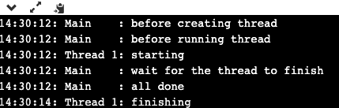
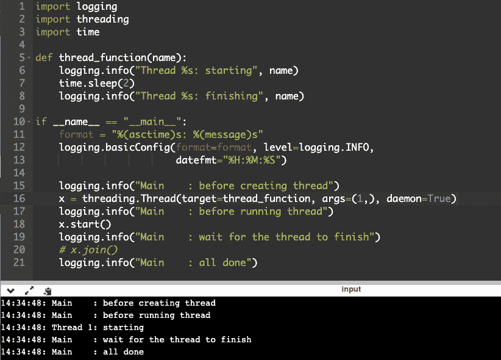
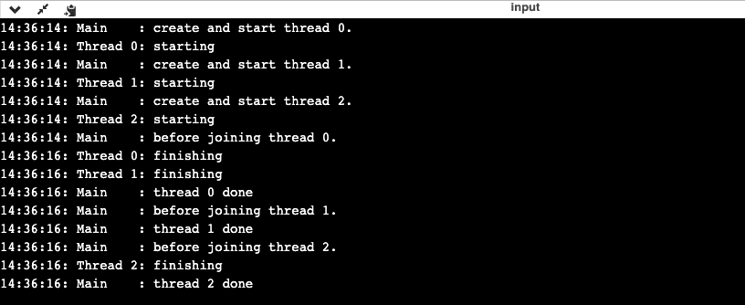

# Python 中的线程:了解如何使用 Python 中的线程

> 原文：<https://www.edureka.co/blog/threading-in-python/>

今天， [Python](https://www.edureka.co/blog/python-tutorial/) 是全世界最受欢迎的编程语言之一。自 20 世纪 90 年代问世以来，它已经获得了大量的追随者、爱好者和程序员，他们每天都在努力使这种编程语言变得更好。在 Python 生态系统内置的许多特性中，最突出的一个是线程化。因此，在本文中，我们将讨论 Python 中的线程技术，如何利用它以及它的优缺点。

本文将涉及以下几点:

*   [Python 中的线程是什么？](#WhatisaThreadinPython?)
*   [在 Python 中启动一个线程](#StartingaThreadinPython)
*   什么是守护线程？
*   [使用多线程](#WorkingwithMultipleThreads)

让我们开始吧

## **Python 中的线程**

## **Python 中的线程是什么？**

Python 中的线程可以简单地定义为一个独立的执行流。这意味着在你的程序中，两个不同的进程将同时执行。Python 中线程化的一个有趣的方面是，在版本 3 之后，Python 中的多个线程不再同时执行，而只是看起来像是。

虽然同时运行两个不同的进程是一种奇妙的感觉，但是我们需要理解 Python 3 和更高版本的当前版本是以这样一种方式编码的，即在任何给定的时间点只能运行一个进程。但是，如果您需要在 CPython 中同时处理两个或更多的进程，您还需要用其他语言编写一些代码，比如 C、C++和 Java，然后通过 Python 中的多线程来运行它们。

Python 中线程化最广为人知的优势之一是它能够提高设计的清晰度。

在此之前，我们对 Python 中的线程有一些了解，让我们了解如何启动一个线程，

## **在 Python 中启动一个线程**

现在你已经习惯了 Python 中线程的定义，让我们来看一个例子，看看如何在 Python 中创建自己的线程。为了在 Python 中创建一个线程，首先需要导入线程库，然后指令它启动()，如下例所示:

```
import logging
import threading
import time
def thread_function(name):
logging.info("Thread %s: starting", name)
time.sleep(2)
logging.info("Thread %s: finishing", name)
if __name__ == "__main__":
format = "%(asctime)s: %(message)s"
logging.basicConfig(format=format, level=logging.INFO,
datefmt="%H:%M:%S")
logging.info("Main&amp;amp;amp;nbsp; &amp;amp;amp;nbsp; : before creating thread")
x = threading.Thread(target=thread_function, args=(1,))
logging.info("Main&amp;amp;amp;nbsp; &amp;amp;amp;nbsp; : before running thread")
x.start()
logging.info("Main&amp;amp;amp;nbsp; &amp;amp;amp;nbsp; : wait for the thread to finish")
# x.join()
logging.info("Main&amp;amp;amp;nbsp; &amp;amp;amp;nbsp; : all done")
```

**输出**



当在 Python 中运行一个线程时，你把它作为一个函数来传递，这个函数包含了它需要执行的参数列表。在上面分享的例子中，您正在指示 Python 运行线程 thread_function()并将其作为参数传递给 1。

当你运行上面的程序时，输出看起来像这样。

本文的下一部分“Python 中的线程”让我们看看什么是守护线程，

## 什么是守护线程？

在技术术语中，守护程序可以定义为主要在后台运行的进程。然而，在 Python 中，守护线程有非常特殊的含义。在 Python 中，一个守护线程会在程序退出时关闭，尽管在其他编程语言中，它会继续在后台运行。如果在某个程序中，一个线程没有被编程为守护线程，那么解释器将等待它完成它的操作，然后只关闭解释器。

为了更好地理解这个概念，看一下上面的例子。在倒数第二行，程序在完成所有任务后等待几秒钟。这是因为它正在等待非后台线程完成其操作，然后退出接口。一旦线程完成了它的操作，那么只有程序退出。

现在让我们修改上面的程序，看看如果我们在代码中插入一个守护线程会发生什么。

新代码:x =线程。Thread(target=thread_function，args=(1，)，daemon=True)

当你运行修改后的程序时，它看起来会像这样。

这两个输出的区别是最后一行少了最后一行。thread_function()没有机会完成，因为我们插入了一个守护线程，当它很快到达末尾时，它退出了程序。

**加入螺纹**

现在你已经学习了在 Python 中创建线程的概念，以及后台线程的概念，让我们来看看如何在 Python 中连接线程。

通过使用 Python 中的 join()函数，你可以连接两个不同的线程，并指示其中一个等待另一个，直到它完成执行。当您正在编写大型应用程序，并且您需要所有的进程以特定的顺序执行时，这个特性通常会派上用场

本文的最后一部分“Python 中的线程”将向您展示如何使用多线程，

## **使用多线程**

在上面的例子中，我们讨论了如何同时处理两个线程。但是如果在某种情况下，你需要同时处理多个线程呢？为了更好地理解这种情况，请看下面的例子。

```
import logging
import threading
import time
def thread_function(name):
logging.info("Thread %s: starting", name)
time.sleep(2)
logging.info("Thread %s: finishing", name)
if __name__ == "__main__":
format = "%(asctime)s: %(message)s"
logging.basicConfig(format=format, level=logging.INFO,
datefmt="%H:%M:%S")
threads = list()
for index in range(3):
logging.info("Main&amp;amp;amp;nbsp; &amp;amp;amp;nbsp; : create and start thread %d.", index)
x = threading.Thread(target=thread_function, args=(index,))
threads.append(x)
x.start()
for index, thread in enumerate(threads):
logging.info("Main&amp;amp;amp;nbsp; &amp;amp;amp;nbsp; : before joining thread %d.", index)
thread.join()
logging.info("Main&amp;amp;amp;nbsp; &amp;amp;amp;nbsp; : thread %d done", index)

```

**输出**



在上面的程序中，我们遵循了相同的程序，导入线程库，启动线程，创建多个线程，然后使用 join()函数将它们组合在一起，并以特定的顺序执行。

当你运行上面的程序时，结果会像这样。

**结论**

这是 Python 最方便的特性之一。通过以正确的方式使用它，你可以使你的整个编码过程更加容易和有效。从上面的文章中，我们希望您已经了解了线程的基本知识，并将在日常编程中继续使用它。

伙计们，我希望你们喜欢这篇文章。

*要深入了解 Python 及其各种应用，您可以 [**在此**](https://www.edureka.co/python/) 注册参加在线直播培训，全天候支持，终身访问。*

*有问题吗？在这篇文章的评论部分提到它们，我们会给你回复。*