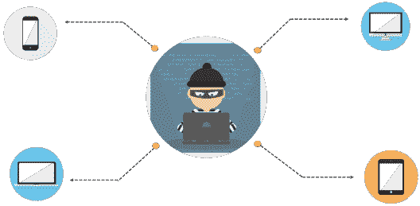

# 网络安全防火墙:应用安全如何工作？

> 原文：<https://www.edureka.co/blog/cybersecurity-firewall/>

近来，日常需求对在线交易的依赖成倍增长。然而，互联网容易受到多重威胁。任何在互联网上公开其系统的组织或个人都必须通过实施适当的技术来规避这些威胁，从而努力保护他们的资源和信息。一种这样的技术是防火墙。在本文中，让我们了解更多关于网络安全防火墙的信息。

本文讨论的主题是:

**什么是网络安全？|网络安全介绍|网络安全培训| Edureka**

[https://www.youtube.com/embed/ooJSgsB5fIE](https://www.youtube.com/embed/ooJSgsB5fIE)

## **网络安全介绍**

网络世界(Cyberworld)或网络空间是所有设备和实体的市场，这些设备和实体通过互联网(也称为万维网)相互连接。网络空间中不同实体之间的通信，即大型企业系统、金融应用程序、云上的软件即服务、机构、中小型企业、个体户笔记本电脑、台式机、移动应用程序，都容易受到[威胁](https://www.edureka.co/blog/ethical-hacking-tutorial/#Types-of-Threats)。对网络空间实体的威胁可能是:

*   数据盗窃或滥用
*   假冒或信用卡/借记卡欺诈
*   网络钓鱼
*   垃圾邮件
*   拒绝服务

他们在互联网或公众上发布的所有应用程序和系统都被放置在组织可信网络的这个定义的边界内。组织一直在寻找改进的方法来保护这些应用程序免受不必要的威胁。 ***防火墙*** 就是这样一种解决方案，它位于组织的内部可信网络的外围，用户可以在此访问应用程序。

## **什么是防火墙？**

网络安全防火墙是一个[网络安全](https://www.edureka.co/blog/what-is-network-security/)系统，它可以是硬件也可以是软件 保护可信网络免受来自外部网络的未授权访问和外部威胁。

*   它使用一套定义好的策略规则来过滤数据，帮助限制对应用程序和系统的访问
*   它就像一个看门人，监视和控制传入和传出的网络流量
*   任何特定的流量，无论是对防火墙后的资源还是可信网络内的资源的访问请求、数据请求，都将被检查、分析，并根据预定义的安全规则允许通过或阻止
*   安全规则被配置到防火墙中，并且是可定制的

**了解我们在顶级城市/国家的网络安全培训**

| **印度** | **美国** | **其他城市/国家** |
| [班加罗尔](https://www.edureka.co/cybersecurity-certification-training-bangalore) | [纽约](https://www.edureka.co/cybersecurity-certification-training-new-york-city) | [英国](https://www.edureka.co/cybersecurity-certification-training-uk) |
| [海德拉巴](https://www.edureka.co/cybersecurity-certification-training-hyderabad) | [芝加哥](https://www.edureka.co/cybersecurity-certification-training-chicago) | 伦敦 |
| [德里](https://www.edureka.co/cybersecurity-certification-training-delhi) | 亚特兰大 | [加拿大](https://www.edureka.co/cybersecurity-certification-training-canada) |
| [钦奈](https://www.edureka.co/cybersecurity-certification-training-chennai) | [休斯顿](https://www.edureka.co/cybersecurity-certification-training-houston) | [多伦多](https://www.edureka.co/cybersecurity-certification-training-toronto) |
| [孟买](https://www.edureka.co/cybersecurity-certification-training-mumbai) | 洛杉矶 | [澳大利亚](https://www.edureka.co/cybersecurity-certification-training-australia) |
| [浦那](https://www.edureka.co/cybersecurity-certification-training-pune) | [波士顿](https://www.edureka.co/cybersecurity-certification-training-boston) | 阿联酋 |
| 加尔各答 | [迈阿密](https://www.edureka.co/cybersecurity-certification-training-miami) | [迪拜](https://www.edureka.co/cybersecurity-certification-training-dubai) |
| 艾哈迈达巴德 | [旧金山](https://www.edureka.co/cybersecurity-certification-training-san-francisco) | [菲律宾](https://www.edureka.co/cybersecurity-certification-training-philippines) |

## **防火墙的各种实现**

*   它们是硬件防火墙，根据从入门级、中端到高端不等
*   我们保护的实体同时受到大量攻击
*   预期用户群
*   有基于软件的防火墙
*   一些实现使用软件和硬件防火墙的组合
*   大型组织安装高端专用硬件防火墙
*   小型应用程序供应商和个人可以在他们的个人设备上设置基本的软件防火墙

## **对防火墙实施的期望**

实施防火墙会做以下事情:

*   确保所有从外部进入系统或应用程序的流量都必须通过防火墙
*   定义的规则确保隔离和检测所有可能的未授权进入流量
*   拒绝未经授权的流量
*   所有授权交通的通过
*   规则的学习与即兴
*   确定适合预期负载的防火墙对于确保性能不受影响至关重要

## **防火墙的优缺点**

*   *优势* 是在防火墙上实施规则和控制的有效性的一种结果。当防火墙能够处理所有可能的外部威胁时，它就是有效的。
*   *一个缺点* 就是防火墙无法防止内部威胁、病毒攻击和黑客使用的可信机制(比如用户名密码)。

组织必须实施其他机制和控制措施来规避这些威胁。像入侵检测系统和入侵防御系统这样的威胁。来自互联网的病毒、木马、间谍软件、勒索软件、拒绝服务、恶意软件的攻击可以通过在防火墙旁边实施防病毒和其他预防和检测系统来挫败。

查看我们新推出的[道德黑客认证](https://www.edureka.co/ceh-ethical-hacking-certification-course)培训课程，深入了解道德黑客的概念并获得技能。

**注:**内部威胁是来自可信网络内部的用户的威胁，这些用户具有恶意意图并拥有实施攻击的所有权限。

## **防火墙的类型**

*   可信网络中应用程序的任何访问都被分解为多个数据包。识别数据包真实性的有 ***包过滤防火墙*** 。这些非常流行，用于阻止来自特定来源或另一个网络的数据包。因此，当网络受到未知数据包的攻击时，防火墙会将其识别为威胁，并发出警报和阻止它。
*   防火墙可以对外部公共网络屏蔽或隐藏可信私有可信网络的互联网地址，因此不会发生未经授权的访问。
*   ***应用级网关*** 或 ***基于代理的防火墙*** 正成为当务之急。
*   如今，基于云的应用程序的依赖和出现转移了对控制应用程序访问的关注。因此，人们可能想要阻止完整的应用服务(如 FTP、telnet、Http)。
    *   FTP 接入允许用户将文件从一个网络复制到另一个网络。通过阻止 FTP 服务，试图连接到该网络并复制内容的恶意用户将无法使用该服务。

有多种解决方案可以检测和防范恶意行为和攻击。因为有许多方法可以避免攻击，所以需要找到针对防火墙、防病毒、反垃圾邮件以及入侵检测和入侵预防的集成解决方案。这种解决方案将是网络安全领域的下一代创新。

## **结论**

互联网上公开的每个商业或应用服务都有自己基于功能的安全需求。在实施最合适的安全控制系统之前，必须进行详细的研究和可行性分析。要击败威胁和黑客的世界，重点必须放在实施上，然后不断即兴应对当前和未来所有可能的威胁。 ***防火墙是当今世界网络安全中控制这些外部威胁的众多解决方案之一。***

就这样，伙计们！这就把我们带到了这篇“网络安全防火墙”文章的结尾。如果您希望学习网络安全并在网络安全领域建立丰富多彩的职业生涯，那么请查看我们的 *[**网络安全认证**](https://www.edureka.co/cybersecurity-certification-training) 培训*，该培训带有讲师指导的现场培训和真实项目体验。这个培训将帮助你深入了解网络安全，帮助你成为网络安全[高手](https://www.edureka.co/masters-program/cybersecurity-training)。

*您还可以看看我们新推出的关于 [**CompTIA Security+认证**](https://www.edureka.co/comptia-security-plus-certification-training) 的课程，这是 Edureka & CompTIA Security+首次与官方合作。它为您提供了一个获得全球认证的机会，该认证侧重于安全和网络管理员不可或缺的核心网络安全技能。*

通过 Edureka 的 [**研究生项目** 和 **NIT Rourkela**](https://www.edureka.co/post-graduate/cybersecurity) 以正确的方式学习网络安全，保护世界上最大的公司免受网络钓鱼者、黑客和网络攻击。

有问题要问我们吗？请在评论区提到它，我们会尽快回复您，或者今天就参加我们在 T2 科尔哈普尔举办的[网络安全培训..](https://www.edureka.co/cybersecurity-certification-training-kolhapur)