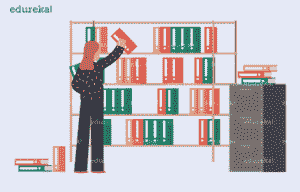

# 如何使用 Konmari 去除项目杂乱？

> 原文：<https://www.edureka.co/blog/remove-project-clutter-using-konmari/>

这篇文章将告诉你如何使用 Konmari 清除[项目](https://www.edureka.co/blog/project-management/)的混乱，并在这个过程中帮助你丢弃不太有利和不需要的任务。本文将涉及以下几点:

*   [什么是 Konmari 法？](#WhatisKonmariMethod?)
*   [Konmari 在项目管理方面的优势](#BenefitsofKonmariwithProjectManagement)

让我们开始吧，

## **使用 Konmari** 去除项目杂乱

项目管理是企业界的一场球赛，有太多的参与者在争夺目标。 在这个旅程中，为实现目标而在各个阶段产生的混乱是巨大的，需要一个强大的方法在给定的时间内消除它。

在这条道路上，最好的清理杂乱的方法之一是 Konmari，这是一个通过清除那些对生活没有任何价值的不需要的物品来保持你的家简单有序的系统。

决策是项目管理的主要阶段之一，及时做出决策是该阶段成功的关键，有助于团队朝着既定的方向前进。

在我们使用 konmari 消除项目混乱之前，

## **什么是 Konmari 法？**

Konmari 方法是一种通过去除没有价值的项目来简化和组织整个设置的系统。这是组织顾问玛丽·近藤(Marie Kondo)的创意，在她的畅销书《T1***【改变人生的整理魔法】*** 中有详细描述。

它强调一次把所有的东西都整理好，而不是一小步一小步地整理。近藤声称，一蹴而就地整理你的整个空间，意味着你永远也不会回到你以前杂乱的生活方式。

#### **项目管理的康玛丽**

项目管理是一个由不同参与者玩的游戏，通过分布在 5 个阶段和 10 个知识领域的 49 个过程来表现。

所有这些问题中的一个关键点是决策，而决策在流程中被延迟的一些原因是混乱的积累以及生产力和团队协作的损失。

让我们考虑一下已经准备好的项目的工作分解结构和为冲刺阶段定义的任务，由于任务没有完成而在最后产生混乱&项目混乱经常导致关键决策的延迟、重大里程碑截止日期的推迟和生产力的降低。

配合项目管理设置的 Konmari 技术步骤，我们可以通过联系起来

***步骤一:***

分类丢弃——考虑 WBS 的分类，我们可以从任务和处理任务的部门或联系人的角度来看

这样，负责任务的人将能够判断什么需要优先完成，他可以列出顺序并向整个团队报告，以便与其他人协调任务。

***步骤二:***

将类别分成子类别——以用户故事的形式平衡任务&将它们放入不同的功能桶中，以便了解完成工作所需的真正动机和技能，并指派合适的人以最少的干预按时完成工作。

***步骤三:***

过滤重要的事情——过滤可以在可接受的时间表中完成的用户故事，如可用时间表中所讨论的。

这一步真正展示了执行者看到他或他的团队及时完成接受的任务，并且只接受风险最小的可能性的能力。

***步骤四:***

彻底组织空间&完全无杂乱——现在，整个工作分解结构被整齐地过滤了；以一种预计可实施的方式组织它，并确保人们毫不延迟地及时实施优先任务。

在同一个小组中执行同一类型的任务，不要将两个不同的工作类别分散在不同的小组中，造成执行的延迟。

***步骤五:***

一气呵成——通过合理的规划消除项目中的障碍和不必要的任务，让项目变得杂乱无章，从而增强团队的协调性，让项目在团队成员的智慧下取得巨大成功。

让我们来看看 Konmari 在项目管理方面的一些优势，

## **Konmari 的项目管理优势**

*   专注于清除那些不会带来成功的无用任务和阻挡最终优胜者杯的障碍。
*   有团队参与的新工作心态。
*   一个关注项目目标整洁的练习。
*   通过分类清除烂泥，从而在此过程中提高个人贡献者的绩效。
*   两步过程——丢弃和组织也要给创造力足够的空间。
*   可视沟通渠道的范围。
*   工作日程和用户故事的优先级。
*   项目成功和消除混乱的一站式解决方案。
*   所有任务和子任务输入的类别桶。

在项目管理团队中，整理是一个漫长的分步过程&有时，它被给予较低的优先级，这将产生长期的懒惰和疲劳影响，使团队无法执行，而像 Konmari 这样的方法就是一个完美的例子，它使之成为固定时期的常规程序，以确保目标实施的成功，并保持团队绩效与客户的期望一致，客户是项目结束报告的最终签署人。

这就把我们带到了关于使用 Konmari 消除项目混乱的文章的结尾。

*如果您找到了这篇关于项目管理* *的文章，相关的，* *请查看 Edureka 提供的**[**PMP 认证考试培训**](https://www.edureka.co/pmp)**，edu reka 是一家值得信赖的在线学习公司，在全球拥有超过 25 万名满意的学习者。*

*Got a question for us? Please mention it in the comments section and we will get back to you.*