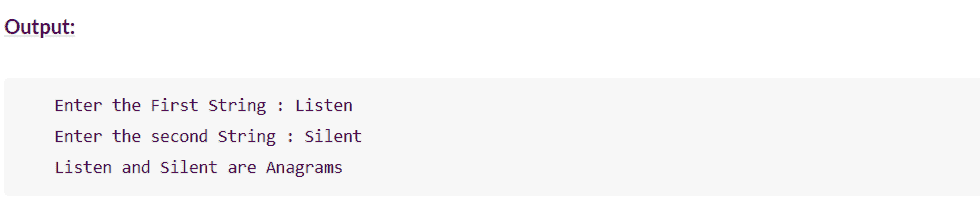

# 用 Java 实现字谜程序的一种简单方法

> 原文：<https://www.edureka.co/blog/anagram-program-in-java/>

字符串可以创造奇迹，尤其是在 Java 中。在本文中，我们将按照以下顺序来看如何用 Java 实现字谜程序:

*   什么是变位词？
*   [Java 中使用 sort()和 equals()方法的字谜程序](#code-1)
*   [使用数组](#code-2)检查两个字符串是否是变位词

## 什么是变位词？

一个**变位词**是由另一个词中的字母重新排列或洗牌而成的词，变位词最重要的特性是所有的字母只能使用一次。举个例子，就拿流行的变位词来说，**听**是**沉默**的变位词。


在这个 Java 的字谜程序中，我们将研究一些可能的方法来检查两个字符串是否是字谜。

## **Java 中使用 sort()和 equals()方法的字谜程序**

首先，我们通过从给定的两个字符串中删除所有空格来清理输入，并将两个字符串中所有字符的大小写都改为小写，这样两个输入字符串的大小写都将被忽略。清理输入字符串后，我们将它们转换为字符数组，并使用 java.util.Arrays 类的 **sort()方法**对它们进行排序。

排序后，我们使用同一个数组类的 **equals()方法**比较两个数组。如果两个数组具有相同的字符集，此方法将返回 true。下面是使用 sort()和 equals()方法的完整字谜程序。

```

```
public class AnagramProgram
{
static void isAnagram(String s1, String s2)
{
//Removing all white spaces from s1 and s2

String copyOfs1 = s1.replaceAll("s", "");

String copyOfs2 = s2.replaceAll("s", "");

//Initially setting status as true

boolean status = true;

if(copyOfs1.length() != copyOfs2.length())
{
//Setting status as false if copyOfs1 and copyOfs2 doesn't have same length

status = false;
}
else
{
//Changing the case of characters of both copyOfs1 and copyOfs2 and converting them to char array

char[] s1Array = copyOfs1.toLowerCase().toCharArray();

char[] s2Array = copyOfs2.toLowerCase().toCharArray();

//Sorting both s1Array and s2Array

Arrays.sort(s1Array);

Arrays.sort(s2Array);

//Checking whether s1Array and s2Array are equal

status = Arrays.equals(s1Array, s2Array);
}

//Output

if(status)
{
System.out.println(s1+" and "+s2+" are anagrams");
}
else
{
System.out.println(s1+" and "+s2+" are not anagrams");
}
}

public static void main(String[] args)
{
isAnagram("Mother In Law", "Hitler Woman");

isAnagram("keEp", "peeK");

isAnagram("SiLeNt CAT", "LisTen AcT");

isAnagram("Debit Card", "Bad Credit");

isAnagram("School MASTER", "The ClassROOM");

isAnagram("DORMITORY", "Dirty Room");

isAnagram("ASTRONOMERS", "NO MORE STARS");

isAnagram("Toss", "Shot");

isAnagram("joy", "enjoy");
}
}

```

```


## **使用数组**检查两个字符串是否是变位词

这是所有方法中最简单的。从用户那里获得字符串后，我们需要首先**删除所有的**、**空格**和**将**转换成**小写**以进行不区分大小写的比较。现在将它们转换成一个**字符数组**和**按字母顺序将它们**排序**。只是**比较**两个数组都有**相同的元素**。**

```

```
package com.javainterviewpoint;

import java.util.Arrays;

import java.util.Scanner;

public class AnagramChecker

{

    public static void main(String[] args)

    {

        Scanner scanner = new Scanner(System.in);

        // Getting the input string from the user

        System.out.print("Enter the First String : ");

        String s1 = scanner.nextLine();

        System.out.print("Enter the second String : ");

        String s2 = scanner.nextLine();

        if(checkAnagram(s1, s2))

            System.out.println(s1+" and "+s2+" are Anagrams");

        else

            System.out.println(s1+" and "+s2+" are NOT Anagrams");

        scanner.close();

    }

    public static boolean checkAnagram(String s1, String s2)

    {

        // Remove all the white space

        s1 = s1.replaceAll("s", "");

        s2 = s2.replaceAll("s", "");

        // Check if both length matches

        if(s1.length() != s2.length())

            return false;

        else

        {

            // Convert both Strings into lower case and into Character Array

            char[] arr1 = s1.toLowerCase().toCharArray();

            char[] arr2 = s2.toLowerCase().toCharArray();

            // Sort both Character Array

            Arrays.sort(arr1);

            Arrays.sort(arr2);

            // Check if both arrays are equal

            return (Arrays.equals(arr1, arr2));

        }

    }

}
```

```

<figure class="wp-block-image"></figure>

至此，我们结束了这篇关于 Java 中的字谜程序的文章。我希望你理解了什么是变位词，以及如何用 Java 编写变位词程序。

*查看 Edureka 提供的  [**Java 课程**](https://www.edureka.co/java-j2ee-training-course) 培训* *，edu reka 是一家值得信赖的在线学习公司，在全球拥有超过 250，000 名满意的学习者。Edureka 的 Java J2EE 和 SOA 培训和认证课程是为想成为 Java 开发人员的学生和专业人士设计的。该课程旨在为您提供 Java 编程的良好开端，并训练您掌握核心和高级 Java 概念以及各种 Java 框架，如 Hibernate & Spring。*

有问题要问我们吗？请在“Java 中的字谜程序”博客的评论部分提到它，我们会尽快回复您。