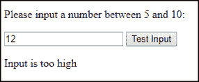

# JavaScript 中的 Try Catch 是什么，它是如何工作的？

> 原文：<https://www.edureka.co/blog/javascript-try-catch/>

无论你多么擅长编程，在某些脚本中都会有错误。这些错误可能是由于意外的用户输入、错误的服务器响应或任何其他原因而发生的。JavaScript 中的 Try catch 允许您捕捉错误，而不是死亡，做一些更合理的事情。在本文中，我们将看到 JavaScript 如何使用 try-catch 按以下顺序处理异常:

*   [在 JavaScript 中处理运行时错误](#runtime)
*   [JavaScript 中的 Try Catch 是什么？](#trycatch)
*   [试抓例子](#example)

我们开始吧。

## **在 JavaScript 中处理运行时错误**

自 Netscape 和 IE4 时代以来，错误处理一直在发展。如果出现 JavaScript 错误，你不需要满足于浏览器对你抛出的问题，相反，你可以自己解决这个问题。JavaScript 的 try-catch 语句帮助您在遇到 JavaScript 异常时重新路由。

与其他防御性编码技术一起，如[对象检测](https://www.edureka.co/blog/tensorflow-object-detection-tutorial/)和 onError 事件，try-catch 增加了绕过某些错误的能力，这些错误在过去会立即阻止你的脚本。

## **JavaScript 中的 Try Catch 是什么？**

JavaScript 的最新版本增加了异常处理功能。JavaScript 实现了 try-catch 构造和 throw 操作符来处理异常。您可以捕获程序员生成的异常和运行时异常，但不能捕获 JavaScript 语法错误。如欲了解更多信息，请立即查看此[全栈开发课程](https://www.edureka.co/masters-program/full-stack-developer-training)。

try 语句用于定义一个代码块，该代码块在执行时要进行错误测试。而 catch 语句用于定义在 try 块中出现错误时要执行的代码块。

JavaScript 语句 try 和 catch 成对出现:

```
try {
Block of code to try
}
catch(err) {
Block of code to handle errors
}
```

当 try 块中出现异常时，该异常被放入 **err** 中，并执行 catch 块。

## **试抓例子**

下面是一个 JavaScript Try Catch 的例子:

```
var message, x;
message = document.getElementById("p01");
message.innerHTML = "";
x = document.getElementById("demo").value;
try {
if(x == "") throw "is empty";
if(isNaN(x)) throw "is not a number";
x = Number(x);
if(x > 10) throw "is too high";
if(x < 5) throw "is too low";
}
catch(err) {
message.innerHTML = "Input " + err;
}
finally {
document.getElementById("demo").value = "";
}
}
</script>

</body>
</html>
```

**输出:**



说到这里，我们的文章就到此为止了。我希望您了解 JavaScript 中的 try catch 是如何用于捕捉错误的。

*查看我们的  [全栈 Web 开发人员硕士课程](https://www.edureka.co/masters-program/full-stack-developer-training) ，该课程包含讲师指导的现场培训和真实项目体验。本培训使您精通使用后端和前端 web 技术的技能。它包括关于 Web 开发、jQuery、Angular、NodeJS、ExpressJS 和 MongoDB 的培训。*

有问题要问我们吗？请在这个博客的评论部分提到它，我们会给你回复。