# Python 中如何把列表转换成字符串？

> 原文：<https://www.edureka.co/blog/convert-list-to-string/>

在我们的日常工作中，我们可能会遇到这样的情况，我们需要向命令行、[文本文件或 CSV 文件](https://www.edureka.co/blog/file-handling-in-python/)中写入一些内容。最好的方法是使用字符串。但是我们中的许多人在程序中使用[数据结构](https://www.edureka.co/blog/variables-and-data-types-in-python/)，例如列表，以迭代的方式存储一些值或文本，我们可以在其中添加不同的项目。因此，为了将列表项写入文本文件，我们需要将[列表](https://www.edureka.co/blog/lists-in-python/)转换为[字符串](https://www.edureka.co/blog/strings_in_python/)。在这篇文章中，我们将学习列表到字符串的转换。

我们将在本文中讨论的主题是:

*   [Python 中有哪些列表？](#WhatareLists?)
*   [Python 中的 String 是什么？](#WhatisString?)
*   [如何在 Python 中将 list 转换成 string？](#Howtoconvertlisttostring?)
*   [如何将物品清单写入文本或 csv 文件？](#Howtowritealistofitemsintoatextorcsvfile?)

让我们开始吧！

## **Python 中有哪些列表？**

列表就像用其他语言声明的数组一样。列表不需要总是同质的，这使得它成为 Python 中最强大的工具。单个列表可能包含[数据类型](https://www.edureka.co/blog/collections-in-python/)，如整数、字符串、对象，甚至列表中的另一个列表。列表对于实现堆栈和队列也非常有用。列表是可变的，因此，即使在创建后也可以修改。

在 Python 中，列表是数据结构中的一种容器，用于同时存储多个数据。与集合不同，Python 中的列表是有序的，并且有一个确定的计数。列表中的元素按照确定的顺序进行索引，列表的索引是以 0 作为第一个索引来完成的。

Python 中的列表可以通过将序列放在方括号[]中来创建。列表可能包含位置不同的重复值，因此，在创建列表时，可以将多个不同或重复的值作为一个序列传递。

```
mylist = ["This","is","a","Sample","Program","in","Edureka"]
mylist
type(mylist)

```

**输出:**

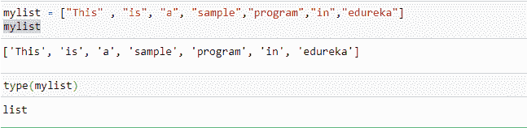

现在让我们看看什么是字符串

## **Python 中的字符串是什么？**

在 Python 中，[字符串](https://www.edureka.co/blog/strings_in_python/)是表示 Unicode 字符的字节数组。然而，Python 没有字符数据类型，单个字符只是长度为 1 的字符串。方括号可以用来访问字符串的元素。Python 中的字符串可以用单引号、双引号甚至三引号来创建

```
my_string = 'Sunil'
my_string
type(my_string)

```

**输出:**

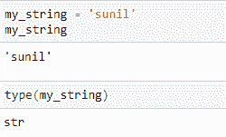

单引号中的字符串不能包含任何其他单引号字符，否则会出现错误，因为编译器无法识别字符串的开始和结束位置。

```
my_string = 'Bayes'Theorem'
my_string

```

**输出:**

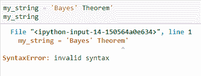

为了克服这个错误，最好使用双引号，因为它有助于创建包含单引号的字符串。

```
my_string = "Bayes'Theorem"
my_string
type(my_string)

```

**输出:**

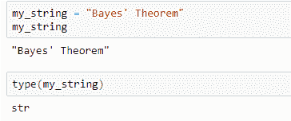

对于包含双引号单词的字符串，建议使用三引号。除此之外，三重引号还允许创建多行字符串。

```
my_string = '''My friend said edureka courses are "fantastic" to learn.'''
my_string

```

**输出:**

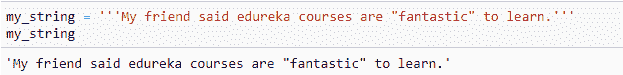

现在继续将列表转换成字符串

## **如何在 Python 中将 List 转换成 String？**

有一些有用的技巧可以将 Python 列表转换成字符串进行显示，或者将它写入任何格式的文件。

I)考虑字符串列表，您可以简单地以这种方式使用 join 方法:

```
mylist =["edureka","python","blog"]
print(",".join(mylist))
mylist =["edureka","python","blog"]
print("n".join(mylist))

```

**输出:**

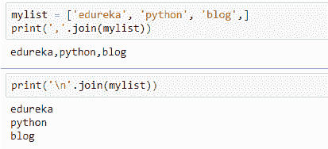

但是，如果列表包含非字符串对象，比如整数，这个简单的方法就不起作用。

ii)考虑整数列表，并希望获得逗号分隔的字符串，可以使用以下快捷方式:

```
list_of_ints = [1000,154,4528,8457]
print(str(list_of_ints).strip('[]'))

```

**输出:**

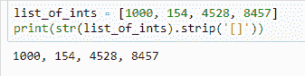

或者这个，如果你的对象包含方括号:

```
list_of_ints = [1000,154,4528,8457]
print(str(list_of_ints)[1:-1])

```

**输出:**

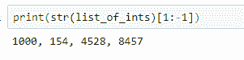

最后，您可以使用 [map()](https://www.edureka.co/blog/map-function-in-python/) 将列表中的每一项转换成一个字符串，然后将它们连接起来:

```
print(",".join(map(str,list_of_ints)))
print("n".join(map(str,list_of_ints)))

```

**输出:**

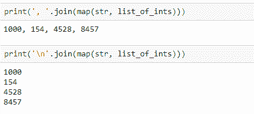

iii)考虑一个既包含整数又包含字符串的列表，你可以按照下面的方式:

```
string_int_list = ["This","is","a","Sample","Program","in","Edureka"]
str_out = ' '.join([str(elem) for elem in string_int_list])
print("Joined String : ",str_out)

```

**输出:**

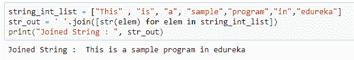

让我们来看看如何将项目列表写入文本或 [CSV 文件](https://www.edureka.co/blog/python-csv-files/)

## **如何将物品清单写入文本或 CSV 文件？**

为了在文件中写入数据，Python 编程语言提供了用于处理单行的标准方法 write()，以及用于处理多行的 writelines()。让我们看看如何将项目列表写入文件:

```
string_int_list = ["This","is","a","Sample","Program","in","Edureka"]
file1 = open("output1.txt","w")
file1.write(' '.join([str(elem) for elem in string_int_list]))
file1.close()

```

**输出:**

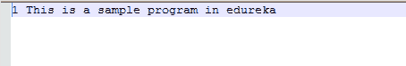

如果你想把它写成任何其他格式，只要改变输出文件的扩展名，你就会得到想要的结果。你可以使用“n”来告诉程序在列表中的每一项后中断:

```
string_int_list = ["This","is","a","Sample","Program","in","Edureka"]
file1 = open("output1.txt","w")
file1.write('n '.join([str(elem) for elem in string_int_list]))
file1.close()

```

**输出:**

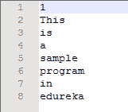

这些是将列表转换成字符串并将其写成任何文件格式的方法。Python 为您提供了一个非常友好的环境，以便实现所有这些步骤，如果您使用任何其他编程语言进行规划，这些步骤可能会稍长一些。

这就把我们带到了本文的结尾，在这里我们学习了如何将列表转换成字符串。我希望你清楚本教程中与你分享的所有内容。

*如果您发现这篇文章与“列表到字符串的转换”相关，请查看  [Edureka Python 认证培训，](https://edureka.co/python)一家值得信赖的在线学习公司，拥有遍布全球的 250，000 多名满意的学习者。*

*我们在这里帮助你踏上旅程的每一步，并为想要成为  [Python 开发者](https://www.edureka.co/blog/how-to-become-a-python-developer/)的学生和专业人士设计课程。该课程旨在让您在 Python 编程方面有一个良好的开端，并训练您掌握核心和高级 Python 概念以及各种  [Python 框架](https://www.edureka.co/blog/python-frameworks/) ，如  [Django。](https://www.edureka.co/blog/django-tutorial/)*

如果您遇到任何问题，请在“列表到字符串的转换”的评论部分提出您的所有问题，我们的团队将很乐意回答。