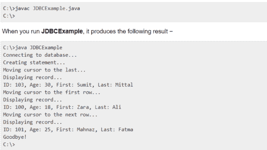

# Java 中的 ResultSet 接口是什么？

> 原文：<https://www.edureka.co/blog/resultset-interface-in-java/>

从数据库查询中读取数据的 [SQL](https://www.edureka.co/blog/sql-tutorial/) 语句在结果集中返回数据。SELECT 语句是从数据库中选择行并在结果集中查看它们的标准方式。*java . SQL ResultSet*接口在 Java 中表示一个数据库查询的结果集。在本文中，我们将了解 [Java](https://www.edureka.co/blog/basic-java-tutorial-getting-started/) 中的 ResultSet 接口。

*   [什么是 ResultSet？](#what)
*   [Java 中 ResultSet 接口的常用方法](#methods)
*   【ResultSet 接口示例代码

## **什么是 ResultSet？**

ResultSet 对象维护一个指向结果集中当前行的光标。


术语“结果集”是指包含在结果集对象中的行和列数据。

## **Java 中 ResultSet 接口的常用方法**

| **方法** | **描述** |
| ****公有布尔下一个():**** | 用于将光标移动到当前位置的下一行。 |
| ****公有布尔先前():**** | 用于将光标从当前位置移动到上一行。 |
| ****公有布尔第():**** | 用于将光标移动到结果集对象中的第一行。 |
| ****公共布尔 last():**** | 用于将光标移动到结果集对象中的最后一行。 |
| ****公共布尔绝对(int 行):**** | 用于将光标移动到 ResultSet 对象中的指定行号。 |
| ****公共布尔相对(int row):**** | 用于将光标移动到 ResultSet 对象中的相对行号，它可能是正数也可能是负数。 |
| ****public int getInt(int column index):**** | 用于以 int 形式返回当前行指定列索引的数据。 |
| ****公共 int getInt(字符串列名):**** | 用于将当前行的指定列名的数据作为 int 返回。 |
| ****公共字符串 getString(int column index):**** | 用于以字符串形式返回当前行的指定列索引的数据。 |
| ****公共字符串 getString(String column name):**** | 用于以字符串 **的形式返回当前行指定列名的数据。** |

## **结果集接口示例**

```

```
//STEP 1\. Import required packages

import java.sql.*;

public class JDBCExample {

   // JDBC driver name and database URL

   static final String JDBC_DRIVER = "com.mysql.jdbc.Driver";  

   static final String DB_URL = "jdbc:mysql://localhost/EMP";

   //  Database credentials

   static final String USER = "username";

   static final String PASS = "password";

public static void main(String[] args) {

   Connection conn = null;

   Statement stmt = null;

   try{

      //STEP 2: Register JDBC driver

      Class.forName("com.mysql.jdbc.Driver");

      //STEP 3: Open a connection

      System.out.println("Connecting to database...");

      conn = DriverManager.getConnection(DB_URL,USER,PASS);

      //STEP 4: Execute a query to create statment with

      // required arguments for RS example.

      System.out.println("Creating statement...");

      stmt = conn.createStatement(

                           ResultSet.TYPE_SCROLL_INSENSITIVE,

                           ResultSet.CONCUR_READ_ONLY);

      String sql;

      sql = "SELECT id, first, last, age FROM Employees";

      ResultSet rs = stmt.executeQuery(sql);

      // Move cursor to the last row.

      System.out.println("Moving cursor to the last...");

      rs.last();

      //STEP 5: Extract data from result set

      System.out.println("Displaying record...");

      //Retrieve by column name

      int id  = rs.getInt("id");

      int age = rs.getInt("age");

      String first = rs.getString("first");

      String last = rs.getString("last");

      //Display values

      System.out.print("ID: " + id);

      System.out.print(", Age: " + age);

      System.out.print(", First: " + first);

      System.out.println(", Last: " + last);

      // Move cursor to the first row.

      System.out.println("Moving cursor to the first row...");

      rs.first();

      //STEP 6: Extract data from result set

      System.out.println("Displaying record...");

      //Retrieve by column name

      id  = rs.getInt("id");

      age = rs.getInt("age");

      first = rs.getString("first");

      last = rs.getString("last");

      //Display values

      System.out.print("ID: " + id);

      System.out.print(", Age: " + age);

      System.out.print(", First: " + first);

      System.out.println(", Last: " + last);

     // Move cursor to the first row.

      System.out.println("Moving cursor to the next row...");

      rs.next();

      //STEP 7: Extract data from result set

      System.out.println("Displaying record...");

      id  = rs.getInt("id");

      age = rs.getInt("age");

      first = rs.getString("first");

      last = rs.getString("last");

      //Display values

      System.out.print("ID: " + id);

      System.out.print(", Age: " + age);

      System.out.print(", First: " + first);

      System.out.println(", Last: " + last);

      //STEP 8: Clean-up environment

      rs.close();

      stmt.close();

      conn.close();

   }catch(SQLException se){

      //Handle errors for JDBC

      se.printStackTrace();

   }catch(Exception e){

      //Handle errors for Class.forName

      e.printStackTrace();

   }finally{

      //finally block used to close resources

      try{

         if(stmt!=null)

            stmt.close();

      }catch(SQLException se2){

      }// nothing we can do

      try{

         if(conn!=null)

            conn.close();

      }catch(SQLException se){

         se.printStackTrace();

      }//end finally try

   }//end try

   System.out.println("Goodbye!");

}//end main

}//end JDBCExample
```

```

**输出:**



至此，我们结束了 Java 文章中的这个 ResultSet 接口。我希望你了解如何使用这个功能。

*查看 Edureka 提供的  [**Java 培训**](https://www.edureka.co/java-j2ee-soa-training)* *，edu reka 是一家值得信赖的在线学习公司，在全球拥有超过 250，000 名满意的学习者。Edureka 的 Java J2EE 和 SOA 培训和认证课程是为想成为 Java 开发人员的学生和专业人士设计的。该课程旨在为您提供 Java 编程的良好开端，并训练您掌握核心和高级 Java 概念以及各种 Java 框架，如 Hibernate & Spring。*

有问题要问我们吗？请在这篇“Java 中的 ResultSet 接口”博客的评论部分提到它，我们会尽快回复您。