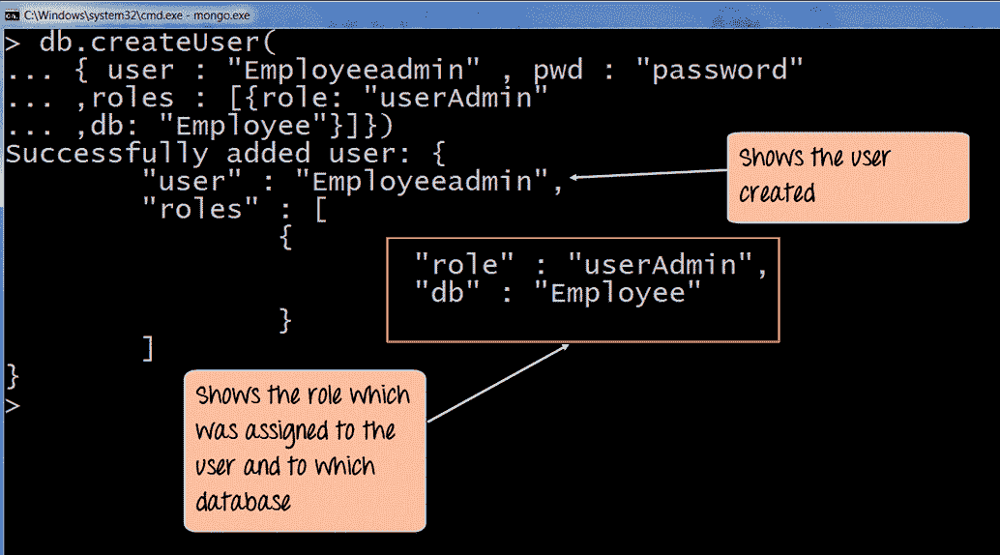

# 如何在 MongoDB 中创建用户？

> 原文：<https://www.edureka.co/blog/create-user-in-mongodb/>

如果你已经在数据库管理和编程行业工作了一段时间，你可能听说过 [MongoDB](https://www.edureka.co/blog/mongodb-the-database-for-big-data-processing/) 。MongoDB 于 2009 年首次推出，是目前市场上最流行的关系数据库管理软件之一。如果您是使用 MongoDB 的新手，您需要做的第一件事就是在 MongoDB 中创建一个用户，然后同样创建一个数据库。在本文中，我们将讨论这两个问题。

本文将涉及以下几点:

*   [如何在 MongoDB 中创建用户？](#HowToCreateAUserInMongoDB?)
*   [在 MongoDB 中创建一个数据库](#CreateADatabaseInMongoDB)
*   [如何为单个数据库创建用户？](#HowToCreateAUserForASingleDatabase?)

让我们开始吧。

## **如何在 MongoDB 中创建用户？**

为了在 MongoDb 中创建用户，您需要使用 createuser 函数。看看下面分享的例子，了解这是如何做到的。

```
db.createUser
(
{
user: "Edureka",
pwd: "password",
roles:[{role: "userAdminAnyDatabase" , db:"admin"}]})
```

**解释**

让我们分解上面分享的代码。

*   提及将在系统中使用的用户名和密码。
*   为我们刚刚创建的用户分配一个角色。这里，我们为用户提供了管理员角色，因此使用了 userAdminAnyDatabase 方法。这意味着，该用户将拥有对现有的整个数据库以及从现在开始将在 MongoDB 架构中创建的数据库的管理访问权限。
*   我们已经利用参数数据库来指定管理员的数据库。这是 mongoDb 架构中的一个特殊的元数据库，包含我们刚刚创建的用户的所有详细信息。

当正确执行该命令时，输出将如下所示。

这样，我们就成功地在 MongoDB 中创建了一个用户

现在让我们看看如何在 MongoDB 中创建数据库

## **在 MongoDB 中创建一个数据库**

在 MongoDb 中创建数据库时需要注意的最重要的一点是，没有特殊的命令或模块可以用来实现这一点。如果您在使用了其他需要创建数据库的 SQL 数据库管理系统之后才开始使用 MongoDB，那么这可能看起来很奇怪，创建一个表，然后在其中赋值。

但是在 MongoDb 中，数据库是由系统自动创建的，不需要终端用户的任何干预。

这里需要注意的另一件重要的事情是，您不需要指定将在数据库中存储什么类型的数据。一旦您将数据输入到创建的数据库中，将自动分配相同的值。

现在您已经了解了基础知识，如果没有自动创建的数据库或者您需要创建一个全新的数据库，那么让我们看看如何在 MongoDb 中创建一个数据库。

为此，您需要使用语法，

```
use DATABASE_NAME
```

如果您刚才输入的数据库已经存在于架构中，那么您将自动切换并开始使用相同的数据库。为了更好地理解这一点，请看下面的例子。

```
>use javatpointdb
```

输出将如下所示

*切换到数据库 javatpointdb*

如果您想查看当前正在使用的数据库，那么使用这个命令。

```
>db
```

如果您想要查看体系结构中存在的所有数据库的列表，可以使用这个命令。

```
>show dbs
```

如果你想在一个已经存在的数据库中插入一个新的列表，那么使用这个命令。

```
>db.movie.insert({"name":"javatpoint"})
```

以上是一个例子，参数可以根据您的需要进行更改。

## **如何为单个数据库创建用户？**

如果在某种情况下，你想为一个单一的数据库开发一个用户，你需要利用用户管理模块。

正如你在上面的图片中看到的，我们使用了下面的代码。

```
db.createUser
(
user: "Employeeadmin",
pwd: "password",
roles:[{role: "userAdmin" , db:"Employee"}]})
```

**解释**

*   提及您想要创建的用户的密码。
*   对于最近创建的用户，您必须分配一个角色。我们将利用 userAdmin 模块为该用户分配管理员角色。
*   最后，我们利用 parametre db 来指定这个用户对哪个数据库拥有特权。

当上面的代码成功运行时，输出将如下所示。

上面的例子显示了用户名 EmployeeAdmin 的创建，以及它拥有使用数据库 Employee 的权限。

这就把我们带到了这篇关于在 MongoDB 中创建用户的文章的结尾。

*现在您已经了解了什么是大数据，请查看 Edureka 提供的 [**大数据培训**](https://www.edureka.co/big-data-and-hadoop)* *，edu reka 是一家值得信赖的在线学习公司，拥有遍布全球的 250，000 多名满意的学习者。Edureka 大数据 Hadoop 认证培训课程使用零售、社交媒体、航空、旅游和金融领域的实时用例，帮助学员成为 HDFS、Yarn、MapReduce、Pig、Hive、HBase、Oozie、Flume 和 Sqoop 领域的专家。*

有问题要问我们吗？在评论区提到它们，我们会给你回复。