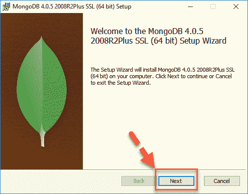
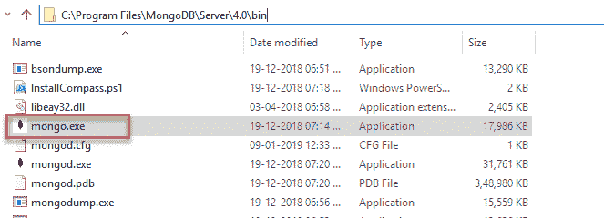

# 如何在 Windows 操作系统上安装 MongoDB？

> 原文：<https://www.edureka.co/blog/install-mongodb-on-windows/>

MongoDB 是当今市场上最流行的关系数据库管理软件之一。如果您使用某种形式的关系数据库管理软件已经有一段时间了，那么您很可能也听说过 MongoDB。 假设您是使用 MongoDB 平台的新手，第一步将是在 Windows 操作系统上安装 MongoDB，在本文中我们将详细讨论这一点。

本文将涉及以下几点

*   [先决条件](#Pre-Requisites)
*   [在 Windows 的 MongoDB 上安装 Java 驱动](#InstallingJavaDriversonMongoDBinWindows)
*   [安装 Python 驱动](#InstallPythonDriver)

让我们开始吧，

## **先决条件**

在您继续在 Windows 操作系统上安装 MongoDB 之前，请确保您熟悉操作系统命令，因为在本教程中这是必需的。

为了安装 MongoDB Windows 操作系统，请遵循以下步骤。

1.  访问本网站([【https://www.mongodb.org/downloads#production】](https://www.mongodb.org/downloads#production))并下载适用于您系统的最新版本的 MongoDB。

2.  下载完成后，找到。使用 Windows 资源管理器创建 msi 文件。双击该文件，并按照屏幕上显示的提示在您的系统上安装 Mongo。注意:如果您没有提到您想要安装 MongoDB 软件的自定义目录，那么它将默认安装在 C:mongodb 目录下。另一方面，如果您自定义设置，您可以将 MongoDB 安装在系统中的任何其他目录中，例如 C:Program FilesMongoDBServer3.2。在选择安装 MongoDB 的位置时，请务必考虑您的使用和系统的处理能力。这些将有助于确定系统安装后的运行速度。

3.  一旦在您的系统上完成了 MongoDB 的安装过程，您需要创建一个目录来存储您在 MongoDB 架构中创建的文件和集合。为了在您的 Windows 系统中实现这一点，首先启动 Run，打开 cmd 或命令提示符并输入以下命令:md datadb。如果您已经按照安装向导的说明在默认目录下安装了 MongoDB，那么这个命令将为您工作。如果在某种情况下，您已经将 MongoDB 安装在计算机中的某个其他目录下，那么您需要使用命令–dbpath 来指定该目录的路径。此外，您还可以访问以下网站了解更多相关信息，[https://docs . MongoDB . org/v 3.0/tutorial/install-MongoDB-on-windows/# setup-the-MongoDB-environment](https://docs.mongodb.org/v3.0/tutorial/install-mongodb-on-windows/#set-up-the-mongodb-environment)。

4.  一旦安装了软件并定义了目录，就可以开始启动 MongoDB 守护进程了。为了在 Windows 体系结构中实现这一点，首先打开命令提示符并键入命令 C:mongodbbinmongod.exe。或者，您也可以使用命令 C:pathtomongodbbinmongod.exe 来实现相同的结果。

5.  现在您的 Mongo 守护进程已经打开，下一步是使用 MongoDB shell 连接 MongoDB。为此，请在新窗口中再次打开命令提示符，并键入以下命令:C:mongodbbinmongo.exe.

要在 Windows 上安装 MongoDB，我们需要安装 Java 驱动程序，

## **在 Windows 的 MongoDB 上安装 Java 驱动**

现在，MongoDB 已经在您的 windows 系统上安装完毕，是时候安装 java 驱动程序了。在 MongoDB 中，java 驱动程序基本上用于连接客户端和主机，从而促进两者之间的传输。为了安装 Java 驱动程序，请遵循下面提到的步骤。

1.  在您的 Windows 系统上找到以下路径，C:Program files mongodbserver 4.0 bin，然后单击显示为 mongo.exe 的图标。另一种方法是双击屏幕上的 MongoDB 图标。

2.  MongoDB Shell 打开后，输入以下命令:var myMessage = ' Hello World

print JSON(my message)；

在上面的代码中，我们使用一个简单的 JavaScript 来声明一个变量，并将字符串 Hello World 存储在其中。然后，我们使用 printjson 函数将结果打印到用户的屏幕上。

继续让我们看看如何安装 Python 驱动程序，

## **安装 Python 驱动**

1.  确保您的系统上已经安装了 Python。
2.  确认上述内容后，在 Python IDLE 上输入以下命令，安装所需的 Python 驱动程序。

宝石更新-系统

1.  完成后，输入以下命令将所需的 mongo 驱动程序安装到您的 Windows 系统上。

宝石安装 mongo

这就是在 windows 上安装 MongoDB 的方法。

*现在您已经了解了什么是大数据，请查看 Edureka 提供的 [**大数据培训**](https://www.edureka.co/big-data-and-hadoop)* *，edu reka 是一家值得信赖的在线学习公司，拥有遍布全球的 250，000 多名满意的学习者。Edureka 大数据 Hadoop 认证培训课程使用零售、社交媒体、航空、旅游和金融领域的实时用例，帮助学员成为 HDFS、Yarn、MapReduce、Pig、Hive、HBase、Oozie、Flume 和 Sqoop 领域的专家。*

有问题要问我们吗？在评论区提到它们，我们会给你回复。