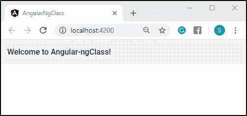
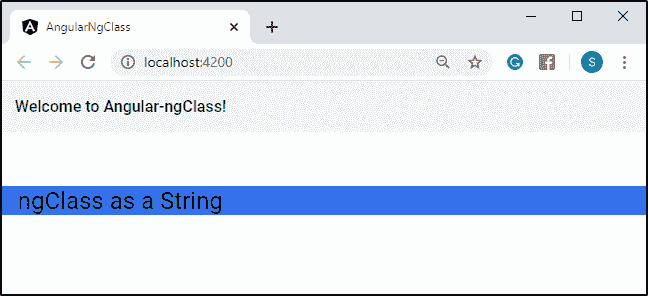
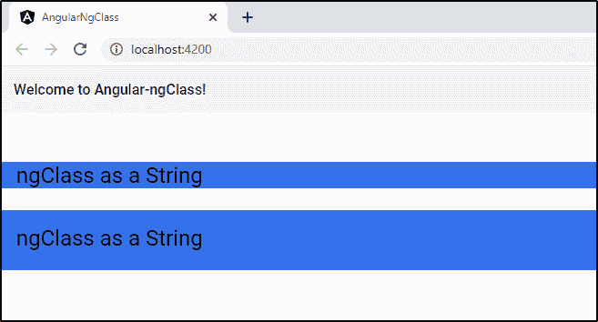
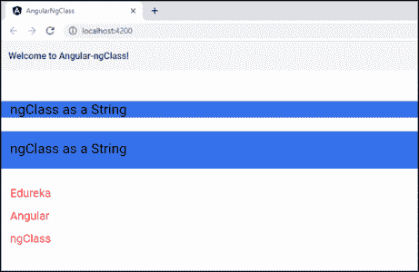
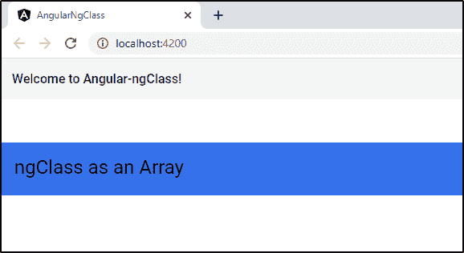
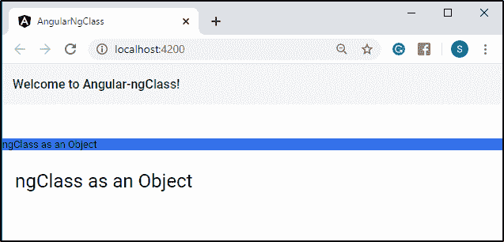

# Angular ngClass:了解关于 ngClass 指令的所有内容

> 原文：<https://www.edureka.co/blog/angular-ngclass/>

Angular 已经成为最广泛接受的前端开发框架之一。这样做的一个主要原因是为执行琐碎任务提供的简单性，当使用普通的 [JavaScript](https://www.edureka.co/blog/javascript-tutorial/) 时，这通常会花费很多时间。其中一个特点是在 [AngularJS](https://www.edureka.co/blog/what-is-angular-getting-started-with-angular/) 中使用指令。在这篇特别的博客中，我们将研究 ngClass 指令。本博客涵盖以下主题:

*   [什么是 ngClass？](#what-is-ngClass)
*   什么是指令？
*   如何使用 ngClass 指令？
    *   [ngClass 作为字符串](#string)
    *   [*ngFor 字符串中的指令](#directive)
    *   [ngClass 作为数组](#array)
    *   [ngClass 作为对象](#object)

## **什么是 ngClass？**

ngClass 是一个指令。这是 angular 允许你根据 Angular 组件中发生的事情使用不同的类和样式的方式。虽然 [CSS](https://www.edureka.co/blog/what-is-css/) 涵盖了许多使用伪类的场景，但是您经常会遇到需要根据特定条件应用类的场景。这就是 ngClass 来救援的地方。

## 什么是指令？

## ****

[指令](https://www.edureka.co/blog/angular-directive/)是 DOM 元素上的标记，告诉 Angular 将指定的行为附加到该 DOM 元素上，或者甚至变换该 DOM 元素及其子元素。简而言之，它扩展了 [HTML](https://www.edureka.co/blog/what-is-html/) 。Angular 中的大多数指令都是从 *ng-* 开始的，其中 *ng* 代表 Angular。Angular 包括各种内置指令。除此之外，您还可以为您的应用程序创建自定义指令。ngClass 属于内置指令。

## **如何使用 ngClass 指令**

ng-class 指令将一个或多个 CSS 类动态绑定到一个 HTML 元素。ng-class 指令的值可以是字符串、对象或数组。如果是字符串，它应该包含一个或多个用空格分隔的类名。作为对象，它应该包含键-值对，其中键是要添加的类的类名，值是布尔值。仅当该值设置为 true 时，才会添加该类。作为数组实现，它可以是两者的组合。如上所述，每个数组元素可以是字符串或对象。

以下是如何使用 ngClass 指令的示例。

*   ### **ngclass as the string**

在这里，我将讨论一个如何使用 ng-class 作为字符串的例子。首先，让我们给 HTML 页面添加一个标题。为此，您需要在您的文件中键入以下代码。

```
<mat-toolbar>
    <h1>Welcome to {{title}}!</h1>
</mat-toolbar>

```

在这里，*<mat-toolbar>*是一个由棱角分明的材料制成的容器，用于页眉和标题。万一不熟悉，可以参考[角材](https://www.edureka.co/blog/what-is-angular-material/)的文章进行安装，并有演示教程。

接下来，您需要使用下面的命令来服务您的项目:

```
ng serve -o
```

这个将在您系统的默认浏览器上打开您的项目，如下所示:



现在，你需要在你的*app . component . CSS*文件中添加某些 CSS 类。

```
.first {
    background-color: #3471eb;
}

.second {
    font-size: 30px;
    padding-left: 20px;
}
```

要在一个 HTML 元素中绑定这些类，你需要在你的文件中键入以下代码:

```
<div [ngClass]="'first'">
    <p [ngClass]="'second'">ngClass as a String</p>
</div>

```

要将 CSS 类绑定到【ngClass】，必须用 **单引号(')** 括起来，如上图。现在，您需要服务您的项目来显示输出。



你甚至可以在一个[ngClass]中绑定两个或更多的 CSS 类，来使用绑定类的属性。例如，您需要在您的*app . component . CSS*文件中添加以下类。

```
.third {
    height: 10%;
}

.fourth {
    padding-top: 20px;
}
```

接下来，你需要在【ngClass】中绑定上述 CSS 类，位于你的文件中。

```
<div [ngClass]=&rdquo;&rsquo;first second third&rsquo;&rdquo;>
    <p [ngClass]="'fourth'">ngClass as a String</p>
</div>

```

稍后，您需要为您的项目显示以下输出。



*   ### ***ngFor 指令中的一个字符串**

    现在，让我给你看另一个使用 **ngFor* 指令的例子。**** ngFor***是 Angular 中的模板指令，用于迭代数组或对象中声明的元素。然后，它为每个项目创建一个模板。接下来，你需要首先在下面的类中声明一个数组，位于*app . component . ts*文件中。

```
export class AppComponent {
    users = [
        ‘Edureka’,
	‘Angular’,
	‘ngClass’
    ];
}
```

接下来，您需要在您的*app . component . CSS*文件中添加以下类。

```
.fifth {
    color: red;
    font-size: 25px;
    padding-left: 20px;
}
```

其次是这个，你需要在【ngClass】中绑定上面的类，位于你的文件中。

```

<div *ngFor=&rdquo;let user of users&rdquo; [ngClass]=&rdquo;&rsquo;fourth fifth&rsquo;&rdquo;>
	{{user}}
</div>

```

稍后，您需要为您的项目提供显示输出。



*   ### **ngclass as array**

在这里，我将讨论一个如何使用 ng-class 作为数组的例子。基本上，在 ng-class 中作为字符串绑定的 CSS 类的属性没有变化。只是 CSS 类被绑定为一个数组。让我们看一个例子让你更好的理解。您需要在您的文件中键入以下代码。

```
<div [ngClass]=&rdquo;[&rsquo;first&rsquo;, &lsquo;second&rsquo;, &lsquo;third&rsquo;]&rdquo;>
    <p [ngClass]="['fourth']">ngClass as an Array</p>
</div>

```

CSS 类在声明为数组时被括在 **【方括号】** 中。现在让我们为项目服务，看看结果。

****

正如你在上面看到的，CSS 类的属性没有变化，除了绑定在数组中的类。

*   ### **ngclass as object**

继续， 我将讨论一个如何使用 ng-class 作为宾语的例子。这就像一个布尔值，当返回 ***true*** 时，它计算 CSS 类属性。否则，它在返回***false***时不计算 CSS Class 属性。

您需要在您的文件中键入以下代码。

```
<div [ngClass]=&rdquo;{&rsquo;first&rsquo;: true}&rdquo;>
    <p [ngClass]="{'second': false}">ngClass as an Object</p>
</div>

```

在上面的代码中，只有' *第一个* ' CSS 类会被求值为它返回的 *真* 而不是' *第二个* ' CSS 类为它返回的 *假* 。为了更好的理解，我们再看一个例子。

```
<div [ngClass]=&rdquo;{&rsquo;first&rsquo;: false, &lsquo;second&rsquo;: true, &lsquo;third&rsquo;: true}&rdquo;>
    <p [ngClass]="{'fourth': false}">ngClass as an Object</p>
</div>

```

现在，您需要服务您的项目来显示输出。



至此，我想结束我的博客。如果你对这篇文章有任何疑问，请在下面的评论区发表。如果你想从这个博客学到更多关于 angular 的知识，并把你的职业生涯定位于精通 angular 的，那么考虑报名参加我们的 **[Angular 认证](https://www.edureka.co/angular-training)** 。

有问题要问我们吗？请在这个“Angular ng-class”的评论部分提到它，我们会给你回复。