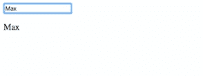

# Angular ngModel:了解 ngModel 指令的所有内容

> 原文：<https://www.edureka.co/blog/angular-ngmodel/>

双向数据绑定对 AngularJS 来说是个大问题。尽管概念很简单，即属性和事件绑定的融合，但实现却相当复杂。这个问题通过在 [Angular 2](https://www.edureka.co/blog/what-is-angular-getting-started-with-angular/) 中引入 ngModel 指令得到了解决。在本文中，我们将了解 ngModel 指令，以及它是如何工作的，并使您作为开发人员的生活变得更加容易:

*   [什么是 ngModel？](#what-is-ngmodel)
*   什么是指令？
*   [ng 模型使用示例](#ng-model)

## **什么是 ngModel？**

ngModel 是 Angular 对双向数据绑定问题的回答。以前在 AngularJS 中，无法执行自动更新的绑定。这个问题在 angular 2 中得到了解决，并且从那时起就一直这样工作。解决方案在于 ngModel 指令，它是 FormsModule 的一部分。在我们学习 ngModel 之前，让我们先简要了解一下什么是指令

## 什么是指令？

[ ](https://www.edureka.co/blog/angular-directive/) [指令](https://www.edureka.co/blog/angular-directive/)是 [DOM](https://www.edureka.co/blog/html-dom) 元素上的标记，告诉 AngularJS 将指定的行为附加到该 DOM 元素上，或者甚至转换 DOM 元素及其子元素。简而言之，它扩展了 [HTML](https://www.edureka.co/blog/what-is-html/) 。Angular 中的大多数指令都是从 *ng-* 开始的，其中 *ng* 代表 *Angular* 。Angular 包括各种内置指令。除此之外，您还可以为您的应用程序创建自定义指令。

## **ng 模型使用示例**

ng-model 指令将 HTML 控件(输入、选择、文本区域)的值绑定到应用程序数据。它是 FormsModule 的一部分。这个指令可以单独使用，也可以作为一个更大的表单的一部分。它接受一个域模型作为可选输入。如果您使用[]语法单向绑定到 ngModel，则在组件类中更改域模型的值会在视图中设置该值。如果您使用[()]语法(也称为“香蕉盒语法”)进行双向绑定，UI 中的值总是同步回您的类中的域模型。要了解 Angular ngModle 的更多信息，请查看这个 [Web 开发人员在线课程](https://www.edureka.co/masters-program/full-stack-developer-training)。

以下示例显示了一个使用 ngModel 的简单独立控件:

```
import {Component} from '@angular/core';

@Component({
selector: 'example-app',
template: `
<input [(ngModel)]="name" #ctrl="ngModel" required>
Value: {{ name }}
Valid: {{ ctrl.valid }}
<button (click)="setValue()">Set value</button>
})
export class SimpleNgModelComp {
name: string = '';
setValue() { this.name = 'Nancy'; }
}

```

上面的代码将向你展示一个双向绑定的表单。输入空间和结果空间以自动更新的方式联系在一起。  就这样，我的博客到此结束。如果你对这篇文章有任何疑问，请在下面的评论区发表。如果你想从这个博客学到更多关于 angular 的知识，并把你的职业生涯定位于一个精通的Angular 开发者，那么考虑报名参加我们的 ** [ Angular 认证课程](https://www.edureka.co/angular-training) ** 。  

有问题要问我们吗？请在这个“Angular ngModel”的评论部分提到它，我们会给你回复。