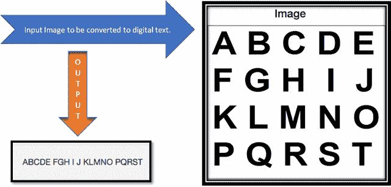

# 如何在 Python 中实现光学字符识别

> 原文：<https://www.edureka.co/blog/optical-character-recognition-in-python/>

光学字符识别是至关重要的，也是编程语言的一个关键方面。这些概念在现实世界中的应用有很多。在本文中，我们将讨论如何在 Python 中实现光学字符识别

*   [光学字符识别的应用](#application)
*   [用 Python 构建一个光学字符识别](#build)
*   [OCR 引擎的优缺点](#adv)

## **光学字符识别的应用**

售票柜台广泛使用这种技术来扫描和检测车票上的关键信息，以跟踪路线和通勤者的详细信息。将纸质文本转换为数字格式，其中相机捕捉高分辨率照片，然后使用 OCR 将其转换为 word 或 PDF 格式。


OCR 和 python 的引入归功于像“Tesseract”和“Orcad”这样的多功能库的增加。这些库已经帮助许多编码人员和开发人员简化了他们的代码设计，并允许他们在项目的其他方面花费更多的时间。因为好处是巨大的，所以让我们来看看它是什么以及它是如何实现的。

## **用 Python 构建光学字符识别**

我们首先需要使用“pytesseract”创建一个类。这个类将使我们能够导入图像并扫描它们。在此过程中，它将输出扩展名为“ocr.py”的文件。让我们看看下面的代码。功能块“process_image”用于锐化我们得到的文本。

以下路由处理程序和视图功能被添加到应用程序(app.py)中。

**路由器处理器代码**

```
//ROUTE HANDLER
@app.route('/v{}/ocr'.format(_VERSION), methods=["POST"])
def ocr():
    try:
        url = request.json['image_url']
        if 'jpg' in url:
            output = process_image(url)
            return jsonify({"output": output})
        else:
            return jsonify({"error": "only .jpg files, please"})
    except:
        return jsonify(
            {"error": "Did you mean to send: {'image_url': 'some_jpeg_url'}"}
        )
```

**OCR 引擎代码**

```
// OCR ENGINE
import pytesseract
import requests
from PIL import Image
from PIL import ImageFilter
from StringIO import StringIO

def process_image(url):
    image = _get_image(url)
    image.filter(ImageFilter.SHARPEN)
    return pytesseract.image_to_string(image)

def _get_image(url):
    return Image.open(StringIO(requests.get(url).content))
//
```

请确保更新导入并添加 API 版本号。

```
import os
import logging
from logging import Formatter, FileHandler
from flask import Flask, request, jsonify

from ocr import process_image
_VERSION = 1  # API version
```

我们正在添加 OCR 引擎的函数“process_image()”的 JSON 响应。JSON 用于收集进出 API 的信息。我们在一个目标文件中传递响应，使用 PIL 的“图像”库来安装它。

请注意，这段代码只有在。仅 jpg 图像。如果我们使用能够以多种图像格式为特征的复杂库，那么所有的图像都可以被有效地处理。还要注意，如果你有兴趣自己尝试这段代码，那么请先安装 PIL，它是从“枕头”库中获得的

首先运行应用程序，即“app.py”:

```
//
$ cd ../home/flask_server/
$ python app.py
//
```

然后，在另一次终端运行中:

```
//$ curl -X POST http://localhost:5000/v1/ocr -d '{"image_url": "some_url"}' -H "Content-Type: application/json"
```

例如:

```
//
$ curl -X POST http://localhost:5000/v1/ocr -d '{" C:UsersakashDownloadsPic1 ": "https://edureka.cimg/blog_images/ocr/ocr.jpg"}' -H "Content-Type: application/json"
{
  "output": "ABCDEnFGH I JnKLMNOnPQRST"
}
//
```



## **OCR 引擎的优缺点**

在 python 中使用 OCR 的许多应用中，最流行的是手写识别。人们应用这种方法是为了重新创建书面文本，然后可以填充到许多副本中，而不仅仅是影印原始脚本。这是为了实现一致性和易读性。

OCR 在将 PDF 转换为文本并将其存储为变量方面也很有用。随后，可以对其进行任何数量的预处理，以完成额外的任务。尽管 OCR 的概念似乎是 Python 世界中一个有益的话题，但它确实也有一些缺点。

OCR 不能总是保证 100%的准确性。许多小时的训练需要在人工智能概念的帮助下进行，这可以使 OCR 引擎学习和识别差的图像。可以识别手写图像，但它们取决于几个因素，如书写风格、页面颜色、图像对比度和图像分辨率。

至此，我们结束了 Python 文章中的光学字符识别。我希望你能理解 OCR 到底是如何工作的。

*要深入了解 Python 及其各种应用，您现在就可以报名参加[最佳 Python 课程](https://www.edureka.co/python-programming-certification-training)培训，该培训提供全天候支持和终身访问。*

*有问题吗？在“Python 中的光学字符识别”的评论部分提到它们，我们将会回复您。*