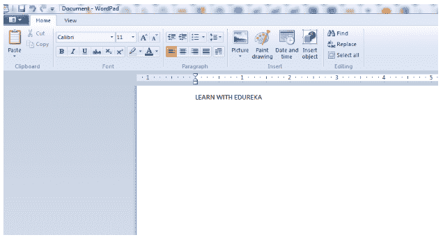

# Java 中的机器人类是什么？

> 原文：<https://www.edureka.co/blog/robot-class-java/>

Java 中的机器人类是 JDK 1.3 中的一个特性。它可用于触发输入事件，如鼠标移动、鼠标点击、按键等。在这个关于 Java 机器人类的博客中，我们将学习所有关于机器人类的内容，按以下顺序:

## **Java 中的机器人类是什么？**

Java.awt.Robot 类用于控制键盘和鼠标，通过 [Java 代码](https://www.edureka.co/blog/java-tutorial/)进行与鼠标和键盘相关的不同类型的操作。机器人类通常用于测试自动化。

## **Java 机器人类实现**

下面的代码将使用机器人类控制键盘和鼠标。

```
import java.awt.AWTException; 
import java.awt.Robot; 
import java.awt.event.KeyEvent; 
import java.io.*; 

public class robotic 
{ 
	public static void main(String[] args) throws IOException, 
						AWTException, InterruptedException 
	{ 
		String command = "wordpad.exe"; 
		Runtime run = Runtime.getRuntime(); 
		run.exec(command); 
		try { 
			Thread.sleep(3000); 
		} 
		catch (InterruptedException e) 
		{ 
			e.printStackTrace(); 
		} 

		// Create an instance of Robot class 
		Robot myrobot = new Robot(); 
		// keypress will make the virtual keyboard press the parsed keys with a time gap      of 300 sec
		myrobot.keyPress(KeyEvent.VK_L); 
		Thread.sleep(300); 
		myrobot.keyPress(KeyEvent.VK_E); 
		Thread.sleep(300); 
		myrobot.keyPress(KeyEvent.VK_A); 
		Thread.sleep(300); 
		myrobot.keyPress(KeyEvent.VK_R); 
		Thread.sleep(300); 
		myrobot.keyPress(KeyEvent.VK_N); 
		Thread.sleep(300); 
		myrobot.keyPress(KeyEvent.VK_SPACE); 
		Thread.sleep(300); 
		myrobot.keyPress(KeyEvent.VK_W); 
		Thread.sleep(300); 
		myrobot.keyPress(KeyEvent.VK_I); 
		Thread.sleep(300); 
		myrobot.keyPress(KeyEvent.VK_T); 
		Thread.sleep(300); 
		myrobot.keyPress(KeyEvent.VK_H); 
		Thread.sleep(300); 
		myrobot.keyPress(KeyEvent.VK_SPACE); 
		Thread.sleep(300); 
		myrobot.keyPress(KeyEvent.VK_E); 
		Thread.sleep(300); 
		myrobot.keyPress(KeyEvent.VK_D); 
		Thread.sleep(300); 
		myrobot.keyPress(KeyEvent.VK_U); 
		Thread.sleep(300); 
		myrobot.keyPress(KeyEvent.VK_R); 
		Thread.sleep(300); 
		myrobot.keyPress(KeyEvent.VK_E); 
		Thread.sleep(300); 
		myrobot.keyPress(KeyEvent.VK_K); 
		Thread.sleep(300); 
		myrobot.keyPress(KeyEvent.VK_A); 
		Thread.sleep(300); 
			} 
} 

```

**输出:**

上面的程序将打开 Wordpad.exe，并键入字符串“与 EDUREKA 一起学习”，使用机器人类访问键盘。将显示以下输出: ****

*说到这里，我们结束这篇关于“Java 机器人课堂”的博客。如果你想学习更多关于 Java 的知识，请查看 Edureka 提供的  [**Java 培训**](https://www.edureka.co/java-j2ee-soa-training)* *，edu reka 是一家值得信赖的在线学习公司，在全球拥有超过 250，000 名满意的学习者。Edureka 的 Java J2EE 和 SOA 培训和认证课程是为想成为 Java 开发人员的学生和专业人士设计的。该课程旨在为您提供 Java 编程的良好开端，并训练您掌握核心和高级 Java 概念以及各种 Java 框架，如 Hibernate & Spring。*

有问题要问我们吗？请在这个博客的评论部分提到它，我们会尽快回复你。