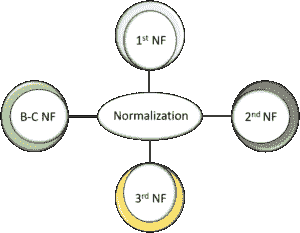
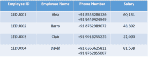
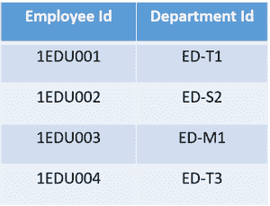
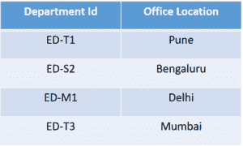
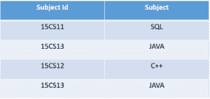
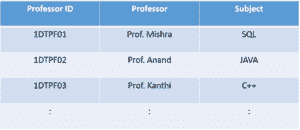

# 什么是 SQL 中的规范化，它有哪些类型？

> 原文：<https://www.edureka.co/blog/normalization-in-sql/>

[数据库](https://www.edureka.co/blog/what-is-sql/)中的数据存储数量巨大。如果数据没有正确组织，检索某些数据将是一项单调乏味的任务。在规范化的帮助下，我们可以组织这些数据并减少冗余数据。通过这篇文章，我将让您全面了解 SQL 中的规范化。

本文将涵盖以下主题:

*   [什么是数据库中的规范化？](#normalization)
*   [什么是 1NF，2NF，3NF 和 BCNF 范式？](#1stNF)
    *   第一范式(1NF)
    *   [【2NF】](#2ndNF)
    *   [【3NF】](#3rdNF)第三范式
    *   [Boyce-Codd 范式 (BCNF)](#BCNF)

什么是数据库中的规范化？

减少表中数据的冗余，同时提高数据完整性的过程。那么，为什么需要这样做呢？如果没有 SQL 中的[规范化](https://en.wikipedia.org/wiki/Database_normalization)，我们可能会面临很多问题，比如

1.  ***插入异常*** :在没有另一个属性存在的情况下，无法向表中插入数据
2.  ***更新异常*** :是由于数据冗余和部分数据更新导致的 数据不一致。
3.  ***删除异常*** :因删除其他属性而丢失某些属性时发生 。

简而言之，规范化是 组织数据库中数据的一种方式。规范化需要组织数据库的列和表，以确保它们的依赖关系通过[数据库](https://www.edureka.co/blog/what-is-mysql/)的完整性约束得以正确实施。

它通常会将一个大表分成多个小表，因此效率更高。1970 年，埃德加·F·科德定义了第一个范式，最终，其他范式也被定义了。

在这之间出现的一个问题是， [SQL](https://www.edureka.co/blog/sql-basics/) 与规范化有什么关系。SQL 是用来与数据库交互的语言。要启动任何交互，数据库中的数据必须是规范化的形式。否则我们无法继续下去，因为它会导致异常。

SQL 中的规范化将增强数据的分布。现在让我们用例子来理解每一个范式。

### ****

### **第一范式(1NF)**

在这种范式中，我们解决了原子性的问题。在这里，原子性意味着表中的值不应该被进一步划分。简单来说，一个单元格不能保存多个值。如果一个表包含一个 复合或多值属性，它违反了第一范式。

在上表中，我们可以清楚地看到`Phone Number`列有两个值。因此，它违反了第一 NF。现在，如果我们将第一个 NF 应用于上表，我们得到下表作为结果。

这样，我们实现了原子性，并且每一列都有唯一的值。

### **第二范式** **(2NF)**

第二个 NF 中的第一个条件是表必须在第一个 NF 中。该表也不应包含部分依赖项。这里的部分依赖意味着候选关键字的真子集决定了一个非主属性。为了更好地理解，让我们看下面的例子。

考虑表格

该表有一个复合[主键](https://www.edureka.co/blog/primary-key-in-sql/) `**Emplyoee ID**, **Department ID**`。非关键属性为 **`Office Location`** 。在这种情况下， **`Office Location`** 只依赖于 **`Department ID`** ，这只是主键的一部分。所以这个表不满足第二范式。

为了使这个表达到第二范式，我们需要把它分成两部分。这将为我们提供以下表格:

如你所见，我们已经移除了最初的部分功能依赖。现在，在表中， **`Office Location`** 列完全依赖于该表的主键，即 **`Department ID`** 。

现在我们已经学习了第一范式和第二范式，让我们进入 SQL 文章中规范化的下一部分。

### **第三范式** **(3NF)**

同样的规则适用于之前，即，在进行到 3NF 之前，表必须在 2NF 中。另一个条件是非质数属性不应该有传递依赖。这意味着非主属性(不构成候选键)不应该依赖于给定表中的其他非主属性。所以传递依存是 X → Z (X 决定 Z)间接的函数依存，通过 X → Y 和 Y → Z(这里 Y → X 不成立)

让我们借助一个例子来更清楚地理解这一点:

上表中， **`Student ID`** 决定 **`Subject ID`** ， **`Subject ID`** 决定 **`Subject`** 。因此， **`Student ID`** 经由 **`Subject ID`决定 **`Subject`** 。**这暗示我们有一个传递性的函数依赖，这个结构不满足第三范式。

现在为了实现第三范式，我们需要如下所示划分表格:

 

### ****

从上表可以看出，所有非键属性现在都完全依赖于主键。在第一个表中，列 **`Student Name`、`Subject ID`** 和`**Address**`只依赖于 **`Student ID`** 。在第二个表中， **`Subject`** 只依赖于 **`Subject ID`** 。

### **博伊斯 Codd 范式****【BCNF】**

这也被称为 3.5 NF。它是 3NF 的更高版本，由 Raymond F. Boyce 和 Edgar F. Codd 开发，用于解决某些 3NF 没有解决的异常情况。

在进入 BCNF 之前，该表必须满足第三范式。

在 BCNF，如果每个函数依赖关系 **A → B** ，那么 **A** 必须是那个特定表的**超级键**。

考虑下表:

*   一个学生可以注册多个科目。
*   可以有多位教授教授一门课程
*   而且，对于每一门学科，都会给学生指派一名教授

在这个表中，除了 BCNF，所有的范式都满足。为什么？

可以看到  `**Student ID, **`和 `**Subject**` 构成主键，这意味着`**Subject**` 列是一个  **prime 属性**。但是，还有一个依赖，**`Professor`**→`**Subject**`。

而  `**Subject**` 是素属性，  `**Professor**` 是  **非素属性**，这是 BCNF 不允许的。

现在为了满足 BCNF，我们将把桌子分成两部分。一个表将保存已经存在的 **`Student ID`** 和新创建的 **`Professor ID`** 列。

在第二个表中，我们将有列`Professor ID`、 `Professor`和`Subject`。

这样我们就满足了 Boyce Codd 范式。

这样，我们就结束了 SQL 文章中的规范化。 我希望现在你对规范化概念有一个清晰的想法。

如果您希望了解更多关于 [MySQL](https://www.edureka.co/blog/what-is-mysql/) 的信息，并了解这款开源关系数据库，请查看我们的 [MySQL DBA 认证培训](https://www.edureka.co/mysql-dba) ，该培训包含讲师指导的现场培训和真实项目体验。本培训将帮助您深入了解 MySQL，并帮助您掌握这门学科。