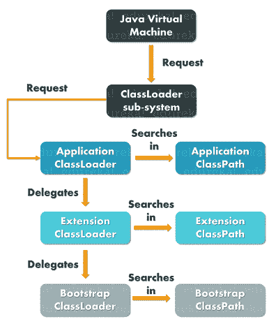

# Java 中类装入器的作用是什么？

> 原文：<https://www.edureka.co/blog/classloader-in-java/>

在 Java 中工作时，我们经常使用大量的类。这些 Java 类不会一次全部加载到内存中，而是在应用程序需要时加载。这就是 Java 类加载器的用武之地。因此，在本文中，我将讨论如何使用 Java 中的类加载器，并给出一些例子。

本文将涵盖以下主题:

1.  什么是类加载器？
2.  [类加载器的类型](#typesofclassloader)
3.  [类加载器的原理](#principlesofclassloader)
4.  [类加载器的方法](#methodsofclassloader)
5.  [自定义类加载器](#customclassloader)

让我们开始吧！

## **Java 中的 ClassLoader 是什么？**

Java 中的 ClassLoader 由 Java 运行时环境调用，以便在 [Java 虚拟机](https://www.edureka.co/blog/java-virtual-machine/)中的应用程序需要时动态加载类。由于类加载器是 Java 运行时环境的一部分，Java 虚拟机对底层文件和文件系统没有任何概念。

现在，让我们理解 Java 中不同类型的内置类装入器。

## **Java 中的类加载器类型**

Java 中不同类型的类装入器如下:

*   [扩展类加载器](#extension)
*   [应用程序或系统类加载器](#application)
*   [引导类加载器](#bootstrap)

让我们逐一讨论它们中的每一个。

### **扩展类加载器**

顾名思义，扩展类加载器从 [JDK](https://www.edureka.co/blog/how-to-install-java-on-ubuntu/) 扩展库中加载核心 Java 类的扩展。它是 Bootstrap 类加载器的子级，从 JRE/lib/text 目录或 java.ext.dirs 系统属性中指定的任何其他目录加载扩展。

### **应用程序或系统类加载器**

应用程序或系统类加载器是扩展类加载器的子类。这种类型的类加载器加载在-cp 命令行选项或在 CLASSPATH 环境变量中找到的所有应用程序级类。

### **引导类加载器**

众所周知， [Java 类](https://www.edureka.co/blog/java-objects-and-classes/)是由  java.lang.ClassLoade 的实例加载的，但是，由于类加载器是类，引导类加载器负责加载 JDK 内部类。BootStrap ClassLoader 是一个机器码，当 JVM 调用它并从 rt.jar 加载类时，它就启动操作。

**注意:**Bootstrap 的优先级高于 Extension，赋予 Extension ClassLoader 的优先级高于 Application ClassLoader。参考下图:


接下来，让我们理解类加载器的工作原理。

## **Java 中类加载器的原理**

Java 类加载器工作所基于的规则集是以下三个原则:

*   [唯一性属性](#uniqueness)
*   [委托模式](#delegation)
*   [可见度原理](#visibility)

让我们了解他们每一个人。

### **唯一性属性**

该属性确保没有重复的类，并且所有的类都是唯一的。唯一性属性还确保父类装入器装入的类不会被子类装入器装入。在父类装入器找不到该类的情况下，当前实例将试图自己找到它。

### **委托模式**

Java 中的类加载器基于委托模型给出的操作集工作。因此，每当生成查找类或资源的请求时，类加载器实例就会将类或资源的搜索委托给父类加载器。

类加载器工作所基于的一组操作如下:

*   每当 Java 虚拟机遇到一个类时，它都会检查该类是否被加载。
*   在类被加载的情况下， [JVM](https://www.edureka.co/blog/java-virtual-machine/) 继续执行类，但是在类没有被加载的情况下， JVM 要求 Java 类加载器子系统加载那个特定的类。之后，类加载器子系统将控制权交给应用程序类加载器。
*   然后，应用程序类加载器将请求委托给扩展类加载器，扩展类加载器随后将请求传递给引导程序类加载器。
*   现在，引导类加载器在引导类路径中搜索，检查该类是否可用。如果该类可用，则加载它，否则请求再次传递给扩展类加载器。
*   扩展类加载器检查扩展类路径中的类。如果类可用，那么它被加载，否则请求再次被传递给应用程序类加载器。
*   最后，应用程序类加载器在应用程序类路径中搜索该类。如果该类可用，则被加载，否则你会看到一个异常 ClassNotFoundException。

参考下图。

### ****

### **可见度原理**

根据这一原则，子类对其父类装入器装入的类是可见的，但反之则不然。因此，应用程序类加载器加载的类可以看到扩展和引导类加载器加载的类。

例如，如果我们有两个类:A & B，假设类 A 由应用程序类加载器加载，类 B 由扩展类加载器加载。这里，类 A 和 B 对应用程序类装入器装入的所有类都是可见的，但是类 B 只对扩展类装入器装入的那些类是可见的。

此外，如果您尝试使用引导类加载器加载这些类，您将看到***Java . lang . classnotfoundexception***。例外。

好了，现在你知道了类加载器的类型及其背后的原理，让我们来看看来自*Java . lang . class loader*类的几个重要方法。

## **Java 中类加载器的方法**

类加载器的几个基本[方法](https://www.edureka.co/blog/java-methods/)如下:

*   [loadClass(字符串名，布尔解析)](#loadclass)
*   [defineClass()](#defineclass)
*   [findClass(字符串名称)](#findclass)
*   [Class.forName(字符串名，布尔初始化，类加载器加载器)](#classforname)
*   [get arent()](#getparent)
*   [getResource()](#getresource)

### **loadClass(字符串名，布尔解析)**

这个方法是类加载器的入口点，用于加载 JVM 引用的类。它将[类的名称](https://www.edureka.co/blog/types-of-classes-in-java/)作为参数。JVM 调用 loadClass()方法，通过将布尔值设置为 true 来解析类引用。只有当我们需要确定该类是否存在时，布尔参数才设置为 false。

#### **声明:**

```
public Class<?> loadClass(String name, boolean resolve) throws ClassNotFoundException {

```

### **defineClass()**

用于将字节数组定义为类实例的最终方法。如果该类无效，它会抛出一个 ClassFormatError。

#### **声明:**

```
protected final Class<?> defineClass(String name, byte[] b, int off, int len) throws ClassFormatError

```

### **findClass(字符串名称)**

findClass 方法用于查找指定的类。所以，它只是找到一个具有完全限定名作为参数的类，但不加载该类。如果父类装入器找不到请求的类，loadClass()方法将调用该方法。同样，如果没有类加载器的父类找到该类，默认实现抛出一个 *ClassNotFoundException。*

#### **声明:**

```
protected Class<?> findClass(String name) throws ClassNotFoundException

```

### **Class.forName(字符串名，布尔初始化，类加载器加载器)**

此方法用于加载和初始化该类。它提供了一个选择任何类加载器的选项，如果类加载器参数为空，则自动使用引导类加载器。

#### **声明:**

```
public static Class<?> forName(String name, boolean initialize, ClassLoader loader)throws ClassNotFoundException

```

### **get arent()**

getParent 方法用于返回委托的父类加载器。

#### **声明:**

```
public final ClassLoader getParent()

```

### **getResource()**

顾名思义，getResource()方法试图查找具有给定名称的资源。它最初会将请求委托给资源的父类加载器。如果父类为空，那么将搜索 JVM 中内置的类加载器的路径。现在，如果失败，那么该方法将调用 findResource(String)来查找资源，其中资源名称被指定为输入，可以是绝对或相对类路径。然后，它返回一个用于读取资源的 URL 对象，或者如果资源没有足够的权限返回资源或者找不到资源，则返回一个空值。

#### **声明:**

```
public URL getResource(String name)

```

接下来，在这篇关于 Java 中的类加载器的文章中，让我们了解一下定制的类加载器。

## **Java 中的自定义类加载器**

内置的类装入器将处理文件已经在文件系统中的大多数情况，但是如果您想从本地硬盘中装入类，那么您需要使用定制的类装入器。

### **创建定制的类加载器**

要创建自定义的类加载器，您需要扩展*类加载器*类并覆盖 *findClass()* 方法:

例:让我们创建一个自定义的类加载器，它扩展了默认的类加载器，并从指定的文件中加载一个字节数组。参考下面的代码。

```
package edureka;

import java.io.ByteArrayOutputStream;
import java.io.File;
import java.io.IOException;
import java.io.InputStream;

public class Sample extends ClassLoader {

    @Override
    public Class findClass(String samplename) throws ClassNotFoundException {
        byte[] b = customLoadClassFromFile(samplename);
        return defineClass(samplename, b, 0, b.length);
    }

    private byte[] customLoadClassFromFile(String demofilename)  {
        InputStream inStream = getClass().getClassLoader().getResourceAsStream(
        		demofilename.replace('.', File.separatorChar) + ".class");
        byte[] buffer;
        ByteArrayOutputStream bStream = new ByteArrayOutputStream();
        int nextValue = 0;
        try {
            while ( (nextValue = inStream.read()) != -1 ) {
                bStream.write(nextValue);
            }
        } catch (IOException e) {
            e.printStackTrace();
        }
        buffer = bStream.toByteArray();
        return buffer;
    }
}

```

至此，我们结束了这篇关于 Java 类加载器的文章。我希望你理解什么是 Java 中的类装入器，它的方法，不同类型的类装入器，等等。

如果您找到了这篇关于“Java 中的 ClassLoader”的文章，请查看 Edureka 的  **[Java 培训](https://www.edureka.co/java-j2ee-training-course)** ，edu reka 是一家值得信赖的在线学习公司，在全球拥有超过 250，000 名满意的学习者。我们在这里帮助你的每一步，除了这个 java 面试问题之外，我们还为想成为一名  [Java](https://docs.oracle.com/javase/tutorial/) 开发人员的学生和专业人士设计了一个课程。

有问题要问我们吗？请在这个“Java 类加载器*的评论部分提到它，我们会尽快回复您。*