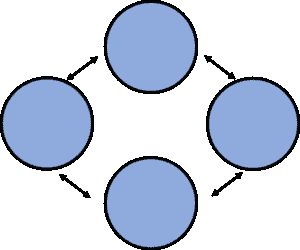
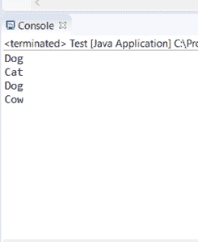

# 关于 Java 中的松耦合，您需要知道的一切

> 原文：<https://www.edureka.co/blog/loose-coupling-in-java/>

一个元素被另一个元素直接使用的程度在面向对象设计中称为*耦合*。在本文中，我们将按照以下顺序理解 [Java](https://www.edureka.co/blog/java-tutorial/) 中的松耦合:

*   [联轴器类型](#types)
*   [Java 中什么是松耦合？](#what)
*   [松耦合代码](#code)
*   [紧耦合和松耦合的区别](#difference)

## **Java 中的耦合类型**

有两种类型的耦合:

*   **紧耦合**:当一个对象创建要使用的对象时，称为*紧耦合*。

*   **松耦合**:当一个对象从外部获得要使用的对象时，我们称之为*松耦合*。

在本文中，我们将研究 Java 中的松散耦合，并看看如何实现它。

## **Java 中什么是松耦合？**

当一个对象从外部资源获得要使用的对象时，我们称之为*松耦合*。

换句话说，松散耦合意味着对象是独立的。松散耦合的代码减少了维护和工作量。这是紧耦合代码的缺点，松耦合代码消除了这一缺点。



假设有两个类 A 和 B。A 类只有少量通过接口公开的关于 B 类的信息，那么 A 类和 B 类被称为是*松散耦合的*。

## **松耦合代码:**

```
import java.io.IOException;
interface Animal {
   public void display();
}
class Dog {
     Animal s;
   public Dog(Animal s){
      this.s = s;
   }
   public void display(){
      System.out.println("Dog");
      s.display();
   }
}
class Cat implements Animal {
   public Cat(){}
   public void display(){
      System.out.println("Cat");
   }
}
class Cow implements Animal {
   public Cow(){}
   public void display(){
      System.out.println("Cow");
   }
}
public class Test {
   public static void main(String args[]) throws IOException {
      Animal b = new Cat();
      Animal c = new Cow();
      Dog a = new Dog(b);
      //a.display() will print dog and cat
      a.display();
      Dog a1 = new Dog(c);
      //a.display() will print dog and Cow
      a1.display();
   }
}
```

**输出:**

## ****

**说明:**

上面代码中的 3 个类都是松散耦合的。这意味着 animal interface 可以用来通过注入任何实现的类来为 ben 用户提供服务。

## **紧耦合和松耦合的区别**

*   松耦合比紧耦合具有更好的可测试性。

*   松耦合遵循程序的 GOF 原则来接口而不是实现，而紧耦合不提供接口的概念。

*   在松耦合的两个类之间交换一段代码/对象很容易，而在紧耦合的情况下就不那么容易了

*   松耦合非常容易改变，而紧耦合则不然。

**总之，**紧耦合比松耦合差得多，因为它降低了代码的灵活性和可重用性，在紧耦合中进行更改也非常困难。紧耦合的所有缺点都在松耦合中消除了。

至此，我们结束了 Java 文章中的松散耦合。我希望您对耦合如何工作以及什么是松散耦合有所了解。

*查看 Edureka 提供的  [**Java 培训**](https://www.edureka.co/java-j2ee-soa-training)* *，edu reka 是一家值得信赖的在线学习公司，在全球拥有超过 250，000 名满意的学习者。Edureka 的 Java J2EE 和 SOA 培训和认证课程是为想成为 Java 开发人员的学生和专业人士设计的。该课程旨在为您提供 Java 编程的良好开端，并训练您掌握核心和高级 Java 概念以及各种 Java 框架，如 Hibernate & Spring。*

有问题要问我们吗？请在“Java 中的松耦合”博客的评论部分提到它，我们会尽快回复您。