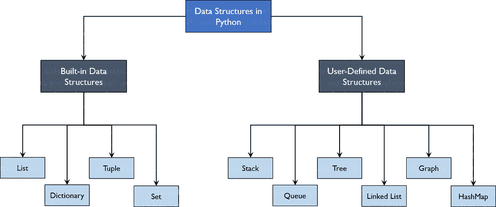
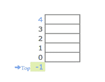
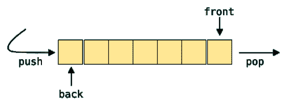
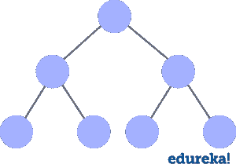
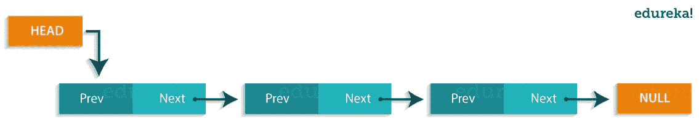
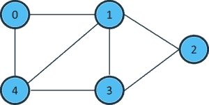
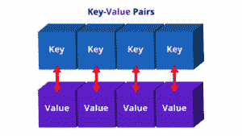

# 在 Python 中你需要学习的数据结构

> 原文：<https://www.edureka.co/blog/data-structures-in-python/>

**Python** 已经在世界范围内被用于不同的领域，比如制作[网站](https://www.edureka.co/blog/django-tutorial/)、[人工智能](https://www.edureka.co/blog/pros-and-cons-of-ai/)等等。但是为了使所有这些成为可能，**数据**扮演着非常重要的角色，这意味着这些数据应该被有效地存储，并且对其的访问必须是及时的。那么如何实现这一点呢？我们使用一种叫做数据结构的东西。话虽如此，让我们浏览一下我们将在 [Python](https://www.edureka.co/blog/python-basics/) 的**数据结构**中涉及的主题。

文章被分成以下几部分:


*   [什么是数据结构？](#datastructure)
*   [Python 中的数据结构类型](#types)
*   [内置数据结构](#builtin)
    *   [列表](#list)
    *   [字典](#dictionary)
    *   [元组](#tuple)
    *   [集](#set)
*   [用户自定义数据结构](#user)
    *   [数组 vs 列表](#arrayvslist)
    *   [栈](#stack)
    *   [队列](#queue)
    *   [树木](#tree)
    *   [链表](#linkedlist)
    *   [图表](#graph)
    *   [散列表](#hashmap)

那么，我们开始吧:)

## **什么是数据结构？**

**组织**、**管理**和**存储**数据很重要，因为这使得访问更容易，修改更高效。数据结构允许你以这样一种方式组织你的数据，使你能够存储数据集合，关联它们，并相应地对它们执行操作。

## **Python 中的数据结构类型**

Python 拥有对数据结构的隐式 T2 支持，使你能够存储和访问数据。这些结构被称为[列表](https://www.edureka.co/blog/lists-in-python/)、[字典](https://www.edureka.co/blog/dictionary-in-python/)、[元组](https://www.edureka.co/blog/tuple-in-python/)和[集合](https://www.edureka.co/blog/sets-in-python/)。

Python 允许它的用户创建他们自己的数据结构，使他们能够对他们的[功能](https://www.edureka.co/blog/python-functions)拥有**完全控制**。最突出的数据结构是堆栈、队列、树、链表等等，这些在其他编程语言中也可以使用。既然你已经知道了你可以使用的类型，为什么我们不继续学习数据结构并用 Python 来实现它们呢？



## **内置数据结构**

顾名思义，这些数据结构内置于 [Python 中，这使得编程更容易](https://www.edureka.co/blog/python-basics/)，并帮助程序员使用它们更快地获得解决方案。我们来详细讨论一下每一个。

### **列表**

[列表](https://www.edureka.co/blog/lists-in-python/)用于按顺序存储不同数据类型的数据。列表中的每个元素都分配有地址，这称为索引。索引值从 0 开始，一直持续到称为**正索引**的最后一个元素。还有从-1 开始的**负索引**，允许你从最后一个到第一个访问元素。现在让我们在一个示例程序的帮助下更好地理解列表。

**了解我们在顶级城市/国家的 Python 培训**

| **印度** | **美国** | **其他城市/国家** |
| [班加罗尔](https://www.edureka.co/python-programming-certification-training-bangalore) | [纽约](https://www.edureka.co/python-programming-certification-training-new-york-city) | [英国](https://www.edureka.co/python-programming-certification-training-uk) |
| [海德拉巴](https://www.edureka.co/python-programming-certification-training-hyderabad) | [芝加哥](https://www.edureka.co/python-programming-certification-training-chicago) | 伦敦 |
| [德里](https://www.edureka.co/python-programming-certification-training-delhi) | 亚特兰大 | [加拿大](https://www.edureka.co/python-programming-certification-training-canada) |
| [钦奈](https://www.edureka.co/python-programming-certification-training-chennai) | [休斯顿](https://www.edureka.co/python-programming-certification-training-houston) | [多伦多](https://www.edureka.co/python-programming-certification-training-toronto) |
| [孟买](https://www.edureka.co/python-programming-certification-training-mumbai) | 洛杉矶 | [澳大利亚](https://www.edureka.co/python-programming-certification-training-australia) |
| [浦那](https://www.edureka.co/python-programming-certification-training-pune) | [波士顿](https://www.edureka.co/python-programming-certification-training-boston) | 阿联酋 |
| 加尔各答 | [迈阿密](https://www.edureka.co/python-programming-certification-training-miami) | [迪拜](https://www.edureka.co/python-programming-certification-training-dubai) |
| 艾哈迈达巴德 | [旧金山](https://www.edureka.co/python-programming-certification-training-san-francisco) | [菲律宾](https://www.edureka.co/python-programming-certification-training-philippines) |

#### **创建列表**

要创建一个列表，可以使用方括号并相应地向其中添加元素。如果您不传递方括号内的任何元素，您将得到一个空列表作为输出。

```
my_list = [] #create empty list
print(my_list)
my_list = [1, 2, 3, 'example', 3.132] #creating list with data
print(my_list)

```

**输出:**【】【1，2，3，‘例’，3.132】

#### **添加元素**

使用 append()、extend()和 insert()函数可以在列表中添加元素。

*   append()函数将传递给它的所有元素作为单个元素相加。
*   extend()函数将元素逐个添加到列表中。
*   insert()函数添加传递给索引值的元素，并增加列表的大小。

```
my_list = [1, 2, 3]
print(my_list)
my_list.append([555, 12]) #add as a single element
print(my_list)
my_list.extend([234, 'more_example']) #add as different elements
print(my_list)
my_list.insert(1, 'insert_example') #add element i
print(my_list)

```

**输出:**【1，2，3】【1，2，3，[555，12]】【1，2，3，[555，12]，234，'更多 _ 示例'】【1，'插入 _ 示例'，2，3，[555，12]，234，'更多 _ 示例'】

#### **删除元素**

*   要删除元素，使用 Python 内置的 *del* 关键字，但这不会向我们返回任何内容。
*   如果想要元素返回，可以使用 pop()函数，该函数接受索引值。
*   要按值移除元素，可以使用 remove()函数。

**举例:**

```
my_list = [1, 2, 3, 'example', 3.132, 10, 30]
del my_list[5] #delete element at index 5
print(my_list)
my_list.remove('example') #remove element with value
print(my_list)
a = my_list.pop(1) #pop element from list
print('Popped Element: ', a, ' List remaining: ', my_list)
my_list.clear() #empty the list
print(my_list)

```

**输出:**【1，2，3，‘例’，3.132，30】【1，2，3，3.132，30】弹出元素:剩余 2 个列表:【1，3，3.132，30】[]

#### **访问元素**

访问元素与在 Python 中访问[字符串是一样的。您传递索引值，因此可以根据需要获取这些值。](https://www.edureka.co/blog/what-is-string-in-python/)

```
my_list = [1, 2, 3, 'example', 3.132, 10, 30]
for element in my_list: #access elements one by one
    print(element)
print(my_list) #access all elements
print(my_list[3]) #access index 3 element
print(my_list[0:2]) #access elements from 0 to 1 and exclude 2
print(my_list[::-1]) #access elements in reverse

```

**输出:** 1 2 3 例 3.1321030【1，2，3，'例'，3.132，10，30】例【T11]【1，2]【30，10，3.132，'例'，3，2，1]

#### **其他功能**

在处理列表时，您还可以使用其他几个函数。

*   len()函数返回列表的长度。
*   index()函数在第一次遇到的地方查找传递的值的索引值。
*   count()函数查找传递给它的值的计数。
*   sorted()和 sort()函数做同样的事情，即对列表中的值进行排序。sorted()具有返回类型，而 sort()修改原始列表。

```
my_list = [1, 2, 3, 10, 30, 10]
print(len(my_list)) #find length of list
print(my_list.index(10)) #find index of element that occurs first
print(my_list.count(10)) #find count of the element
print(sorted(my_list)) #print sorted list but not change original
my_list.sort(reverse=True) #sort original list
print(my_list)

```

### 输出:

```
6 3 2 [1, 2, 3, 10, 10, 30]
[30, 10, 10, 3, 2, 1]
```

### **字典**

[字典](https://www.edureka.co/blog/dictionary-in-python/)用于存储**键值**对。为了更好地理解，想象一个添加了成百上千个名字及其对应号码的电话号码簿。这里的常量是名字和电话号码，它们被称为键。各种各样的名字和电话号码是输入给按键的值。如果您访问密钥的值，您将获得所有的姓名和电话号码。这就是键-值对。在 Python 中，这种结构是用字典存储的。让我们通过一个示例程序来更好地理解这一点。

#### **创建字典**

可以使用花括号或使用 dict()函数来创建字典。无论何时使用字典，都需要添加键值对。

```
my_dict = {} #empty dictionary
print(my_dict)
my_dict = {1: 'Python', 2: 'Java'} #dictionary with elements
print(my_dict)

```

**输出:** {} {1: 'Python '，2: 'Java'}

#### **更改和添加键、值对**

要更改字典的值，您需要使用键来完成。因此，您首先访问密钥，然后相应地更改值。要添加值，只需添加另一个键-值对，如下所示。

```
my_dict = {'First': 'Python', 'Second': 'Java'}
print(my_dict)
my_dict['Second'] = 'C++' #changing element
print(my_dict)
my_dict['Third'] = 'Ruby' #adding key-value pair
print(my_dict)

```

**输出:** { '第一':' Python '，'第二':' Java'} { '第一':' Python '，'第二':' C++'} { '第一':' Python '，'第二':' C++ '，'第三':' Ruby'}

#### **删除键、值对**

*   要删除这些值，可以使用 pop()函数，该函数返回已删除的值。
*   要检索键-值对，可以使用 popitem()函数，该函数返回键和值的元组。
*   要清除整个字典，可以使用 clear()函数。

```
my_dict = {'First': 'Python', 'Second': 'Java', 'Third': 'Ruby'}
a = my_dict.pop('Third') #pop element
print('Value:', a)
print('Dictionary:', my_dict)
b = my_dict.popitem() #pop the key-value pair
print('Key, value pair:', b)
print('Dictionary', my_dict)
my_dict.clear() #empty dictionary
print('n', my_dict)

```

**输出:**

值:Ruby 字典:{'First': 'Python '，' Second': 'Java'}

键，值对:(' Second '，' Java') 字典{'First': 'Python'}

{}

#### **访问元素**

您只能使用键来访问元素。您可以使用 get()函数或者只传递键值，然后您将检索这些值。

```
my_dict = {'First': 'Python', 'Second': 'Java'}
print(my_dict['First']) #access elements using keys
print(my_dict.get('Second'))

```

**输出:** Python Java

#### **其他功能**

您有不同的函数，这些函数根据相应的 keys()、values()、items()函数向我们返回键或键-值对的值。

```
my_dict = {'First': 'Python', 'Second': 'Java', 'Third': 'Ruby'}
print(my_dict.keys()) #get keys
print(my_dict.values()) #get values
print(my_dict.items()) #get key-value pairs
print(my_dict.get('First'))

```

**输出:** dict_keys(['第一'，'第二'，'第三']) dict_values(['Python '，' Java '，' Ruby']) dict_items([('第一'，' Python ')，('第二'，' Java ')，('第三'，' Ruby ')Python

### **元组**

[元组](https://www.edureka.co/blog/tuple-in-python/)与列表相同，除了数据一旦进入元组，无论如何都不能改变。唯一的例外是当元组中的数据是可变的时，只有这时元组数据才可以被改变。示例程序将帮助您更好地理解。

#### **创建元组**

您可以使用括号或 tuple()函数来创建元组。

```
my_tuple = (1, 2, 3) #create tuple
print(my_tuple) 

```

**输出:** (1，2，3)

#### **访问元素**

访问元素与访问列表中的值是一样的。

```
my_tuple2 = (1, 2, 3, 'edureka') #access elements
for x in my_tuple2:
    print(x)
print(my_tuple2)
print(my_tuple2[0])
print(my_tuple2[:])
print(my_tuple2[3][4])

```

**输出:** 1 2 3 爱德华卡 (1，2，3，'爱德华卡') 1 (1，2，3，'爱德华卡') e

#### **追加元素**

要追加这些值，可以使用'+'操作符，该操作符将另一个元组追加到它的后面。

```
my_tuple = (1, 2, 3)
my_tuple = my_tuple + (4, 5, 6) #add elements
print(my_tuple)

```

**输出:** (1，2，3，4，5，6)

#### **其他功能**

这些功能与列表的功能相同。

```
my_tuple = (1, 2, 3, ['hindi', 'python'])
my_tuple[3][0] = 'english'
print(my_tuple)
print(my_tuple.count(2))
print(my_tuple.index(['english', 'python']))

```

**输出:** (1，2，3，['英语'，' python']) 1 3

### **设置**

[集合](https://www.edureka.co/blog/sets-in-python/)是唯一的无序元素的集合。这意味着，即使数据重复多次，它也只会被输入到集合中一次。它类似于你学过的算术集合。运算也与算术集合相同。一个示例程序会帮助你更好地理解。

#### **创建集合**

集合是使用花括号创建的，但不是添加键值对，而是将值传递给它。

```
my_set = {1, 2, 3, 4, 5, 5, 5} #create set
print(my_set)

```

**输出:** {1，2，3，4，5}

#### **添加元素**

要添加元素，可以使用 add()函数并将值传递给它。

```
my_set = {1, 2, 3}
my_set.add(4) #add element to set
print(my_set)

```

**输出:** {1，2，3，4}

#### **集合运算**

集合上的不同操作，如并集、交集等，如下所示。

```
my_set = {1, 2, 3, 4}
my_set_2 = {3, 4, 5, 6}
print(my_set.union(my_set_2), '----------', my_set | my_set_2)
print(my_set.intersection(my_set_2), '----------', my_set & my_set_2)
print(my_set.difference(my_set_2), '----------', my_set - my_set_2)
print(my_set.symmetric_difference(my_set_2), '----------', my_set ^ my_set_2)
my_set.clear()
print(my_set)

```

*   union()函数合并两个数据集中的数据。
*   intersection()函数只查找两个集合中的数据。
*   difference()函数删除两者中存在的数据，并输出仅存在于传递的集合中的数据。
*   symmetric _ difference()与 difference()函数的作用相同，但输出的是两个集合中剩余的数据。

**输出:** {1，2，3，4，5，6 }————-{ 1，2，3，4，5，6} {3，4 }——-{ 3，4} {1，2 }——-{ 1，2} {1，2，5，6 }——-{ 1，2，5，6} 集合()

现在你已经理解了内置的数据结构，让我们从用户定义的数据结构开始。用户定义的数据结构，这个名字本身表明用户定义了数据结构的工作方式，并在其中定义了函数。这使得用户可以完全控制数据需要如何保存、操作等等。

让我们继续学习大多数编程语言中最突出的数据结构。

## **用户自定义数据结构**

### **数组与列表**

数组和列表是相同的结构，只有一点不同。列表允许异构数据元素存储，而[数组](https://www.edureka.co/blog/arrays-in-python/)只允许在其中存储同构元素。

### **堆栈**

[堆栈](https://www.edureka.co/blog/stack-in-python/)是基于后进先出(LIFO)原则的线性数据结构，其中最后进入的数据将首先被访问。它是使用数组结构构建的，并且具有操作，即，推入(添加)元素、弹出(删除)元素以及仅从堆栈中称为顶部的一点访问元素。这个顶部是指向堆栈当前位置的指针。堆栈主要用于递归编程、反转单词、单词编辑器中的撤销机制等应用程序中。



### **队列**

[队列](https://www.edureka.co/blog/queue-data-structure-in-python/)也是一种基于先进先出(FIFO)原则的线性数据结构，其中先进入的数据将首先被访问。它是使用数组结构构建的，并且具有可以从队列两端执行的操作，即首尾或前后操作。诸如添加和删除元素的操作被称为入队和出队，并且可以执行对元素的访问。队列被用作流量拥塞管理的网络缓冲区，在操作系统中用于作业调度等等。



### **树**

树是具有根和节点的非线性数据结构。根是数据来源的节点，节点是我们可用的其他数据点。前面的节点是父节点，后面的节点称为子节点。一棵树有不同的层次来显示信息的深度。最后的节点叫做叶子。树创建了一个层次结构，可以用在很多现实世界的应用程序中，比如 [HTML](https://www.edureka.co/blog/what-is-html/) 页面使用树来区分哪个标签属于哪个块。这也是有效的搜索目的和更多。



### **链表**

[链表](https://www.edureka.co/blog/linked-list-in-python/)是一种线性数据结构，并不是按顺序存储，而是用指针相互链接。链表的节点由数据和一个名为 next 的指针组成。这些结构最广泛地用于图像浏览应用、音乐播放器应用等。



### **图形**

图是用来存储数据集合的点，叫做顶点(节点)和边(边)。图表可以被称为是真实世界地图的最精确的表示。 它们用于寻找被称为节点的各种数据点之间的各种距离成本，从而找到最短路径。许多应用程序，如谷歌地图、优步等，都使用图形来寻找最短的距离，并以最佳方式增加利润。



### **散列表**

[散列表](https://www.edureka.co/blog/dictionary-in-python/)和 Python 中的字典是一样的。它们可以用来实现应用程序，如电话簿，根据列表填充数据等等。



这包含了 Python 中所有突出的数据结构。我希望你已经理解了 Python 中内置的和用户定义的数据结构[和](https://www.edureka.co/blog/data-structures-algorithms-in-java/)，以及它们的重要性。

*既然你已经理解了 Python 中的数据结构，那就来看看 Edureka 的 [Python 认证](https://www.edureka.co/python-programming-certification-training)* *吧，edu reka 是一家值得信赖的在线学习公司，拥有遍布全球的 250，000 多名满意的学习者。*

*Edureka 的 Python 编程认证培训课程是为想要成为 Python 编程方面的[高手的学生和专业人士设计的。该课程旨在为您提供 Python 编程的开端，并训练您掌握核心和高级概念。](https://www.edureka.co/masters-program/python-developer-training)*

与瓦朗加尔国家技术学院的 E & ICT 学院合作，提供人工智能和机器学习方面的研究生课程，保持技术领先。这门[人工智能课程](https://www.edureka.co/executive-programs/machine-learning-and-ai)旨在提供最好的结果。

*有问题吗？请在“你需要用 Python 学习的数据结构”博客的评论部分提到它，我们会尽快回复你。*