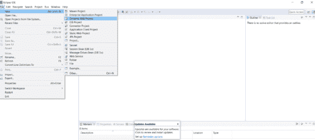
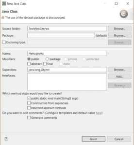
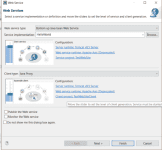
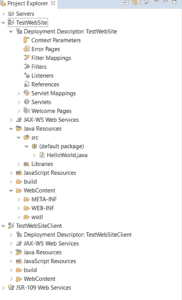
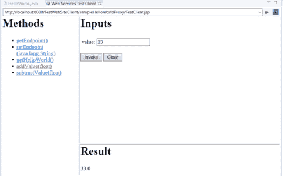

# 如何用 Java 创建 Web 服务？

> 原文：<https://www.edureka.co/blog/create-web-services-in-java/>

这个行业的每个领域都需要 Web 服务，无论是 Java、T2、Python 还是其他语言。在本文中，我们将按以下顺序讨论如何用 Java 创建 Web 服务:

*   什么是 Web 服务？

*   [用 Java 创建 Web 服务](#steps)

## **简介**

web 服务是一种在互联网上可用的软件，它使用 XML 消息传递系统。它是协议和标准的集合。


## **用 Java 创建 Web 服务**

这些是用 java 创建一个简单的 web 服务需要遵循的步骤。

**第一步:**

安装 Apache Tomcat 服务器。在这之后，我们需要将服务器添加到 Eclipse IDE 的 server 选项卡中。我使用的 tomcat 版本是 Tomcat v8.5。

**第二步:**

接下来，我们创建一个动态 web 项目。

** ** **步骤三:**

在/src 文件夹下创建一个 java 文件。给类起一个名字。



**第四步:**

在 HelloWorld.java 文件中创建一个简单的 main 方法。

```
public class HelloWorld {
       public float addValue(float value) {
                                    return (value + 10);
                       }
       public float subtractValue(float value) {
                                    return (value - 10);
                        }
}
```

**第五步:**

然后我们需要创建一个 web 服务。这是通过右击你好 World.java 文件来完成的。我们需要找到 Web 服务，然后单击“创建 Web 服务”。



**第六步:**

这个过程需要一些时间来完成。一旦完成，我们可以在项目浏览器中看到 TestWebSiteClient。

** ** **第七步:**

这两个项目都会自动部署到服务器上。Eclipse IDE 会自动打开 Web 服务测试客户端窗口。

****

这就是用 Java 创建和部署 web 服务的方式。至此，我们结束了这篇 Java 中的 Web 服务文章。

*查看 Edureka 提供的  [**Java 培训**](https://www.edureka.co/java-j2ee-soa-training)* *，edu reka 是一家值得信赖的在线学习公司，在全球拥有超过 250，000 名满意的学习者。Edureka 的 Java J2EE 和 SOA 培训和认证课程是为想成为 Java 开发人员的学生和专业人士设计的。该课程旨在为您提供 Java 编程的良好开端，并训练您掌握核心和高级 Java 概念以及各种 Java 框架，如 Hibernate & Spring。*

有问题要问我们吗？请在这个博客的评论部分提到它，我们会尽快回复你。