# 如何用 NumPy 在 Python 中实现矩阵？

> 原文：<https://www.edureka.co/blog/matrices-in-python/>

在现实世界中，矩阵作为一种数学工具被用于各种目的。在本文中，我们将使用著名的 NumPy 库按以下顺序讨论 Python 中关于矩阵的一切:

*   [什么是 NumPy，什么时候使用？](#what)T3T5
*   [在 NumPy](#create) 中创建矩阵
*   [矩阵运算及例题](#matrix)
*   [矩阵切片](#slice)

**奖金** :把所有的放在一起——Python 代码解一个线性方程组

让我们从 Python 中的矩阵开始。

## **什么是 NumPy，什么时候使用？**

NumPy 是一个 Python 库，允许进行简单的数字计算，包括单维和多维数组和矩阵。顾名思义，NumPy 擅长执行数值计算。许多数据科学库，如 [**【熊猫】**](https://www.edureka.co/blog/python-pandas-tutorial/)[**Scikit-learn**](https://www.edureka.co/blog/cheatsheets/python-scikit-learn-cheat-sheet/)[**SciPy**](https://www.edureka.co/blog/scipy-tutorial/)**[matplotlib](https://www.edureka.co/blog/python-matplotlib-tutorial/)**等。依赖 NumPy。它是当今用 Python 编写的数据科学应用程序不可或缺的一部分。

许多 **线性代数** 的计算使用 NumPy 变得容易解决。 **线性代数** 是很多 **机器学习** 算法中使用的核心数学工具。因此，详细了解 NumPy 有助于您创建库或扩展现有的机器学习库。

NumPy 提供:

*   一个强大的 N 维数组对象，名为 ndarray
*   广播功能
*   集成 C/C++和 Fortran 代码的工具
*   有用的线性代数、傅立叶变换和随机数功能

现在让我们继续 Python 中的矩阵，看看如何创建矩阵。

## **在 NumPy 中创建矩阵**

### **使用列表创建矩阵**

```
## Import numpy
import numpy as np

## Create a 2D numpy array using python lists
arr = np.array([[ 1, 2, 3],[ 4, 5, 6]])
print(arr)
```

np.array 用于从列表中创建 NumPy 数组。NumPy 数组的类型是 ndarray 。

上面程序的输出是:

表示一个 2D 矩阵，其中输入到 np.array() 是一个列表列表 [[ 1，2，3]，[ 4，5，6]] 。父列表中的每个列表在矩阵中形成一个 行 。

### 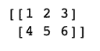

### **使用范围创建矩阵**

np.arange() 可以生成一个给定开始和结束的数列。

```
## Generate numbers from (start) to (end-1)
## Here start = 0
## end = 5
## Generated a NumPy array from 0 to 4
print(np.arange(0,5))
```

以上语句输出以下 1D 数组:

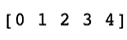

为了生成 2D 矩阵，我们可以在一个列表中使用 np.arange() 。我们将这个列表传递到 np.array() 中，这使它成为一个 2D NumPy 数组。

```
print(np.array([np.arange(0,5), np.arange(5,10)]))

```

以上语句输出以下 2D 数组:

## **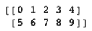**

## **NumPy 阵列的形状**

我们称任何 NumPy 对象为 N 维数组。在数学中，它被称为 N 维矩阵。每个 NumPyn array对象都可以查询其形状。形状是一个格式为 (n_rows，n_cols) 的元组

下面的代码片段打印了一个矩阵的形状

```
## Using example from above section to generate a matrix using ranges
arr_2d = np.array([np.arange(0,5), np.arange(5,10)])
print(arr_2d.shape)
```

**输出:**

(2，5) 表示矩阵有 2 行 5 列

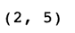

### **用零和一填充的矩阵**

#### **用零填充:**

```
## Create a matrix of shape (3, 4) filled wit zeros
## By default float64 type of numbers are generated if not specified
print(np.zeros((3, 4)))
```

**输出:**

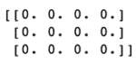

默认情况下数组中生成的数字类型是 float64 如果没有指定。

#### **用 1 填充:**

```
## Create a matrix of shape (2, 2) filled with ones
## Here we have specified dtype = np.int16 which asks NumPy to generate integers
print(np.ones((2, 2), dtype=np.int16))
```

**输出:**

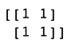

用 1 生成矩阵时有一个转折，我们传递了一个附加参数 dtype=np.int16 。这迫使 np.ones 函数生成整数，而不是默认的浮点数。这个附加参数也可以传入 np.zeros

## **矩阵运算和例子**

### **加法**

下面的例子解释了两种加法:

*   标量加法
*   矩阵加法

```
import numpy as np
## Generate two matrices
mat_2d_1 = np.array([np.arange(0,3), np.arange(3,6)])
mat_2d_2 = np.array([np.arange(6,9), np.arange(9,12)])</pre>
print("Matrix1: n ", mat_2d_1)
print("Matrix2: n ", mat_2d_2)

## Add 1 to each element in mat_2d_1 and print it
print("Scalar addition: n ", mat_2d_1 + 1)

## Add two matrices above elementwise
print("Element wise addition of two matrices of same size: n ", mat_2d_1 + mat_2d_2)
```

**输出:**

### **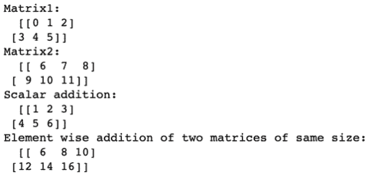**

### **减法**

减法类似于加法。我们只需要把运算从加法改为减法。

```
import numpy as np

## Generate two matrices
mat_2d_1 = np.array([np.arange(0,3), np.arange(3,6)])
mat_2d_2 = np.array([np.arange(6,9), np.arange(9,12)])

print("Matrix1: n ", mat_2d_1)
print("Matrix2: n ", mat_2d_2)

## Subtract 1 from each element in mat_2d_1 and print it
print("Scalar addition: n ", mat_2d_1 - 1)

## Subtract two matrices above elementwise
print("Element wise subtraction of two matrices of same size: n ", mat_2d_1 - mat_2d_2)
```

**输出:**

### **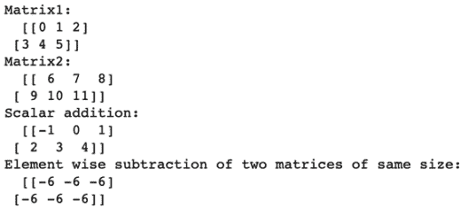**

### **产品**

可以在 NumPy 矩阵上进行两种乘法或乘积运算

*   标量积:一个标量值乘以一个矩阵的所有元素
*   点积:根据矩阵乘法的规则，这是两个矩阵的乘积。矩阵乘法的规则参见 [矩阵乘法](https://www.mathsisfun.com/algebra/matrix-multiplying.html) 。

```
import numpy as np

## Generate two matrices of shape (2,3) and (3,2) so that we can find
## dot product
mat_2d_1 = np.array([np.arange(0,3), np.arange(3,6)])
mat_2d_2 = np.array([np.arange(0,2), np.arange(2,4), np.arange(4,6)])

## Print shapes and matrices
print("Matrix1: n ", mat_2d_1)
print("Matrix1 shape: n", mat_2d_1.shape)
print("Matrix2: n ", mat_2d_2)
print("Matrix2 shape: n", mat_2d_2.shape)

## Multiply each element by 2 in mat_2d_1 and print it
print("Scalar Product: n ", mat_2d_1 * 2)

## Find product of two matrices above using dot product
print("Dot Product: n ", np.dot(mat_2d_1, mat_2d_2))

```

**重要** :注意 * 运算符只用于标量乘法。然而，对于矩阵乘法，我们使用一个函数 np.dot() ，它采用两个 NumPy 2D 数组作为自变量。

**输出:**

### **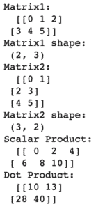**

### **分部**

元素标量除法可以使用除法运算符 / 来完成

```
import numpy as np

## Generate a matrix of shape (2,3)
mat_2d = np.array([np.arange(0,3), np.arange(3,6)])

## Print the matrix
print("Matrix: n ", mat_2d)

## Element wise division by scalar
print("Scalar Division: n ", mat_2d / 2)

```

**输出:**

### **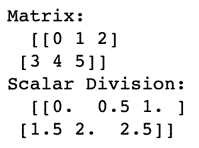**

### **指数**

使用运算符 ** 可以找出元素的指数

```
import numpy as np

## Generate a matrix of shape (2,3)
mat_2d = np.array([np.arange(0,3), np.arange(3,6)])

## Print the matrix
print("Matrix: n ", mat_2d)

## Find exponent element wise i.e. raise each element in matrix to power 2
print("Matrix raised to power of 2: n ", mat_2d ** 2)

```

**输出:**

### **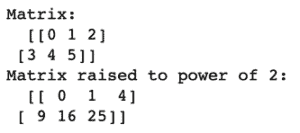**

### **转置**

*   *转置 *矩阵* 中的* 是新的 *矩阵* 的行是原的列
*   一个(2，3)矩阵在形状上变成了(3，2)矩阵
*   Numpy 在每个存储矩阵转置的 ndarray 对象上都有一个属性。我们不需要使用任何特殊的算子来寻找矩阵的转置。
*   矩阵。T 提供 NumPy 中矩阵的转置
*   下面的代码片段演示了转置操作

```
import numpy as np

## Generate a matrix of shape (2,3)
mat_2d = np.array([np.arange(0,3), np.arange(3,6)])

## Print the matrix
print("Matrix: n ", mat_2d)

## Matrix Transpose
print("Transpose n ", mat_2d.T)

```

**输出:**

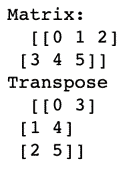

## **对矩阵进行切片**

*   一个矩阵片正在选择一个 子矩阵 。Python 提供了一个很棒的语法来索引和切片矩阵。
*   切片使用下面的语法:

### **切片选择一行**

```
import numpy as np
# Create a matrix
mat_2d = np.array([np.arange(0,3), np.arange(3,6)])
print("Matrix: n", mat_2d)

# Slice to get second row in matrix
print("Sliced: n ", mat_2d[1:, :])

```

**输出:**

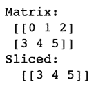

*   重要提示:

### **切片选择一列**

```
import numpy as np
# Create a matrix
mat_2d = np.array([np.arange(0,3), np.arange(3,6)])
print("Matrix: n", mat_2d)

# Slice to get last column in matrix
print("Sliced: n ", mat_2d[:, 2:])

```

**输出:**

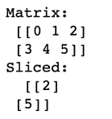

*   重要提示:

### **切片选择子矩阵**

```
import numpy as np
# Create a matrix
mat_2d = np.array([np.arange(0,4), np.arange(4,8), np.arange(8,12), np.arange(12,16)])
print("Matrix: n", mat_2d)

# Slice to get (2, 2) submatrix in the centre of mat_2d
# i.e.
# [ [ 5 6]
# [ 9 10] ]
print("Sliced: n ", mat_2d[1:3, 1:3])

```

**输出:**

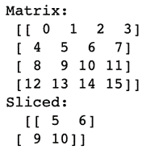

*   重要提示:

## **奖励:解线性方程组**

*方程组*

*   解方程组的矩阵符号是:

*   例如，考虑下面的线性方程组:

*   x+y+z = 12x+4y+z =-2x–y+z = 0
*   可以用矩阵表示为:
*   X =【X y z】未知量的向量A =[[1 1]【2 4 1】【1-1】]B =[1-2 0]

*   利用上面提到的矩阵公式，我们可以求解如下方程组:

```
import numpy as np

## A = (3,3) matrix
A = np.array([[1,1,1], [2,4,1], [1,-1,1]])
## B = (3,1) matrix
B = np.array([1,-2, 0]).T

## X = Inv(A).B = (3, 1) in shape
X = np.dot(np.linalg.inv(A), B)

print("Solution: n ", X)

```

**输出:**

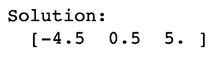

其中，x = -4.5，y = 0.5，z = 5.0

说到这里，我们的文章就到此为止了。我希望你明白 Python 中的矩阵是什么。

*要深入了解 Python 及其各种应用程序，您可以在线注册实况 [**Python 认证课程**](https://www.edureka.co/python-programming-certification-training) ，该课程提供全天候支持和终身访问。*

有问题要问我们吗？请在“Python 中的矩阵”博客的评论部分提到它，我们会尽快回复您。