# 什么是 Tableau 服务器及其组件？

> 原文：<https://www.edureka.co/blog/tableau-server/>

Tableau Server 是分发 Tableau 工作簿最安全的方式。它帮助您嵌入实时[交互式仪表盘](https://www.edureka.co/blog/tableau-dashboards/)，并为您的数据提供高安全性。这个 Tableau 服务器教程，让你对 Tableau 服务器的基础有一个大概的了解。以下是本教程涵盖的主题:

*   [Tableau 服务器组件](#components)
*   [Tableau 服务器安装](#installation)
*   [激活](#activation)
*   [配置 Tableau 服务器](#configuring)
*   [设置分布式服务器](#distributed-servers)
*   [添加用户](#adding-users)

让我们开始吧。

## **Tableau 服务器组件**

以下是 Tableau 的各种服务器组件:

*   **应用服务器** :这个过程处理 Tableau 服务器 Web 和移动接口的浏览和权限。

*   **VizQL 服务器** :它根据客户端的请求向数据源发送查询，并返回一个呈现为图像的结果集。最终，它将它们呈现给用户。

*   **数据服务器** :让用户管理和存储 [Tableau](https://www.edureka.co/blog/what-is-tableau/) 数据源，同时也维护 Tableau 桌面的元数据。

[https://www.youtube.com/embed/aJ10CQgB-Cs](https://www.youtube.com/embed/aJ10CQgB-Cs)

## **Tableau 服务器安装**

*   双击安装文件。
*   按照屏幕上的指示完成 *设置向导* 。
*   安装应用程序。
*   安装完毕后，点击 *下一步* 打开 *产品密钥管理器* 窗口

## ****

## **激活**

安装 Tableau Desktop/Tableau Server 后，需要激活产品。它们都需要产品密钥来激活这些产品。

Tableau 服务器需要至少一个产品密钥。它应该既能激活服务器，又能确定可以分配给用户的许可级别数。产品密钥可从客户账户中心 *画面* 中获取。

**激活并注册**

安装和配置服务器后，产品密钥管理器会自动打开，您可以输入产品密钥并注册产品。

*   选择 *激活产品* 选项。

*   将您的服务器产品密钥粘贴到相应的文本框中，点击 *激活* 。

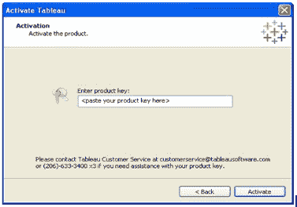

*   当你在线时，它就在这里。但是当您脱机时，激活将会失败，您可以选择保存一个文件，以便脱机激活。点击 *保存* 。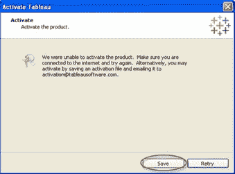

*   选择文件的位置，点击 *保存* 。该文件将被保存为*offline . tlq*，并将包含要在其上激活许可证的主机的信息。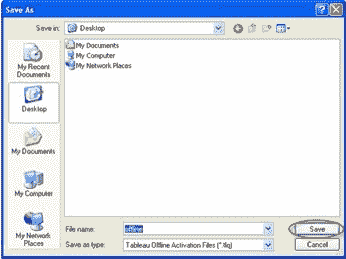

## **配置 Tableau 服务器**

在 Tableau 服务器安装过程中， *Tableau 服务器配置* 实用程序打开，此时，在服务器启动之前，您可以在其中设置配置选项。服务器在安装过程结束时启动。

*   Tableau 服务器默认使用 *网络服务* 账号运行。

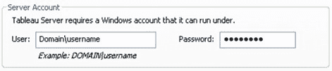

*   选择是否要使用*Active Directory*对服务器上的用户进行认证。

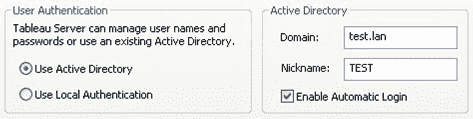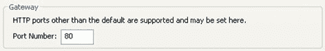

**数据连接配置**

*数据连接* 选项卡用于配置适用于完整数据连接的缓存和初始 SQL 语句使用情况。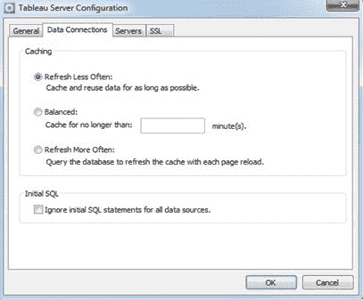

发布到 Tableau 服务器的视图非常具有交互性，并且经常与数据库保持实时连接。当用户在 web 浏览器中与视图交互时，查询的数据存储在缓存中。随后，如果可行，访问将从该缓存中提取数据。

**配置缓存**

*   在 *Tableau 服务器配置* 对话框中选择 *数据连接* 选项卡。

*   然后您可以从以下选项中选择一个；

1.  **刷新频率降低-**当数据变化不频繁时，选择此选项。无论数据何时添加到缓存中，只要数据可用，就会被缓存和重用。该选项最大限度地减少了发送到数据库的查询，提高了性能。

2.  **平衡-**数据在指定时间后从缓存中删除。如果在指定的时间范围内将数据添加到缓存中，将使用缓存的数据，否则，将从数据库中查询新数据。

3.  **更频繁地刷新—**每次加载页面时都会查询数据库。数据仍然被缓存，并将被重用，直到用户重新加载页面。此选项将确保用户看到最新的数据。但是，这可能会降低性能。

**设置任务**

以下几个步骤是添加管理员帐号。

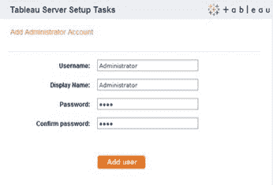

## **设置分布式服务器**

完成初始配置后，设置 Tableau 服务器在多台计算机上运行。这也称为 *分布式安装* 或 *集群* 。这增加了 Tableau 服务器环境的可伸缩性。

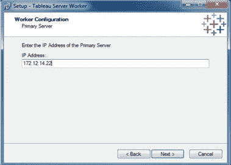

*   您可以设置 Tableau 服务器在多台机器上运行。您还可以微调哪些 Tableau 服务器进程可以在单独的机器上运行(包括主服务器)。

*   这种类型的环境可以帮助您支持更多的用户，改善观众的互动和浏览。它还优化了服务器后台任务的处理。

*   在工人机器上安装工人软件后，您需要返回主服务器并打开配置实用程序。你可以通过在 *开始菜单* 上选择 **Tableau 服务器 8 >配置 Tableau 服务器** 来完成。

*   在 *配置实用程序* ，转到 **服务器选项卡** ，点击 **添加按钮** 。

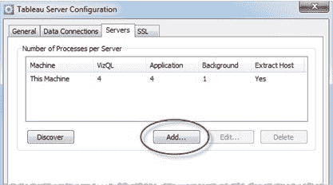

*   在接下来出现的对话框中，键入其中一台工作机的 IP 地址。标明分配给机器的 *VizQL 进程**应用服务器进程* ， *后台进程* 的数量。

**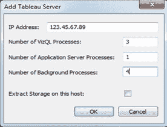**

## **添加本地用户**

您可以添加所有单个用户的信息，然后从 CSV 文件(逗号分隔值文件)导入多个用户。您还可以在 CSV 文件中包含诸如站点角色和发布能力等属性，以便应用到用户的同时导入它们。

所以，要添加本地用户，需要做以下事情；

*   输入您的管理员用户名和密码，登录 Tableau 服务器。
*   点击页面左侧管理区中的 *用户*

*   点击以下链接之一

1.  **添加用户** 通过一次指定一个用户名和密码来添加用户。
2.  **从 CSV 文件添加用户** 从一个 CSV 文件添加多个用户。

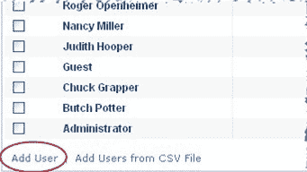

如果您正在添加单个用户，您需要指定以下内容:

1.  **用户名**–输入仅由字母和数字组成的用户名。
2.  **全名**–输入显示名称。
3.  **密码**–输入强密码。
4.  **确认** **密码**–再次输入您之前输入的密码进行确认。
5.  **许可级别**–选择许可级别。
6.  **分配用户权限**–选择发布工作簿和分配管理员权限是否属于用户权限。

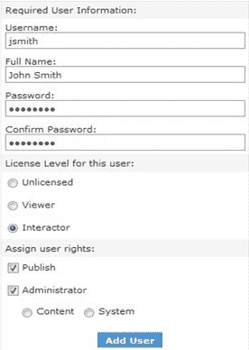

*   点击添加 *用户* 按钮。

至此，关于 Tableau Server 的这篇文章到此结束。感谢阅读。我希望这篇教程足以让你开始。

*如果你希望掌握 Tableau，Edureka 有一个关于 **[Tableau 在线培训](https://www.edureka.co/tableau-certification-training)** 的策划课程，该课程深入涵盖了数据可视化的各种概念，包括条件格式、脚本、链接图表、仪表板集成、Tableau 与 R 的集成等等。它提供 24*7 支持，在整个学习期间为您提供指导。新的批次即将开始。*

*有问题吗？请在“Tableau 服务器”的评论区提到它，我们会在第一时间回复您。*