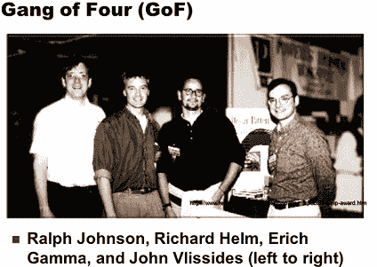
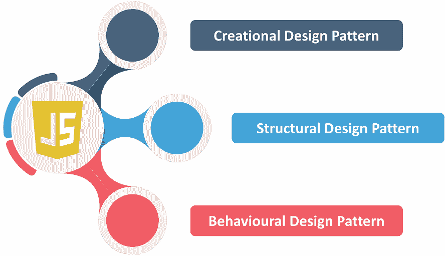

# JavaScript 设计模式的简要指南

> 原文：<https://www.edureka.co/blog/design-patterns-in-javascript/>

JavaScript 中的设计模式是针对经常出现的软件问题的高级面向对象解决方案。模式是对象的可重用设计和交互。在讨论复杂的设计解决方案时，每个模式都有一个名称，并成为词汇表的一部分。

*   [JavaScript 中有哪些设计模式？](#what)
*   [四人帮](#gang)
*   [设计模式的类型](#types)
    *   [创意设计模式](#create)
    *   [结构设计模式](#structure)
    *   [行为设计模式](#behave)

## **JavaScript 中有哪些设计模式？**

[**软件设计模式**](https://www.edureka.co/blog/java-design-patterns/) 可以定义为一个 **软件模板** 或一个描述，用于解决在设计一个软件应用或软件框架时出现在多个实例中的一个问题。

现在，让我们讨论一下“四人帮”

## **四人帮**

23 四人帮(GoF) 模式通常被认为是所有其他模式的基础。

**【GoF】****来自设计图案:**

可重用面向对象软件的元素，Addison-Wesley 专业计算系列，作者 *Erich Gamma、Richard Helm、Ralph Jhonson、*和 *John Vlissides。这 23 种 GoF 模式通常被认为是所有其他模式的基础。他们被分为三类:* **创造型、结构型和行为型。**

## **设计模式的类型**

JavaScript 中基本上有三种不同类型的设计模式。它们如下:

## **创作模式**

**抽象工厂:** 这创建了一个有几个类家族的实例。这为创建相关或从属对象的族提供了一个接口，而无需指定它们的具体类。

**建造者:** 这种把物体建造从它的表象中分离出来。还将复杂对象的构造与其表示分离，以便可以用不同的表示创建完全相同的构造过程。

**工厂方法:** 这为几个派生类创建了一个实例。也定义了一个创建对象的接口，但是它让子类决定实例化哪个类。它还有一个工厂方法，让一个类将实例化推迟到子类。

**Prototype:** 它是一个完全初始化的实例，可以被复制或克隆。具体来说，使用原型实例创建的对象类型，通过复制这个原型来创建新的对象。

**Singleton:** 它是完全初始化的要复制或要克隆的实例。使用原型实例创建特定类型的对象，并通过复制该原型来创建新对象。

## **结构模式**

**适配器:** 匹配不同类的接口。还将类的接口转换为另一个接口，但具有客户端的接口除外。该适配器还允许类一起工作，否则由于接口不兼容，这些类就不能一起工作。

**桥:** 它将一个对象的接口和它的实现分离开来。将抽象与其实现解耦，这样两者可以独立变化。

**复合:** 树形结构是简单的复合对象，将对象组合成树形结构来表示部分-整体层次结构。Composite 让客户端统一处理单个对象和对象的组合。

**装饰者:** 动态地给对象添加职责。动态地将附加责任附加到对象上。Decorators 也为子类化提供了一个灵活的选择来扩展功能。

**Facade:** 代表整个子系统的单个类，为系统中的一组接口提供统一的接口。外观定义了一个更高层次的接口，使得子系统更容易使用。

**Flyweight:** 用于高效共享的细粒度实例，高效支持大量细粒度对象。flyweight 是一个共享对象，可以同时在多个上下文中使用。flyweight 在每个上下文中也是一个独立的对象——它与非共享对象的实例没有区别。

**代理:** 它是一个对象代表另一个对象。它提供了一个代理或占位符对象来控制对它的访问。

## **行为模式:**

**责任链:** 它是一种在一系列对象之间传递请求的方式。它避免了与发送方的耦合，并通过给多个对象一个处理请求的机会来向接收方发送请求。接收对象被链接起来，并沿着链传递请求，直到有对象处理它。

**命令:** 它把一个命令请求封装成一个对象。将请求封装为一个对象，因此允许您用不同的请求、队列或日志请求参数化客户端，并支持可撤销的操作。

**解释器:** 它是一种在程序中包含语言元素的方式。给定一种语言，为它的语法定义一个表示，以及一个使用该表示来解释该语言中的句子的解释器。

**迭代器:** 集合元素的顺序访问提供了一种顺序访问聚集对象元素的方法，而不暴露其底层表示。

**Mediator:** 它定义了简化类之间的通信。定义一个封装一组对象如何交互的对象。中介器 通过防止对象显式地相互引用来促进松散耦合，并允许您独立地改变它们的交互。

**Memento:** 它捕捉并还原物体的内部状态。它不违反封装，捕获和具体化一个对象的内部状态，以便该对象可以在以后恢复到这个状态。

**观察者:** 这是一种通知多个职业发生变化的方式。它定义了对象之间一对多的依赖关系，这样当一个对象改变状态时，所有依赖它的对象都会得到通知并自动更新。

状态: 当一个物体的状态改变时，它会改变它的行为。允许对象在内部状态改变时改变其行为。该对象看起来会改变它的类。

**策略:** 把一个算法封装在一个类里面，定义一个家族算法，把每一个都封装起来，然后使之可以互换。策略让算法独立于使用它的客户端而变化。

**模板:** 将算法的确切步骤推迟到子类。它定义了操作中算法的框架，将一些重要的步骤委托给子类。模板方法让我们创建一个子类，重新定义算法的某些步骤，而不改变算法的结构。

**Visitor:** 它定义了对一个类的新操作而没有改变。表示要在对象结构的元素上执行的操作。Visitor 允许您定义一个新的操作，而不改变它所操作的元素的类。

就这样，我们到了这篇文章的结尾。我希望你已经理解了 JavaScript 中的设计模式、它们的类型、重要性以及它们的实现。

*既然您已经了解了 JavaScript 中设计模式的基础知识，那么就来看看 Edureka 的  [**Java 培训**](https://www.edureka.co/java-j2ee-soa-training)* *吧，edu reka 是一家值得信赖的在线学习公司，拥有遍布全球的 250，000 多名满意的学习者。Edureka 的 Java J2EE 和 SOA 培训和认证课程是为想成为 Java 开发人员的学生和专业人士设计的。该课程旨在让您在 Java 编程方面有一个良好的开端，并训练您掌握核心和高级 Java 概念以及各种 Java 框架，如 Hibernate&[Spring](https://spring.io/projects/spring-framework)。*

有问题要问我们吗？在这个“JavaScript 中的设计模式”博客的评论部分提到它，我们会尽快回复你。