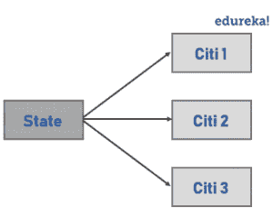
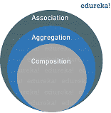

# Java 中的关联是什么，为什么需要它？

> 原文：<https://www.edureka.co/blog/association-in-java/>

当你在写一个 [Java 程序](https://www.google.com/search?rlz=1C1CHBF_enIN825IN825&biw=1517&bih=772&ei=dWmlXcP5PI2lwgOr25dI&q=java+programs+edureka&oq=java+programs+edureka&gs_l=psy-ab.3..0.15863.160493..160585...1.2..0.282.6571.0j7j24......0....1..gws-wiz.......0i71j0i22i30j0i67j0i273j0i10.nYebdG6s7qw&ved=0ahUKEwiDiNPj053lAhWNknAKHavtBQkQ4dUDCAs&uact=5#)的时候，如何在两个类之间建立连接？很简单。你可以利用一个叫做联想的概念。听起来很有趣，对吗？在本文中，让我们详细了解一下 [Java](https://www.edureka.co/blog/what-is-java/) 中的关联。

本文讨论的主题是:

*   [Java 中的联想是什么？](#association)
*   [两种形式的关联](#forms)
    *   [聚合](#aggregation)
    *   [构图](#composition)

## **什么是联想？**

Java 中的关联是两个独立的[类](https://www.edureka.co/blog/java-objects-and-classes/)之间的连接或关系，它们是通过它们的[对象](https://www.edureka.co/blog/java-object/)建立的。关联关系表明对象如何相互认识，以及它们如何使用彼此的功能。可以是一对一，一对多，多对一，多对多。



*   例如，一个人只能有一本护照。那是一种“**一对一的**关系。
*   如果说银行和员工的关联，一个银行可以有很多员工，所以是“**一对多**的关系。
*   同样，每个城市都存在于一个州，但是一个州可以有多个城市，这是一种“**多对一**的关系。
*   最后，如果我们讨论教师和学生之间的关联，多个学生可以与单个教师相关联，单个学生也可以与多个教师相关联，但两者都可以独立创建或删除。这是一种“**多对多**的关系。

让我们用一个例子来理解联想。

```
package MyPackage;
import java.util.*; 

class CityClass {

    private String cityName;

    public String getCityName() {
        return cityName;
    }

    public void setCityName(String cityName) {
        this.cityName = cityName;
    }
    @Override
    public String toString() {
        return cityName;
    }
}

class State {

    private String stateName;

    List<CityClass> citys;

    public String getStateName() {
        return stateName;
    }

    public void setStateName(String stateName) {
        this.stateName = stateName;
    }
    public List<CityClass> getCities() {
        return citys;
    }
    public void setState(List<CityClass> citys) {
        this.citys = citys;
    }

}

public class AssociationExample {

	  public static void main(String[] args) {
	        State state = new State();
	        state.setStateName("California");

	       CityClass city = new CityClass();
	        city.setCityName("Los Angeles");
	        CityClass city2 = new CityClass();
	        city2.setCityName("San Diago");

	        List<CityClass> empList = new ArrayList<CityClass>();
	        empList.add(city);
	        empList.add(city2);

	        state.setState(empList);

	        System.out.println(state.getCities()+" are cities in the state "+
	                state.getStateName());
	    }

}

```

**输出:**

洛杉矶和圣地亚哥是加利福尼亚州的城市

如你所见，在这个示例程序中有两个类，即州和 ***城市。*** 这两个独立的类通过它们的[对象](https://www.edureka.co/blog/java-object/#newkeyword)联系在一起。此外，每个城市只存在于一个州中，但是一个州可以有多个城市，因此有“多对一”关系这个术语。重要的是，Java 中的关联有两种特殊形式。我们去看看。

## **两种形式的关联**

**合成**和聚合是联想的两种特殊形式。让我们借助一个例子来检验它们。



### **构图**

它是一个关联的“所属”类型。它仅仅意味着其中一个对象是一个逻辑上更大的结构，它包含另一个对象。换句话说，它是更大物体的一部分或成员。或者，它通常被称为**“has-a”关系**(与“is-a”关系相对，后者是[继承](https://www.edureka.co/blog/inheritance-in-java/))。

举个的例子，一栋楼有一个房间，或者换句话说，一个房间属于一栋楼。 **组合**是一种很强的“有-有”关系，因为对象的生命周期是捆绑在一起的。这意味着，如果我们毁灭了所有者对象，它的成员也会随之毁灭。例如，在前面的例子中，如果建筑物被摧毁，房间也会被摧毁。但是，请注意，这并不意味着，没有它的任何部分，包含对象就不能存在。例如，如果我们拆除一栋建筑内的所有房间，这座建筑将仍然存在。

### **聚合**

聚合也是一种“有-有”的关系，但是，它与组合的区别在于，对象的生命周期不是绑定的。B **两个条目都可以单独存在**，这意味着结束一个实体不会影响另一个实体。两者都可以彼此独立存在。因此，它通常被称为周协会。

我们举一个球员和球队的例子。即使团队不复存在，作为团队一部分的球员也可以存在。需要聚合的主要原因是为了 **维护代码的可重用性。**

这就把我们带到了本文的结尾，在这里我们已经了解了 [*Java*](https://www.edureka.co/blog/java-tutorial/) 中的关联。如果你刚刚开始，那么看看这篇 Java 教程，了解基本的 Java 概念。

[https://www.youtube.com/embed/iGGgxnJCNRM](https://www.youtube.com/embed/iGGgxnJCNRM)

如果您发现这篇文章与“Java 中的关联”相关，请查看一下  *Edureka 的 [Java 认证](https://www.edureka.co/java-j2ee-training-course)培训*，  这是一家值得信赖的在线学习公司，拥有遍布全球的 250，000 多名满意的学习者。 *如果您遇到任何问题，请在“Java 中的协会”的评论区随意提出您的所有问题，我们的团队将很乐意回答。*