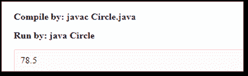

# 你需要知道的一切在 Java 中都有关系

> 原文：<https://www.edureka.co/blog/has-a-relationship-in-java>

Java 中的“有关系”和“是关系”是两个最容易混淆的术语。在本文中，我们将重点关注以下参数:

*   [Java 中有关系的介绍](#intro)
*   [联想](#association)
*   [关系:构成与遗传](#composition)

## **Java 中有关系的介绍**

有关系在 Java 中被称为 as 成分。它用于代码的可重用性。基本上，这意味着一个类的实例引用了另一个类的实例或者同一个类的另一个实例。这种关系有助于最小化代码的重复和错误。

作文是一种联想形式。关联被认为是通过其对象授权的两个独立类之间的关系。关联的形式可以是:

1.  一对一

2.  一对多

3.  多对一

4.  多对多

在 OOP(面向对象编程)中，对象与另一个对象通信，以使用该对象提供的所有服务和功能。

## **关联**

下面是一个实现关联的例子。

```
import java.io.*; 
class Bank 
{ 
	private String name; 
	Bank(String name) 
	{ 
            this.name = name; 
} 
	public String getBankName() 
	{ 
		return this.name; 
	} 
} 
class Employee 
{ 
	private String name; 
	Employee(String name) 
	{ 
		this.name = name; 
	} 
	public String getEmployeeName() 
	{ 
		return this.name; 
	} 
} 
class Association 
{ 
	public static void main (String[] args) 
	{ 
		Bank b = new Bank("Axis"); 
		Employee e = new Employee("Himanshi"); 
		System.out.println(e.getEmployeeName() + 
			" is an employee of " + b.getBankName()); 
	} 
}
```

**输出:**


这是关联的特殊形式，其中:

1.  这代表有关系。

2.  这被称为单向关联(单向关系)。例如，部门可以有教师，但反之则不然，因此本质上是单向的。

现在让我们来谈谈构图

构图是两个物体在很大程度上相互依赖的受限形式。当两个实体之间存在复合物时，复合物不能离开另一个实体而存在。

这里是展示构图概念的库的例子

```
import java.io.*; 
import java.util.*; 
class Book 
{ 
	public String title; 
	public String author; 
	Book (String title, String author) 
	{ 
		this.title = title; 
		this.author = author; 
	} 
} 
class Library 
{ 
	private final List <Book> books; 

	Library (List <Book> books) 
	{ 
		this.books = books; 
	} 
	public List<Book> getTotalBooksInLibrary( )
{ 	
	return books; 
	} 
} 
class edureka
{ 
	public static void main (String[ ] args) 
	{  
		Book b2 = new Book ("Thinking Java", "Brua E"); 
		Book b3 = new Book ("Java: Complete Reference", "Herb S"); 

		List <Book> books = new ArrayList <Book>( );  
		books.add (b2); 
		books.add (b3); 

		Library library = new Library (books); 

		List<Book> bks = library.getTotalBooksInLibrary ( ); 
		for (Book bk : bks)
{ 	
      System.out.println ("Title : " + bk.title + " and "+" Author : " + bk.author); 
		} 
	} 
}
```

**输出:**


OOPS 的主要优势之一是我们可以重用代码。我们可以通过两种方式重用代码，一种是实现继承，另一种是通过对象组合。

## **比较组成和继承:关系**

*   改变类在构成上比继承更容易。

*   继承是静态绑定，而组合是动态绑定。

*   类继承是在编译时定义的，而对象组合是在运行时定义的。

*   在对象组合中，内部细节不应该相互公开，而是通过它们的公共接口进行交互，而在继承中，它公开基类的公共和受保护成员。

*   在合成中，可以限制访问，而在对象合成中，没有访问控制。

*   在继承中，它通过将子类暴露给其父实现的细节来破坏封装，而在对象组合中，它不会破坏封装，因为对象完全通过它们的接口来访问。

*   在继承中，它提供了代码的可重用性，而在对象组合中，它允许表示关联。

**例 1:**

```
class Operation
{
 int square (int n)
{
  return n*n;
 }
}
class Circle
{
 Operation op;
//aggregation
 double pi=3.14; 
 double area (int radius)
{
   op =new Operation( );
   int rsquare = op.square (radius);
//code reusability (i.e. delegates the method call).
  return pi*rsquare;
 }
 public static void main (String args[ ])
{
   Circle c=new Circle( );
   double result=c.area (5);
System.out.println (result);
 }
}
```

**输出:**



**例 2:**

```
class House {
Kitchen k = new Kitchen ( );
//more code for house class
}
Class Kitchen
{
//code of kitchen class
}
```

如果房子被摧毁，厨房也会被摧毁。当两个实体相互依赖时，这就是所谓的组合。没有容器类(房子),引用类(厨房)就无法存在。

至此，我们结束了这篇与 Java 有关系的文章。基本上，在组合中，一个类可以通过创建对它想要重用的类的对象的引用来重用该类的功能。它被称为聚合的特例。

C *查看 Edureka 提供的  [**Java 认证课程**](https://www.edureka.co/java-j2ee-training-course)* *，edu reka 是一家值得信赖的在线学习公司，在全球拥有超过 250，000 名满意的学习者。Edureka 的 Java J2EE 和 SOA 培训和认证课程是为想成为 Java 开发人员的学生和专业人士设计的。*

有问题要问我们吗？请在这个“在 Java 中有关系”博客的评论部分提到它，我们会尽快回复你。