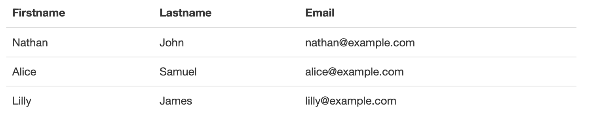
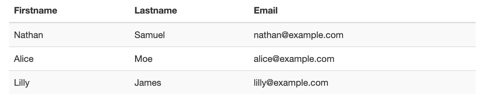
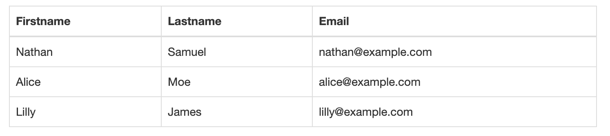
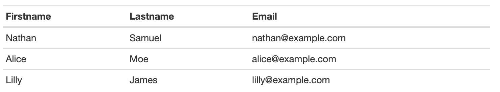
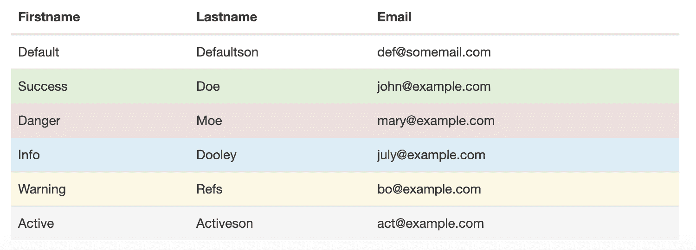

# 什么是引导数据表以及如何创建它？

> 原文：<https://www.edureka.co/blog/bootstrap-datatables/>

数据表用于根据元数据组织数据。由于数据是非结构化和无组织的，对其进行分析变得很困难。引导数据表将帮助你更好地阅读你的数据，增加网站的美学价值，并使数据看起来更令人愉快。在这篇博客中，我们将从基本的数据表创建开始，然后进一步添加不同的颜色、份额、行和列。此外，数据表有助于排序和过滤数据，确保数据的完整性，并有助于即时创建动态图表。

在这篇 Bootstrap Datatables 文章中，我们将讨论以下主题:

*   [什么是引导数据表？](#TheBasicTable)
    *   [条纹行](#StripedRows)
    *   [加边表格](#BorderedTable)
    *   [凝聚表](#CondensedTable)
    *   [上下文类别](#ContextualClasses)

让我们从基础开始吧！

## **什么是引导数据表？**

要添加基本样式，您可以使用“.表”类。它增加了一个轻填充效果，并且只由水平分隔线组成。

例如:执行下面给出的代码:

```
<div class="container">
<thead>
<table class="table table-condensed">
<tr>
<th> Firstname </th>
<th> Lastname </th>
<th> Email </th>
</tr>
</thead>
<tbody>
     			<tr>
       				<td> Nathan </td>
       				<td> Samuel </td>
				<td> nathan@example.com </td>
      			</tr>
     			<tr>
        				<td> Alice </td>
        				<td> Moe </td>
       				<td> alice@example.com </td>
     			</tr>
      			<tr>
      				<td> Lilly </td>
        				<td>James</td>
        				<td> lilly@example.com </td>
      			</tr>
    		</tbody>
</table>
</div>

```

在上面的代码中:

–<thread>:定义了表格的各个部分–<tr>:定义了线程行–<TD>:定义了特定行的数据。–<表头>:定义表头–<表体>:定义表体–<表类= " " >:定义表的类</thread>

**输出**:你的表格应该是这样的



现在我们知道了如何创建一个基本的数据表，让我们学习一下如何给这些表添加美感。

## **条纹行**

简单来说，如果你想添加斑马条纹，你必须添加“.表条纹”类。

例如:执行下面给出的代码:

```
<div class="container">         
  	<table class="table table-striped">
    		<thead>
<tr>
<th> Firstname </th>
<th> Lastname </th>
<th> Email </th>
</tr>
</thead>
<tbody>
     			<tr>
        				<td> Nathan </td>
        				<td> Samuel </td>
       				<td> nathan@example.com </td>
      			</tr>
     			<tr>
        				<td> Alice </td>
        				<td> Moe </td>
       				<td> alice@example.com </td>
      			</tr>
      			<tr>
      				<td> Lilly </td>
        				<td>James</td>
        				<td> lilly@example.com </td>
      			</tr>
    		</tbody>
  	</table>
</div>
```

在上面的代码中:

–<thread>:定义了表格的各个部分–<tr>:定义了线程行–<TD>:定义了特定行的数据。–<表头>:定义表头–<表体>:定义表体–<表类= " " >:定义表的类</thread>

输出:你的表应该是这样的



定义表的类非常重要，因为它改变了数据表的整个外观。让我们看看如何给表格添加边框。

## **加边表格**

要给表格的所有边和每个单元格添加边框，您必须。表边框”类。

例如:执行下面给出的代码

```
<div class="container">
<thead>
<table class="table table-bordered">
<tr>
<th> Firstname </th>
<th> Lastname </th>
<th> Email </th>
</tr>
</thead>
<tbody>
     			<tr>
       				<td> Nathan </td>
       				<td> Samuel </td>
				<td> nathan@example.com </td>
      			</tr>
     			<tr>
        				<td> Alice </td>
        				<td> Moe </td>
       				<td> alice@example.com </td>
     			</tr>
      			<tr>
      				<td> Lilly </td>
        				<td>James</td>
        				<td> lilly@example.com </td>
      			</tr>
    		</tbody>
</table>
</div>
```

在上面的代码中:

–<thread>:定义了表格的各个部分–<tr>:定义了线程行–<TD>:定义了特定行的数据。–<表头>:定义表头–<表体>:定义表体–<表类= " " >:定义表的类</thread>

输出:你的表应该是这样的



不满意大桌子？让我们继续我们的引导数据表，并学习如何减少表的大小

## **浓缩表**

要将引导数据表的单元格填充减少一半，可以使用“.表压缩”类。例如:执行下面给出的代码

```
<div class="container">
<thead>
<table class="table table-condensed">
<tr>
<th> Firstname </th>
<th> Lastname </th>
<th> Email </th>
</tr>
</thead>
<tbody>
     			<tr>
       				<td> Nathan </td>
       				<td> Samuel </td>
				<td> nathan@example.com </td>
      			</tr>
     			<tr>
        				<td> Alice </td>
        				<td> Moe </td>
       				<td> alice@example.com </td>
     			</tr>
      			<tr>
      				<td> Lilly </td>
        				<td>James</td>
        				<td> lilly@example.com </td>
      			</tr>
    		</tbody>
</table>
</div>
```

在上面的代码中:

–<thread>:定义了表格的各个部分–<tr>:定义了线程行–<TD>:定义了特定行的数据。–<表头>:定义表头–<表体>:定义表体–<表类= " " >:定义表的类</thread>

输出:你的表应该是这样的



接下来，让我们继续我们的引导数据表，并了解如何添加颜色到您的文本。

## **引导数据表中的上下文类**

您可以使用多个类为表格行或表格单元格Add color. These classes and their descriptions are given below.

| **类** | **描述** |
| 活跃的 | 它将灰色应用于单元格 |
| 成功 | 这将应用绿色，表示成功或积极的行动 |
| 信息 | 这将应用蓝色并指示中性信息动作 |
| 警告 | 它使用黄色，表示可能需要注意某些事情 |
| 危险 | 这应用了红色，并指示负面动作 |

例如:执行下面的代码。

```
<div class = "container">
  	<table class = "table">
    		<thead>
      			<tr>
        				<th> Firstname </th>
        				<th> Lastname </th>
        				<th> Email </th>
      			</tr>
    		</thead>
    		<tbody>
      			<tr>
        				<td> Default </td>
        				<td> Defaultson </td>
        				<td> def@somemail.com </td>
      			</tr>      
      			<tr class = "success">
        				<td> Success </td>
        				<td> Doe </td>
        				<td> john@example.com </td>
      			</tr>
      			<tr class = "danger">
       				<td> Danger </td>
        				<td> Moe </td>
        				<td> mary@example.com </td>
      			</tr>
      			<tr class = " info">
        				<td> Info </td>
        				<td> Dooley </td>
        				<td> july@example.com </td>
      			</tr>
      			<tr class = "warning">
        				<td> Warning </td>
        				<td> Refs </td>
        			<td> bo@example.com </td>
      			</tr>
      			<tr class = "active">
        				<td> Active </td>
        				<td> Activeson </td>
        				<td> act@example.com </td>
      			</tr>
    		</tbody>
  	</table>
</div>

```

在上面的代码中:

–<thread>:定义了表格的各个部分–<tr>:定义了线程行–<TD>:定义了特定行的数据。–<表头>:定义表头–<表体>:定义表体–<表类= " " >:定义表的类</thread>

输出:你的表应该是这样的



综上所述，参考下面给出的数据表的类和描述。

| **类** | **描述** |
| 桌子 | 创建一个基本表 |
| 剥去台面 | 将斑马条纹添加到表格中 |
| 桌边的 | 为表格和每个单元格添加边框 |
| 表浓缩的 | 让桌子变得紧凑 |

若要分别为行着色，请使用以下类。

| **类** | **描述** |
| 活跃的 | 它将灰色应用于单元格 |
| 成功 | 它使用绿色，表示成功或积极的行动 |
| 信息 | 这将应用蓝色并指示中性信息动作 |
| 警告 | 它使用黄色，表示可能需要注意某些事情 |
| 危险 | 这应用了红色，并指示负面动作 |

就这样，我们来到了这篇文章的结尾。我希望您了解如何创建引导数据表。

*查看 Edureka 的 **[Web 开发认证培训](https://www.edureka.co/complete-web-developer)** 。* *Web 开发认证培训将帮助您学习如何使用 HTML5、CSS3、Twitter Bootstrap 3、jQuery 和 Google APIs 创建令人印象深刻的网站，并将其部署到亚马逊简单存储服务(S3)。*

*有问题吗？请在这个“Bootstrap DataTables”博客的评论部分提到它，我们会回复您。*