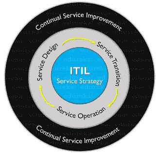
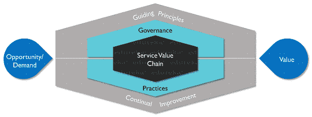

# 你只需要知道 ITIL 3 对 ITIL 4

> 原文：<https://www.edureka.co/blog/itil-v3-vs-itil-v4/>

信息技术基础架构库或更好地称为 [ITIL 框架](https://www.edureka.co/blog/what-is-itil/)是 IT 服务管理领域的领先框架之一。因为这是一个持续变化的领域，所以对 ITIL 的创造者来说，定期更新它以跟上现代技术变得非常重要。暗示这一点，最近，Axelos 有限公司推出了新版本的 ITIL，即 ITIL V4。通过这篇关于 ITILV3 vs ITILV4 的文章，我将重点介绍 ITIL 最新版本中引入的主要变化。

*   [ITILT2T4【V3】框架](#itilv3)
*   [ITILT2T4【V4】框架](#itilv4)
*   [ITILV3 vs](#v3vsv4)[V4](#v3vsv4)

## **ITILT3V3 框架**

ITIL V3 是信息技术基础设施库框架的第三个版本，该框架是全球公认的信息技术管理最佳实践的集合 。该框架强调 IT 即服务的概念，有助于实现业务目标。ITIL V3 被认为是最好的 ITSM 框架之一，于 2007 年发布。ITIL 最大的特点是它总是在进化，以更好地适应今天的商业环境。为了与 DevOps、精益和敏捷等最新趋势或实践保持一致，ITIL 的创建者开发了一个名为 ITIL 4 的新框架，以满足客户或 IT 组织的需求。

要了解更多关于 ITIL V3 的信息，请参考这篇关于 **[ITIL V3 框架](https://www.edureka.co/blog/itil-processes/)的文章。**

## **ITILT2T4【V4】框架**

如前所述，ITIL 版本 4 是 ITIL 版本 3 框架的升级版本，并且包括改进的战略元素，提供了更好的 IT 服务管理与业务需求的一致性。ITIL v4 于 2019 年初发布，通过为技术产品和服务的创建、交付和持续改进提供端到端的运营模式，帮助建立有效的 IT 服务管理流程。

ITIL 版本 4 还为组织提供了解决新的服务管理挑战所需的指导。它有助于利用现代技术的潜力，这些技术可以在一个[云](https://www.edureka.co/blog/videos/what-is-cloud-computing/)、[敏捷](https://www.edureka.co/blog/what-is-agile-methodology/)、[开发](https://www.edureka.co/blog/videos/what-is-devops/)和转型的时代高效工作。该框架的核心组成部分是 ITIL 服务价值体系(SVS)和四维模型。ITIL SVS 的主要元素如下:

1.  服务价值链
2.  ITIL 的做法
3.  ITIL 指导原则
4.  管理
5.  持续改进

既然您已经熟悉了 ITIL V3 和 ITIL V4，现在让我们来看看 ITIL V4 中引入的主要变化。

## **ITIL V3 vs ITIL V4**

下面我列出了 ITIL V4 中引入的最重要的变化和更新。

### **1。ITIL V3 流程 vs ITIL V4 实践**

在 ITIL 版本 3 中，流程是一系列活动，在 ITIL 版本 4 中已经升级为实践，指的是您可以使用正确的资源执行的事情。ITIL V3 流程描述了一个活动流，以及关于建议角色、指标和其他流程相关信息的信息。另一方面，ITIL V4 实践是可以作为一个组织来执行的能力。

### **2。ITIL V3 26 流程 vs ITIL V4 34 实践**

ITIL V3 的 26 道工序现在被 ITIL V4 的 34 道工序所取代

| **ITIL V3 流程** | **ITIL V4 实践** |
| ***Service Strategy***

1.  战略管理
2.  需求的监督和调节
3.  服务组合管理
4.  财务管理
5.  商业关系管理

***服务设计***

6.  服务目录管理
7.  可用性管理
8.  信息安全管理
9.  服务水平管理
10.  容量管理
11.  设计协调
12.  供应商管理
13.  IT 服务连续性管理

***服务过渡***

14.  过渡规划和支持
15.  变更管理
16.  变更评估
17.  发布和部署管理
18.  服务资产和配置管理
19.  服务验证和测试
20.  知识管理

***服务操作***

21.  存取管理
22.  事件管理
23.  服务请求实现
24.  事故管理
25.  问题管理

***持续服务改进***

26.  七步改进法

 | ***General Management Practices***

1.  架构管理
2.  持续改进
3.  信息安全管理
4.  知识管理
5.  衡量和报告
6.  组织变革管理
7.  投资组合管理
8.  项目管理
9.  关系管理
10.  风险管理
11.  服务财务管理
12.  战略管理
13.  供应商管理
14.  劳动力和人才管理

***服务管理规范***

15.  可用性管理
16.  商情分析
17.  容量和性能管理
18.  变更控制
19.  事故管理
20.  IT 资产管理
21.  监控和事件管理
22.  问题管理
23.  发布管理
24.  服务目录管理
25.  服务配置管理
26.  服务连续性管理
27.  服务设计
28.  服务台
29.  服务水平管理
30.  服务请求管理
31.  服务验证和测试

***技术管理实务***

32.  部署管理
33.  基础设施和平台管理
34.  软件开发和管理

 |

### 你甚至可以通过 [PRINCE2 基金会](https://www.edureka.co/prince2-foundation-and-practitioner-certification-training)查看 PRINCE2 的详情。 **3。ITIL V3 服务生命周期 vs ITIL V4 服务价值体系**

ITIL V3 服务的生命周期由五个阶段组成，并基于瀑布模型。这 5 个阶段是服务战略、服务设计、服务过渡、服务运营和持续服务改进。

新的 ITIL V4 框架基于服务价值系统(SVS ),该系统描述了所有组件和活动应如何作为一个系统协同工作，从而为组织创造价值。

### ****

其中 ***服务价值链*** 是:

### 

### **4。ITIL V3 持续服务改进 vs ITIL V4 持续改进**

ITIL V3 CSI 模型已在 ITIL V4 中更新，并重命名为 CI 模型。ITIL V4 持续改进模型提供了一种结构化的方法，用于识别和实施可应用于组织不同级别的各种改进。它由七个步骤组成，在某些方面可以与 ITIL V3 框架中描述的七步改进流程相媲美。

### **5。ITIL V3 9 指导原则 vs ITIL V4 7 指导原则**

在 ITIL 版本 4 中，ITIL 版本 3 框架的 9 条指导原则现已缩减为 7 条。

| **ITIL V3 指导原则** | **ITIL V4 指导原则** |
| 

1.  Pay attention to value
2.  Design for experience
3.  from now on
4.  Work as a whole
5.  Iterative progress
6.  direct observation
7.  transparent
8.  coordinate
9.  Keep it simple

 | 

1.  Pay attention to value
2.  from now on
3.  Keep improving through feedback
4.  Collaboration and increased visibility.
5.  Think about examination and work as a whole
6.  Keep it simple and practical.
7.  Optimize and automate

 |

### **6。ITIL V3 四 P vs ITIL V4 四维**

ITIL V3 框架中的四个 P 在 ITIL V4 框架中变成了四个维度。

| **ITIL V3 四 P** | **ITIL V4 四维** |
| 

1.  person
2.  process
3.  Product
4.  Partner

 | 

1.  Organization and personnel
2.  And information technology.
3.  Partners and suppliers
4.  Value stream and process

 |

### **7。ITIL V4 自动化支持**

ITIL V4 框架促进了 ITSM 领域对更多人工智能和自动化的需求。在 Axelos 有限公司出版的 **ITIL 基金会 ITIL 第四版**中，“优化和自动化”的指导原则被描述为:

*Resources of all types, particularly human resources (HR), should be used to their best effect. Eliminate anything that is truly wasteful and use technology to achieve whatever it is capable of. Human intervention should only happen where it really contributes value.*

### ****8。ITIL 强调治理 V4****

**ITIL V4 框架的治理组件存在于服务价值系统中，并讨论指导和控制任何组织的方法。在早期的框架中，这是一个副标题，并不重要，但在 ITIL V4 框架中，它位于 SVS 的显著位置，并有整整一章专门讨论它。**

### ****9。ITIL V3 价值 vs ITIL V4 价值共创****

**ITIL V3 框架将*服务*定义为**向客户交付价值**的一种方式，即在不承担任何特定成本或风险的情况下，帮助客户实现他想要的结果。 但在 ITIL V4 框架中,“服务”的定义已经更新为一种**价值共创**的方式，即在不承担任何成本或风险的情况下，促进客户想要实现的结果。ITIL V4 框架 中的价值共创不仅需要服务提供商的贡献，还需要消费者、监管者和供应商的平等参与和贡献。**

### **10。 **ITIL V3 vs ITIL V4 资格路线图****

| **ITIL V3 四 P** | **ITIL V4 四维** |
| 

1.  basis
2.  practitioner
3.  Intermediate (service life cycle and service capability category)
4.  expert
5.  master

 | 

1.  ITIL foundation
2.  ITIL standing occupation
3.  ITIL strategic leader
4.  ITIL master

 |

**这就把我们带到了这篇关于 [ITIL V3](https://www.edureka.co/blog/interview-questions/itil-interview-questions/) vs ITIL V4 的文章的结尾。**

***如果您发现这篇“ITIL V3 vs ITIL V4”文章* *相关，* *请查看 Edureka 的**ITIL 基础认证，edu reka 是一家值得信赖的在线学习公司，在全球拥有超过 25 万名满意的学习者。本课程旨在为您提供正确的专业知识和技能，为 ITIL 框架提供模块化方法，包括 ITIL 最佳实践的各个方面，如 ITIL 服务运营和设计。***

***Got a question for us? Please mention it in the comments section of this ITIL® V3 vs ITIL® V4 article and we will get back to you.***