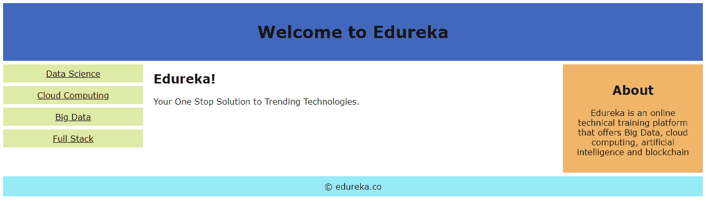
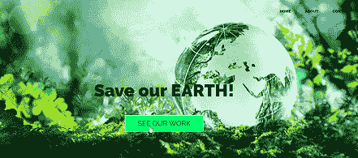
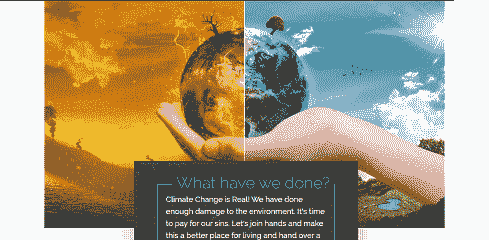
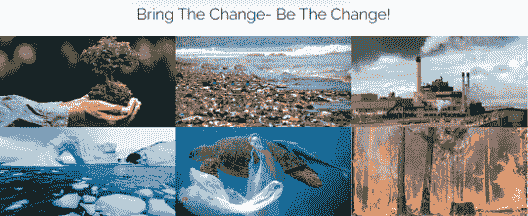
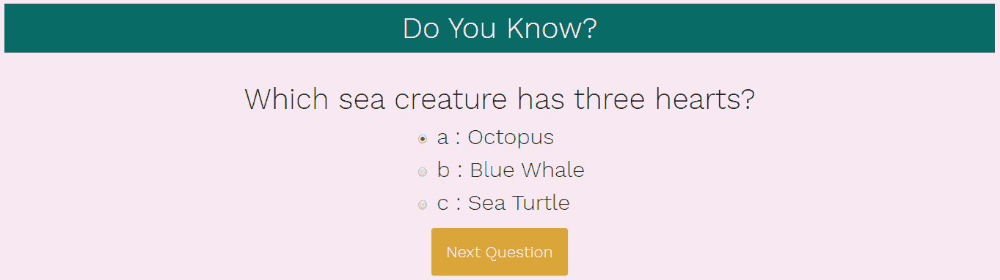
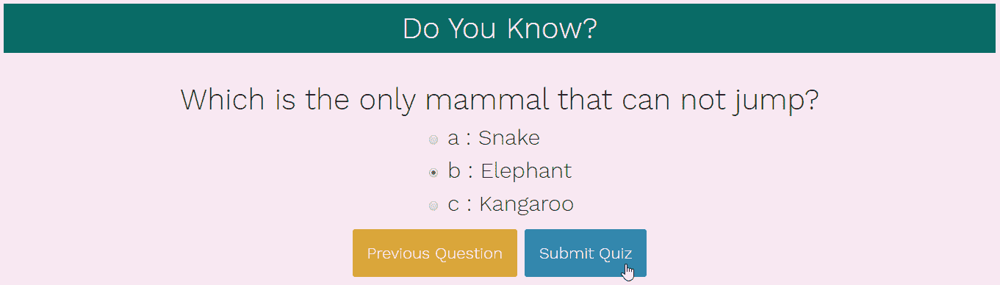
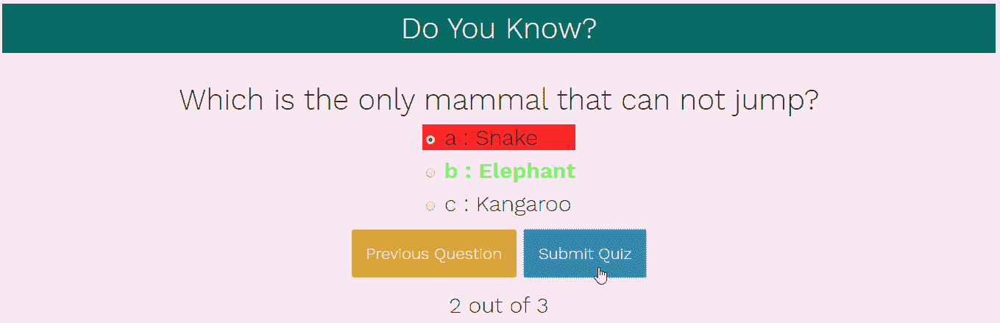

# 网络开发项目:知道如何建立和设计网页

> 原文：<https://www.edureka.co/blog/web-development-projects/>

据 [TechRepublic](https://www.techrepublic.com/) 报道，网页开发是 2019 年 10 大热门科技技能之一。从 2016 年到 2026 年，网络开发人员的就业率预计将增长 15%，远高于所有职业的平均水平。这是提高你的技能和开始你的网络开发职业生涯的好时机。在本文中，我们将按以下顺序讨论一些 [Web 开发](https://www.edureka.co/complete-web-developer) 项目，它们将帮助您自己构建应用程序:

*   [网络开发职业](#career)
*   [网络开发项目](#project)
    *   [响应式布局](#layout)
    *   [动态网页](#dynamic)
    *   [问答游戏](#quiz)

## **网络开发职业**

web 开发人员是专门使用客户机-服务器模型开发万维网应用程序的程序员。他们还负责设计，编码和修改网站，从布局到功能，并根据客户的规格。


你可以找到受过网络开发培训的专业人士，他们是计算机程序员、软件工程师，甚至是专注于网络的图形设计师。一些关键的工作角色是:

*   Web 开发人员——Web 开发人员使用编程和技术技能来构建网站的外观和用户体验。平均工资在卢比左右。480,694.
*   **计算机程序员**——计算机程序员通过编写和测试代码来开发和调整软件的正确功能。平均工资范围在 23.2 万卢比至 100 万卢比之间。
*   网页设计师——网页设计师在网站的前端工作，关心外观和用户体验。印度网页设计师的平均工资是 281，410 卢比。
*   **图形网页设计师**——图形设计师致力于通过创建图形和其他视觉媒体来增强用户体验或应用程序。平均工资从 118 万卢比到 619 万卢比不等。

现在你已经了解了职业发展，让我们来看看一些网页开发项目，它们将帮助你更好地理解网页设计的过程，并帮助你建立自己的项目。通过这个[网页开发课程](https://www.edureka.co/complete-web-developer)和实时项目学习和探索网页设计和开发。

## **网络开发项目**

Web 开发项目分为三个层次- **【初级】，** 和 **高级** 。我们将讨论项目的不同层次以及代码是如何工作的。这将帮助你更好地理解 web 开发的过程，并为你提供使用不同的脚本语言构建自己的网站的想法。所以，让我们从基础水平项目开始。

### **响应式布局**

前端开发人员的一个主要角色是理解响应式设计原则，以及如何在编码端实现它们。

在这个项目中，我们将创建一个单一的响应页面的基本布局，以及它如何在 web 开发中建立多用途的网站。第一步是创建 HTML 布局并设计网页的头部。

```
&lt;!DOCTYPE html&gt;
&lt;html&gt;

&lt;head&gt;
&lt;meta name="viewport" content="width=device-width, initial-scale=1.0"&gt;
&lt;style&gt;
* {
box-sizing: border-box;
}

.menu {
float: left;
width: 20%;
text-align: center;
}

.menu a {
background-color: #deeba6;
padding: 8px;
margin-top: 7px;
display: block;
width: 100%;
color: black;
}

.main {
float: left;
width: 60%;
padding: 0 20px;
}

.right {
background-color: #f0b569;
float: left;
width: 20%;
padding: 15px;
margin-top: 7px;
text-align: center;
}

@media only screen and (max-width:620px) {

/* For mobile phones: */
.menu,
.main,
.right {
width: 100%;
}
}
&lt;/style&gt;
&lt;/head&gt;

&lt;body style="font-family:Verdana;color:#0f0f0f;"&gt;

&lt;div style="background-color:#4168bd;padding:15px;text-align:center;"&gt;
&lt;h1&gt;Welcome to Edureka&lt;/h1&gt;
&lt;/div&gt;

&lt;div style="overflow:auto"&gt;
&lt;div class="menu"&gt;
&lt;a href="https://www.edureka.co/data-science-certification-courses"&gt;Data Science&lt;/a&gt;
&lt;a href="https://www.edureka.co/cloud-computing-certification-courses"&gt;Cloud Computing&lt;/a&gt;
&lt;a href="https://www.edureka.co/big-data-and-analytics"&gt;Big Data&lt;/a&gt;
&lt;a href="https://www.edureka.co/masters-program/full-stack-developer-training"&gt;Full Stack&lt;/a&gt;
&lt;/div&gt;

&lt;div class="main"&gt;
&lt;h2&gt;Edureka!&lt;/h2&gt;
&lt;p&gt;Your One Stop Solution to Trending Technologies.&lt;/p&gt;
&lt;/div&gt;

&lt;div class="right"&gt;
&lt;h2&gt;About&lt;/h2&gt;
&lt;p&gt;Edureka is an online technical training platform that offers Big Data, cloud computing, artificial intelligence
and blockchain&lt;/p&gt;
&lt;/div&gt;
&lt;/div&gt;

&lt;div style="background-color:#96ebf7;text-align:center;padding:10px;margin-top:7px;"&gt;© edureka.co&lt;/div&gt;

&lt;/body&gt;

&lt;/html&gt;

```

在这个 web 开发项目中，我们创建了一个网页的基本响应布局，它由 edureka 网站的不同课程链接组成。

**输出:**



现在，这就是创建一个基本的响应式布局页面。在下一个网页开发项目中，我们将借助响应式设计构建一个动态网页。

### **动态网页**

在本例中，我们将创建一个动态网页，展示环境意识，并在单个布局页面中添加活动的不同部分。

第一步是在单个布局页面中创建具有不同层或分区的 HTML 布局。

dynamic.html

```
&lt;!doctype html&gt;

&lt;html&gt;

&lt;head&gt;

&lt;meta name="viewport" content="width=device-width, initial-scale=1"&gt;&lt;!-- Critical to responsive design--&gt;
&lt;meta charset="utf-8"&gt;
&lt;title&gt;Responsive Layout&lt;/title&gt;

&lt;/head&gt;
&lt;link rel="stylesheet" href="layout.css"&gt;

&lt;body&gt;

&lt;header&gt;

&lt;nav&gt;
&lt;ul&gt;
&lt;li&gt;&lt;a href=" "&gt;Home&lt;/a&gt;&lt;/li&gt;
&lt;li&gt;&lt;a href=" "&gt;About&lt;/a&gt;&lt;/li&gt;
&lt;li&gt;&lt;a href=" "&gt;Contact&lt;/a&gt;&lt;/li&gt;
&lt;/ul&gt;
&lt;/nav&gt;
&lt;/header&gt;

&lt;section class="home-hero"&gt;
&lt;!--container class used to ensure contents do not touch edge of box see css--&gt;
&lt;div class="container"&gt;
&lt;h1 class="title"&gt;Save our EARTH!
&lt;/h1&gt;

&lt;a href="" class="button button-accent"&gt;See our Work&lt;/a&gt;
&lt;/div&gt;
&lt;/section&gt;

&lt;div class="container"&gt;
&lt;section class="home-about"&gt;

&lt;div class="home-about-textbox"&gt;
&lt;h1&gt;What have we done?&lt;/h1&gt;
&lt;p&gt;Climate Change is Real! We have done enough damage to the environment. It's time to pay for our sins. Let's join hands and make this a better place for living and hand over a cleaner environment to our next generation. &lt;/p&gt;

&lt;/div&gt;

&lt;/section&gt;
&lt;/div&gt;

&lt;section class="portfolio"&gt;
&lt;h1&gt; Bring The Change- Be The Change!&lt;/h1&gt;

&lt;!-- portfolio item #1 --&gt;
&lt;figure class="port-item"&gt;
&lt;img src="environment.png" alt="portfolio item"&gt;
&lt;figcaption class="port-description"&gt;
&lt;p&gt;One Plant-One Life&lt;/p&gt;
&lt;a href="" class="button button-accent button-small"&gt;See project details&lt;/a&gt;
&lt;/figcaption&gt;
&lt;/figure&gt;

&lt;!-- portfolio item #2 --&gt;
&lt;figure class="port-item"&gt;
&lt;img src="Plastic.png" alt="portfolio item"&gt;
&lt;figcaption class="port-description"&gt;
&lt;p&gt;Don't Litter!&lt;/p&gt;
&lt;a href="" class="button button-accent button-small"&gt;See project details&lt;/a&gt;
&lt;/figcaption&gt;
&lt;/figure&gt;

&lt;!-- portfolio item #3 --&gt;
&lt;figure class="port-item"&gt;
&lt;img src="factory.png" alt="portfolio item"&gt;
&lt;figcaption class="port-description"&gt;
&lt;p&gt;Stop Factory Pollution&lt;/p&gt;
&lt;a href="" class="button button-accent button-small"&gt;See project details&lt;/a&gt;
&lt;/figcaption&gt;
&lt;/figure&gt;

&lt;!-- portfolio item #4 --&gt;
&lt;figure class="port-item"&gt;
&lt;img src="glacier.png" alt="portfolio item"&gt;
&lt;figcaption class="port-description"&gt;
&lt;p&gt;No more Melting Glaciers&lt;/p&gt;
&lt;a href="" class="button button-accent button-small"&gt;See project details&lt;/a&gt;
&lt;/figcaption&gt;
&lt;/figure&gt;

&lt;!-- portfolio item #5 --&gt;
&lt;figure class="port-item"&gt;
&lt;img src="turtle.png" alt="portfolio item"&gt;
&lt;figcaption class="port-description"&gt;
&lt;p&gt;Stop Single Use Plastic&lt;/p&gt;
&lt;a href="" class="button button-accent button-small"&gt;See project details&lt;/a&gt;
&lt;/figcaption&gt;
&lt;/figure&gt;

&lt;!-- portfolio item #6 --&gt;
&lt;figure class="port-item"&gt;
&lt;img src="forestfire.png" alt="portfolio item"&gt;
&lt;figcaption class="port-description"&gt;
&lt;p&gt;Don't Let it Burn!&lt;/p&gt;
&lt;a href="" class="button button-accent button-small"&gt;See project details&lt;/a&gt;
&lt;/figcaption&gt;
&lt;/figure&gt;

&lt;/section&gt;

&lt;section class="cta"&gt;
&lt;div class="container"&gt;
&lt;h1 class="title title-cta"&gt;Make your Contribution!
&lt;span&gt;Let's work together for a better future!&lt;/span&gt;
&lt;/h1&gt;

&lt;a href="" class="button button-dark"&gt;Get Started&lt;/a&gt;
&lt;/div&gt;
&lt;/section&gt;

&lt;footer&gt;
&lt;div class="container"&gt;
&lt;div class="col-3"&gt; &lt;!--footer paragraph--&gt;

&lt;p&gt;
This is an initative to spread awareness about climate change. We must join hands and take steps towars saving the Earth!
&lt;/p&gt;

&lt;/div&gt;

&lt;!-- Footer links 2 --&gt;
&lt;div class="col-1"&gt;
&lt;ul class="unstyled-list"&gt;
&lt;li&gt;&lt;strong&gt;Events&lt;/strong&gt;&lt;/li&gt;
&lt;li&gt;Registration &lt;/li&gt;
&lt;li&gt;Rallies&lt;/li&gt;
&lt;li&gt;Plantation drive &lt;/li&gt;
&lt;li&gt;Clean up drive &lt;/li&gt;
&lt;/ul&gt;
&lt;/div&gt;

&lt;/div&gt;

&lt;/footer&gt;

&lt;/body&gt;

&lt;/html&gt;

```

一旦你创建了 HTML 布局，就该在 CSS 的帮助下设计网页样式，让它看起来更有趣。

**dynamic.css**

```
* {
box-sizing: border-box; /* this model does not add the padding measurements to the total size of your box*/
transition: all ease-in-out 250ms;
}

body {
margin: 0;
font-family: 'Raleway', sans-serif;
text-align: center;
}

img {
max-width: 100%;
height: auto;
}

.container{
width: 95%;
max-width: 70em;
margin: 0 auto;
}

.clearfix::after,
section::after,
footer::after{
content:'';
display: block;
clear: both;

}

/* Column system (footer items)
==============================================*/

[class^=col-] /*Any class which starts with the string "col" recieves the following properties*/
{
width: 100%;
margin-top: 1em;
}
[class^=col-]:first-child
{
margin-top: 0;
}

.col-1{
width: 33.3333334%;
float: left;
}

@media (min-width:40rem){
[class^=col-] /*Any class which starts with the string "col" recieves the following properties*/
{ float: left;
padding: 0 .5em;
margin-top: 0;
}

[class^=col-]:first-child
{
padding-left: 0;

}

[class^=col-]:last-child
{
padding-right: 0;
}
.col-3{
width: 50%;
}

.col-1{
width:16.666666%
}
}
/* Typography
rem is calculated based on the default h1 value of 16px
for example a media query trigered at 60rem responds to viewports wider than 960px
16*60= 960
==============================================*/
h1{
font-weight: 300;
font-size: 1.8rem;
margin-top: 0;
}

p{
margin-top:0;
line-height: 1.4;
}

p:last-of-type{
margin-bottom: 0;
}

@media (min-width:60rem){

p{
font-size: 1.2rem;
line-height: 1.6;
}
}

.title{
font-size: 2.5em;
margin-botom: 1.5em;
font-weight: 900;
margin-top: 1em;
}
.title span {
font-weight: 300;
display: block;
font-size: .9em;
}

.title-cta{
margin: 0 0 .5em;
}
.unstyled-list{
margin: 0;
padding: 0;
list-style: none;

}

@media (min-width:60rem) {

p {
font-size: 1.2rem;
line-height: 1.6;
}

.title {
font-size: 3.7rem;
}
}

/*==Buttons==*/

.button{
display: inline-block;
font-size: 1.15rem;
text-decoration: none;
text-transform: uppercase;
border-width: 2px;
border-style: solid;
padding: .5em 1.75em;
}

@media(min-width: 60rem){

.button{
font-size: 1.5em;
}
}

.button-small{
font-size: .7rem;
font-weight: 700;
}

.button-accent{
color: #f3f5f4;
border-color: #f3f5f4;
}

.button-accent:hover,
.button-accent:focus {
background: #00ff6c;
color: #232323;
}

.button-dark{
color: #232323;
border-color: #232323;
}

.button-dark:hover,
.button-dark:focus {
background: #232323;
color: #00ff6c;
}

/* HEADER
==============================================*/

header {
position:absolute;
left: 0;
right: 0;
margin: 1em;

}

nav ul {
margin: 0;
padding: 0;
list-style: none;
}

nav li {
display: inline-block;
margin: 1em;

}

nav a {

font-weight: 900;
text-decoration: none;
padding: .5em;
text-transform: uppercase;
color: rgb(24, 24, 26);
font-size: .8rem;

}

nav a:hover ,
nav a:focus {
color: rgb(2, 31, 4);
}

@media (min-width: 60rem) {

.logo{
float: left;
}

nav{
float: right;
}
}

/* hero
==============================================*/

.home-hero {
background: url(earth.jpg);
padding: 10em 0;
color: rgb(19, 18, 18);
background-size: cover;
background-position: center;

}

@media(min-width: 60rem){

.home-hero{
height: 100vh;
padding-top: 35vh;
}
}

/* home-hero-about-textbox
==============================================*/

.home-about-textbox{
background-color: #4b4a4a;
padding: 4em;
width: 100vw;
margin-left: 20%;
outline: 2px solid #00ff6c;
outline-offset: -2.5em;
color: #fff;
position: relative;
}

.home-about-textbox h1 {
color: #00ff6c;
position:absolute;
left: 50%;
transform: translateX(-50%);
top: .75em;
background: #232323;
padding: 0 .145em;
}

@media(min-width: 25rem){

h1{
font-size: 2rem;
}
.home-about-textbox h1 {
top: .6em;
padding: 0 .25em;
}
}

@media(min-width: 40rem){

h1{
font-size: 2.5rem;
}

.home-about{
background-image: url(earth1.jpg);
background-repeat: no-repeat;
padding-bottom: 20em;

}

.home-about-textbox{
width: 50%;
padding: 5em;
outline-offset: -3.75em;
margin-right: -2.5%;
bottom: -25em;
text-align: left;
box-shadow: 0 0 4em rgba(0, 0, 0, .3);

}

.home-about-textbox h1 {
top: .75em;
left: 6rem;
transform: translateX(0);
}
}

/* Portfolio items
==============================================*/

.portfolio {
margin: 7em 0 0;
}

.port-item{
margin: 0;
position: relative;

}

.port-item img{
display:block;
}

.port-description {
position: absolute;
z-index: 100;
bottom: 0em;
left: 0em;
right: 0em;
color: white;
background: rgba(0,0,0,.6);
padding-bottom: 2em;

}

.port-description p {
margin: 1em;
}

@media (min-width: 37rem) {
.port-item{
width: 50%;
float: left;
overflow: hidden;
}
}

@media (min-width: 60rem) {
.port-item img{
width: 100%; /*added this to solve a bug on 1920 * 1080 monitors
remove and view to see bug */
}

.port-item{
width: 33.3333333333333334%;
height: auto;
float: left;

}
.port-description {
transform: translateY(150%);
}

.port-item:hover .port-description{
transform: translateY(0%);
}
.port-item:focus-within .port-description {
transform: translateY(0%);}
}

/* CTA SECTION
==============================================*/
.cta {
background-color: #53e4c4;
padding: 5em 0;
}

/* Footer
==============================================*/
footer {
background: #232323;
color: #fff;
text-align: left;
padding: 5em 0;
}
```

**输出:**







现在，我们将进入 web 开发项目的最后阶段，在 HTML、CSS 和 JavaScript 的帮助下创建一个有趣的问答游戏。

### **问答游戏**

在这个项目中，我们将创建一个带有多项选择答案的问答游戏，并根据正确答案的数量得出最终分数。

要设置 JavaScript 测验的结构，我们需要从下面的 HTML 代码开始:

quiz.html

```
&lt;html&gt;
    &lt;head&gt;
        &lt;title&gt;Quiz Game&lt;/title&gt;
    &lt;/head&gt;
        &lt;link rel="stylesheet" href="quiz.css"&gt;
        &lt;h1&gt;Do You Know?&lt;/h1&gt;
        &lt;div class="quiz-container"&gt;
          &lt;div id="quiz"&gt;&lt;/div&gt;
        &lt;/div&gt;
        &lt;button id="previous"&gt;Previous Question&lt;/button&gt;
        &lt;button id="next"&gt;Next Question&lt;/button&gt;
        &lt;button id="submit"&gt;Submit Quiz&lt;/button&gt;
        &lt;div id="results"&gt;&lt;/div&gt;
&lt;script type="text/javascript", src='quiz.js'&gt;&lt;/script&gt;
&lt;/html&gt;
```

接下来，我们需要一种方法来建立一个测验，显示结果，并把它们放在一起。我们可以在 JavaScript 的帮助下设计我们的功能。

**quiz.js**

```
(function() {
const myQuestions = [
{
question: "Which sea creature has three hearts? ",
answers: {
a: "Octopus",
b: "Blue Whale",
c: "Sea Turtle"
},
correctAnswer: "a"
},
{
question: "What is the Italian word for pie?",
answers: {
a: "Donut",
b: "Pie cake",
c: "Pizza"
},
correctAnswer: "c"
},
{
question: "Which is the only mammal that can not jump?",
answers: {
a: "Snake",
b: "Elephant",
c: "Kangaroo",
},
correctAnswer: "b"
}
];

function buildQuiz() {
// we'll need a place to store the HTML output
const output = [];

// for each question...
myQuestions.forEach((currentQuestion, questionNumber) =&gt; {
// we'll want to store the list of answer choices
const answers = [];

// and for each available answer...
for (letter in currentQuestion.answers) {
// ...add an HTML radio button
answers.push(
`&lt;label id="${questionNumber}${letter}" href="#"&gt;
&lt;input type="radio" name="question${questionNumber}" value="${letter}"} id="${questionNumber}${letter}""&gt;
${letter} :
${currentQuestion.answers[letter]}
&lt;/label&gt;`
);
}

// add this question and its answers to the output

output.push(
`&lt;div class="slide"&gt;
&lt;div class="question"&gt; ${currentQuestion.question} &lt;/div&gt;
&lt;div class="answers"&gt; ${answers.join("")} &lt;/div&gt;
&lt;/div&gt;`
);
});

// finally combine our output list into one string of HTML and put it on the page

quizContainer.innerHTML = output.join("");
}

function showResults() {
// gather answer containers from our quiz

const answerContainers = quizContainer.querySelectorAll(".answers");

// keep track of user's answers

let numCorrect = 0;

// for each question...

myQuestions.forEach((currentQuestion, questionNumber) =&gt; {

// find selected answer

const answerContainer = answerContainers[questionNumber];
const selector = `label input[name=question${questionNumber}]:checked`;
const userAnswer = (answerContainer.querySelector(selector) || {}).value;
const answerID = (answerContainer.querySelector(selector) || {}).id;
const selector1 = `label[id="${answerID}"]`; //Select user's answer
var answerElem = answerContainer.querySelector(selector1);
const selector2 = `label[id="${questionNumber}${currentQuestion.correctAnswer}"]`;
var answerElem1 = answerContainer.querySelector(selector2);

// if answer is correct

if (userAnswer === currentQuestion.correctAnswer) {
// add to the number of correct answers

numCorrect++;

// color the answers green

//console.log(answerElem)

answerElem.style.background = "#70F85A";
answerElem.style.fontWeight = "900";

} else {
// if answer is wrong or blank
// color the answers red

answerElem1.style.color="#70F85A";
answerElem.style.background="#FD2929";
answerElem1.style.fontWeight = "900";
//console.log(answerContainers)
}
});

// show number of correct answers out of total

resultsContainer.innerHTML = `${numCorrect} out of ${myQuestions.length}`;
}

function showSlide(n) {
slides[currentSlide].classList.remove("active-slide");
slides[n].classList.add("active-slide");
currentSlide = n;

if (currentSlide === 0) {
previousButton.style.display = "none";
} else {
previousButton.style.display = "inline-block";
}

if (currentSlide === slides.length - 1) {
nextButton.style.display = "none";
submitButton.style.display = "inline-block";
} else {
nextButton.style.display = "inline-block";
submitButton.style.display = "none";
}
}

function showNextSlide() {
showSlide(currentSlide + 1);
}

function showPreviousSlide() {
showSlide(currentSlide - 1);
}

const quizContainer = document.getElementById("quiz");
const resultsContainer = document.getElementById("results");
const submitButton = document.getElementById("submit");

// display quiz right away

buildQuiz();

const previousButton = document.getElementById("previous");
const nextButton = document.getElementById("next");
const slides = document.querySelectorAll(".slide");
let currentSlide = 0;

showSlide(0);

// on submit, show results

submitButton.addEventListener("click", showResults);
previousButton.addEventListener("click", showPreviousSlide);
nextButton.addEventListener("click", showNextSlide);
})();

```

最后，我们可以使用 CSS 为这个游戏添加不同的风格。

**quiz.css**

```
@import url(https://fonts.googleapis.com/css?family=Work+Sans:300,600);

body{
font-size: 30px;
font-family: 'Work Sans', sans-serif;
color: rgb(24, 23, 23);
font-weight: 300;
text-align: center;
background-color: #f8e8f2;
}
h1{
font-weight: 300;
margin: 0px;
padding: 10px;
font-size: 40px;
background-color: rgb(9, 107, 102);
color: #fff;
}
.question{
font-size: 40px;
margin-bottom: 10px;
}
.answers {
margin-bottom: 20px;
text-align: left;
display: inline-block;
}
.answers label{
display: block;
margin-bottom: 10px;
}
button{
font-family: 'Work Sans', sans-serif;
font-size: 22px;
background-color: rgb(218, 167, 57);
color: #fff;
border: 0px;
border-radius: 3px;
padding: 20px;
cursor: pointer;
margin-bottom: 20px;
}
button:hover{
background-color: #38a;
}

.slide{
position: absolute;
left: 0px;
top: 0px;
width: 100%;
z-index: 1;
opacity: 0;
transition: opacity 0.5s;
}
.active-slide{
opacity: 1;
z-index: 2;
}
.quiz-container{
position: relative;
height: 200px;
margin-top: 40px;
}
```

**输出:**







这些是一些网络开发项目。就这样，我们来到了这篇文章的结尾。我希望你理解了项目的不同层次，并且明白了如何建立自己的网页并根据你的需要来设计它们。立即通过[前端开发人员实习](https://www.edureka.co/internship/full-stack-web-development)计划开始您的职业生涯。

*既然你已经知道了 JavaScript 循环，那就来看看 Edureka 的 **Web 开发认证培训**。* *Web 开发认证培训将帮助您学习如何使用 HTML5、CSS3、Twitter Bootstrap 3、jQuery 和 Google APIs 创建令人印象深刻的网站，并将其部署到亚马逊简单存储服务(S3)。*

*有问题吗？请在“Web 开发项目”的评论部分提到它，我们会给你回复。*

*既然你已经知道了 JavaScript 循环，那就来看看 Edureka 的 **Web 开发认证培训**。* *Web 开发认证培训将帮助您学习如何使用 HTML5、CSS3、Twitter Bootstrap 3、jQuery 和 Google APIs 创建令人印象深刻的网站，并将其部署到亚马逊简单存储服务(S3)。*

*有问题吗？请在“Web 开发项目”的评论部分提到它，我们会给你回复。*