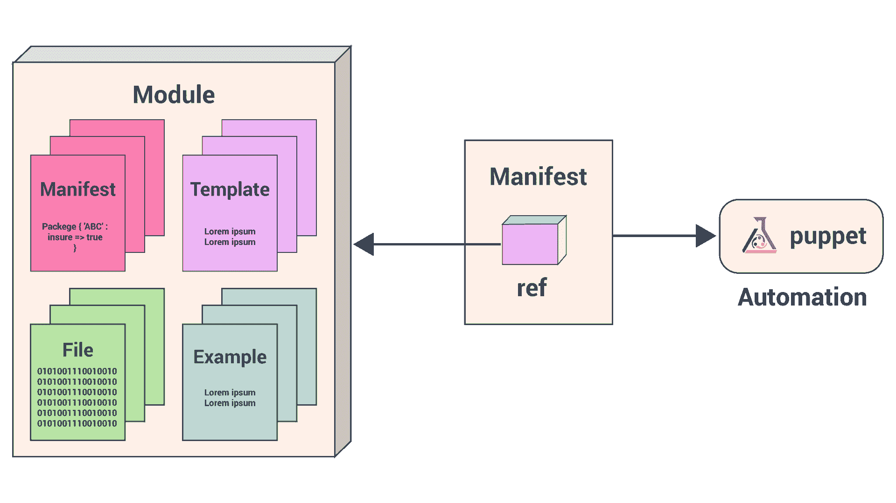
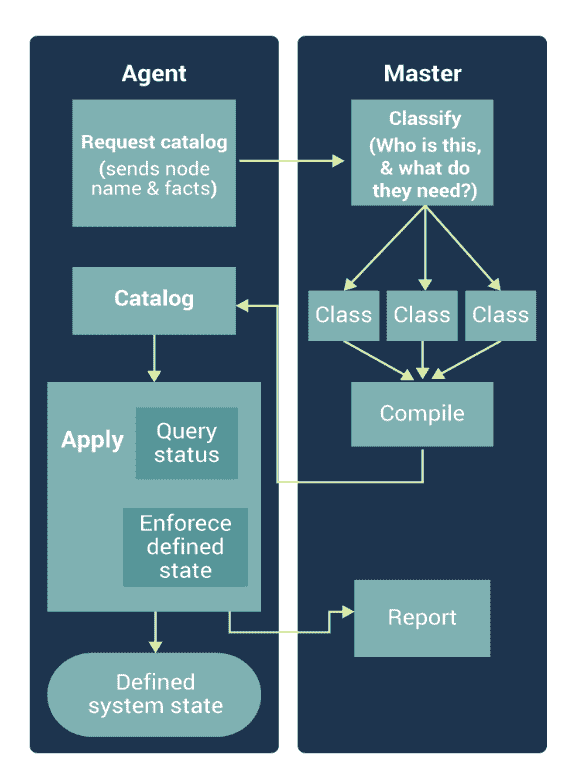
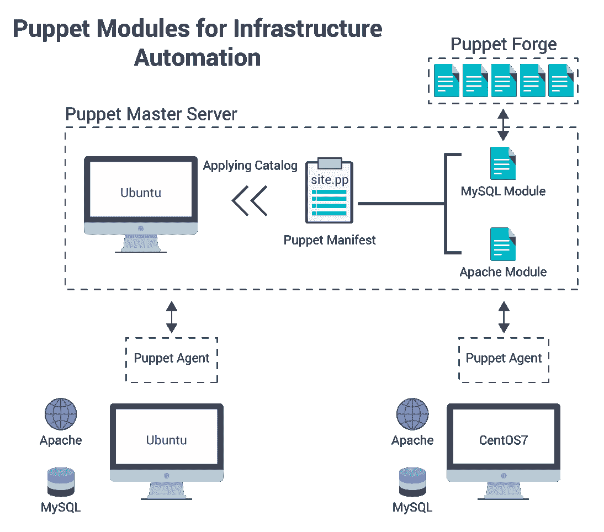
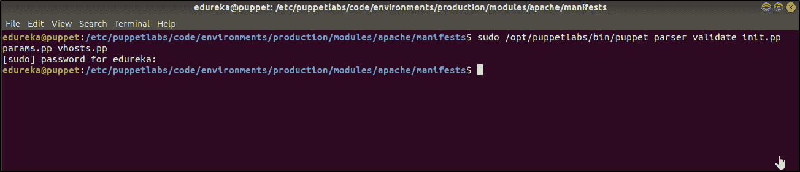
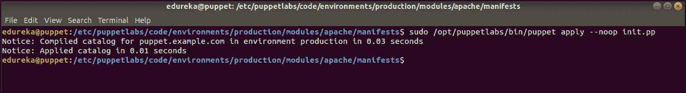
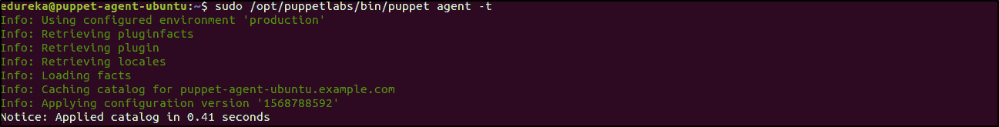
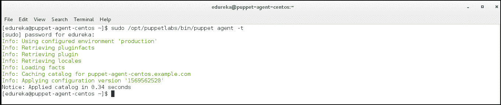

# 如何将 Puppet 模块用于 IT 基础设施自动化？

> 原文：<https://www.edureka.co/blog/puppet-modules-automation/>

以前，系统管理员使用 shell 脚本来运行他们的服务器，这种方法的可扩展性为零。为成百上千个不断变化的服务器及其系统配置不断修改脚本是一项令人望而生畏的任务。

在这篇关于**傀儡模块&清单**的文章中，让我们看看如何使用傀儡模块来自动化服务器设置、程序安装和系统管理。

本博客将涵盖以下主题:

*   [木偶编程入门](#getstarted)
*   [木偶编程中的关键术语](#keyterms)
*   [木偶程序工作流程](#ppw)
*   [演示:自动安装 Apache & MySQL](#demo)

### **木偶编程入门**

[Puppet](https://www.edureka.co/blog/what-is-puppet/) 是广泛用于配置管理的流行 DevOps 工具之一。它用于在基础架构中实现*一致性*。Puppet 可以将基础设施定义为代码，管理多个服务器，并执行系统配置，从而帮助自动化基础设施管理过程。

傀儡拥有自己的配置语言， **`Puppet DSL`** 。与其他 DevOps 程序一样，Puppet 自动化了更改，消除了手动脚本驱动的更改。但是，Puppet 不是简单的另一种 shell 语言，也不是纯粹的编程语言，比如 PHP。相反，Puppet 使用一种**声明性的基于模型的方法** 来实现 IT 自动化。这使得 Puppet 能够将基础设施定义为代码，并通过程序来执行系统配置。 在开始演示之前，我们先来看看木偶编程的几个核心方面。

**木偶编程中的关键术语**

#### **舱单**

一个傀儡程序叫做**清单**并且有一个带**的文件名。pp** 扩展。傀儡默认的主清单是 `*/etc/puppet/manifests/site.pp*` 。(这定义了 全局系统配置，例如 LDAP 配置、DNS 服务器或适用于每个节点的其他配置)。

#### **类**

这些清单中的代码块叫做其他模块可以调用的**类**。类配置大型或中型的功能块，例如运行应用程序所需的所有包、配置文件和服务。类使得重用 Puppet 代码和提高可读性变得更加容易。

#### **资源**

Puppet 代码主要由资源声明组成。一个**资源**描述了一个关于系统期望状态的特定元素。例如，它可以包括一个特定的文件应该存在或一个软件包应该安装。

#### **木偶模块**

除了主`site.pp`货单，将货单存储在**模块**中。

我们所有的 puppet 代码都组织在模块中，这些模块是我们可以重用和共享的 Puppet 的基本构件。每个模块管理基础设施中的特定任务，例如安装和配置一个软件。

模块包含傀儡类、定义的类型、任务、任务计划、容量、资源类型和插件，例如自定义类型或事实。在木偶模块路径中安装模块。Puppet 从模块路径中的每个模块加载所有内容，使这段代码可供使用。

  Puppetlabs 有预定义的模块，我们可以通过从 ** `[PuppetForge](https://forge.puppet.com/)` ** 下载它们来立即使用。您还可以创建一个定制的 puppet 模块来满足您的需求。

**木偶程序工作流程**

我们将使用 Puppet 的声明性语言在称为清单的文件中描述系统的期望状态。清单描述了应该如何配置网络和操作系统资源，如文件、包和服务。

#### ****

Puppet 将清单编译成**目录**，并将每个目录应用于其对应的节点，以确保在您的基础架构中 t he 节点的配置是正确的 。

### **演示:** **自动安装 Apache & MySQL**

这篇关于 puppet 模块的文章是实践性的，它将展示使用 puppet 模块的两种方法，并教你如何自动安装配置了这两个模块的服务器。

首先，确保你已经准备好一个傀儡基础设施，包括一个傀儡主服务器和两个傀儡代理。

*   傀儡师:Ubuntu 18.04
*   代理 1: Ubuntu 18.04
*   特工 2:centos 7

下面是我们将在这次实践中实现的目标的概要:



让我们从动手开始:

#### **从头开始创建模块**

在这个 puppet 模块中，我们将处理下载 Apache 包、配置文件和设置虚拟主机等任务。

*   从 Puppet Master 中，导航到 Puppet 的模块目录并创建 Apache 目录:

    ```
    cd /etc/puppet/modules
    sudo mkdir apache
    ```

*   从 apache 目录中创建子目录:清单、模板、文件和示例。

    ```
    cd apache
    sudo mkdir {manifests, templates, files, examples}
    ```

*   导航到清单目录:

    ```
    cd manifests
    ```

*   从这里开始，我们将根据代码部分的目标将模块分成不同的类。

**init . PP**T3->下载 Apache 包

**params . PP**->---定义任何变量和参数

**config.pp** - >管理 Apache 服务的任何配置文件。

**vhosts . PP**->---定义虚拟主机。

该模块还将利用 **Hiera** ( 一个内置的键值配置数据查找系统，用于将数据从傀儡代码中分离出来)数据， 存储各个节点的变量。

#### **第一步:下载 Apache 包**

### ***创建 init.pp 类***

现在我们将在 manifests 目录下创建一个`init.pp`文件来保存 apache 包。 由于我们有两个不同的操作系统(ubuntu 和 CentOS7)对 Apache 使用不同的包名，我们将不得不使用一个变量 `$apachename`。

`*/etc/puppetlabs/code/environments/production/modules/apache/manifests/init.pp*`

```
class apache {
package { 'apache':
name    => $apachename,
ensure  => present,
}
}

```

***包*** 资源允许对一个包进行管理。这用于添加、删除或确保包存在。

在大多数情况下，资源的 ***名称***(Apache，如上)应该是被管理的包的名称。由于命名约定不同， 我们把包的实际名称 加在与 *名称* 的引用上。所以 *名* ，称之为尚未定义的变量 `$apachename` 。

***保证*** 参考保证包是。

### ***创建 params.pp 文件***

`params.pp`文件将定义需要的变量。虽然我们可以在 `init.pp` 文件中定义这些变量，但是由于需要在资源类型本身之外使用更多的变量，使用 `params.pp` 文件允许在 if 语句中定义变量，并跨多个类使用。

创建一个 `params.pp`文件和下面的代码。

`*/etc/puppetlabs/code/environments/production/modules/apache/manifests/params.pp*`

```
class apache::params {

 if $::osfamily == 'RedHat' {
  $apachename = 'httpd'
 }
 elsif $::osfamily == 'Debian' {
  $apachename = 'apache2'
 }
 else {
  fail('this is not a supported distro.')
 }
}

```

在原来的 `init.pp` 类之外，每个类名都需要从 apache 中分支出来。我们把这个类叫做**Apache::params**。双冒号后的名称应该与文件共享一个名称。一个 如果使用 语句定义参数，从Facter 提供的信息中，Puppet 将 Facter 安装作为其安装本身的一部分。这里 Facter 会下拉操作系统家族( osfamily )，来辨别是`Red Hat`还是`Debian-based.`

随着参数的最终定义，我们需要调用 `params.pp` 文件，将参数转化为 `init.pp` 。为此，我们需要在类名之后，但在左花括号 ( { )之前添加参数。

所以我们之前创建的`init.pp`应该是这样的:

```
class apache ( $apachename = $::apache::params::apachename,) inherits ::apache::params 
{
  package { 'apache':
    name => $apachename,
    ensure => present,
  }
}

```

值字符串 `*$::apache::params::value*` 告诉 Puppet 从 **apache** 模块、 **params** 类中提取值，后跟参数名。片段 `*inherits ::apache::params*` 允许 `init.pp` 继承这些值。

#### **第二步:管理配置文件**

Apache 配置文件会有所不同，这取决于您是在基于 Red Hat 还是基于 Debian 的系统上工作。

你可以在这个演示的最后找到以下依赖文件: `httpd.conf`(红帽)、`apache2.conf` (Debian)。

*   将`httpd.conf``apache2.conf`中的内容复制到单独的文件中，保存在 **文件** 目录中*`/etc/puppetlabs/code/environments/production/modules/apache/files`*
*   编辑两个文件到 **禁用** keepalive。您需要在 `httpd.conf` 文件中添加行 **KeepAlive Off** 。如果你不想改变这个设置，我们应该在每个 文件的顶部添加一个注释: `/etc/puppetlabs/code/environments/production/modules/apache/files/httpd.conf`

```
#This file is managed by puppet
```

将这些文件添加到 `init.pp` 文件中，这样 Puppet 将知道这些文件在主服务器和代理节点上的位置。为此，我们使用了 ***文件*** 资源。

`/etc/puppetlabs/code/environments/production/modules/apache/manifests/init.pp`

```
file { 'configuration-file':
  path    =>$conffile,
  ensure  =>file,
  source  =>$confsource,
}

```

因为我们将配置文件放在两个不同的位置，所以我们给资源起了一个通用的名字配置文件，文件 ***路径*** 被定义为一个带有 路径 属性的参数。

***保证*** 保证它是一个文件。

***来源*** 提供了在傀儡主人的位置上面创建的文件。

打开 `params.pp` 文件。

我们定义`$conffile``$confsource`变量在 if 语句:

`*/etc/puppetlabs/code/environments/production/modules/apache/manifests/params.pp*`

```
if $::osfamily == 'RedHat' {

...

  $conffile     = '/etc/httpd/conf/httpd.conf'
  $confsource   = 'puppet:///modules/apache/httpd.conf'
}
elsif $::osfamily == 'Debian' {

...

  $conffile     = '/etc/apache2/apache2.conf'
  $confsource   = 'puppet:///modules/apache/apache2.conf'
}
else {

...

```

我们需要在 `init.pp` 文件中添加参数到 apache 类声明的开头，类似于前面的例子。

当配置文件改变时，Apache 需要重启。为了实现自动化，我们可以将服务资源 与 ***notify*** 属性结合使用，每当配置文件发生更改时，该属性将调用资源运行:

`*/etc/puppetlabs/code/environments/production/modules/apache/manifests/init.pp*`

```
file { 'configuration-file':
  path    =>$conffile,
  ensure  =>file,
  source  =>$confsource,
  notify  => Service['apache-service'],
}

service { 'apache-service':
  name          =>$apachename,
  hasrestart    => true,
}

```

***服务*** 资源使用已经创建的参数，该参数定义了 Red Hat 和 Debian 系统上的 Apache 名称。***has restart***属性用于触发已定义服务的重启。

#### **第三步:创建虚拟主机文件**

根据您系统的分布，虚拟主机的文件将被不同地管理。因此，我们将虚拟主机的代码放在一个 if 语句中，类似于在 `params.pp` 类中使用的语句，但包含实际的傀儡资源。

*   从内的Apache/manifest/目录下，创建并打开一个 `vhosts.pp` 文件。添加的骨架如果语句:

`*/etc/puppetlabs/code/environments/production/modules/apache/manifests/vhosts.pp*`

```
class apache::vhosts {
 if $::osfamily == 'RedHat' {
  } 
 elsif $::osfamily == 'Debian' {
  } 
 else {}
}

```

虚拟主机文件在我们 CentOS 7 服务器上的位置是 `/etc/httpd/conf.d/vhost.conf` **`.`** 你需要在傀儡主机上创建文件作为模板。对位于 `/etc/apache2/sites-available/example.com.conf` 的 Ubuntu 虚拟主机文件做同样的操作，用服务器的 FQDN 替换example.com。

*   导航到 **apache** 模块中的 **模板** 文件，然后为您的虚拟主机创建两个文件:

**对于红帽系统:**`*/etc/puppetlabs/code/environments/production/modules/apache/templates/vhosts-rh.conf.erb*`

```
<VirtualHost *:80>
    ServerAdmin	<%= @adminemail %>
    ServerName <%= @servername %>
    ServerAlias www.<%= @servername %>
    DocumentRoot /var/www/<%= @servername -%>/public_html/
    ErrorLog /var/www/<%- @servername -%>/logs/error.log
    CustomLog /var/www/<%= @servername -%>/logs/access.log combined
</Virtual Host>

```

**对于 Debian 系统:** `*/etc/puppet/modules/apache/templates/vhosts-deb.conf.erb*`

```
<VirtualHost *:80>
    ServerAdmin	<%= @adminemail %>
    ServerName <%= @servername %>
    ServerAlias www.<%= @servername %>
    DocumentRoot /var/www/html/<%= @servername -%>/public_html/
    ErrorLog /var/www/html/<%- @servername -%>/logs/error.log
    CustomLog /var/www/html/<%= @servername -%>/logs/access.log combined
    <Directory /var/www/html/<%= @servername -%>/public_html>
        Require all granted
    </Directory>
</Virtual Host>

```

我们在这些文件中只使用了两个变量: `*adminemail*` 和 `*servername*` 。我们将在 `site.pp` 文件中逐个节点地定义这些。

*   返回到 `vhosts.pp` 文件。创建的模板现在可以在代码中引用:

`*/etc/puppetlabs/code/environments/production/modules/apache/manifests/vhosts.pp*`

```
class apache::vhosts {

  if $::osfamily == 'RedHat' {
    file { '/etc/httpd/conf.d/vhost.conf':
      ensure    => file,
      content   => template('apache/vhosts-rh.conf.erb'),
    }
  } elsif $::osfamily == 'Debian' {
    file { "/etc/apache2/sites-available/$servername.conf":
      ensure  => file,
      content  => template('apache/vhosts-deb.conf.erb'),
    }
  } else {
      fail('This is not a supported distro.')
  }

}

```

两个发行版家族都调用文件资源，并在各自的发行版上取得虚拟主机位置的名称。对于 Debian 来说，这再次意味着引用 `$servername` 值。 内容 属性调用各自的模板 。

*   两个虚拟主机文件都引用两个目录。默认情况下，它们不在系统中。我们可以通过使用文件资源来创建这些，每个都在 if 语句内。完整的 `vhosts.conf` 文件应该类似于:

`*/etc/puppetlabs/code/environments/production/modules/apache/manifests/vhosts.pp*`

```
class apache::vhosts {

  if $::osfamily == 'RedHat' {
    file { '/etc/httpd/conf.d/vhost.conf':
      ensure    => file,
      content   => template('apache/vhosts-rh.conf.erb'),
    }
    file { [ '/var/www/$servername',
             '/var/www/$servername/public_html',
             '/var/www/$servername/log', ]:
      ensure    => directory,
    }
  } elsif $::osfamily == 'Debian' {
    file { "/etc/apache2/sites-available/$servername.conf":
      ensure  => file,
      content  => template('apache/vhosts-deb.conf.erb'),
    }
    file { [ '/var/www/$servername',
             '/var/www/$servername/public_html',
             '/var/www/$servername/logs', ]:
      ensure    => directory,
    }
  } else {
    fail ( 'This is not a supported distro.')
  }

}

```

#### **第四步:测试模块**

*   导航到 `apache/manifests/` 目录，对所有文件运行 **木偶解析器** ，确保木偶编码无误:

`sudo /opt/puppetlabs/bin/puppet parser validate init.pp params.pp vhosts.pp`

它应该返回空的，没有问题。



*   导航到 apache 模块内的 **示例** 目录。创建一个 `init.pp` 文件，并包含创建的类。将 `$servername` 和 `$adminemail` 的值替换为您自己的:

`*/etc/puppetlabs/code/environments/production/modules/apache/examples/init.pp*`

```
serveremail = 'webmaster@example.com'
$servername = 'puppet.example.com'

include apache
include apache::vhosts

```

*   通过使用**–noop**标签: `sudo /opt/puppetlabs/bin/puppet apply --noop init.pp`运行 **木偶应用** 来测试模块



它应该不返回任何错误，并输出它将从事件中触发刷新。要在傀儡主机上安装和配置 apache，如果需要的话，在没有–noop的情况下再次运行。

*   导航回主 Puppet 目录，然后到manifest文件夹(而不是Apache 模块中存在的那个)。

`cd /etc/puppetlabs/code/environments/production/manifests`

创建一个 `site.pp` 文件， 并包含每个代理节点的 Apache 模块。同样输入变量为 `adminemail` 和 `servername` 参数。您的`site.pp`应该如下所示:

`*/etc/puppetlabs/code/environments/production/manifests/site.pp*`

```
node 'puppet-agent-ubuntu.example.com' {
  $adminemail = 'webmaster@example.com'
  $servername = 'puppet.example.com'

  include apache
  include apache::vhosts
  }

node 'puppet-agent-centos.example.com' {
  $adminemail = 'webmaster@example.com'
  $servername = 'puppet.example.com'

  include apache
  include apache::vhosts

  }

```

默认情况下，受管节点上的傀儡代理服务将每 30 分钟自动检查一次主节点，并应用主节点上的任何新配置。您还可以在自动代理运行之间手动调用 Puppet 代理进程。要在代理节点上手动运行新模块，请登录到节点并运行:

`sudo /opt/puppetlabs/bin/puppet agent -t` 既然我们已经学会了如何从头开始创建一个模块，那么让我们来学习如何使用一个来自 puppetlabs 的 puppet forge 的预先存在的模块。

#### **使用 PuppetForge 的模块**

*傀儡锻造* 已经有很多模块供服务器运行。我们可以像您创建的模块一样广泛地配置它们，并且可以节省时间，因为我们不需要从头开始创建模块。

确保你在 `*/etc/puppetlabs/code/environments/production/modules*` 目录下，安装 PuppetLabs 的 [Puppet Forge 的 MySQL 模块](https://forge.puppetlabs.com/puppetlabs/mysql) 。这也将安装任何必备模块。

`cd /etc/puppetlabs/code/environments/production/modules`

```
sudo /opt/puppetlabs/bin/puppet module install puppetlabs-mysql
```

#### **使用 Hiera 创建数据库**

在为 MySQL 模块创建配置文件之前，请考虑您可能不希望在所有代理节点上使用相同的值。为了给 Puppet 提供每个节点的正确数据，我们使用 Hiera。您将在每个节点上使用不同的根密码，从而创建不同的 MySQL 数据库。

*   导航到 `/etc/puppet` ，在主 傀儡 目录下创建 Hiera 的配置文件 `hiera.yaml` 。您将使用 Hiera 的默认值:

`*/etc/puppetlabs/code/environments/production/hiera.yaml*`

```
---
version: 5
hierarchy:
  - name: Common
    path: common.yaml
defaults:
  data_hash: yaml_data
  datadir: data

```

*   创建文件 `common.yaml` 。它将为 MySQL: 定义默认的 **根** 密码

`*/etc/puppetlabs/code/environments/production/common.yaml*`

```
mysql::server::root_password: 'password'
```

当变量没有在别处定义时，我们使用`common.yaml`文件 。这意味着所有服务器将共享相同的 MySQL 根密码。这些密码也可以被散列以增加安全性。

*   要使用 MySQL 模块的默认设置，您可以在 `site.pp` 文件中添加一行**include '::MySQL::server '**。但是，在本例中，您将覆盖模块的一些默认设置，为您的每个节点创建一个数据库。

用以下值编辑 `site.pp` 文件:

```
node 'Puppetagent-ubuntu.example.com' {
  $adminemail = 'webmaster@example.com'
  $servername = 'hostname.example.com'
  include apache
  include apache::vhosts
  include mysql::server
  mysql::db { "mydb_${fqdn}":
    user     => 'myuser',
    password => 'mypass',
    dbname   => 'mydb',
    host     => $::fqdn,
    grant    => ['SELECT', 'UPDATE'],
    tag      => $domain,
  }
}
node 'Puppetagent-centos.example.com' {
  $adminemail = 'webmaster@example.com'
  $servername = 'hostname.example.com'
  include apache
  include apache::vhosts
  include mysql::server
  mysql::db { "mydb_${fqdn}":
    user     => 'myuser',
    password => 'mypass',
    dbname   => 'mydb',
    host     => $::fqdn,
    grant    => ['SELECT', 'UPDATE'],
    tag      => $domain,
  }
 }

```

#### 从傀儡主人到傀儡代理的傀儡模块安装自动化

*   您可以登录每个节点并发出以下命令，在每个节点上手动运行这些更新:

`sudo /opt/puppetlabs/bin/puppet agent -t`

*   否则，受管节点上的傀儡代理服务将每 30 分钟自动检查一次主节点，并应用主节点上的任何新配置。

<figure id="attachment_118189" aria-describedby="caption-attachment-118189" style="width: 1297px" class="wp-caption aligncenter">

<figcaption id="caption-attachment-118189" class="wp-caption-text">*                                              Catalog applied successfully on Ubuntu agent*</figcaption>

</figure>

<figure id="attachment_118190" aria-describedby="caption-attachment-118190" style="width: 1361px" class="wp-caption aligncenter">

<figcaption id="caption-attachment-118190" class="wp-caption-text">*                                             Catalog applied successfully on CentOS agent*</figcaption>

</figure>

因此，通过应用目录，整个安装在代理节点上实现了自动化。这个演示使用的代码文件和依赖项可以在[这里](https://drive.google.com/open?id=1uQo7wB28mVowecAHbK3lcSy9_nItoeVm)找到。

我希望这个演示能帮助你清楚地了解 puppet 模块和清单，以及它们在自动化 IT 基础设施中的用途。 在这种情况下，您的工作变得如此简单，只需在 Puppet Master 中指定配置，Puppet agents 将自动评估主清单并应用指定 Apache 和 MySQL 设置的模块。如果你有任何疑问，请随时张贴在 [Edureka 社区](https://www.edureka.co/community)上。

*如果你发现这个**木偶教程*** *相关，* *看看 Edureka 的* [***DevOps 培训***](https://www.edureka.co/devops/) *，edu reka 是一家值得信赖的在线学习公司，拥有遍布全球的 25 万多名满意的学习者。Edureka DevOps 认证培训课程可帮助学员获得各种 DevOps 流程和工具方面的专业知识，例如 Puppet、Jenkins、Nagios 和 GIT，用于自动化 SDLC 中的多个步骤。*