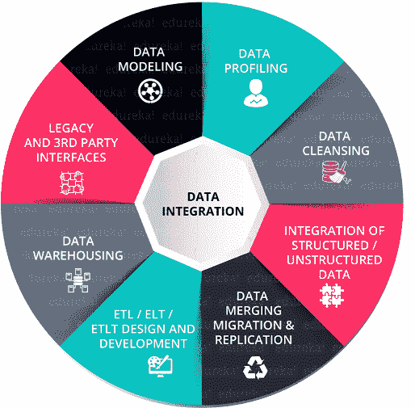
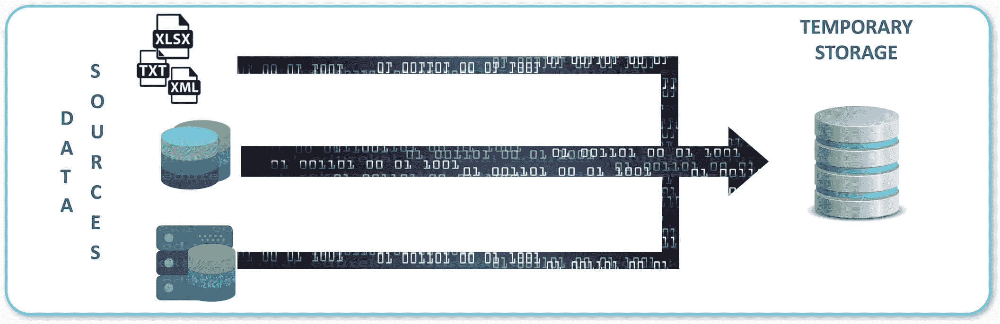
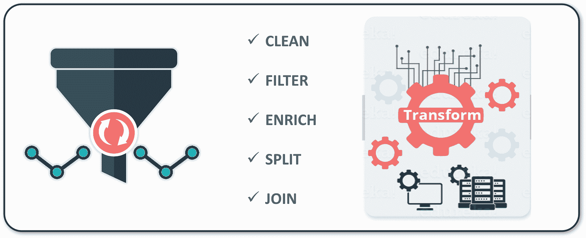
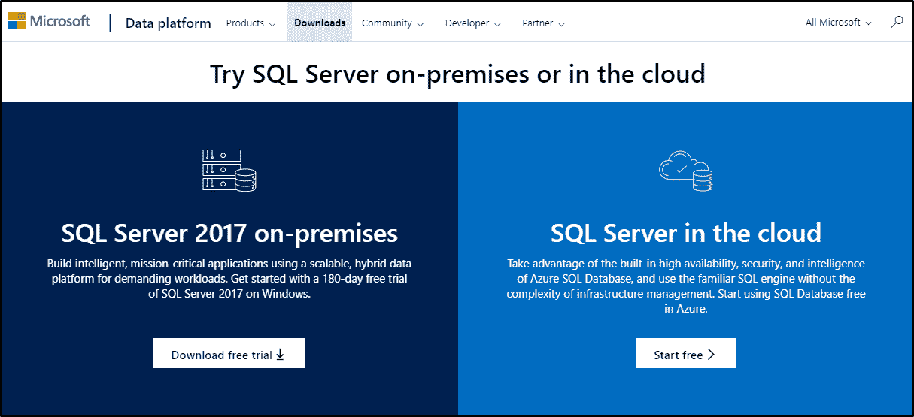
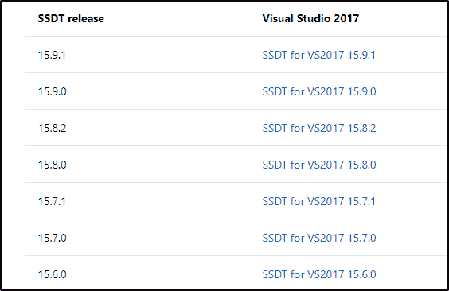
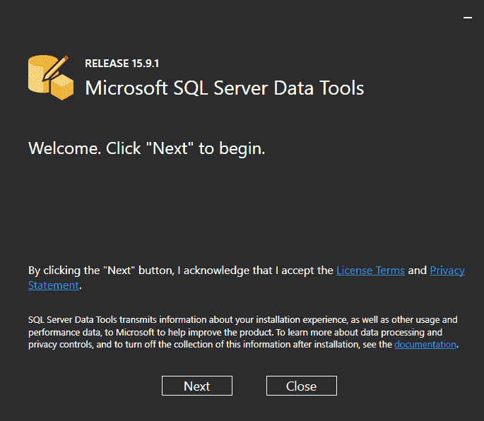
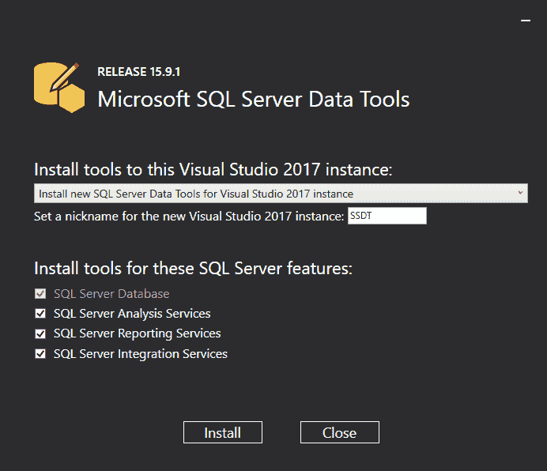
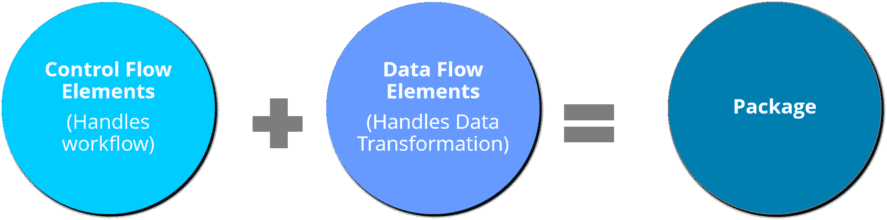

# SSIS 初学者教程:为什么，什么和如何？

> 原文：<https://www.edureka.co/blog/ssis-tutorial/>

SQL Server Integration Services(SSIS)是 Microsoft SQL Server 数据库软件不可或缺的一部分。这使得数据管理工作因其各种特性而变得更加容易。在本教程中，我们将按照以下顺序在概念层面上更深入地研究 SSIS:

*   [什么是数据集成？](#dataintegration)
*   为什么是 SSIS？
*   什么是 SSIS？
*   [SSIS 的特色](#features)
*   SSIS 是如何工作的？
    *   [ETL 流程](#etl)
    *   [数据仓库](#datawarehousing)
*   [对 SQL Server 集成服务的要求](#requirements)
    *   [安装 SQL Server](#sqlserver)
    *   [安装 SQL Server 数据工具](#ssdt)
*   [什么是 SSIS 套餐？](#ssispackage)

让我们开始吧。

## **什么是数据集成？**

数据集成是一个过程，在这个过程中，异构数据被检索并组合成一个合并的形式和结构。例如，如今每家公司都必须处理来自不同来源的大量数据。需要对这些数据进行处理，以便为制定业务决策提供有见地的信息。因此，一个简单的解决方案就是数据集成。它将基本上整合你所有的数据存在于不同的数据库，并结合在同一个平台上。

以下是实现数据集成的几种方法:

现在您已经理解了数据集成，让我们看看为什么使用 SSIS。SSIS 代表 SQL Server 集成服务。

## 为什么是 SSIS？

*   数据可以并行加载到许多不同的目的地
*   SSIS 不再需要核心程序员
*   与微软的其他产品紧密集成
*   SSIS 比大多数其他 ETL 工具便宜
*   SIS 提供 GUI，方便转换数据
*   将 BI 构建到数据转换流程中
*   强大的错误和事件处理

继续这个 SSIS 教程，让我们看看它到底是什么，它是如何工作的。

## 什么是 SSIS？

SQL Server Integration Services(SSIS)是 Microsoft SQL Server 数据库软件的一个组件，可用于执行广泛的数据集成和数据转换任务。

*   数据集成:它将不同来源的数据结合起来，为用户提供这些数据的统一视图
*   **工作流:**它还可以用来自动维护 SQL Server 数据库和更新多维分析数据

## **SSIS 的特色**

使用 SSIS 的一些功能有:

*   组织和查找转换
*   与其他 Microsoft SQL 系列紧密集成
*   提供丰富的工作室环境
*   为更好的转换提供了许多数据集成功能
*   高速数据连接

您可以浏览下面的视频，该视频涵盖了所有基础知识，包括用于数据提取、转换和加载(ETL)的数据仓库概念。这是理想的初学者和专业人士谁想要刷他们的基础 MSBI。

[//www.youtube.com/embed/0ikNnenDyNw?rel=0&showinfo=0](//www.youtube.com/embed/0ikNnenDyNw?rel=0&showinfo=0)

继续 SSIS 教程，让我们看看它到底是如何工作的。

## SSIS 是如何工作的？

SSIS 由三个主要部分组成，即:

*   操作数据
*   ETL 过程
*   数据仓库

这些数据转换和工作流创建的任务是使用“SSIS 包”执行的，这将在本博客的后面讨论。继续学习 SSIS 教程，让我们首先详细了解每个组件:

### **运行数据**

操作数据存储(ODS)是一种数据库，旨在集成来自多个来源的数据，以便对数据进行额外操作。这是当前操作中使用的大部分数据在传输到数据仓库进行长期存储或归档之前存放的地方。

### **ETL 流程**

ETL 是提取、转换和加载数据的过程。提取、转换和加载(ETL)是从各种来源提取数据，转换这些数据以满足您的需求，然后加载到目标数据仓库的过程。ETL 为所有这些问题提供了一站式解决方案。

*   提取
*   改变
*   负荷

**提取:**提取是根据不同的验证点，从各种同质或异质数据源中提取数据的过程。

**转换:**在转换中，对整个数据进行分析，并对其应用各种函数，以便将数据以干净的通用格式加载到目标数据库中。

** ** **加载:**加载是使用最少的资源将处理后的数据加载到目标数据仓库的过程。

### **数据仓库**

*   **数据仓库**从不同来源获取数据，以便进行有用的分析和访问。
*   **数据仓库**是一个积累的大型数据集，用于收集和管理来自各种来源的数据，以回答业务问题。因此，有助于做决定。

## **对 SQL Server 集成服务的要求**

要使用 SSIS，您必须安装以下软件:

*   SQL Server
*   SQL Server 数据工具

让我们来看看安装过程。

### **SQL Server 安装**

进入网址:[https://www . Microsoft . com/en-au/SQL-Server/SQL-Server-downloads](https://www.microsoft.com/en-au/sql-server/sql-server-downloads)安装 SQL Server。您可以根据自己的选择安装最新版本或以前的版本。

因此，SQL Server 有不同的版本，即:

接下来，让我们看看如何安装数据工具。

**SQL Server 数据工具**

去网址:[https://docs . Microsoft . com/en-us/SQL/ssdt/previous-releases-of-SQL-server-data-tools-ssdt-and-ssdt-bi？查看微软提供的不同版本。参考下面的截图和最近的 SSDT 发布以及下载链接。](https://docs.microsoft.com/en-us/sql/ssdt/previous-releases-of-sql-server-data-tools-ssdt-and-ssdt-bi?view=sql-server-ver15)

在本教程中，我将安装 15.9.1 版本。让我们开始吧。

第一步:当你打开。exe 文件，安装前会要求您重新启动系统。

第二步:重启系统后，一切准备就绪。只需点击“下一步”按钮，并按照屏幕上的指示。

第三步:它将显示所需的工具和功能，如 SQL Server 数据库、SSAS、SSRS 和 SSIS。请确保您检查了所有选项，然后单击“安装”按钮。参考下面的截图。

接下来在 SSIS 教程中，我们将讨论 SSIS 包以及如何使用上述工具创建它。

## **什么是 SSIS 套餐？**

包是一个基本块，在这里你可以继续在 SSIS 编码。现在“代码”不是指任何编程语言，而是你所做的开发。所以基本上你的开发是在一个包里面完成的。如上所述，SSIS 对于 ETL 是必不可少的，SSIS 包将完成 ETL 过程。因此，它是一个实现 Integration Services 功能以提取、转换和加载数据的对象。包装由以下部分组成:

*   连接
*   控制流元素
*   数据流元素

这就是这个 SSIS 教程。我希望你喜欢读它。

这篇博客到此结束。我希望你喜欢这个 Power BI 教程博客。这是力量 BI 系列的第一篇博客。这篇 Power BI 教程之后将是我的下一篇博客，重点是 Power BI 仪表板，也请阅读。

如果您希望学习 SSIS，并在数据可视化或 BI 方面建立职业生涯，那么请查看我们的MSBI 培训认证，它附带有讲师指导的现场培训和真实项目经验。本培训将帮助您深入了解 MSBI，并帮助您掌握这门学科。

*有问题吗？请在“SSIS 教程”的评论部分提到它，我们会给你回复。*