# 学习如何制作你的第一个 Python 程序

> 原文：<https://www.edureka.co/blog/python-visual-studio/>

Python 编程语言是一种通用的语言，可以扩展对其他技术的支持。Visual studio code 就是这样一个代码编辑器，它使用 [python](https://www.edureka.co/data-science-python-certification-course) 扩展来扩展对 [python 编程语言](https://www.edureka.co/blog/videos/python-tutorial/)的支持。在这篇文章中，我们将学习如何使用 python 的 visual studio 代码。本课程将涵盖以下主题。

*   [什么是 Visual Studio 代码？](#visual)
*   [Visual Studio 代码安装](#install)
*   [Visual Studio 代码中的 Python 扩展](#extension)
*   [用 Visual Studio 代码编写第一个 Python 程序](#program)
*   [编辑现有项目](#existing)
*   [林挺](#linting)
*   [调试支持](#test)
*   [Jupyter 笔记本支持](#jupyter)
*   [互动 Python](#interactive)
*   [环境](#env)

## **什么是 Visual Studio 代码？**

visual studio 代码是一个轻量级但功能强大的源代码编辑器，可以在您的桌面上运行。它适用于 Windows、macOS 和 [Linux](https://www.edureka.co/blog/linux-tutorial/) 。

它还内置了对 [node.js](https://www.edureka.co/blog/learn-node-js/) 、 [javascript](https://www.edureka.co/blog/javascript-tutorial/) 和 [typescript](https://www.edureka.co/blog/typescript-vs-javascript/) 的支持，以及对其他语言的广泛外部支持，如 [python](https://www.edureka.co/blog/python-tutorial/) 、 [c](https://www.edureka.co/blog/c-programming-tutorial/) 、 [c++](https://www.edureka.co/blog/cpp-tutorial/) 等。

**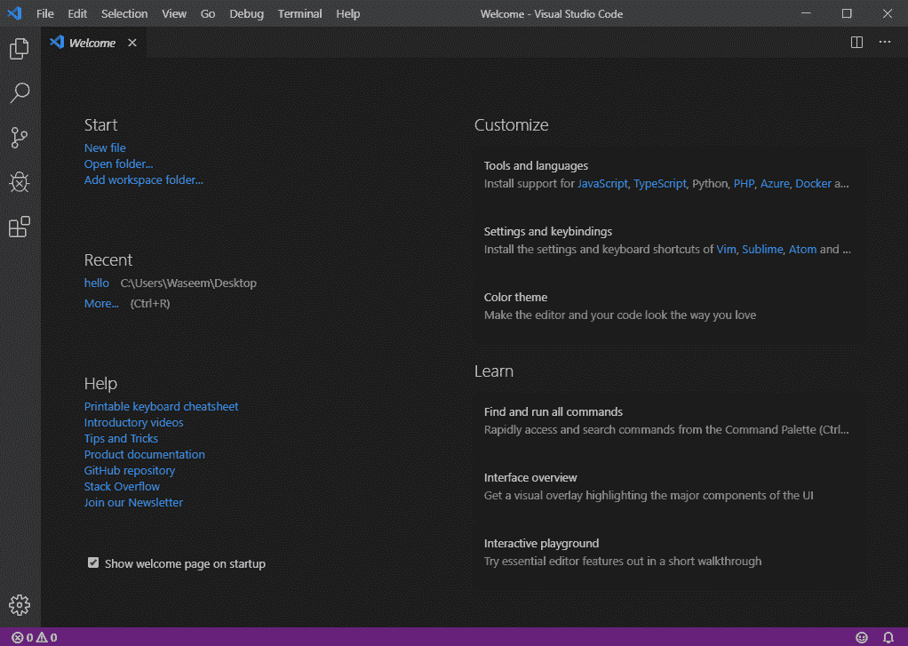**

**扩展**

以下是一些最流行的 visual studio 代码扩展。

**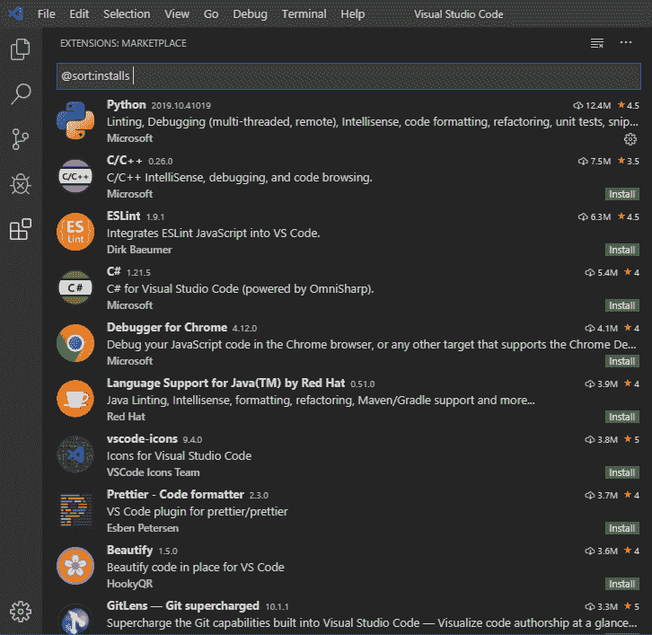**

现在我们对 visual studio 代码有了一个模糊的概念，让我们看看如何在我们的系统中下载和安装 visual studio 代码。

## **Visual Studio 代码安装**

您可以在这里找到与您的系统兼容的相关版本。

**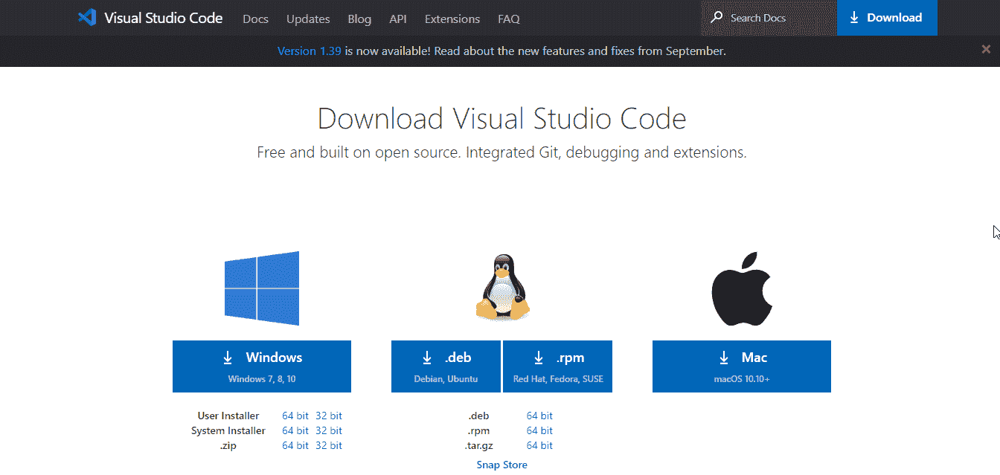**

完成安装后，您可以用 visual studio 代码开始您的 python 之旅。

## **Visual Studio 中的 Python 扩展代码**

要在 visual studio 中使用 python，您需要从市场安装 python 扩展。在市场上很容易找到 python 扩展。

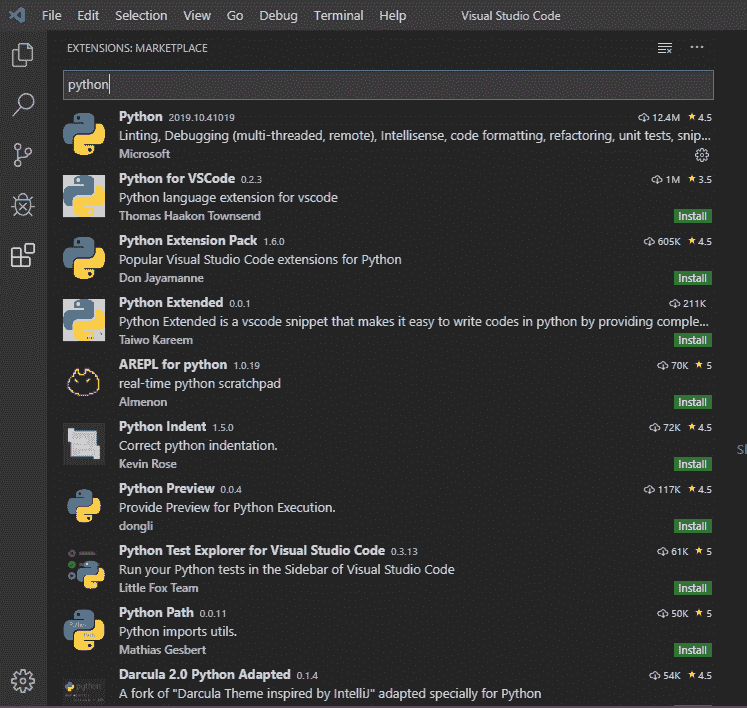

您需要安装的 python 扩展名为 python，由微软发布。让我们来看看 python 扩展的一些特性。

*   智能感知

*   林挺

*   代码格式

*   排除故障

*   测试

*   jupyter 笔记本

*   环境

*   重构

完成安装后，您可以开始使用您的第一个 python 程序。

## **用 Visual Studio 编写第一个程序代码**

要从您的第一个 [python 程序](https://www.edureka.co/blog/how-to-run-a-python-script/)开始，进入命令提示符并键入以下命令。

## **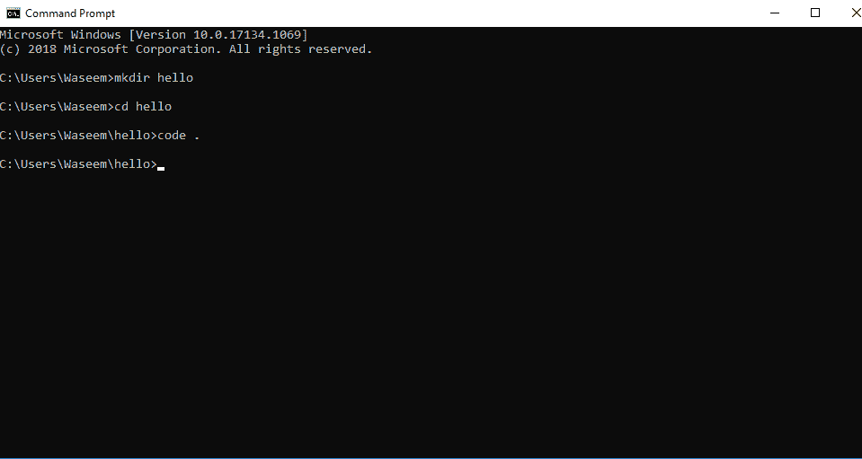**

它将使用 hello 目录打开 vs 代码，然后您可以添加一个扩展名为. py 的新文件来编写您的第一个 python 程序。

## **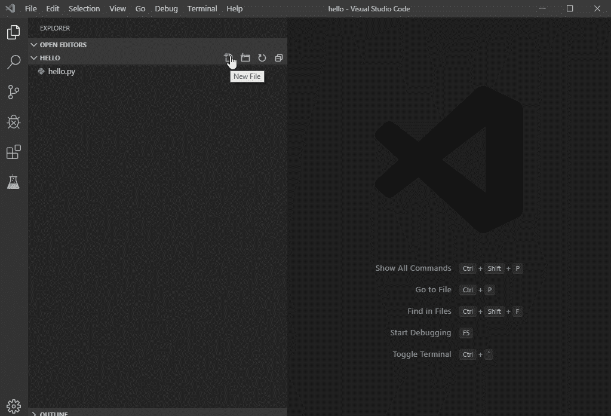**

当你创建了一个新的文件，打开这个文件并创建一个简单的 hello world 程序。

## **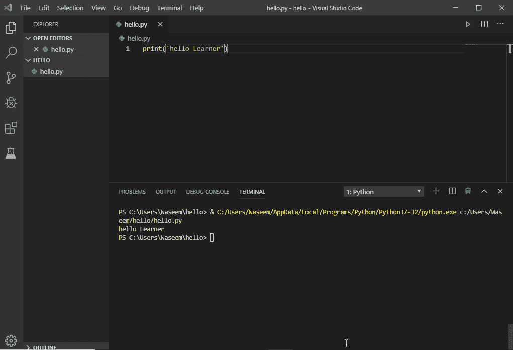**

这就是我们如何使用 python 扩展用 visual studio 代码制作一个简单的 hello world 程序。Python 扩展提供了许多在 **vs 代码**中编辑 python 源代码的特性。

*   **自动完成和智能感知:**

    它们是为存储在标准位置的所有 python 包提供的，您可以右键单击不同的标识符来利用这几个命令。

    *   转到定义

    *   峰值定义

    *   转到声明

    *   Peek 声明

*   **在终端运行选择/线路:**

    它用于将所选行带到 python 终端。

*   格式化: 它通过实现缩进、操作符周围的间距、行间距等规则，使代码更容易阅读。

*   **重构:**

    python 扩展添加了以下重构命令

    *   提取变量–它提取当前范围内所选文本的所有类似出现。

    *   extract Method–它提取当前范围内所选表达式或块的所有相似实例

    *   排序导入–排序导入使用 isort 包将来自同一个模块的特定导入合并到一个导入语句中，并按字母顺序导入语句。

现在让我们看看如何使用 vs 代码编辑现有的项目。

## **E** **编辑现有项目**

您可以在 visual studio 代码中编辑现有项目，只需在命令行中导航到该项目，然后输入以下命令。

## **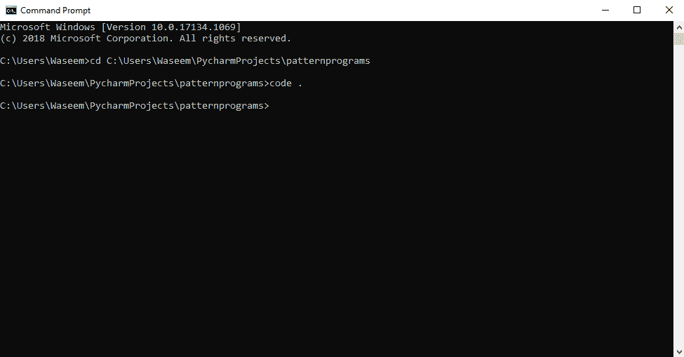**

输入此命令后，vs 代码将打开该位置上的现有项目，您可以运行该项目或在 visual studio 代码中编辑代码。

## **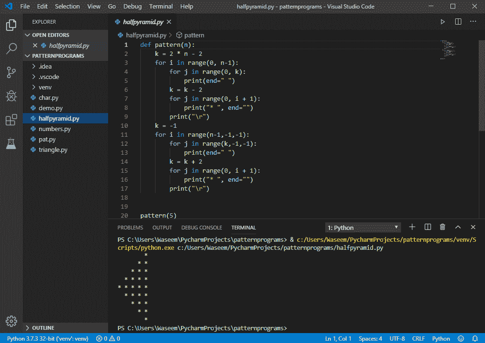**

现在我们知道了如何在 visual studio 代码中编辑现有的项目，让我们了解一下林挺。

## **林挺**

它主要强调了 python 源代码中的语法和样式问题。要启用 linter，我们可以使用下面的方法，尽管 python 扩展默认启用了 pylint linter。按“ctrl+shift+p”并选择 python:在托盘中选择 linter。

## **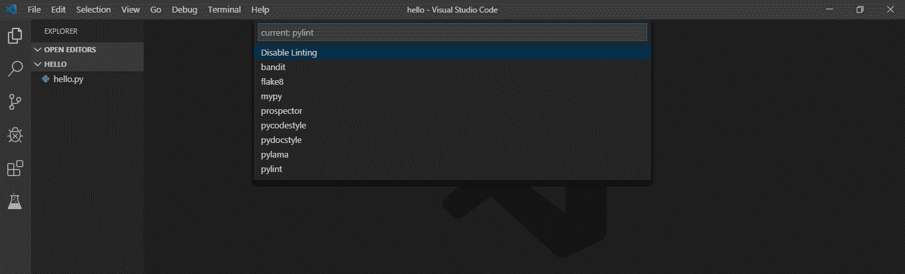**

尽管林挺会在您保存文件时自动运行。您可以通过在命令选项板中选择以下选项来运行林挺。

## **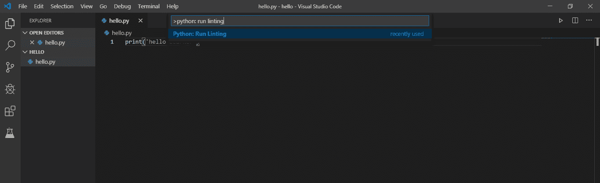**

以下是一些特定的棉绒:

*   Pylint –

*   薄片 8

*   我是麦比

*   pydocstyle

*   探矿者

*   Pep8

*   血浆

*   强盗

## **调试支持**

让我们试着理解在我们简单的 hello world 程序中调试是如何工作的。

只需点击编辑器左侧的装订线并在该行设置一个断点，然后按 f5。

## **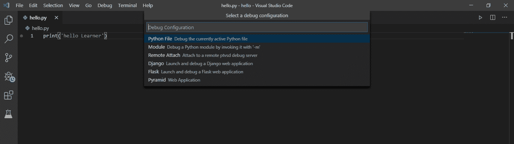**

选择配置，它将打开如下所示的调试工具栏。

## **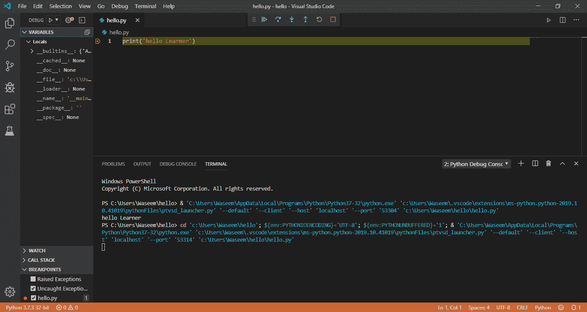**

再次按 f5 键运行程序直到完成，您将在终端中看到输出。这就是我们如何在 visual studio 代码中调试程序，你可以看到许多选项和一个调试工具栏，这样你也可以悬停在代码上。

现在我们已经完成了调试，让我们了解一下 visual studio 代码中对 jupyter 笔记本的支持。

## **Jupyter 笔记本支持**

要在 vs 代码中打开 [jupyter 笔记本](https://www.edureka.co/blog/cheatsheets/jupyter-notebook-cheat-sheet)，打开命令托盘并选择以下选项

## **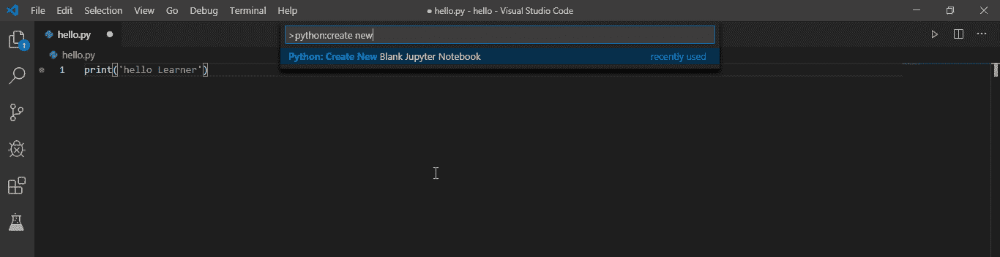**

打开笔记本后，您可以简单地运行代码并保存它。

## **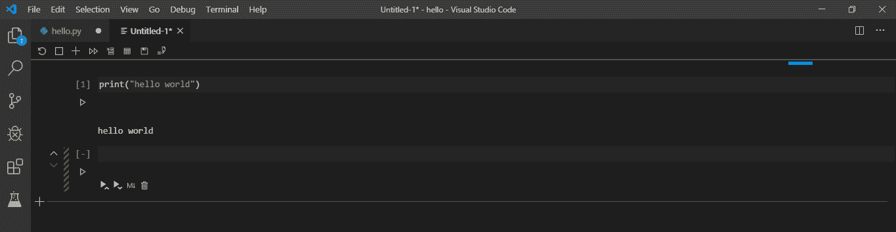**

现在我们知道了如何在 visual studio 代码中使用 jupyter notebook，让我们了解一下如何在 vs 代码中使用交互式 python。

## **互动 Python**

您可以简单地在代码中添加“#%%”，并将其保存在. py 扩展名文件中。单击运行单元按钮时，将打开 python 交互式面板，您可以直接使用 python 交互式窗口运行代码。只需键入您的代码，然后按“ctrl+enter”。

## **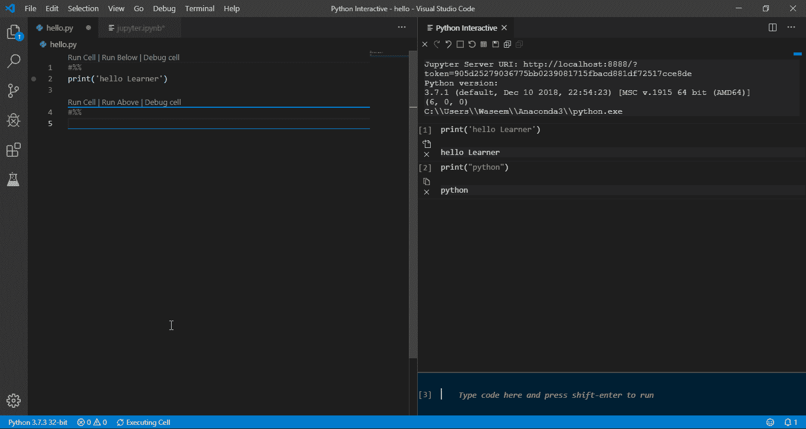**

## **环境**

Python 扩展通常会寻找环境，选择系统路径中的第一个解释器。要选择特定的环境，您可以使用命令托盘搜索环境。

## **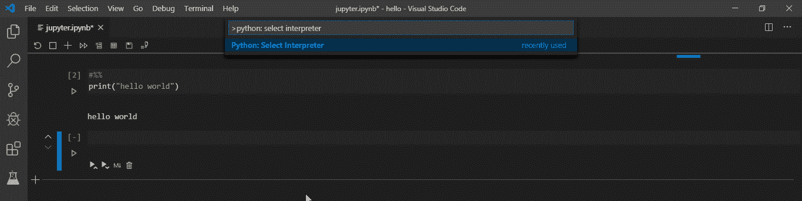**

选择此项后，它会显示可供您选择的解释器。

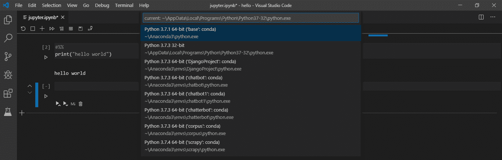

这就把我们带到了本文的结尾，在这里我们学习了如何使用 python 扩展来使用 visual studio 代码。我希望你清楚本教程中与你分享的所有内容。

*如果您发现这篇文章与“Python Visual Studio”相关，请查看一下  [Edureka Python 认证培训、](https://www.edureka.co/data-science-python-certification-course) 一家值得信赖的在线学习公司，拥有遍布全球的 250，000 多名满意的学习者。*

*我们在这里帮助你踏上旅程的每一步，并为想要成为  [Python 开发者](https://www.edureka.co/blog/how-to-become-a-python-developer/)的学生和专业人士设计课程。该课程旨在让您在 Python 编程方面有一个良好的开端，并训练您掌握核心和高级 Python 概念以及各种  [Python 框架](https://www.edureka.co/blog/python-frameworks/) ，如  [Django。](https://www.edureka.co/blog/django-tutorial/)*

如果您遇到任何问题，请在“Python Visual Studio”的评论区提出您的所有问题，我们的团队将很乐意回答。