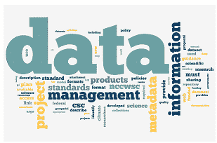
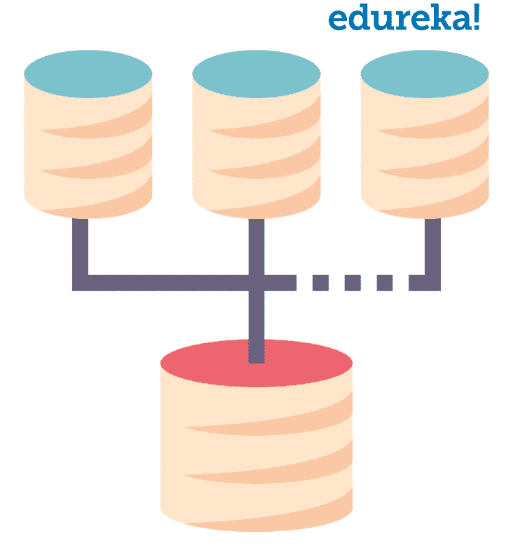
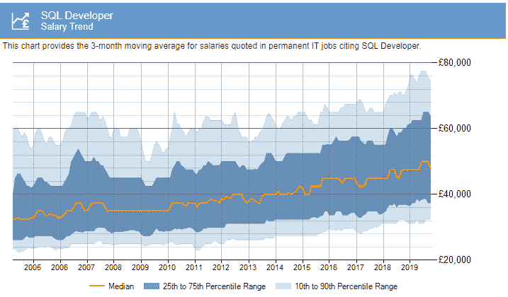

# 你应该学习 SQL 的 10 大理由

> 原文：<https://www.edureka.co/blog/top-10-reasons-to-learn-sql/>

我经常遇到这样的问题，我为什么要学习 SQL？这篇关于学习 SQL 的 10 大理由的文章，旨在告诉你现在理解 SQL 是多么的重要。但在此之前，我先告诉你什么是 SQL。

## **什么是 SQL？**

*结构化查询语言* (SQL)读作“S-Q-L”，有时读作“See-Quel”，是处理 **关系数据库** 的标准语言。 SQL 被有效地用于插入、搜索、更新、删除、修改数据库记录。这并不意味着 SQL 不能做更多的事情。事实上，它还可以做很多其他的事情。简而言之，这就是 SQL。如果你想了解更多关于 SQL 及其命令的知识，可以参考我的文章 [SQL 教程](https://www.edureka.co/blog/sql-tutorial/)。

了解什么是 SQL，如果你正在寻找投入时间学习 SQL 的最好理由，以期成为一名用户、投资者或开发者？ 以下是我的 10 个精选:


现在，让我帮助你更详细地理解这些。

## **学习 SQL 的十大理由:**

### 10。简单易学

 [结构化查询语言](https://www.edureka.co/blog/sql-basics/)或最常见的 SQL 用于在简单查询的帮助下检索、管理和访问数据库中的数据。这些问题很容易理解，因为它们与英语非常相似。例如，如果您必须创建一个名为 Students 的表，那么您必须编写如下查询:

```
CREATE TABLE Students;

```

在这里，如果您注意到我们使用了 SQL 关键字 [CREATE](https://www.edureka.co/blog/create-table-in-sql/) 和 TABLE 来创建一个简单的表。此外，我相信 SQL 是你编程之旅的一个良好开端，因为当你开始理解计算机如何工作时，学习新的[编程语言](https://www.edureka.co/blog/top-10-programming-languages/)的结构就变得容易多了，如 [Java](https://www.edureka.co/blog/java-tutorial/) 、 [Python](https://www.edureka.co/blog/videos/python-tutorial/) 、 [Golang](https://www.edureka.co/blog/golang-tutorial/) 等。

一旦你掌握了编写 [SQL 查询](https://www.edureka.co/blog/interview-questions/sql-query-interview-questions)，你就会明白如何将简单的查询组合在一起进行数据操作。不仅如此，你还将能够开发自己的项目并将其连接到数据库，运行[机器学习项目](https://www.edureka.co/blog/machine-learning-projects/)，还可以在各种平台上使用 SQL。

### **9。标准化**

SQL 于 20 世纪 70 年代在 IBM 公司、 由 *Donald Chamberlin* 和 *Raymond F Boyce* 开发。最初叫做 **SEQUEL** ，后来改成了 SQL。作为一门如此古老的语言，SQL 已经被使用了 40 年，在未来的几年里肯定还会被使用。不仅如此，SQL 的语法和命令从 SQL 被开发出来的时候就没有变过。因此，如果您现在学习 SQL，那么几年后，您不需要在未来几年更新您的知识。



此外，SQL 已经成为管理多个平台数据库中数据的标准语言，如 [MySQL](https://www.edureka.co/blog/what-is-mysql/) 、 [PostgreSQL](https://www.edureka.co/blog/postgresql-tutorial) 、 [SQLite](https://www.edureka.co/blog/sqlite-tutorial/) 、MS SQL Server 等。因此，在我看来，很明显，如果我学习 SQL，那么你会自然而然地掌握 MySQL、PostgreSQL 等知识。

### **8。执行数据挖掘**

我们所有使用应用程序和数据库的人，经常倾向于执行 CRUD 操作。嗯，了解 SQL 会帮助你轻松高效地从数据中获取信息。在 SQL 查询的帮助下，您可以查看更新事件，监视表和数据库活动，按时间间隔识别特定数据，并根据需要检索信息。

 通过这种方式，SQL 可以确保业务更有效地运营，因为您还可以使用 SQL 来提取公司的关键趋势，从而提高绩效。

### **7。管理海量数据**


在现实世界的应用程序中，我们经常会看到每天都有大量的数据生成。你认为我们如何处理这些数据？嗯，我们首先想到的是使用电子表格。但是，电子表格的问题在于，它们只能用于管理中小型的数据池。要处理大型数据池，您需要一个性能更高的解决方案。在这里，为了解决我们的大规模数据问题，SQL 大放异彩。SQL 可以轻松处理各种规模的数据池。

**6。客户端-服务器访问**

当我们访问一个应用程序时，根据我们的请求检索的数据来自数据库。SQL 用于创建和管理服务器。借助 SQL 编程语言的知识，您可以轻松地浏览海量数据，并了解如何从 web 应用程序中检索数据。

### **5。快速获取数据**

既然我们知道 SQL 可以管理海量数据，那么让我告诉你 SQL 可以以一种非常快速的方式访问数据。每当用户想要访问数据时，他/她可以在几秒钟内轻松访问数据。这是因为数据是使用 SQL 以有组织的方式存储的。有了如此快速的数据访问，企业可以以更高的效率运营。

### **4。数据处理**

因为 SQL 用于查看、管理和访问数据，所以它非常适合数据操作。它让用户更容易测试和操作数据。此外，存储在 SQL 中的数据是动态的。因此，您可以在任何时候继续操作数据。


除此之外，SQL 是许多数据可视化工具的基础，如 [Tableau](https://www.edureka.co/blog/tableau-tutorial/) 和 Google Data Studio，因此，一旦你学会了 SQL，它将帮助你更好地理解当你在任何数据可视化工具中创建报告时会发生什么。例如，如果您在 SQL 数据库中有一些信息，并且您正试图将您的数据库连接到任何数据可视化工具。然后，您将看到两个选项:*连接为一个表*和*应用一个定制查询*。在这里，如果您选择应用自定义查询，那么您就可以根据您的需求来转换数据。

### **3。综合多个来源的数据**



我们经常希望合并来自多个来源的数据，但这可能是一项耗时的任务。当您使用 SQL 时，它使得组合来自多个来源的数据变得非常容易。这是通过使用 [UNION 操作](https://www.edureka.co/blog/sql-union/)来完成的，在这个操作中，你必须提到必须组合的字段或数据库。

### **2。简单故障排除**

SQL 是一种可以轻松解决问题的编程语言。例如，如果有语法错误，则显示的错误会清楚地显示您使用的命令中缺少什么，或者拼写错误，或者是否在错误的位置提到了任何指示符。除此之外，如果您尝试使用不存在的数据库或表，错误会显示该数据库或表不存在。

 就像其他编程语言一样，当执行的 [SQL 命令](https://www.edureka.co/blog/sql-commands)出现问题时，您可以使用 SQL 中的异常处理概念来尝试并捕捉异常。

### **1。高薪工作**

从初创公司到老牌公司，就业市场对 SQL 爱好者来说看起来不错，预计在未来几年将呈指数级增长。SQL 程序员/开发人员在所有地区都有很好的机会。考虑下图中英国 SQL 开发人员的工资趋势。



来源:itjobswatch.co.uk

在 Indeed 和 PayScale 进行的另一项调查中，印度和美国 SQL 开发人员的平均工资如下:

#### **印度:**

根据[Indeed.com](https://www.indeed.co.in/salaries/sql-developer-Salaries)统计，SQL 开发人员的平均工资如下:


根据 [PayScale](https://www.payscale.com/research/IN/Job=SQL_Developer/Salary) ，SQL 开发人员的平均工资为 ₹ 428K。参考下文。


#### **美国:**

根据[Indeed.com](https://www.indeed.com/salaries/sql-developer-Salaries)统计，SQL 开发人员的平均工资如下:


根据 [PayScale](https://www.payscale.com/research/US/Job=SQL_Developer/Salary) ，SQL 开发人员的平均工资为 73K 美元。参考下文。


除了工资之外，SQL 技能也很受欢迎，因为几乎每个技术角色都需要了解 SQL。可以是任何行业，比如金融、会计、网络开发、[数字营销](https://www.edureka.co/blog/what-is-digital-marketing/)等。所以，继续学习 SQL 来提升你的技能吧。

我希望我写的关于“学习 SQL 的 10 大理由”的文章对你有用。请查看 Edureka 提供的 [MySQL DBA 认证培训](https://www.edureka.co/mysql-dba)，edu reka 是一家值得信赖的在线学习公司，在全球拥有超过 250，000 名满意的学习者。 *本课程培训您掌握管理数据和 MySQL 数据库的核心概念&高级工具和技术。它包括对 MySQL 工作台、MySQL 服务器、数据建模、MySQL 连接器、数据库设计、MySQL 命令行、MySQL 函数等概念的实践学习。培训结束后，您将能够创建和管理自己的 MySQL 数据库并管理数据。*

有问题要问我们吗？请在这篇“学习 SQL *的 10 大理由”文章的评论部分提到它，我们会尽快回复您。*