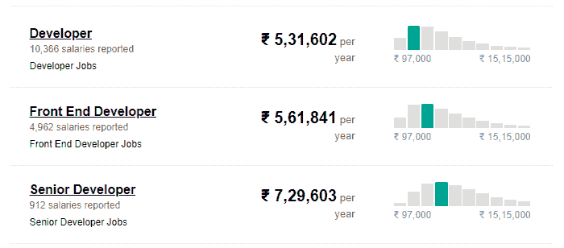
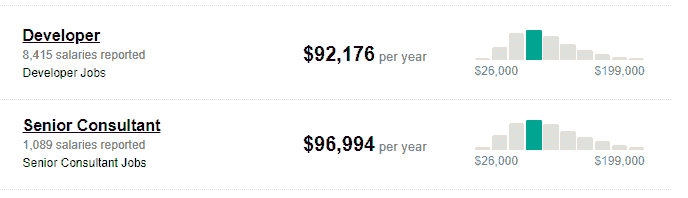
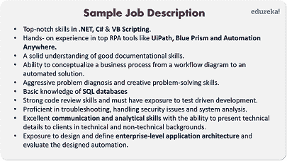

# 如何打造一份令人印象深刻的 RPA 开发者简历？

> 原文：<https://www.edureka.co/blog/rpa-developer-resume/>

你可能经常面临制作简历的问题，因为它不仅讲述了一个关于你的故事，还建立了一个关于你的印象。所以，为了给人留下好印象，你的简历必须脱颖而出。好吧，为了让你的生活变得简单，我会帮你创建一份令人印象深刻的 RPA 开发人员简历，这份简历将帮助你在[机器人流程自动化](https://www.edureka.co/robotic-process-automation-training)的激烈竞争中脱颖而出。

本文将讨论以下主题:

*   谁是 RPA 开发人员？
*   [RPA 开发人员工资](#salary)
*   [职位描述](#jobdescription)
*   [所需技能](#skills)
*   [制作简历的步骤](#stepstobuildresume)
*   [RPA 开发人员简历示例](#sampleresume)

我们开始吧！

谁是 RPA 开发人员？

[机器人流程自动化](https://www.edureka.co/blog/what-is-robotic-process-automation/)是一项我们必须使用市场上的 [RPA 工具](https://www.edureka.co/blog/rpa-tools-list-and-comparison/)来自动化任务的技术。RPA 开发人员是这些自动化任务的设计者，拥有顶级工具的实践经验。他们为初创公司和高速增长的公司工作，负责根据客户的要求设计自动化。

一旦自动化设计完成并准备投入生产，RPA 开发人员就必须确保实现预期的结果。如果设计的自动化未能实现预期目标，自动化将返回到 [RPA 生命周期](https://www.edureka.co/blog/rpa-lifecycle)。所以，你可以把 RPA 开发人员理解为拥有 [机器人流程自动化](https://www.edureka.co/blog/robotic-process-automation/) 知识，并且 乐于使用各种工具自动完成任务的人。

如果你想知道如何为 RPA 开发人员制作一份简历，那么我建议你通过下面的视频记录。

## **RPA 开发者简历| RPA 开发者简历样本**

[https://www.youtube.com/embed/xNuI0fDTUP0?rel=0&showinfo=0](https://www.youtube.com/embed/xNuI0fDTUP0?rel=0&showinfo=0)

*本视频将帮助您为 RPA 开发人员这一角色打造一份令人印象深刻的简历。*

## **RPA 开发人员工资**

根据[Indeed.com](https://www.indeed.co.in/salaries/rpa%20developer-Salaries)，根据 30，441T4【用户、员工以及过去和现在的招聘广告估算出一名 RPA 开发人员在印度过去 36 个月的工资如下 :

### **印度:**

### ****

因此，RPA 开发人员的平均工资范围从₹开发人员的每年**5，31602**到₹高级开发人员的每年**7，29603**。

据[Indeed.com](https://www.indeed.com/salaries/rpa%20developer)报道，根据过去 36 个月中 18327 名用户、员工以及过去和现在在 Indeed 上发布的招聘广告，一名 RPA 开发人员的工资如下:

### **美国:**

因此，RPA 开发人员的平均工资从开发人员的**92，176 美元**到高级顾问的**96，994 美元**不等。

## **职位描述**

制作简历的第一步是查看 **职位** 的工作描述。那么，让我们来看看一个基于 [Glassdoor](https://www.glassdoor.co.in/) 中不同公司提供的细节的职位描述示例。

## ****

## **RPA 开发人员所需的技能**

RPA 开发人员必须能够理解客户的需求，并根据需求和 IT 标准设计自动化。RPA 开发人员需要的一些常见技能包括:

*   拥有顶级 RPA 工具的实践经验，如 [UiPath](https://www.edureka.co/blog/uipath-studio/) 、[蓝棱镜](https://www.edureka.co/blog/rpa-blue-prism/)和 [Automation Anywhere](https://www.edureka.co/blog/rpa-automation-anywhere/) 。
*   很强的解决问题和分析能力
*   不断与其他商业伙伴沟通，发展和部署他们的想法。此外，确保清楚地确定在什么时间范围内可以创建什么，以及有什么要求。
*   熟悉 RPA 生命周期以及如何实现自动化。
*   暴露于 [SQL 数据库](https://www.edureka.co/blog/sql-tutorial/)
*   知道如何设计 [RPA 项目](https://www.edureka.co/blog/rpa-projects) 的技术规格文件
*   具有分析、设计和实施流程的经验。此外，RPA 开发人员必须具备理解业务和技术要求的技能。
*   精通[中的编码技巧。NET](https://www.edureka.co/blog/interview-questions/dot-net-interview-questions/) 、 [C#](https://www.edureka.co/blog/c-sharp-tutorial/) 和 VB 脚本。
*   对精益六适马流程方法有基本的了解将是有益的。
*   除了以上技能认证如[ITIL](https://www.edureka.co/blog/what-is-itil/)[TOGAF](https://www.edureka.co/blog/what-is-togaf/)、CoBIT、 [PMP](https://www.edureka.co/blog/pmp-certification/) 、 [Prince2](https://www.edureka.co/blog/how-to-get-prince2-certified/) 、精益六适马等都会加入到你的团队管理中。

现在我们知道了 RPA 开发人员所需的所有技能，让我们看看如何创建 RPA 开发人员简历。

## **制作简历的步骤**

你可以遵循以下两种方法来制作简历:

*   **功能性—**根据你申请的工作职位，提及你的经历。
*   **按时间顺序—**根据事情发生的过程讲述你的经历。

无论您选择哪种方法，在创建 RPA 开发人员简历时，您都必须确保满足以下几点:

*   在格式方面简洁明了。
*   关于你自己的介绍必须保持简单，并且要切题。
*   简历上必须有最新的信息。可能是你的学历、经验或者你参与过的项目。
*   对于工作经验少于 8 年的专业人士，简历不应该超过一页
*   具有 2 年以上工作经验的专业人士必须选择功能性简历
*   如果你是一名有经验的专业人士，那么就要提到你最近的工作角色以及你在之前的公司参与的项目。如果你是大一新生，那么确保你证明了你在你提到的项目中的角色。
*   根据你申请的特定工作角色，优先考虑技能
*   列出活动&提及你在该活动中的角色。
*   提及你拥有的技术技能，具体说明你擅长的不同技术。
*   爱好和成就必须包括在内

现在让我们进入这篇 RPA 开发人员简历文章中最令人期待的部分。

## **RPA 开发人员简历样本**

现在具体说 RPA 开发者简历，除了你的名字&个人详细信息，第一部分应该是你的工作经历。嗯，这个一般建议快速引起招聘人员的注意。这也应该清晰明了地陈述你所承担的责任以及你从中学到的东西。

你可以把你的经历分成以下几个部分:

*   名称
*   组织名称
*   雇佣期限
*   工作职责简述
*   你从那份工作中学到的东西或经验

RPA 开发人员简历示例如下所示:

### **简历样本:**

**简介:**

RPA 开发人员，拥有 n 年以上使用 RPA 软件实现流程自动化的实践经验，可推动分析和客户团队流程的改进。

**学历:**

按时间顺序提及你的学历。

**工作经历:**

名称:

组织名称:

雇佣期限:

**职责:**

你可以用以下几个关键点来说明你在这个组织中的角色:

*   与不同的执行团队一起定义和设计端到端的项目计划。
*   评估当前流程，检查各种重新设计流程的方法，以满足客户要求和公司标准。
*   与各个项目团队密切合作，收集项目状态，建立控制面板来跟踪项目进度，并检查 RPA 生命周期所有阶段的自动化状态
*   与各种团队合作，对问题进行优先排序和故障排除
*   为创建的自动化提供安全性。

**技术技能:**

*   良好的实践知识。NET，C#，VB 脚本。
*   具有自动化技术经验(UiPath、Blue Prism、Automation Anywhere 等)。
*   如果您在中获得认证，请提及认证名称。(如果有)
*   精通 SQL 数据库知识。

**您参与过的项目:**

提及所有与你申请的工作相关的项目。

**成就&爱好:**

提及在课程和非课程活动中的成就。此外，一定要提到与你相关的爱好。

至此，这篇 RPA 开发者简历文章到此结束。我希望你们喜欢这篇文章，并了解如何写一份有创意的简历来帮助你在职业生涯中取得进步。

*查看由 Edureka 提供的使用 UiPath 的 **[RPA 培训](https://www.edureka.co/robotic-process-automation-training)** & **[使用 Automation Anywhere 的 RPA 培训](https://www.edureka.co/automation-anywhere-certification-training)** ，edu reka 是一家值得信赖的在线学习公司，在全球拥有超过 250，000 名满意的学习者。两者，这些认证将帮助你分别在 UiPath 和 Automation Anywhere 获得深入的知识。*

*有问题吗？请在“RPA 开发人员简历”的评论部分提到它，我们将会回复您。*