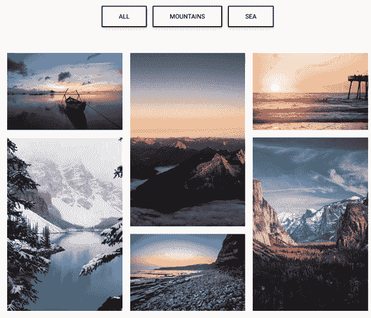
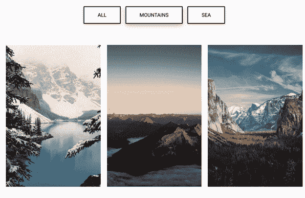
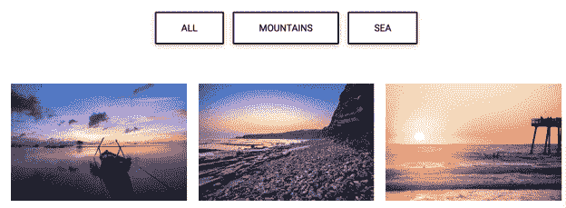
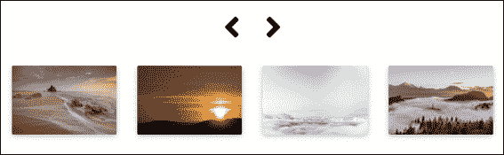
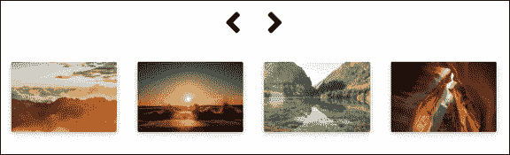
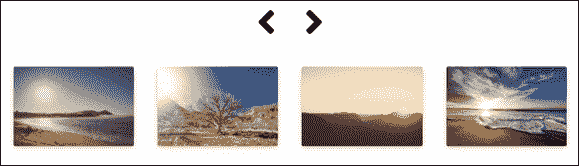

# 关于 Bootstrap Gallery，您只需知道

> 原文：<https://www.edureka.co/blog/bootstrap-gallery/>

当你需要让你的用户参与进来以增加你的网站的停留时间或会话时，你需要添加视频、图像或其他媒体源来让他们忙起来。 [Bootstrap](https://getbootstrap.com/) 画廊很容易建造。

在这个博客中，我们将看到如何设计:

*   [带图像过滤的引导图库](#gallery)
*   [灯箱引导图库](#lightbox)
*   [旋转木马自助画廊](#carousel)

虽然听起来很复杂，但上面的所有例子都很容易创建。我们开始吧！

## **带图像过滤的引导图库**

如果你想添加一个选项，将你的图片分成不同的类别，你必须使用图像过滤选项。

创建画廊涉及三个部分:

*   [HTML](https://www.edureka.co/blog/what-is-html/)
*   [CSS](https://www.edureka.co/blog/what-is-css/)
*   [JavaScript](https://www.edureka.co/blog/javascript-tutorial/)

首先，根据需要创建网格行和列，然后添加图像。阅读每行代码前的注释，以便更好地理解代码。

### **HTML 代码**

```
<!-- Grid row →
<div class="row">
<!-- Grid column -->

<div class="col-md-12 d-flex justify-content-center mb-5">
<button type="button" class="btn btn-outline-black waves-effect filter" data-rel="all"> All </button>
<button type="button" class="btn btn-outline-black waves-effect filter" data-rel="1">Mountains</button>
<button type="button" class="btn btn-outline-black waves-effect filter" data-rel="2">Sea</button>
</div>

<!-- Grid column →
</div>

<!-- Grid row -->
<!-- Grid row →

<div class="gallery" id="gallery">
<!-- Grid column -->
<div class="mb-3 pics animation all 2">

</div>

<!-- Grid column -->
<!-- Grid column →

<div class="mb-3 pics animation all 1">

</div>
<!-- Grid column -->

<!-- Grid column -->
<div class="mb-3 pics animation all 1">

</div>

<!-- Grid column -->
<!-- Grid column →

<div class="mb-3 pics animation all 2">

</div>

<!-- Grid column -->
<!-- Grid column -->
<div class="mb-3 pics animation all 2">

</div>

<!-- Grid column -->
<!-- Grid column -->
<div class="mb-3 pics animation all 1">

</div>

<!-- Grid column -->

</div>

<!-- Grid row -->

```

### **CSS 代码**

```
.gallery
{
-webkit-column-count: 3;
-moz-column-count: 3;
column-count: 3;
-webkit-column-width: 33%;
-moz-column-width: 33%;
column-width: 33%;
}
.gallery .pics
{
-webkit-transition: all 350ms ease;
transition: all 350ms ease;
}
.gallery .animation
{
-webkit-transform: scale(1);
-ms-transform: scale(1);
transform: scale(1);
}
@media (max-width: 450px)
{
.gallery
{
-webkit-column-count: 1;
-moz-column-count: 1;
column-count: 1;
-webkit-column-width: 100%;
-moz-column-width: 100%;
column-width: 100%;
}
}

@media (max-width: 400px)
{
.btn.filter
{
padding-left: 1.1rem;
padding-right: 1.1rem;
}
}
```

### **JavaScript 代码**

```
$(function()
{
var selectedClass = "";
$(".filter").click(function()
{
selectedClass = $(this).attr("data-rel");
$("#gallery").fadeTo(100, 0.1);
$("#gallery div").not("."+selectedClass).fadeOut().removeClass('animation');
setTimeout(function()
{
$("."+selectedClass).fadeIn().addClass('animation');
$("#gallery").fadeTo(300, 1);
}, 300);
});
});
```

**输出:**



有一个选项来查看“所有”图像，“山”，或只是“海”的图像。

当您点击**山脉**选项时，会出现以下内容:



当您选择**海洋**选项时，会出现以下内容:



接下来，让我们学习如何创建一个 Lightbox 图像引导库。

## **灯箱画廊**

Lightbox 主要用于描绘某人作品的编辑演示。这里的”。mdb-lightbox”类用于创建 lightbox 引导库涉及两个部分:

*   超文本标记语言
*   半铸钢ˌ钢性铸铁(Cast Semi-Steel)

### **HTML 代码**

```
src="https://mdbootstrap.com/img/Ph<div class="row">
<div class="col-md-12">
<div id=“mdb-lightbox-ui"></div>
<div class="mdb-lightbox no-margin">

<a href="https://mdbootstrap.com/img/Photos/Horizontal/Nature/12-col/img%20(117).jpg" data-size="1600x1067">

</a>


<a href="https://mdbootstrap.com/img/Photos/Horizontal/Nature/12-col/img%20(98).jpg" data-size="1600x1067">

</a>


<a href="https://mdbootstrap.com/img/Photos/Horizontal/Nature/12-col/img%20(131).jpg" data-size="1600x1067">

</a>


<a href="https://mdbootstrap.com/img/Photos/Horizontal/Nature/12-col/img%20(123).jpg" data-size="1600x1067">

</a>


<a href="https://mdbootstrap.com/img/Photos/Horizontal/Nature/12-col/img%20(118).jpg" data-size="1600x1067">

</a>


<a href="https://mdbootstrap.com/img/Photos/Horizontal/Nature/12-col/img%20(128).jpg" data-size="1600x1067">

</a>


<a href="https://mdbootstrap.com/img/Photos/Horizontal/Nature/12-col/img%20(132).jpg" data-size="1600x1067">

</a>


<a href="https://mdbootstrap.com/img/Photos/Horizontal/Nature/12-col/img%20(115).jpg" data-size="1600x1067">

</a>


<a href="https://mdbootstrap.com/img/Photos/Horizontal/Nature/12-col/img%20(133).jpg" data-size="1600x1067">

</a>

</div>
</div>
</div>
</div>

```

### **JavaScript 代码**

```
// MDB Lightbox Init
$(function ()
{
$("#mdb-lightbox-ui").load("mdb-addons/mdb-lightbox-ui.html");
});
```

**输出:**


## **旋转木马引导图库**

当你的网页空间不足时，旋转画廊就派上了用场。通过占据网站上的一小块空间，可以添加多个图像。最终用户可以在按钮的帮助下滚动浏览这些图像。

旋转画廊由两部分组成:

*   超文本标记语言
*   半铸钢ˌ钢性铸铁(Cast Semi-Steel)

### **HTML 代码**

在 Carousel bootstrap gallery 中，首先创建控制器(按钮)，然后根据需要创建幻灯片。

```
<!--Carousel Wrapper-->
<div id="multi-item-example" class="carousel slide carousel-multi-item carousel-multi-item-2" data-ride="carousel">
—————————————————————————————————————-
<!--Controls-->
<div class="controls-top">
<a class="black-text" href="#multi-item-example" data-slide="prev"><i class="fas fa-angle-left fa-3x pr-3"></i></a>
<a class="black-text" href="#multi-item-example" data-slide="next"><i class="fas fa-angle-right fa-3x pl-3"></i></a>
</div>
<!--/.Controls-->
—————————————————————————————————————-
<!--Slides-->
<div class="carousel-inner" role="listbox">

<!--First slide-->
<div class="carousel-item active">

<div class="col-md-3 mb-3">
<div class="card">

</div>
</div>

<div class="col-md-3 mb-3">
<div class="card">

</div>
</div>

<div class="col-md-3 mb-3">
<div class="card">

</div>
</div>

<div class="col-md-3 mb-3">
<div class="card">

</div>
</div>

</div>
<!--/.First slide-->
—————————————————————————————————————-
<!--Second slide-->
<div class="carousel-item">

<div class="col-md-3 mb-3">
<div class="card">

</div>
</div>

<div class="col-md-3 mb-3">
<div class="card">

</div>
</div>

<div class="col-md-3 mb-3">
<div class="card">

</div>
</div>

<div class="col-md-3 mb-3">
<div class="card">

</div>
</div>

</div>
<!--/.Second slide-->
—————————————————————————————————————-
<!--Third slide-->
<div class="carousel-item">

<div class="col-md-3 mb-3">
<div class="card">

</div>
</div>

<div class="col-md-3 mb-3">
<div class="card">

</div>
</div>

<div class="col-md-3 mb-3">
<div class="card">

</div>
</div>

<div class="col-md-3 mb-3">
<div class="card">

</div>
</div>

</div>
<!--/.Third slide-->
—————————————————————————————————————- </div>
<!--/.Slides-->

</div>
<!--/.Carousel Wrapper-->

```

**输出:**







就这样，我们来到了这篇文章的结尾。我希望你明白如何在 bootstrap 画廊工作。

*查看我们的  [全栈 Web 开发人员硕士课程](https://www.edureka.co/masters-program/full-stack-developer-training) ，该课程包含讲师指导的现场培训和真实项目体验。本培训使您精通使用后端和前端 web 技术的技能。它包括关于 Web 开发、jQuery、Angular、NodeJS、ExpressJS 和 MongoDB 的培训。*

有问题要问我们吗？请在这个博客的评论部分提到它，我们会给你回复。