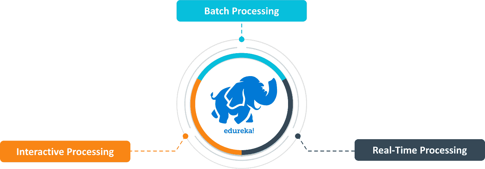
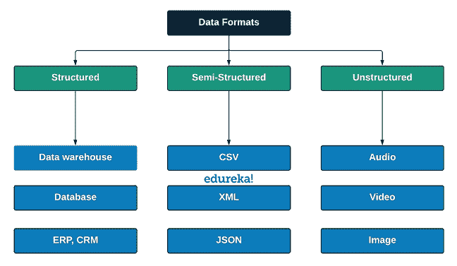
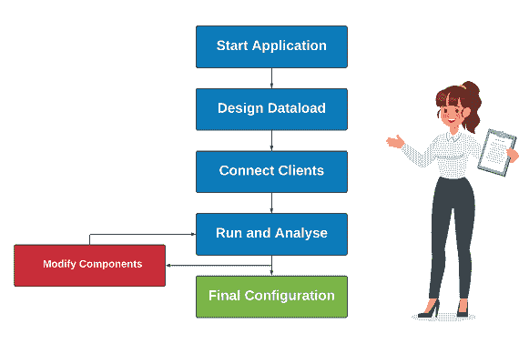

# 大数据测试:你需要遵循的完美指南

> 原文：<https://www.edureka.co/blog/big-data-testing/>

海量数据的创建、存储、检索和分析的永无止境激增，触发了大数据测试起源背后的动机。测试如此庞大的数据需要精密的工具、卓越的框架和卓越的策略。

通过 [Hadoop 课程](https://www.edureka.co/big-data-hadoop-training-certification)提高您对大数据概念的理解并提升您的工作机会。

在本文中，我们将学习大数据测试背后的技术、工具和术语。

*   [测试大数据的需求](#need)
*   [到底什么是大数据测试](#what)
*   [测试大数据背后的策略](#strategy)
*   [大数据表单](#forms)
*   [大数据测试环境](#environment)
*   [大数据测试](#types)
*   [大数据测试工具](#tools)
*   [测试大数据面临的挑战](#challenge)
*   [传统测试和大数据测试](#compare)

## **测试大数据的需求**

大多数用户可能会以一个问题结束，即“*我们到底为什么需要大数据测试？*“您可能已经正确地编写了查询，并且您的架构可能很好。然而，可能有许多失败的可能性。

让我们假设一个发生在银行的严重破产的经典案例。银行数据库的设计者将*客户银行位置 pin 码*列命名为 **CL** ，*客户 ID* 列命名为 **CI** ，*客户电话号码*列命名为 **CP** 。

银行希望将*客户 ID * **CI** 和*客户电话号码* **CP** 做成键值对。在这个场景中，由于输入错误，MapReduce 算法在字母 **P** 和 **L** 之间陷入混乱。

然后，在键-值对 **CL** ( *客户银行定位 Pin* )中替换 **CP** ( *客户电话号码*)。现在，客户将无法获得 OTP、电话、银行设施。

想象一下这种实时的情况。为了避免这样的错误，我们更喜欢测试大数据。从[数据工程师认证](https://www.edureka.co/microsoft-azure-data-engineering-certification-course)中了解更多大数据概念。

## **到底什么是大数据测试**

大数据测试可以定义为涉及检查和验证大数据应用程序功能的程序。大数据是传统存储系统无法处理的海量数据的集合。

测试如此大量的数据需要一些特殊的工具、技术和术语，这些将在本文后面的章节中讨论。

## **测试大数据背后的策略**

测试一个处理万亿字节数据的应用程序需要全新层次的技能和跳出框框的思维。质量保证团队关注的核心和重要测试基于三个场景。即，

*   批量数据处理测试
*   实时数据处理测试
*   交互式数据处理测试

**批量数据处理测试**

**批处理数据处理**测试包括当应用程序处于批处理模式时运行数据的测试程序，其中应用程序使用 **HDFS 等批处理存储单元进行处理。**批量过程测试主要包括

*   针对错误输入运行应用程序
*   改变数据量

**实时数据处理测试**

**实时数据处理**测试在应用程序处于实时数据处理模式时处理数据。该应用程序使用实时处理工具运行，如 **Spark。**

实时测试包括在实时环境中测试应用程序，并检查其稳定性。

**交互数据处理测试**

**交互式数据处理**测试集成了现实生活中的测试协议，这些协议以现实生活中用户的视角与应用程序进行交互。交互式数据处理模式使用交互式处理工具，如 **HiveSQL。从孟买 的 [Azure 数据工程培训中了解更多大数据概念。](https://www.edureka.co/microsoft-azure-data-engineering-certification-course-mumbai)**

## **大数据表单**

大数据因其在处理传统数据处理单元无法处理的多种数据格式方面的优势而闻名。大数据可以处理的数据格式如下。

*   结构数据
*   半结构化数据
*   非结构化数据

**结构化数据**

任何有意义地组织成行和列并易于访问的表格数据被称为结构化数据。它可以组织在不同存储单元(如 RDBMS)中的命名列下。

**示例:**表格数据

**半结构化数据**

半结构化数据完美地介于结构化数据和非结构化数据之间。它不能被直接接收到 RDBMS 中，因为它包含元数据、标记，有时还包含重复值。在准备接收数据之前，需要对数据应用一些操作。

**举例:**。CSV，。JSON

**非结构化数据**

不符合任何一种结构数据被称为非结构化数据。与结构化数据不同，非结构化数据很难存储和检索。组织生成的大部分数据是非结构化类型的数据。

**例如:**图片、视频、音频

## **大数据测试环境**

拥有测试大数据应用的完美环境至关重要。补充数据测试的基本要求如下。

*   应该有存储、处理和验证万亿字节数据的空间。
*   集群及其各自的节点应该有响应
*   强大的 CPU 等数据处理资源应该可用

从孟买的 [Hadoop 培训中进一步了解大数据技术和应用。](https://www.edureka.co/big-data-hadoop-training-certification-mumbai)

## **大数据测试**

测试大数据应用的一般方法包括以下几个阶段。

1.  数据摄取
2.  数据处理
3.  输出的验证

**数据摄取**

首先使用提取工具将数据从源加载到大数据系统。存储可能是 HDFS，MongoDB 或任何类似的存储。然后，交叉检查加载的数据是否有错误和缺失值。

**示例:** Talend

**数据处理**

在这个阶段，生成数据的键值对。稍后，MapReduce 逻辑将应用于所有节点，并检查算法是否工作正常。数据验证过程在这里发生，以确保输出按预期生成。

**确认输出**

在这个阶段，生成的输出已经准备好迁移到数据仓库。在这里，检查转换逻辑，验证数据完整性，并验证该位置的键值对的准确性。

可以测试大数据应用程序的类别有很多。下面列出了几个主要类别。

*   [单元测试](#unit)
*   [功能测试](#function)
*   [非功能性测试](#non)
*   [性能测试](#perform)
*   [建筑](#arch)

**单元测试**

大数据中的单元测试类似于简单应用中的任何其他单元测试。完整的大数据应用程序被分为多个部分，每个部分都经过严格的测试，具有多种预期结果的可能性。如果该部分失败了，那么它将被送回开发和改进部门。

**功能测试**

功能测试也可以称为测试大数据应用程序的不同阶段。大数据应用程序旨在处理巨大的数据块。如此庞大的数据量和种类往往容易带来数据问题，比如坏数据、重复值、元数据、缺失值等等。

这正是测试大数据的先驱们设计大数据功能测试程序的原因。大数据测试的不同阶段如下。

*   数据验证阶段
*   数据完整性阶段
*   数据摄取阶段
*   数据处理阶段
*   数据存储阶段
*   报告生成阶段

现在，让我们详细讨论其中的每一个阶段。

**数据验证阶段**

*   数据验证阶段处理大数据应用程序中的业务逻辑和层
*   数据是从数据源收集的，并根据业务用例运行
*   通过应用程序的各个层检查收集的数据的准确性和移动性
*   在此阶段，大数据通过聚合和过滤机制进行测试
*   基于业务规则，数据经历端到端的验证和转换逻辑

**数据完整性阶段**

*   使用参照完整性验证来检查数据的完整性
*   针对错误条件验证数据约束和复制
*   边界测试识别每一层的模式限制

**数据摄取阶段**

*   检查应用程序与不同数据模块连接的能力
*   使用消息传递系统重放数据，并监控任何数据丢失
*   这一阶段的主要目标是实现以下品质
    1.  容错
    2.  连续数据可用性
    3.  与各种数据流的稳定连接

**数据处理阶段**

*   数据处理阶段仔细检查并执行业务逻辑
*   业务规则是交叉验证的
*   Map-Reduce 逻辑在每个阶段都经过验证
*   数据是端到端处理的
*   对应用程序进行异常检查，它们得到完美的处理

**数据存储阶段**

*   数据存储阶段集中于以下参数
    1.  读写超时
    2.  连续可用性
    3.  负载平衡
    4.  查询性能分析

**报告生成阶段**

*   这是功能测试的最后阶段。它涉及以下内容。
    1.  度量和维的数据验证
    2.  实时报告
    3.  数据向上钻取和向下钻取机制
    4.  商业报告和图表

**非功能性测试**

非功能测试阶段关注大数据的三个主要维度和特征。大数据的数量、速度，以及最后的多样性。非功能测试包括五个阶段。

*   数据质量监控
*   基础设施
*   数据安全
*   数据性能
*   故障转移测试机制

**数据质量监控**

*   数据质量监控检查错误的数据、记录和消息。
*   数据质量监控确保数据的以下参数。
    1.  数据准确性
    2.  数据精度
    3.  数据及时性
    4.  数据一致性
    5.  数据剖析

**基础设施**

*   基础设施确保两者都有连续的服务可用性
    1.  内部大数据应用系统
    2.  外部大数据应用系统
*   基础设施还负责以下事项
    1.  数据复制
    2.  数据备份
    3.  数据恢复

**数据安全**

*   数据安全性是任何大数据应用程序最重要的方面。
*   数据安全阶段保护敏感数据。
*   它管理用户身份验证检查和基于用户角色的授权。
*   个人信息的数据加密和屏蔽

**数据性能**

*   数据性能评估每一个组件。
*   评估最大数据处理速度
*   评估的最大数据容量大小
*   检查消息传输速度和响应时间
*   计算单位时间内执行的操作数
*   启用并行作业监控
*   对实时数据库执行读、写和更新操作

**故障转移测试机制**

*   切换到相邻数据节点时，确保无缝数据处理
*   并行创建数据恢复点，并为灾难做好准备。
*   准备好使用多个偏移量重放数据
*   启用动态聚类

**性能测试**

性能测试高度关注大数据系统所有组件提供的性能。性能测试包括以下类别。

*   数据收集阶段
*   数据摄取阶段
*   数据处理
*   组件外围测试

**数据收集阶段**

在此阶段，大数据系统根据其在给定时间范围内从不同来源(如 RDBMS、数据库、数据仓库等)获取数据的速度和能力进行验证。

**数据摄取阶段**

数据收集后的下一个阶段是数据接收。在这里，根据应用程序将收集的数据从源加载到目的地的速度和能力，对应用程序进行测试和验证，目的地可能是 HDFS、MongoDB、Cassandra 或任何类似的数据存储单元。

**数据处理**

这里，基于编写的 Map-Reduce 逻辑测试应用程序。针对集群中的每个节点运行逻辑，并验证处理速度。要执行的查询被期望以低延迟的高速度执行。

**部件外围测试**

这个阶段与组件性能有关。系统中的每个组件都应该高度可用和连接。当任何节点面临故障时，组件备份应该在线。应该平稳地支持高容量数据交换。

**性能测试方法**

*   该过程从建立大数据集群和运行应用程序开始
*   设计运行测试所需的工作负载
*   让客户参与测试，并听取他们的反馈
*   使用数据执行应用程序并分析结果。
*   如果应用程序以最佳稳定性运行，则该过程结束
*   否则，应用所需的修改并重新测试应用程序

**性能测试涉及的参数**

*   **数据存储:**注意数据在系统中的存储方向
*   **提交日志:**标记提交日志的限制
*   **并发:**检查为读写进程分配的线程数量
*   **兑现:**专用**行缓存**和**键缓存**
*   超时:设置应用、连接、查询等的超时。

**架构测试**

架构测试专注于建立一个稳定的 Hadoop 架构。大数据处理应用的架构在实现平稳运行方面起着关键作用。设计糟糕的架构会导致混乱，

1.  性能下降
2.  节点故障
3.  高数据延迟
4.  可能需要高额维护

## **大数据测试工具**

测试大数据时使用的各种工具如下所示:

| **流程** | **工具描述** |
| **数据摄取** | **动物园管理员，卡夫卡，Sqoop** |
| **数据处理** | **MapR，蜂巢，猪** |
| **数据存储** | **HDFS 亚马逊 S3** |
| **数据迁移** | **Talend，Kettle，CloverDX** |

可以查看 *[大数据大师在线](https://www.edureka.co/masters-program/big-data-architect-training)* 课程，了解大数据从基础到进阶的更多知识。

## **测试大数据面临的挑战**

*   大数据测试非常复杂，这个过程需要一名技术高超的官员。
*   自动化大数据测试程序是预定义的，不适合意外错误。
*   虚拟机延迟会在测试中造成延迟，并且管理多媒体是一个难题
*   数据量是测试的一个主要挑战
*   应该为不同的平台开发测试环境和自动化
*   每个组件来自不同的技术，因此需要单独测试
*   没有单一的工具可以执行端到端的测试
*   设计测试用例需要高度的脚本化
*   需要定制的解决方案来提高性能和测试关键领域

## **传统测试和大数据测试**

| **传统测试** | **大数据测试** |
| **支持结构化数据** | **支持所有类型的数据** |
| **测试不 R & D** | 需要测试吗 |
| **有限的数据大小不需要特殊的环境** | **由于数据量巨大，需要特殊的环境** |
| **使用基于 EXCEL 的宏或基于 UI 的自动化工具** | **拥有大量用于测试的可编程工具** |
| **基本操作知识足以运行测试** | **高素质的技能组合是必要的** |

到此，我们来结束这篇文章**。** 我希望我已经向您展示了一些关于  **大数据** 及其 **技术的知识。**

*既然您已经了解了大数据及其技术，请查看 Edureka 在班加罗尔举办的  [**Hadoop 培训**](https://www.edureka.co/big-data-hadoop-training-certification-bangalore)* *，edu reka 是一家值得信赖的在线学习公司，拥有遍布全球的 250，000 多名满意的学习者。Edureka 大数据 Hadoop 认证培训课程使用零售、社交媒体、航空、旅游和金融领域的实时用例，帮助学员成为 HDFS、Yarn、 [MapReduce](https://hadoop.apache.org/docs/current/hadoop-mapreduce-client/hadoop-mapreduce-client-core/MapReduceTutorial.html) 、Pig、Hive、HBase、Oozie、Flume 和 Sqoop 领域的专家。*

如果你对这篇文章有任何疑问，请在下面的评论区给我们写信，我们会尽快回复你。