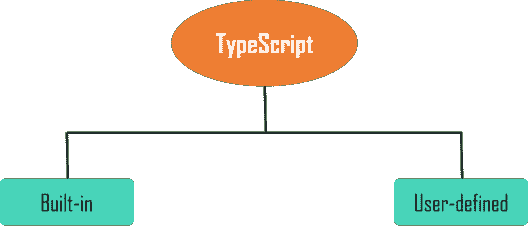
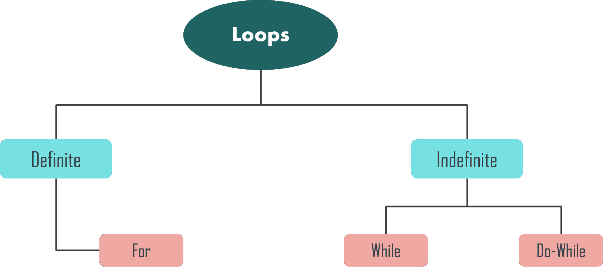
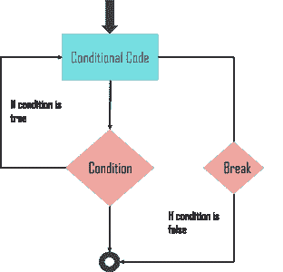
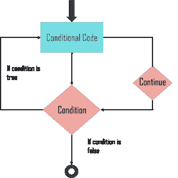
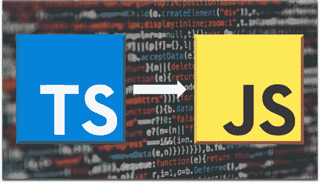

# TypeScript 教程:了解 TypeScript 的基础知识

> 原文：<https://www.edureka.co/blog/typescript-tutorial/>

TypeScript 是一个编译成普通 JavaScript 的强类型 JavaScript 超集。您可以使用这种语言进行应用程序规模的 JavaScript 开发。此外，它可以在任何浏览器、任何主机和任何操作系统上执行。在本 TypeScript 教程中，我们将深入了解 TypeScript，并按以下顺序理解基本知识:

*   [打字稿简介](#introduction)
*   [打字稿类型](#types)
*   [变量](#variables)
*   [操作员](#operators)
*   [循环](#loops)
*   [功能](#functions)
*   [琴弦](#strings)
*   [数组](#arrays)
*   [接口](#interfaces)
*   [类](#class)
*   [物体](#objects) 物体
*   [打字稿用例](#usecase)

## **打字稿简介**

TypeScript 是 JavaScript 的类型化超集，它编译成普通 JavaScript。TypeScript 是纯面向对象的，有类、接口和静态类型编程语言，如 [C#](https://www.edureka.co/blog/c-sharp-tutorial/) 或 [Java](https://www.edureka.co/blog/java-tutorial/) 。它需要一个编译器来编译并生成 JavaScript 文件。基本上，TypeScript 是 JavaScript 的 ES6 版本，具有一些额外的特性。

一段 TypeScript 代码写在一个带**的文件里。ts 扩展**然后用编译器编译成 JavaScript。您可以在任何代码编辑器中编写该文件，并且编译器需要安装在您的平台上。安装完成后，命令 **tsc <文件名>。ts** 将 TypeScript 代码编译成一个普通的 JavaScript 文件。

**语法:**

```
var message:string = "Welcome to Edureka!"
console.log(message)
```

编译时，它会生成以下 JavaScript 代码:

```
//Generated by typescript 1.8.10
var message = "Welcome to Edureka!";
console.log(message);
```

### **打字稿的特点**

****

*   **跨平台:**TypeScript 编译器可以安装在 Windows、MacOS、Linux 等任何操作系统上。

*   **面向对象语言** : TypeScript 提供了类似[类](https://www.edureka.co/blog/javascript-classes/)、接口和模块的特性。因此，它可以为客户端和服务器端开发编写面向对象的代码。

*   **静态类型检查** : TypeScript 使用静态类型，并在编译时帮助进行类型检查。因此，您可以在编写代码时发现错误，而无需运行脚本。

*   可选的静态类型化:如果你使用 JavaScript 的动态类型化，TypeScript 也允许可选的静态类型化。

*   **DOM 操作**:您可以使用 TypeScript 操作 DOM 来添加或删除元素。

*   **ES 6 特性** : TypeScript 包含了计划中的 ECMAScript 2015 (ES 6，7)的大部分特性如类、接口、箭头函数等。

### **使用 TypeScript 的优势**

*   TypeScript 快速、简单、易学，可以在任何浏览器或 JavaScript 引擎上运行。

*   它与 T2 的 JavaScript 类似，使用相同的语法和语义。

*   这有助于后端开发人员更快地编写前端代码。

*   TypeScript 代码可以从现有的 JavaScript 代码中调用。此外，它可以与现有的 JavaScript 框架和库一起工作，没有任何问题。

*   扩展名为. d.ts 的定义文件支持现有的 JavaScript 库，如 **Jquery、D3.js** 等。因此，类型脚本代码可以使用类型定义添加 [JavaScript 库](https://www.edureka.co/blog/javascript-libraries/)，以利用现有动态类型 JavaScript 库中的类型检查、代码自动完成和文档的优势。

*   它包括来自 **ES6** 和 **ES7** 的特性，可以在类似 [Node.js](https://www.edureka.co/blog/node-js-installation/) 这样的 ES5 级 JavaScript 引擎中运行。

现在你已经理解了什么是 TypeScript，让我们继续学习这个 TypeScript 教程，看看不同的类型。

## **打字稿类型**

类型系统表示语言支持的不同类型的值。它在程序存储或操作提供的**值**之前，检查其**有效性**。



它可以分为两种类型，例如:

*   **内置**:包括数字、字符串、布尔、void、null 和未定义。
*   **自定义**:包括枚举(enums)、类、接口、数组、元组。

现在让我们继续这个 TypeScript 教程，了解更多关于变量的知识。

## **打字脚本教程:变量**

变量是内存中用来存储值的命名空间。

在 TypeScript 中声明变量的类型语法包括变量名后的冒号(:)，后跟变量的类型。类似于 JavaScript，我们使用 [var 关键字](https://www.edureka.co/blog/javascript-variable/)来声明一个变量。

当我们声明一个变量时，有四个选项:

```
var [identifier] : [type-annotation] = value;
```

```
var [identifier] : [type-annotation];
```

```
var [identifier] = value;
```

```
var [identifier];
```

**举例:**

```
var name:string = "Daisy";
var empid:number = 1001;
console.log("name"+name)
console.log("employee id "+empid)
```

编译时，它将生成以下 JavaScript 代码:

```
//Generated by typescript 1.8.10
var name = "Daisy";
var empid = 1001;
console.log("name" + name);
console.log("employee id: " + empid);
```

**输出:**

`name:Daisy`

现在让我们进入打字教程的下一个主题。

## **操作员**

运算符用于定义将对数据执行的功能。运算符处理的数据称为操作数。TypeScript 中有不同类型的[运算符](https://www.edureka.co/blog/javascript-operators/)，例如:

*   **算术运算符**
*   **逻辑运算符**
*   **关系运算符**
*   **按位运算符**
*   **赋值运算符**

### **算术运算符**

| **操作员** | **描述** |
| **加法(+)** | 返回操作数的总和 |
| **减法(-)** | 返回值的差值 |
| **乘法(*)** | 返回值的乘积 |
| **除法(/)** | 执行除法运算并返回商 |
| **模数(%)** | 执行除法运算并返回余数 |
| **增量(++)** | 将变量值递增 1 |
| **减量(–)** | 将变量的值减一 |

### 示例:

```
var num1:number = 10
var num2:number = 2
var res:number = 0

res = num1 + num2
console.log("Sum: "+res);

res = num1 - num2;
console.log("Difference: "+res)

res = num1*num2
console.log("Product: "+res)
```

**输出:**

`Sum: 12``Difference: 8`

### **逻辑运算符**

| **操作员** | **描述** |
| **和(& & )** | 只有当指定的所有表达式都返回 true 时，它才返回 true |
| **或(&#124;&#124;)** | 如果指定的表达式中至少有一个返回 true，则返回 true |
| **不(！)** | 它返回表达式结果的倒数。 |

**举例:**

```
var avg:number = 20;
var percentage:number = 90;

console.log("Value of avg: "+avg+" ,value of percentage: "+percentage);

var res:boolean = ((avg>50)&&(percentage>80));
console.log("(avg>50)&&(percentage>80): ",res);
```

**输出:**

`Value of avg: 20 ,value of percentage: 90`

### **关系运算符**

| **操作员** | **描述** |
| **>** | 大于 |
| **<** | 小于 |
| **> =** | 大于或等于 |
| **< =** | 小于或等于 |
| **==** | 平等 |
| **！=** | 不相等 |

**举例:**

```
var num1:number = 10;
var num2:number = 7;

console.log("Value of num1: "+num1);
console.log("Value of num2 :"+num2);

var res = num1>num2
console.log("num1 greater than num2: "+res)

res = num1<num2
console.log("num1 lesser than num2: "+res)
```

**输出:**

`Value of num1: 10` `Value of num2 :7` `num1 greater than num2: true`

### **按位运算符**

| **操作员** | **描述** |
| **按位与(& )** | 对其整数参数的每一位执行布尔 AND 运算。 |
| **按位或(&#124;)** | 它对整数参数的每一位执行布尔 OR 运算。 |
| **按位异或(^)** | 它对其整数参数的每一位执行布尔异或运算。 |
| **按位非(~)** | 这是一个一元运算符，通过反转操作数中的所有位进行运算。 |
| **左移(< < )** | 它将第一个操作数中的所有位向左移动第二个操作数中指定的位数。 |
| **右移(> > )** | 左操作数的值向右移动右操作数指定的位数。 |
| **右移加零(> > > )** | 它类似于>>运算符，除了左边移入的位总是零。 |

**举例:**

```
var a:number = 2; // Bit presentation 10
var b:number = 3; // Bit presentation 11

var result;

result = (a & b);
console.log("(a & b) => ",result)

result = (a | b);
console.log("(a | b) => ",result)
```

**输出:**

`(a & b) => 2`

### **赋值运算符**

| **操作员** | **描述** |
| **简单赋值(=)** | 将右侧操作数的值赋给左侧操作数 |
| **加和赋值(+=)** | 它将右操作数与左操作数相加，并将结果赋给左操作数。 |
| **减法和赋值(-=)** | 它从左操作数中减去右操作数，并将结果赋给左操作数。 |
| **乘法和赋值(*=)** | 它将右操作数与左操作数相乘，并将结果赋给左操作数。 |
| **除法和赋值(/=)** | 它将左操作数除以右操作数，并将结果赋给左操作数。 |

**举例:**

```
var a: number = 12
var b:number = 10

a = b
console.log("a = b: "+a)

a += b
console.log("a+=b: "+a)

a -= b
console.log("a-=b: "+a)
```

**输出:**

`a = b: 10``a += b: 20`

这些是不同的操作员。现在让我们继续我们的 TypeScript 教程，学习循环。

## **循环**

可能会出现这样的情况，一段代码需要执行多次。一条[循环](https://www.edureka.co/blog/javascript-loops/)语句允许我们多次执行一条或一组语句。

TypeScript 循环可以分为以下几类:



### **为循环**

循环的[是一个确定循环的实现。](https://www.edureka.co/blog/javascript-foreach/)

**语法:**

```
for (first expression; second expression; third expression ) {
// statements to be executed repeatedly
}
```

这里，第一个表达式在循环开始之前执行。第二个表达式是循环执行的条件。并且在执行每个代码块之后执行第三表达式。

**举例:**

```
for (let i = 0; i < 2; i++) {
console.log ("Execute block statement" + i);
}
```

**输出:**

`Execute block statement 0 Execute block statement 1`

### **While 循环**

每当指定的条件评估为真时，while 循环执行指令。

**语法:**

```
while (condition expression) {
// code block to be executed
}
```

**举例:**

```
let i: number = 1;

while (i < 3) {
console.log( "Block statement execution no." + i )
i++;
}
```

**输出:**

`Block statement execution no.1 Block statement execution no.2`

### **做..While 循环**

do…while 循环类似于 while 循环，只是它不在循环第一次执行时计算条件。

**语法:**

```
do { // code block to be executed } while (condition expression);
```

**举例:**

```
let i: number = 1;
do {
console.log("Block statement execution no." + i )
i++;
} while ( i < 3)
```

**输出:**

`Block statement execution no.1 Block statement execution no.2`

除此之外，TypeScript 中还有在循环中使用的 break 和 continue 语句。

### **中断语句**

break 语句用于从构造中取出控制权。在循环中使用 break 语句有助于程序退出循环。



**举例:**

```
var i:number = 1
while(i<=10) {
if (i % 5 == 0) {
console.log ("The first multiple of 5 between 1 and 10 is : "+i)
break //exit the loop if the first multiple is found
}
i++
} //outputs 5 and exits the loop
```

**输出:**

`The first multiple of 5 between 1 and 10 is : 5`

### **继续语句**

continue 语句跳过当前迭代中的后续语句，并将控制返回到循环的开始处。



**举例:**

```
var num:number = 0
var count:number = 0;

for(num=0;num<=10;num++) {
if (num % 2==0) {
continue
}
count++
}
console.log (" The count of odd values between 0 and 10 is: "+count)
```

**输出:**

`The count of odd values between 0 and 10 is: 5`

这些是 TypeScript 中不同的循环。现在，让我们继续我们的 TypeScript 教程并理解函数。

## **功能**

在 JavaScript 中，[函数](https://www.edureka.co/blog/javascript-functions/)是最重要的部分之一，因为它是一种函数式编程语言。函数确保了程序的可维护性和可重用性，并被组织成可读的块。虽然 TypeScript 提供了类和模块的概念，但函数仍然是语言不可或缺的一部分。

### **命名函数**

命名函数用于通过函数的给定名称来声明和调用函数。

**举例:**

```
function display() {
console.log("TypeScript Function");
}

display();
```

**输出:**

`TypeScript Function`

### **匿名功能**

匿名函数是定义为表达式的函数。这个表达式存储在一个变量中。使用存储函数的变量名调用这些函数。

**举例:**

```
let greeting = function() {
console.log("TypeScript Function");
};

greeting();
```

**输出:**

`TypeScript Function`

### **箭头功能**

粗箭头符号用于匿名函数，即函数表达式。在其他语言中，它们也被称为 lambda 函数。

**语法:**

```
(param1, param2, ..., paramN) => expression
```

使用粗箭头(= >)不再需要使用“function”关键字。参数在尖括号<>中传递，函数表达式在花括号{}中。

**举例:**

```
let sum = (x: number, y: number): number => {
return x + y;
}

sum(10, 30); //returns 40
```

### **函数重载**

TypeScript 提供了函数重载的概念。因此，可以有多个同名但参数类型和返回类型不同的函数。

**举例:**

```
function add(a:string, b:string):string;
function add(a:number, b:number): number;
return a + b;
}
add("Hello ", "Edureka"); // returns "Hello Edureka"
add(10, 10); // returns 20
```

在上面的例子中，我们有同一个函数 add()，有两个函数声明和一个函数实现。第一个签名有两个 string 类型的参数，而第二个签名有两个 number 类型的参数。

这些是不同类型的功能。现在，让我们继续我们的 TypeScript 教程，理解 TypeScript 中的字符串。

## **打字教程:字符串**

[字符串](https://www.edureka.co/blog/javascript-string-functions/)是另一种用于存储文本数据的原始数据类型。字符串值用单引号或双引号括起来。

**语法:**

```
var var_name = new String(string);
```

字符串对象中有不同的方法属性，例如:

*   **构造函数**–它返回创建对象的字符串函数的引用
*   **Length**–返回字符串的长度
*   **原型**–这个属性允许你添加属性和方法到一个对象中

**举例:**

```
let name = new String("Welcome to Edureka!");
console.log("Message: " +name);
console.log("Length: "+name.length);
```

**输出:**

`Message: Welcome to Edureka!`

### **字符串方法**

字符串对象中的方法列表包括:

| **方法** | **描述** |
| **charAt()** 的缩写 | 它返回指定索引处的字符 |
| **字符编码()** | 它返回一个数字，指示给定索引处字符的 Unicode 值 |
| **concat()** | 合并两个字符串的文本并返回一个新字符串 |
| **indexOf()** | 返回指定值在调用字符串对象中的第一个匹配项的索引 |
| **lastIndexOf()** | 它返回最后一次出现指定值的调用字符串对象中的索引 |
| **match()** | 用于将正则表达式与字符串进行匹配 |
| **局部 ecopare()** | 返回一个数字，指示引用字符串在排序顺序中是位于给定字符串之前还是之后，或者是否与给定字符串相同 |
| **搜索()** | 这将搜索正则表达式和指定字符串之间的匹配项 |
| **替换()** | 用于查找正则表达式和字符串之间的匹配，并用新的子字符串替换匹配的子字符串 |
| **切片()** | 它提取一个字符串的一部分并返回一个新的字符串 |
| **split()** | 通过将字符串拆分为子字符串，将 String 对象拆分为字符串数组 |
| **substr()** | 返回从指定位置开始到指定字符数的字符串中的字符 |
| **子串()** | 它将字符串中两个索引之间的字符返回到字符串中 |
| **toLocaleLowerCase()** | 在考虑当前区域设置的同时，字符串中的字符被转换为小写 |
| **toLocaleUpperCase()** | 字符串中的字符被转换为大写，同时考虑当前的区域设置 |
| **toLowerCase()** | 它返回转换成小写的调用字符串值 |
| **toUpperCase()** | 它返回转换成大写的调用字符串值 |
| **toString()** | 返回表示指定对象的字符串 |
| **valueOf()** | 返回指定对象的原始值 |

**举例:**

```
let str: string = 'Welcome to Edureka';
str.charAt(0); // returns 'w'
str.charAt(2); // returns 'l'
"Welcome to Edureka".charAt(2); returns 'l'

let str1: string = 'welcome';
let str2: string = 'Edureka';
str1.concat(str2); // returns 'welcomeEdureka'
str1.concat(' ', str2); // returns 'welcome Edureka'
str1.concat(' 'to' '); // returns 'welcome to'
```

现在你已经知道了字符串，让我们继续学习这个 TypeScript 教程，理解数组。

## **TypeScript 中的数组**

一个[数组](https://www.edureka.co/blog/javascript-array/)是一种特殊的数据类型，它使用特殊的语法顺序存储不同数据类型的多个值。数组元素由一个唯一的整数标识，称为元素的下标或索引。

**语法:**

```
var array_name[:datatype]; //declaration
array_name = [val1,val2,valn..] //initialization
```

**举例:**

```
let names: Array<string>;
names = ['John', 'Daisy', 'Rachel'];

let ids: Array<number>;
ids = [101, 700, 321];
```

### **数组方法**

以下是可用于不同用途的不同数组方法的列表:

| **方法** | **描述** |
| **过滤器()** | 创建一个新数组，其中包含该数组中所有元素，并且所提供的筛选函数返回 true |
| **every()** | 如果此数组中的每个元素都满足提供的测试函数，则返回 true |
| **concat()** | 返回一个由这个数组和其他数组组成的新数组 |
| **indexOf()** | 返回数组中等于指定值的第一个或最小的元素索引 |
| **forEach()** | 为数组中的每个元素调用一个函数 |
| **join()** | 将数组中的所有元素连接成一个字符串 |
| **lastIndexOf()** | 返回数组中等于指定值的最后一个或最大的元素索引 |
| **地图()** | 创建一个新数组，包含对该数组中的每个元素调用提供的函数的结果 |
| **push()** | 将一个或多个元素添加到数组末尾，并返回数组的新长度 |
| **pop()** | 从数组中移除最后一个元素并返回该元素 |
| **reduce()** | 从左到右对数组的两个值同时应用一个函数，以将其减少为一个值 |
| **reduceRight()** | 从右到左对数组的两个值同时应用一个函数，以将其减少为一个值 |
| **反转()** | 反转数组元素的顺序 |
| **shift()** | 从数组中移除第一个元素并返回该元素 |
| **切片()** | 提取数组的一部分并返回一个新数组 |
| **一些()** | 如果该数组中至少有一个元素满足提供的测试函数，则返回 true |
| **sort()** | 它对数组的元素进行排序 |
| **toString()** | 返回表示数组及其元素的字符串 |
| **拼接()** | 它在数组中添加和/或删除元素 |
| **unshift()** | 将一个或多个元素添加到数组的前面并返回数组的新长度 |

**举例:**

```
var name: Array<string> = ['John', 'Daisy', 'Tara'];
name.sort();
console.log(name); //output: [ 'Daisy', 'John', 'Tara' ]

console.log(name.pop()); //output: Tara

name.push('Rachel');
console.log(name); //output: ['John', 'Daisy', 'Rachel']
```

现在让我们继续学习这个 TypeScript 教程，并了解接口。

## **类型脚本接口**

接口是在应用程序中定义契约的结构。它定义了类要遵循的语法。它只包含成员的声明，定义成员是派生类的责任。

**举例:**

```
interface Employee {
empID: number;
empName: string;
getSalary: (number) => number; // arrow function
getManagerName(number): string;
}
```

在上面的例子中，**员工**接口包括两个属性 **empID** 和 **empName** 。它还包括一个使用**箭头函数**的方法声明**getsalary**，该函数包括一个数字参数和一个数字返回类型。使用普通函数声明了 **getManagerName** 方法。

## **打字稿** **班级**

TypeScript 引入了类，这样它们就可以利用封装和抽象等面向对象技术的优势。TypeScript 编译器将 TypeScript 中的类编译成普通的 JavaScript 函数，以便跨平台和浏览器工作。

一个类包括以下内容:

*   **构造器**
*   **属性**
*   **方法**

**举例:**

```
class Employee {
empID: number;
empName: string;

constructor(ID: number, name: string) {
this.empName = name;
this.empID = ID;
}

getSalary() : number {
return 40000;
}
}
```

### **继承**

TypeScript 支持[继承](https://www.edureka.co/blog/inheritance-in-javascript/)，因为它是程序从现有类创建新类的能力。被扩展来创建新类的类被称为父类或超类。新创建的类称为子类。

一个类使用“extends”关键字从另一个类继承。子类从父类继承除私有成员和构造函数之外的所有属性和方法。但是，TypeScript 不支持多重继承。

**语法:**

```
class child_class_name extends parent_class_name
```

**举例:**

```
class Person {
name: string;

constructor(name: string) {
this.name = name;
}
}

class Employee extends Person {
empID: number;

constructor(empID: number, name:string) {
super(name);
this.empID = empid;
}

displayName():void {
console.log("Name = " + this.name + ", Employee ID = " + this.empID);
}
}

let emp = new Employee(701, "Jason");
emp.displayName(); // Name =Jason, Employee ID = 701
```

现在你已经知道了类，让我们继续这个 TypeScript 教程，学习对象。

## **打字稿中的对象**

对象是包含一组不同的键值对的实例。这些值可以是标量值或函数，甚至是其他对象的数组。

**语法:**

```
var object_name = {
key1: “value1”, //scalar value
key2: “value”,
key3: function() {
//functions
},
key4:[“content1”, “content2”]
```

对象可以包含标量值、函数和结构，如数组和元组。

**举例:**

```
var person = {
firstname:"Danny",
lastname:"Green"
};
//access the object values
console.log(person.firstname)
console.log(person.lastname)
```

在编译时，它将生成相同的 JavaScript 代码。

**输出:**

`Danny`

这些是打字稿不同的重要元素。现在，让我们继续这个 TypeScript 教程，并看一个例子来理解这个用例。

## **打字教程:用例**

在这里，我们将学习如何将现有的 [JavaScript 项目](https://www.edureka.co/blog/javascript-projects/)转换为 TypeScript。

当我们编译一个 TypeScript 文件时，它会生成相应的同名 JavaScript 文件。这里，我们需要确保作为输入的原始 JavaScript 文件不能在同一个目录中，这样 TypeScript 就不会覆盖它们。



从 JavaScript 迁移到 TypeScript 的过程包括以下步骤:

### **1。将 tsconfig.json 文件添加到项目**

您需要向项目添加一个 tsconfig.json 文件。TypeScript 使用 tsconfig.json 文件来管理项目的编译选项，例如要包括和排除哪些文件。

```
{
"compilerOptions": {
"outDir": "./built",
"allowJs": true,
"target": "es5"
},
"include": [
"./src/**/*"
]
}
```

### **2。与构建工具集成**

大多数 JavaScript 项目都有一个集成的构建工具，如 gulp 或 webpack。您可以通过以下方式将项目与 webpack 集成:

*   在终端上运行以下命令:

```
$ npm install awesome-typescript-loader source-map-loader
```

在 webpack 集成中，您将 awesome-typescript-loader 与 source-map-loader 结合使用，以便更容易地调试源代码。

*   其次，合并我们的 webpack.config.js 文件中的模块配置属性以包含加载器。

### **3。全部移动。js 文件到。ts 文件**

在这一步中，您必须重命名。js 文件到。ts 文件。同样，如果该文件使用 JSX，您需要将其重命名为. tsx。现在，如果我们在支持 TypeScript 的编辑器中打开该文件，一些代码可能会出现编译错误。因此，逐个转换文件可以更容易地处理编译错误。如果 TypeScript 在转换过程中发现任何编译错误，它仍然能够翻译代码。

### **4。检查错误**

将 js 文件移动到 ts 文件后，TypeScript 将立即开始对我们的代码进行类型检查。因此，您可能会在 JavaScript 代码中得到诊断错误。

### **5。使用第三方 JavaScript 库**

JavaScript 项目使用第三方库，如 [jQuery](https://www.edureka.co/blog/jquery-tutorial/) 或 Lodash。为了编译文件，TypeScript 需要知道这些库中所有对象的类型。JavaScript 库的 TypeScript 类型定义文件已经在 DefinitelyTyped 上可用。所以，没有必要在外部安装这种类型。您只需要安装那些在我们的项目中使用的类型。

对于 jQuery，您可以安装定义:

```
$ npm install @types/jquery
```

之后，对 JavaScript 项目进行修改，运行构建工具。现在，您应该将 TypeScript 项目编译成可以在浏览器中运行的普通 JavaScript。

至此，本 TypeScript 教程到此结束。我希望您理解了 TypeScript 的所有重要元素。

*查看 Edureka 的 **[Web 开发认证培训](https://www.edureka.co/complete-web-developer)** 。* *Web 开发认证培训将帮助您学习如何使用 HTML5、CSS3、Twitter Bootstrap 3、jQuery 和 Google APIs 创建令人印象深刻的网站，并将其部署到亚马逊简单存储服务(S3)。*

*有问题吗？请在“TypeScript 教程”的评论部分提到它，我们会回复您。*