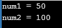
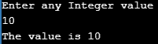

# C++中的数据隐藏:什么是封装和抽象？

> 原文：<https://www.edureka.co/blog/data-hiding-in-cpp/>

简单来说，数据隐藏是一种[面向对象编程](https://www.edureka.co/blog/object-oriented-programming-in-cpp/)技术，隐藏内部对象细节，即数据成员。数据隐藏保证对类成员的受限数据访问&保持对象完整性。在这篇博客中，我们将了解数据隐藏在 C++中是如何工作的。 本教程涵盖以下主题:

*   [封装](#encapsulation)
*   [抽象](#abstraction)
*   [数据隐藏](#datahiding)

封装、抽象&数据隐藏彼此密切相关。 当我们谈论任何 C++程序时，它都由两个基本元素组成:

*   **程序语句**–执行动作的程序(函数)的一部分。
*   **程序数据**–使用功能操作的程序中的数据。

## **封装**

[封装](https://www.edureka.co/blog/object-oriented-programming-in-cpp/#Encapsulation) 将数据&功能绑定在一起，使二者免受外界干扰。数据封装导致了数据隐藏。

让我们看一个封装的例子。这里，我们指定 getter & setter 函数来获取& set 变量 *num* 的值，而不直接访问它。

**举例:**

```
#include<iostream> 
using namespace std; 

class Encapsulation 
{ 
    private: 
        // data hidden from outside world 
        int num; 

    public: 
        // function to set value of  
        // variable x 
        void set(int a) 
        { 
            num =a; 
        } 

        // function to return value of 
        // variable x 
        int get() 
        { 
            return num; 
        } 
}; 

// main function 
int main() 
{ 
    Encapsulation obj; 

    obj.set(5); 

    cout<<obj.get(); 
    return 0; 
}

```

****输出:****

****

**数据抽象**

数据抽象 是一种对用户隐藏实现的机制&公开接口。

**举例:**

```
#include <iostream> 
using namespace std; 

class Abstraction 
{ 
    private: 
        int num1, num2; 

    public: 

        void set(int a, int b) 
        { 
            num1 = a; 
            num2 = b; 
        } 

        void display() 
        { 
            cout<<"num1 = " <<num1 << endl; 
            cout<<"num2 = " << num2 << endl; 
        } 
}; 

int main()  
{ 
    Abstraction obj; 
    obj.set(50, 100); 
    obj.display(); 
    return 0; 
}

```

****输出:****

## **数据隐藏在 C++**

数据隐藏是将数据和功能组合成一个单元的过程。数据隐藏背后的思想是将数据隐藏在一个类中，以防止它被类外的人直接访问。它帮助程序员创建具有唯一数据集和函数的类，避免来自其他程序类的不必要的渗透。

讨论数据隐藏&数据封装，数据隐藏只隐藏类数据组件，而数据封装隐藏类数据部分和私有方法。

现在你还需要知道访问说明符来理解数据隐藏。

私有，公共&受保护在一个类中有三种类型的保护/访问说明符。通常，类中的数据是私有的&函数是公共的。数据是隐藏的，因此不会被意外篡改。

*   **私有成员/方法**只能被定义为类的一部分的方法访问。数据通常被定义为私有的，以防止其他类的直接外部访问。私有成员可以由类的成员访问。

*   **公共成员/方法**可以从程序中的任何地方访问。类方法通常是公共的，用于操作类中的数据。一般来说，数据不应该被公开。公共成员可以由类的成员和对象访问。

*   **受保护的成员/方法**在一个类中是私有的，并且可用于派生类中的私有访问。

现在让我们看一个数据隐藏的例子。

**示例:C++中的数据隐藏**

```
#include<iostream>
using namespace std;
class Base{

    int num;  //by default private
    public:

    void read();
    void print();

};

void Base :: read(){
    cout<<"Enter any Integer value"<<endl; cin>>num;

}

void Base :: print(){
    cout<<"The value is "<<num<<endl;
}

int main(){
    Base obj;

    obj.read();
    obj.print();

    return 0;
}

```

**输出:**

现在看完上面的 C++程序，你就会明白什么是数据隐藏&如何在 C++中实现。我希望这篇博客能给你带来信息和附加值。

因此，我们已经结束了这篇关于“C++中的数据隐藏”的文章。如果你想了解更多，请查看由 Edureka(一家值得信赖的在线学习公司)提供的  [Java 培训](https://www.edureka.co/java-j2ee-soa-training)。Edureka 的 Java J2EE 和 SOA 培训和认证课程旨在培训您掌握核心和高级 Java 概念以及各种 Java 框架，如 Hibernate & Spring。

有问题要问我们吗？请在这个博客的评论部分提到它，我们会尽快回复你。