# Excel 中有哪些公式和函数，如何使用？

> 原文：<https://www.edureka.co/blog/basic-excel-formulas-functions/>

只有当你可以实际处理数据时，数据才会派上用场，而当你必须制定自己的方程或使用内置方程时， [Excel](https://www.edureka.co/blog/excel-tutorial/) 是一个提供大量便利的工具。在本文中，您将学习如何实际使用这些 Excel 公式和函数。

这里快速浏览一下这里讨论的主题:

*   [什么是公式？](#formula)
*   [编写 Excel 公式](#excelformulas)
*   [编辑公式](#editing)
*   [复制/粘贴公式](#copypaste)
*   [隐藏 Excel 中的公式](#hide)
*   [运算符优先级 Excel 公式](#operatorprecedence)
*   [Excel 中有哪些函数？](#functions)
*   [最重要的功能](#importantfunctions)

## **什么是公式？**

一般来说，公式是用符号来表达某些信息的一种浓缩方式。在 Excel 中，公式是可以输入到 Excel 工作表的单元格中的表达式，其输出显示为结果。

Excel 公式可以是以下类型:

| 类型 | 例子 | 描述 |
| 数学运算符(+、-、*等) | 示例:=A1+B1 | 将 A1 和 B1 的值相加 |
| 值或文本 | 例如:100*0.5 的倍数 100 乘以 0.5 | 获取值并返回输出 |
| 单元格引用 | 示例:=A1=B1 | 通过比较 A1 和 B1 返回 TRUE 或 FALSE |
| 工作表函数 | 示例:=SUM(A1: B1) | 通过将 A1 和 B1 中的值相加返回输出 |

## **编写 Excel 公式:**

要将公式写入 Excel 工作表单元格，您可以执行以下操作:

*   选择要显示结果的单元格
*   最初键入一个“=”号，让 Excel 知道您将在该单元格中输入公式
*   之后，您可以键入单元格地址或指定要计算的值
*   例如，如果要将两个单元格的值相加，可以按如下方式键入单元格地址:

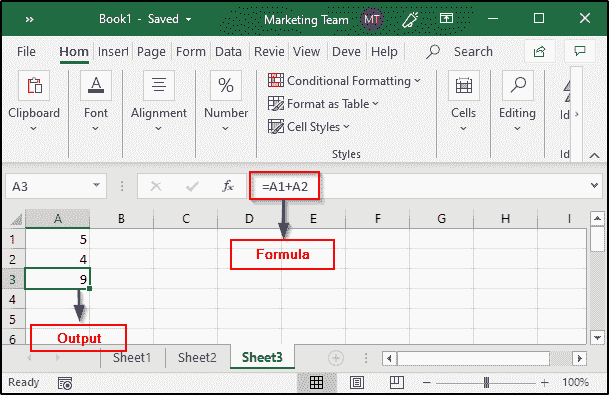

*   您也可以选择要计算其总和的单元格，方法是在按住 Ctrl 键的同时选择所有所需的单元格:

## **编辑公式:**

如果您想要编辑一些之前输入的公式，只需选择包含目标公式的单元格，然后在公式栏中进行所需的更改。在前面的例子中，我已经计算了 A1 和 A2 的总和。现在，我将对其进行编辑，并更改公式以计算这两个单元格中的值的乘积:

完成后，按 Enter 查看所需的输出。

## **复制或粘贴公式:**

当你需要复制/粘贴公式时，Excel 非常方便。每当复制公式时，Excel 会自动处理该位置所需的单元格引用。这是通过一个叫做[相对单元地址](https://www.edureka.co/blog/excel-tutorial/#formulas)的系统来完成的。

要复制公式，请选择保存原始公式的单元格，然后将其拖到需要该公式副本的单元格，如下所示:

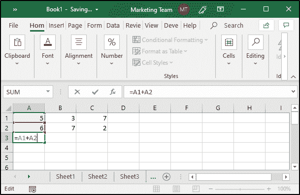

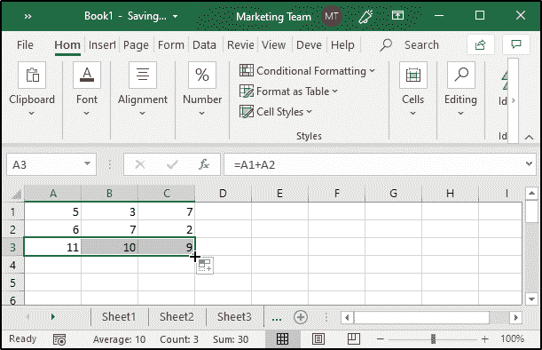

正如您在图像中看到的，该公式最初是用 A3 书写的，然后我沿着 B3 和 C3 向下拖动它，以计算 B2 的 B1 和 C2 的 C1 的总和，而没有专门写下单元格地址。

如果我更改了任何单元格的值，Excel 将根据[相对单元格地址](https://www.edureka.co/blog/excel-tutorial/#formulas)、[绝对单元格地址](https://www.edureka.co/blog/excel-tutorial/#formulas)或[混合单元格地址](https://www.edureka.co/blog/excel-tutorial/#functions)自动更新输出。

## **隐藏 Excel 中的公式:**

如果你想在 excel 表格中隐藏一些公式，你可以这样做:

*   选择要隐藏其公式的单元格
*   打开“字体”窗口并选择“保护”面板
*   选中隐藏选项，然后单击确定
*   然后，从功能区选项卡中，选择“审阅”
*   单击保护工作表(如果不这样做，公式将不起作用)
*   Excel 将要求您输入密码，以便取消隐藏公式供将来使用

## **Excel 公式的运算符优先级:**

Excel 公式遵循 BODMAS(括号顺序除法乘法加法减法)规则。如果您有一个包含括号的公式，括号中的表达式将在整个公式的任何其他部分之前被求解。请看下图:

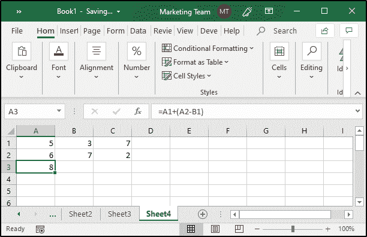

正如你在上面的例子中看到的，我有一个由括号组成的公式。因此，根据 BODMAS 规则，Excel 将首先找出 A2 和 B1 之间的差异，然后将结果与 A1 相加。

## **Excel 中的‘函数’有哪些** **？**

一般来说，函数定义了一个以某种给定顺序执行的公式。Excel 提供了大量的[内置函数](https://www.edureka.co/blog/excel-tutorial/#functions)，可以用来计算各种公式的结果。

Excel 中的公式分为以下几类:

| 种类 | 重要公式 |
| 日期和时间 | 日期、日、月、小时等 |
| 金融的 | 刺刺刺刺刺刺刺刺刺刺刺刺刺刺刺刺刺刺刺刺刺刺刺刺刺刺刺刺刺刺刺刺刺刺刺刺刺刺刺刺刺刺刺刺刺刺刺刺刺刺刺刺刺刺刺刺刺刺刺刺刺刺刺刺刺 |
| 数学和三角 | SUM、SUMIF、PRODUCT、SIN、COS 等 |
| 统计的 | 平均值、计数、计数、最大值、最小值等 |
| 查找和参考 | 列、HLOOKUP、行、VLOOKUP、选择等 |
| 数据库ˌ资料库 | 数据平均值、数据计数、DMIN、DMAX 等 |
| 文本 | 铢、美元、较低、较高等 |
| 逻辑学的 | AND，OR，NOT，IF，TRUE，FALSE 等 |
| 信息 | 信息，错误。类型、类型、ISERROR 等 |
| 工程 | 复杂、转换、增量、OCT2BIN 等 |
| 立方 | 立方集、立方数、立方值等 |
| 和睦相处 | 百分比、等级、变量、模式等 |
| 网 | ENCODEURL，FILTERXML，WEBSERVICE |

现在，让我们看看如何利用一些最重要和最常用的 Excel 公式。

## **最重要的 Excel 函数:**

以下是一些最重要的 Excel 函数及其描述和示例。

### **日期:**

Excel 中最重要且使用最广泛的日期函数之一是 Date 函数。它的语法如下:

*日期(年、月、日)*

该函数返回一个数字，该数字代表 MS Excel 日期-时间格式中的给定日期。日期函数可以按如下方式使用:

**举例:**

1.  =日期(2019，11，7)
2.  =DATE(2019，11，7)-7(返回当前日期–七天)

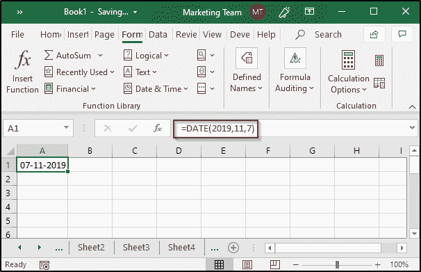

### **日:**

此函数返回一个月中的日值(1-31)。它的语法如下:

*日(序列号)*

这里，serial_number 是要检索的日期。它可以以任何方式给出，例如由日期函数提供的某个其他函数的结果，或者单元格引用。

**举例:**

1.  =天(A7)
2.  =DAY(TODAY())
3.  =日(日期(2019，11，8))

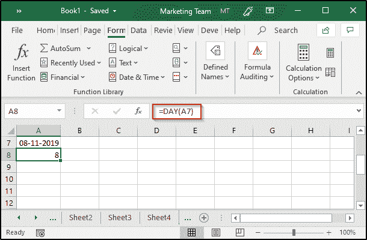

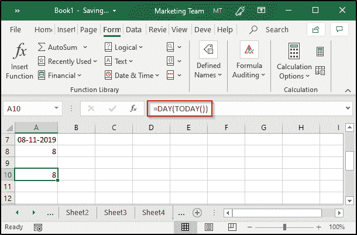

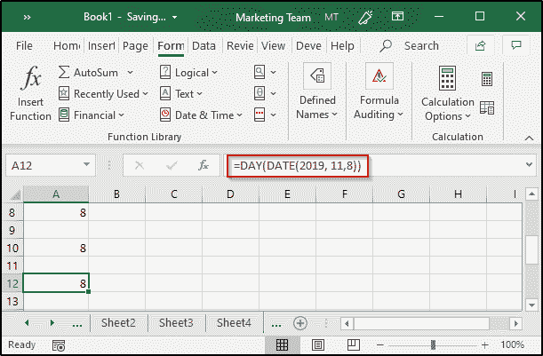

### **月:**

就像日函数一样，Excel 提供了另一个函数，即月函数，用于从特定日期检索月份。语法如下:

*月(序列号)*

**举例:**

1.  =月(今天())
2.  =月(日期(2019，11，8))

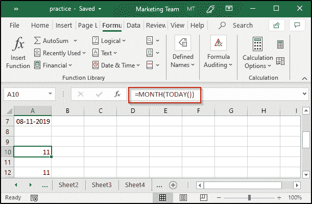

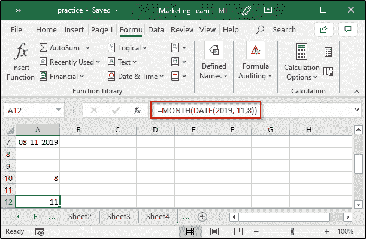

### **百分比:**

众所周知，百分比是以 100 的分数计算出来的比率。它可以表示如下:

*百分比=(部分/整体)x 100*

在 Excel 中，您可以计算任何所需值的百分比。例如，如果 A1 和 A2 中有部分值和整体值，并且您想要计算百分比，您可以执行以下操作:

*   选择要显示结果的单元格
*   键入“=”符号
*   然后，键入公式 A1/ A2，并按回车键
*   从主页选项卡编号组中，选择“%”符号

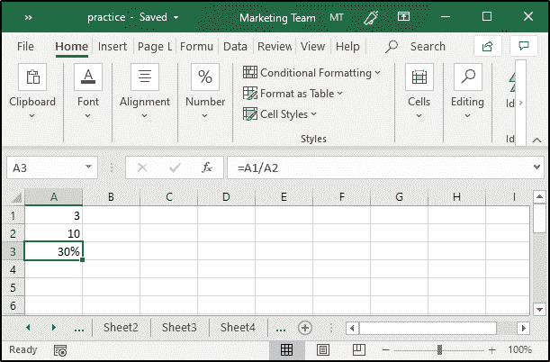

### **如果:**

IF 语句是一个条件语句，当满足指定的条件时返回 True，当条件不满足时返回 Flase。Excel 提供了一个内置的“IF”函数来实现这一目的。其语法如下:

*IF(逻辑 _ 测试，值 _ IF _ 真，值 _ IF _ 假)*

这里，*逻辑测试*是要检查的条件

**举例:**

*   输入要比较的值
*   选择将显示输出的单元格
*   在公式栏中键入“=IF(A1=A2，“Yes”，“No”)”，然后按 enter 键

## **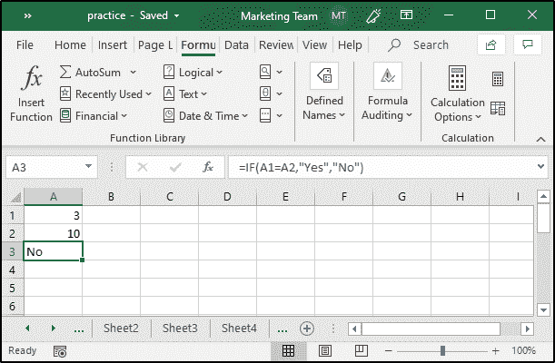**

### **VLOOKUP:**

该函数用于从 Excel 表的列中查找和获取某些特定数据。VLOOKUP 中的“V”代表垂直查找。这是 Excel 中最重要也是最广泛使用的公式之一，为了使用这个函数，表格必须按升序排序。该函数的语法如下:

*VLOOKUP(查找值，表数组，列索引，数量范围，查找)*

在哪里，

**查找值**是要查找的值

**table_array** 是要搜索的表

**col_index** 是要从中检索值的列

**range_lookup** (可选)大约返回 TRUE。match 和 FALSE 表示完全匹配

**举例:**

## **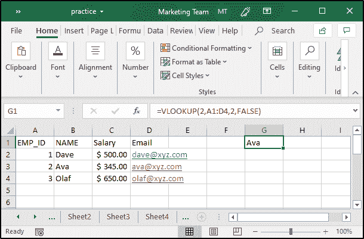**

正如您在图像中看到的，我指定的值是 2，表的范围在 A1 和 D4 之间。我想获取雇员的姓名，因此我将列值设为 2，因为我希望它完全匹配，所以我使用 False 进行范围查找。

### **所得税:**

假设你想计算一个人的总工资是 300 美元的所得税。您需要按照以下方式计算所得税:

*   列出工资总额、工资扣除额、应税收入和所得税的百分比
*   指定总薪资、薪资扣减
*   然后通过找出工资总额和工资扣除额之间的差额来计算应税收入
*   最后，计算税额

## 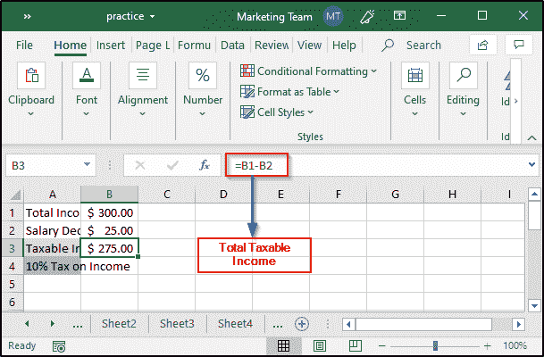

## 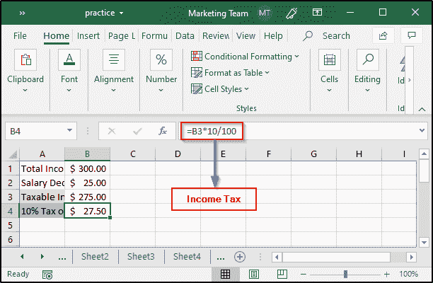

### **总和:**

Excel 中的 SUM 函数通过将 Excel 中所有指定的值相加来计算结果。该函数的语法如下:

*SUM(数字 1，数字 2，…)*

将指定为参数的所有数字添加到其中。

**举例:**

如果你想计算你在购买蔬菜上花费的总数，列出所有的价格，然后使用如下的总数公式:

### **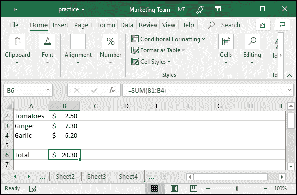**

### 复利:

为了计算复利，你可以使用一个叫做 FV 的 Excel 公式。该函数将基于定期、恒定的利率和付款返回投资的未来值。该函数的语法如下:

*FV(利率、nper、pmt、pv、类型)*

为了计算利率，您需要将年利率除以周期数，即年利率/周期数。周期数或 nper 的计算方法是将期限(年数)乘以周期，即期限*周期。pmt 代表定期付款，可以是包括零在内的任何值。

考虑下面的例子:

## 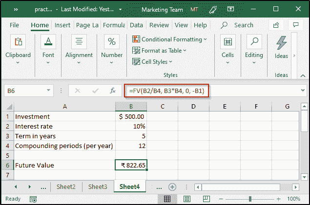

在上面的例子中，我计算了 500 美元的复利，利率为 10%，为期 5 年，并假设定期支付值为 0。请注意，我使用了-B1，意思是从我这里拿走了 500 美元。

### **平均值:**

众所周知，平均值描述了多个值的中间值。在 Excel 中，可以使用名为“average”的内置函数轻松计算平均值。该函数的语法如下:

*平均值(数字 1，数字 2，…)*

**举例:**

如果您想计算学生在所有考试中获得的平均分数，您可以简单地创建一个表，然后使用平均值公式来计算每个学生获得的平均分数。

## **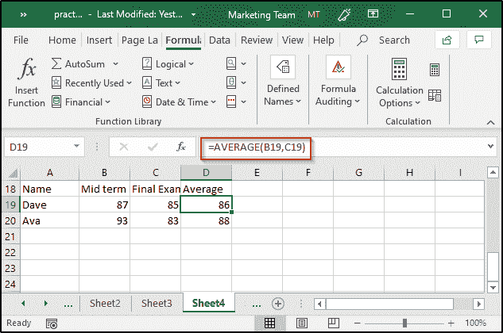**

在上面的例子中，我计算了两个学生在两次考试中的平均分数。如果需要确定两个以上数值的平均值，只需指定这些数值所在的单元格范围。例如:

## 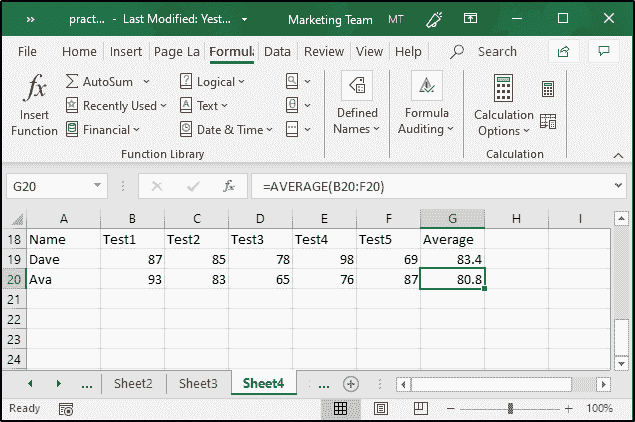

### **计数:**

Excel 中的 count 函数将计算给定范围内包含数字的单元格的数量。该函数的语法如下:

*计数(值 1，值 2，…)*

**举例:**

如果我想从上一个示例中创建的表中计算包含数字的单元格的数量，我只需选择要显示结果的单元格，然后使用 COUNT 函数，如下所示:

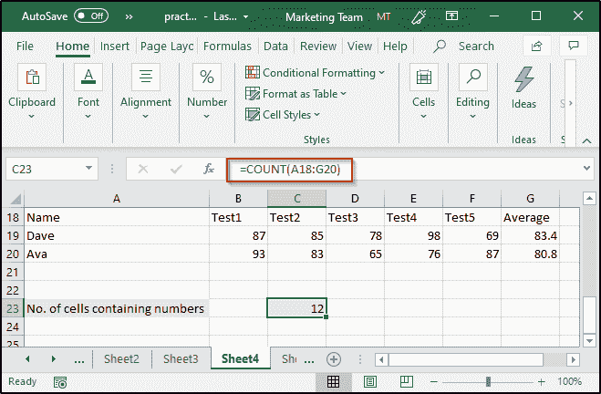

### **回合:**

为了将数值四舍五入到特定的小数位数，可以使用 round 函数。该函数将返回一个数字，将其四舍五入到指定的小数位数。该函数的语法如下:

*ROUND(num，num_digits)*

**举例:**

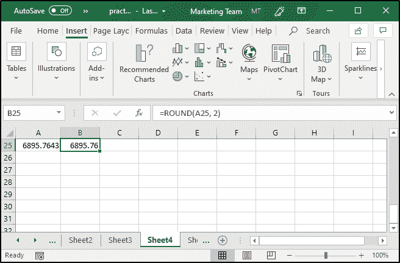

### **查找等级:**

为了找到分数，你必须在 Excel 中使用嵌套的 IF 语句。例如，在平均示例中，我计算了学生在测试中的平均分数。现在，为了找出这些学生的成绩，我必须创建一个嵌套的 IF 函数，如下所示:

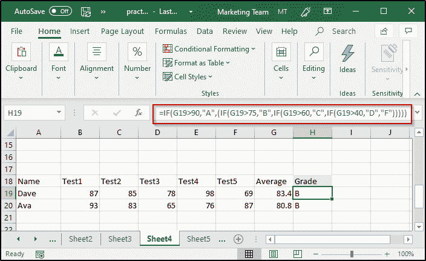

如您所见，g 列显示了平均分数。为了计算分数，我使用了一个嵌套的 IF 公式。代码如下:

=IF(G19>90，" A "，)(IF(G19>75，" B "，IF(G19>60，" C "，IF(G19>40，" D "，" F)))))

完成后，您只需将公式复制到所有要显示分数的单元格中。

### **排名:**

如果你想知道一个班级的学生的排名，你可以使用 Excel 内置的公式，即排名。该函数将通过按升序或降序比较给定范围来返回指定范围的排名。该函数的语法如下:

*RANK(ref，number，order)*

**举例:**

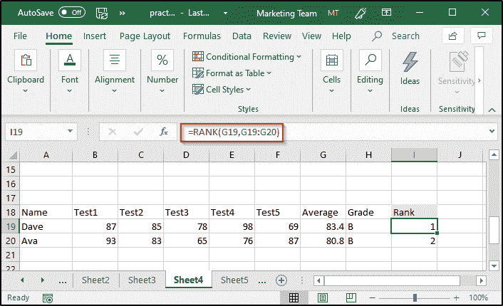

正如您所看到的，在上面的例子中，我已经使用 Rank 函数计算了学生的排名。这里，第一个参数是每个学生获得的平均分数，数组是该班所有其他学生获得的平均分数。我没有指定任何顺序，因此，输出将按降序排列。对于升序排列，您必须指定任何非零值。

### **COUNTIF:**

为了根据给定的条件对单元格进行计数，可以使用一个名为“COUNTIF”的内置 Excel 公式。该函数将返回给定范围内满足某些条件的单元格的数量。该函数的语法如下:

*COUNTIF(范围，标准)*

**举例:**

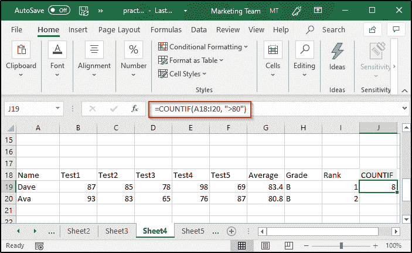

正如您所看到的，在上面的例子中，我已经找到了值大于 80 的单元格的数量。您还可以为 criteria 参数赋予一些文本值。

### **指标:**

INDEX 函数返回指定范围内某个特定位置的值或单元格引用。该函数的语法如下:

*索引(数组，行编号，列编号 ) **或***

*索引(引用，行数，列数，面积数)*

对于*数组*表单，索引函数的工作方式如下:

*   如果同时提供了行号和列号，它将返回交集单元格中的值
*   如果行值设置为零，它将返回指定范围内整列中的值
*   如果列值设置为零，它将返回指定范围内整行中的值

对于*参考*表单，索引函数的工作方式如下:

*   返回行值和列值相交的单元格的引用
*   area_num 将指示在提供多个范围的情况下使用哪个范围

**举例:**

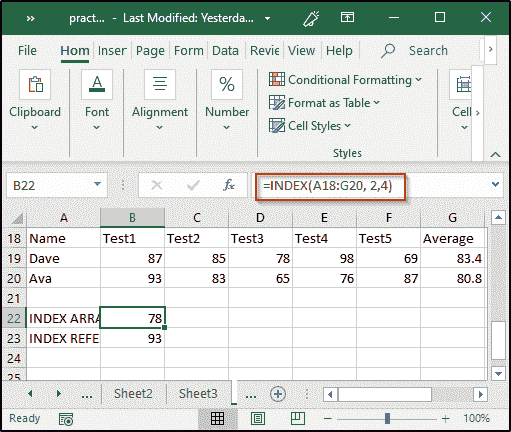

如您所见，在上面的示例中，我使用了 INDEX 函数来确定第 2 行第 4 列中 A18 到 G20 单元格区域的值。

同样，您也可以通过指定多个引用来使用 INDEX 函数，如下所示:

## ****

关于 Excel 公式和函数的这篇文章到此结束。我希望你清楚已经与你分享的一切。 ***确保你尽可能多的练习，恢复你的经验。***

*有问题吗？请在这个“Excel 公式和函数”博客的评论部分提到它，我们会尽快回复您。*

*要深入了解任何趋势技术及其各种应用，您可以注册参加实时 **[Edureka MS Excel 在线培训](https://www.edureka.co/advanced-ms-excel-self-paced)** ，24/7 全天候支持和终身访问。*