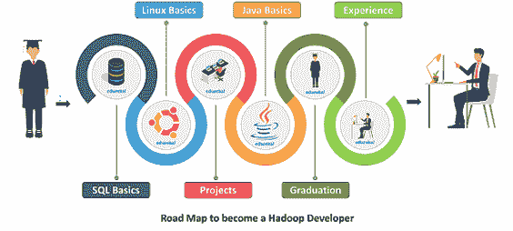
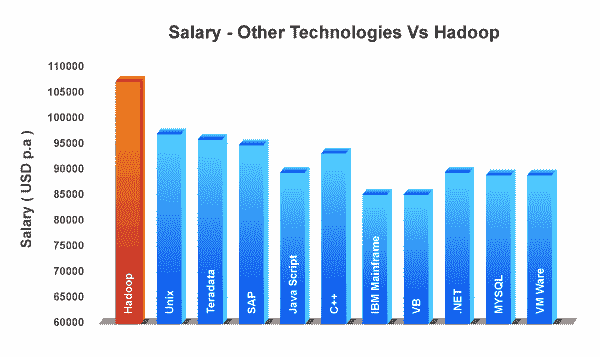
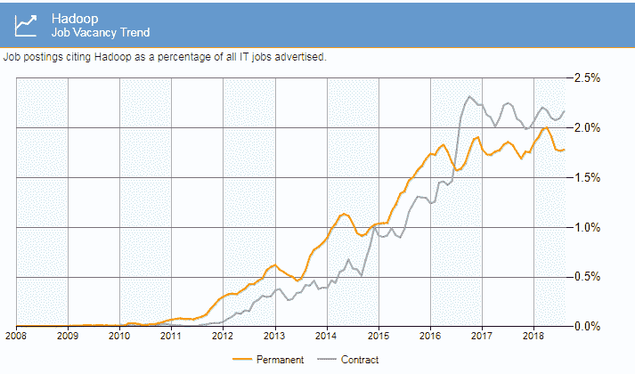

# 如何成为一名 Hadoop 开发者？工作趋势和工资

> 原文：<https://www.edureka.co/blog/hadoop-developer/>

[**Hadoop 开发者**](https://www.edureka.co/big-data-hadoop-training-certification) 是当前 IT 行业最令人向往、薪酬最高的角色。这份高质量的档案需要高超的技能才能以惊人的准确度处理海量数据。在本文中，我们将了解一名 Hadoop 开发人员的工作描述。

*   [谁是 Hadoop 开发者？](#who)
*   [如何成为一名 Hadoop 开发者？](#how)
*   [Hadoop 开发人员所需的技能](#skill)
*   [薪资趋势](#salary)
*   [工作趋势](#job)
*   [顶级公司招聘](#top)
*   [Hadoop 开发者的未来](#future)
*   [角色和职责](#roles)

## **谁是 Hadoop 开发者？**

Hadoop Developer 是一名专业的程序员，拥有 Hadoop 组件和工具的丰富知识。一名 Hadoop 开发人员，主要负责设计、开发和部署 Hadoop 应用程序，具有很强的文档技能。

## **如何成为一名 Hadoop 开发者？**

要成为 Hadoop 开发者，你必须经历描述的**路线图**。

*   牢牢掌握 [**SQL 基础知识**](https://www.edureka.co/blog/sql-basics/) 和 [**分布式系统**](https://www.edureka.co/blog/spark-architecture/) 是必须的。

*   **[Java](https://www.edureka.co/blog/java-tutorial/) ， [Python](https://www.edureka.co/blog/python-tutorial/) ， [JavaScript](https://www.edureka.co/blog/javascript-tutorial/) ， [NodeJS](https://www.edureka.co/blog/nodejs-tutorial/)** 等语言编程能力强

*   构建自己的 Hadoop 项目，以便理解术语 [**Hadoop**](https://www.youtube.com/watch?v=WNITzdRJVB8)

*   熟悉 Java 是必须的。因为 Hadoop 是用 Java 开发的

*   计算机科学学士或硕士学位

*   最小经历**2**到 3年

## **Hadoop 开发人员所需的技能**

Hadoop 开发涉及多种 [**技术**](https://www.edureka.co/blog/top-big-data-technologies/) 和编程语言。下面列出了成为一名成功的 Hadoop 开发人员的重要技能。

*   **Hadoop** 及其 [**生态系统**](https://www.edureka.co/blog/hadoop-ecosystem) 的基础知识

*   能够使用 [**、Linux**](https://www.edureka.co/blog/linux-tutorial/) 并执行 dome 的基本命令

*   **动手**体验**与 [Hadoop 核心组件](https://www.edureka.co/blog/every-hadoop-component/)**

*   Hadoop 技术如 **[MapReduce](https://www.edureka.co/blog/mapreduce-tutorial/) 、 [Pig](https://www.edureka.co/blog/pig-tutorial/) 、 [Hive](https://www.edureka.co/blog/hive-tutorial/) 、 [HBase](https://www.edureka.co/blog/hbase-tutorial) 。**

*   在**生态系统**中处理**多线程**和并发的能力

*   熟悉 [**ETL 工具**](https://www.edureka.co/blog/top-big-data-technologies/) 和 [**Flume**](https://www.edureka.co/blog/apache-flume-tutorial/) 和 [**Sqoop**](https://www.edureka.co/blog/apache-sqoop-tutorial/) 等数据加载工具

*   应该能够与**后端**编程工作。

*   熟悉脚本语言，如

*   精通查询语言，如 [**HiveQL**](https://www.edureka.co/blog/hive-commands-with-examples)

## **薪资趋势**

Hadoop Developer 是 IT 行业中最受欢迎的人物之一。基于社交媒体上提供的最新更新的工资估计显示，Hadoop 开发人员的平均工资高于任何其他专业人员。

现在让我们根据经验来讨论不同国家的 Hadoop 开发人员的薪资趋势。首先，让我们考虑一下美利坚合众国。根据经验，在这些领域工作的大数据专业人员的薪酬如下所述。

起薪从 **75，000 美元**到 **80，000 美元**的*入门级*薪资，另一方面，拥有 *20 年以上工作经验*的候选人将获得 **125，000 美元**到 **150，000 美元**的年薪。

其次是美国，我们现在将讨论英国 Hadoop 开发人员的薪资趋势。

在英国，对于初级开发人员来说，Hadoop 开发人员的薪资趋势是从 **25，000 英镑到 30，000 英镑**开始，另一方面，对于有经验的候选人来说，提供的薪资是 **80，000 英镑到 90，000 英镑。**

其次是英国，我们现在将讨论印度 Hadoop 开发人员的薪资趋势。

在印度，Hadoop 开发人员的起薪趋势是从 **400，000 印度卢比**到 **500，000 印度卢比**，另一方面，经验丰富的候选人的起薪是 **4，500，000 印度卢比**到 **5，000，000 印度卢比。**

## **工作趋势**

*   从 2014 年到 2019 年**，Hadoop 的工作数量急剧增加。**

*   从 2016 年 4 月**日**到 2019 年 4 月**日，这一数字几乎翻了一番。**

*   **印度商业部门目前有 5 万个**与大数据相关的职位空缺。

*   印度贡献了全球市场 **12%的 Hadoop 开发人员岗位**。

*   由于外包，印度离岸工作的数量可能会在快速增长**。**

*   印度几乎所有的大型跨国公司都为印度的 Hadoop 开发者提供了**丰厚的薪水**。

*   **80%的市场**雇主都在寻找来自工程和管理领域的**大数据**专家。

## **顶级公司招聘**

雇佣 Hadoop 开发人员最多的十家公司是，

*   **脸书**
*   **推特**
*   **Linkedin**
*   雅虎
*   **易贝**
*   **中等**
*   **Adobe**
*   **印孚瑟斯**
*   **认知**
*   **埃森哲**

## **Hadoop 开发者的未来**

**Hadoop** 是**未来依靠**的技术。大型企业需要 Hadoop 来存储、处理和分析他们的大数据。数据量呈指数级增长，对该软件的需求也是如此。

2018 年**，**，**全球大数据和商业分析市场**的规模为 1690 亿美元，预计到 2022 年将增长至**2740 亿美元。**然而，一份**普华永道报告**预测，到 2020 年，仅在美国就将有大约**270 万** **个数据科学和分析岗位**。

如果你正在考虑去学习 Hadoop，那么**正是最佳时机**

## **角色和职责**

不同的公司有不同的数据问题，因此，开发人员的角色和职责需要不同的技能组合，以便能够用即时解决方案处理多种情况。Hadoop 开发人员的一些主要和一般的角色和职责如下。

*   开发 Hadoop 并以**最佳性能** 实施

*   从不同的**数据源** 加载 **数据**的能力

*   **设计、构建、安装、配置**和**支持** Hadoop 系统

*   能够翻译详细设计中的复杂技术要求。

*   **分析**庞大的数据存储，揭开洞见。

*   维护**安全**和**数据隐私。**

*   设计**可扩展的**和**高性能的** web 服务用于数据跟踪。

*   **高速**数据查询。

*   **加载、部署**和**管理 **HBase 中的**数据。**

*   使用像 [**动物园管理员**](https://www.youtube.com/watch?v=Qhc6RMaDkgY)这样的调度器定义作业流

*   [**集群**](https://www.edureka.co/blog/hadoop-clusters) 协调服务通过**动物园管理员**

到此，我们来结束这篇文章**。**我希望我已经让你对 **Hadoop 开发人员**的知识有所了解，包括所需技能、角色和职责、工作趋势和薪资趋势。

*既然您已经了解了大数据及其技术，请查看 Edureka 的  **[Hadoop 培训](https://www.edureka.co/big-data-hadoop-training-certification)*** *，edu reka 是一家值得信赖的在线学习公司，拥有遍布全球的 250，000 多名满意的学习者。Edureka 大数据 Hadoop 认证培训课程使用零售、社交媒体、航空、旅游、金融领域的实时用例，帮助学员成为 HDFS、Yarn、  [MapReduce](https://hadoop.apache.org/docs/current/hadoop-mapreduce-client/hadoop-mapreduce-client-core/MapReduceTutorial.html) 、Pig、Hive、HBase、Oozie、Flume 和 Sqoop 领域的专家。*

如果您对本文有任何疑问，请在下面的评论区给我们写信，我们会尽快回复您，或者参加我们在查谟的 [Hadoop 培训。](https://www.edureka.co/big-data-hadoop-training-certification-jammu)