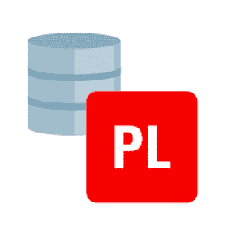
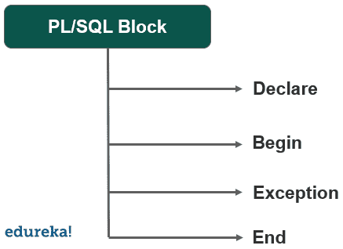
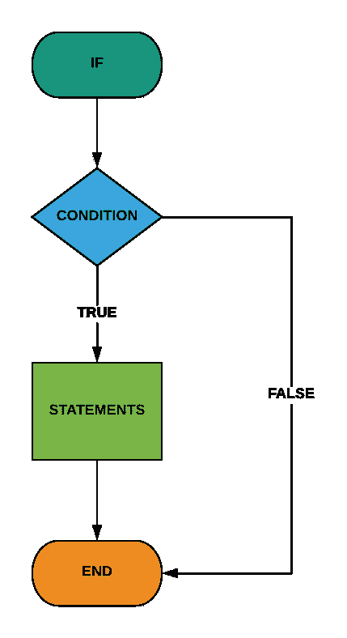
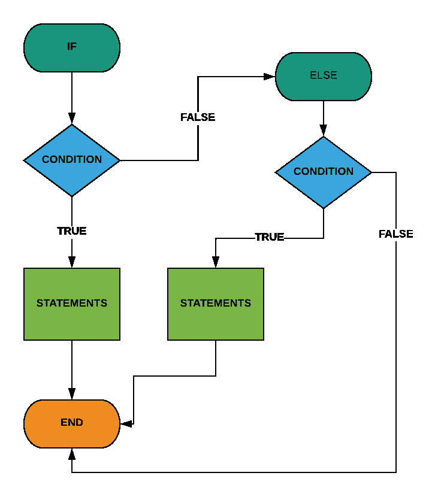
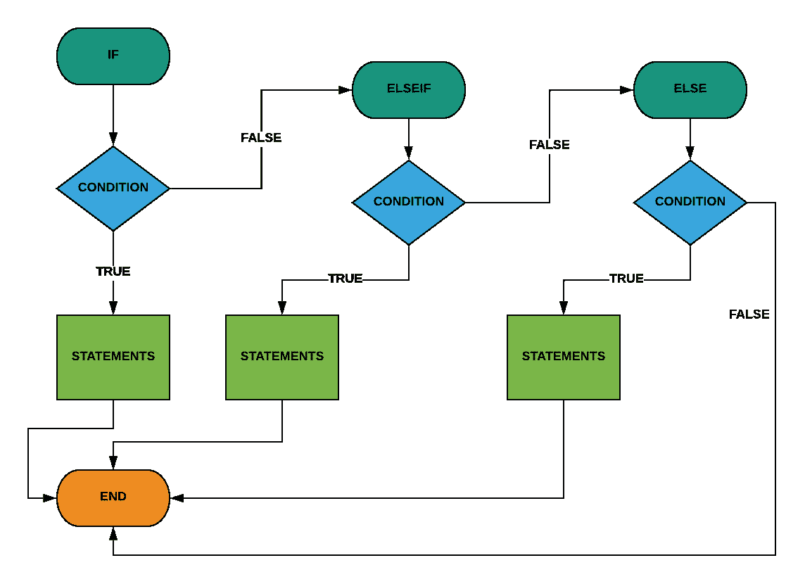

# PL/SQL 教程:关于 PL/SQL 你需要知道的一切

> 原文：<https://www.edureka.co/blog/pl-sql-tutorial/>

PL/SQL 是一种过程化语言，克服了[结构化查询语言](https://www.edureka.co/blog/what-is-sql/)所面临的缺点。它是 SQL 的扩展，我们甚至可以在任何 PL/SQL 应用程序或程序中毫无困难地使用 SQL 查询。在本 PL/SQL 教程中，我们将详细介绍 PL/SQL 的基本概念。本文涵盖了以下主题。

*   [什么是 PL/SQL？](#plsql)
    *   [特性](#features)
    *   [PL/SQL vs SQL](#vs)
*   [PL/SQL 中的块结构](#block)
*   [PL/SQL 变量](#variables)
*   [PL/SQL 中的函数](#function)
*   [PL/SQL 过程](#procedure)
*   [嵌套块](#nested)
*   [IF 语句](#if)
*   [案例陈述](#case)
*   [循环语句](#loop)
    *   [While 循环语句](#while)
    *   [For 循环语句](#for)
*   [异常处理](#exception)

## **什么是 PL/SQL？**

它代表对结构化查询语言的过程语言扩展。Oracle 创建了 PL/SQL，它扩展了 SQL 的一些限制，为构建在 oracle [数据库](https://www.edureka.co/blog/what-is-a-database/)上运行的任务关键型应用程序提供了更全面的解决方案。

## ****

### **特性**

*   PL/SQL 提供了过程语言的功能，如决策、迭代等。

*   使用一个命令，PL/SQL 可以执行许多查询。

*   我们还可以重用创建后存储在数据库中的 PL/SQL 单元，如函数、触发器、过程等。

*   PL/SQL 还有一个异常处理块，用于处理 PL/SQL 中的异常。

*   使用 PL/SQL 也可以进行广泛的错误检查

*   以 PL/SQL 编写的应用程序可移植到其他硬件和操作系统，前提是 oracle 必须可运行。

### **PL/SQL vs SQL**

| **SQL** | **PL/SQL** |
| SQL 是用于执行 DDL 和 DML 操作的单一查询 | PL/SQL 是用于定义整个程序或过程/功能等的代码块 |
| 它并没有真正定义事情需要如何做，而是定义了需要做什么 | PL/SQL 定义了事情需要如何完成 |
| 它执行一条语句 | 它一次执行一组语句。 |
| SQL 主要用于操作数据 | 另一方面，PL/SQL 用于创建应用程序 |
| 它不能包含 PL/SQL 代码 | 因为它是一个 SQL 扩展，所以它可以包含 SQL 代码 |

## **PL/SQL 中的块结构**

## ****

PL/SQL 通常将代码组织成块。没有名称的代码块称为匿名块。它被称为匿名块，因为它不保存在 oracle 数据库中。让我们看一下 PL/SQL 中的匿名块。

```
[DECLARE]
   declaration statements;
[BEGIN]
   execution statements;
   [EXCEPTION]
      exception statements;
END;
/

```

看上面的图，我们可以看到块结构分为四个部分，即声明、开始、异常和结束。让我们试着理解块结构在 PL/SQL 中是如何工作的。在所有这些部分中，执行部分是必需的，其余部分都是可选的。

*   **DECLARE** 关键字用于对用于声明的数据类型和结构如变量、函数等进行声明。

*   **BEGIN** 关键字用于执行段。它是强制性的，包含所有需要执行的语句。这个块是定义业务逻辑的地方，我们可以在这个块中使用过程语句或 SQL 语句。

*   **异常**关键字用于异常部分。它包含所有的异常语句。

*   **END** 关键字标记块的结尾，反斜杠“/”告诉您正在使用的工具(Oracle 数据库工具)来执行 PL/SQL 块。

这里有一个简单的例子来展示我们如何使用 PL/SQL 代码。

```
BEGIN
       NULL;
END;
/

```

现在我们知道了 PL/SQL 中的块结构是如何工作的，让我们了解 PL/SQL 的各个方面，如声明、命名和给变量赋值。

## **PL/SQL 变量**

PL/SQL 中的变量基本上是支持特定数据类型的可变名称或临时存储位置。让我们看看如何在 PL/SQL 程序中使用变量。

### **变量命名规则**

PL/SQL 遵循以下规则来命名变量。

*   变量不能超过 31 个字符

*   变量名应该以 ASCII 字符开头。由于 PL/SQL 区分大小写，大写字母和小写字母将是不同的变量。

*   在第一个字符之后，必须有一个特殊字符($，_)或任何数字。

### **命名惯例**

使用下面列出的命名约定来使用变量。

| **前缀** | **数据类型** |
| 五 _ | VARCHAR2 |
| n_ | 数字 |
| t_ | 桌子 |
| r_ | 排 |
| d_ | 日期 |
| b_ | 布尔型 |

### **申报**

让我们试着理解在 PL/SQL 中变量声明是如何完成的

声明包括变量名，后跟数据类型，并用分号分隔。下面的示例展示了如何在 PL/SQL 中声明变量。

```
DECLARE
   v_name VARCHAR(25);
   n_age NUMBER(3);
BEGIN
  NULL;
END;

```

您还可以添加数据类型的长度，就像我们在上面的示例中所做的那样。

### **锚**

锚基本上是指使用%TYPE 关键字来声明数据类型与表中特定列的数据类型相关联的变量。

看一个例子来理解这一点。假设我们有一个雇员表，我们可以按照下面的方式使用锚。

```
DECLARE
    v_name EMPLOYEE.NAME%TYPE;
    n_age    EMPLOYEE.AGE%TYPE;
BEGIN
   NULL;
END;
/

```

### **分配**

变量赋值是相当容易的，我们可以用赋值运算符给变量赋值。下面的例子展示了我们如何给一个变量赋值。

```
DECLARE
   v_name VARCHAR(20);
   n_course VARCHAR(10);
BEGIN
  v_name = "edureka";
  v_course = "sql";
END;
/

```

### **初始化**

我们也可以在声明部分为变量初始化一个值。下面的例子展示了我们如何初始化变量的值。

```
DECLARE
v_name VARCHAR(20) = "edureka";
n_course VARCHAR(10) = "sql";
BEGIN
 NULL;
END;
/

```

现在我们知道了如何处理变量，让我们试着理解如何在 PL/SQL 中使用函数。

## **PL/SQL 中的函数**

PL/SQL 中的函数基本上是一个返回值的命名块。它也被称为子例程或子程序，以下语法显示了我们如何在 PL/SQL 中使用函数。

```
CREATE [OR REPLACE] FUNCTION function_name [(
   parameter_1 [IN] [OUT] data_type,
   parameter_2 [IN] [OUT] data_type,
   parameter_N [IN] [OUT] data_type]
    RETURN return_data_type IS

BEGIN
   statements
   return return_data_type;
   EXCEPTION

END;
/

```

首先，必须在关键字后指定一个函数名。函数名必须以动词开头。一个函数可能没有参数，也可能有一个或多个我们在 parameters 中指定的参数。我们必须显式指定每个参数的数据类型，然后是可以执行以下任一操作的模式。

*   **IN–**IN 参数是一个只读参数。

*   **OUT–**这是一个只写参数

*   **IN OUT—**IN OUT 参数既是读写参数。

这里有一个简单的例子来展示我们如何在 PL/SQL 中使用函数。

```
CREATE OR REPLACE FUNCTION try_parse(
    iv_number IN VARCHAR2)
  RETURN NUMBER IS
BEGIN
   RETURN to_number(iv_number);
   EXCEPTION
     WHEN others THEN
        RETURN NULL;
END;

```

**调用函数**

让我们在下面的例子中尝试调用我们在匿名块中创建的函数。

```
SET SERVEROUTPUT ON SIZE 1000000;
DECLARE
  n_x number;
  n_y number;
   n_z number;
BEGIN
   n_x := try_parse('256');
   n_y := try_parse('29.72');
   n_z := try_parse('pqrs');

   DBMS_OUTPUT.PUT_LINE(n_x);
   DBMS_OUTPUT.PUT_LINE(n_y);
   DBMS_OUTPUT.PUT_LINE(n_z);
END;
/

```

我们也可以在 SELECT 语句中调用这个函数。现在我们知道了如何在 PL/SQL 中使用函数，让我们试着理解如何在 PL/SQL 中使用过程。

## **PL/SQL 过程**

过程基本上是一个完成特定任务的块。使用过程，我们可以包装或封装复杂的业务逻辑，并在应用程序和数据库层重用它们。

让我们看一个简单的例子来理解这个过程在 PL/SQL 中是如何工作的

```
CREATE OR REPLACE PROCEDURE adjust_salary(
    in_employee_id IN EMPLOYEES.EMPLOYEE_ID%TYPE,
    in_percent IN NUMBER
) IS
BEGIN
   -- update employee's salary
   UPDATE employees
   SET salary = salary + salary * in_percent / 100
   WHERE employee_id = in_employee_id;
END;

```

在上面的例子中，我们有两个参数，过程按给定的百分比调整薪水，关键字 UPDATE 更新薪水信息中的值。

**程序头**

关键字 IS 之前的部分称为过程头。以下是使用过程时必须熟悉的一些要点。

*   **schema–**它是过程所属的模式的可选名称。

*   **name–**以动词开头的过程的名称。

*   **参数—**是可选的参数列表。

*   **AUTHID–**它确定该过程是以当前用户的权限执行，还是以该过程的原始所有者的权限执行。

**程序体**

IS 关键字后面的所有内容都称为过程体。我们在过程体中有声明、异常和执行语句。与函数不同，过程中的 RETURN 关键字用于暂停执行并将控制权返回给调用方。

**调用程序**

让我们看看如何在 PL/SQL 中调用过程。

```

EXEC procedure_name(param1,param2…paramN);

```

我们可以只使用 EXEC 关键字和过程名来调用不带参数的过程。现在我们知道了如何使用过程，让我们试着理解如何在 PL/SQL 中使用嵌套块。

## **嵌套块**

嵌套块不过是一个或多个 PL/SQL 块的组合，以便更好地控制程序的执行和异常处理。

下面是一个嵌套块的简单示例。

```
SET SERVEROUTPUT ON SIZE 1000000;
DECLARE
  n_emp_id EMPLOYEES.EMPLOYEE_ID%TYPE := &emp_id1;
BEGIN
  DECLARE
    n_emp_id employees.employee_id%TYPE := &emp_id2;
    v_name   employees.first_name%TYPE;
  BEGIN
    SELECT first_name
    INTO v_name
    FROM employees
    WHERE employee_id = n_emp_id;

    DBMS_OUTPUT.PUT_LINE('First name of employee ' || n_emp_id || 
                                       ' is ' || v_name);
    EXCEPTION
      WHEN no_data_found THEN
        DBMS_OUTPUT.PUT_LINE('Employee ' || n_emp_id || ' not found');
  END;
END;
/

```

上例中的外部 PL/SQL 块称为父块或封闭块，而内部块则称为子块或封闭块。

在两个块中使用相同名称的变量不是一个好主意，因为在执行过程中，子块变量将覆盖父块变量。发生这种情况是因为 PL/SQL 将第一优先权赋予了它自己的块中的变量。

**块标签**

我们可以通过块标签来解决这个问题，块标签可以帮助我们使用标签来引用块中的变量。

这里有一个简单的例子来说明我们如何使用块标签。

```
<<block_label>>
DECLARE
...
BEGIN
...
END;

```

使用块标签有助于提高代码的可读性，获得更好的控制和对块的引用。现在我们知道了如何使用嵌套块，让我们试着理解 IF 语句在 PL/SQL 中是如何工作的。

## **IF 语句**

PL/SQL 有三个 IF 语句

*   **IF-THEN**–这是最简单的 IF 语句，如果条件为真，则执行语句，如果条件为假，则不执行任何操作。

*   **IF-THEN-ELSE–**在这里，ELSE 子句被添加用于替代语句序列。

*   **IF-THEN-else IF–**它允许我们按顺序执行多个测试条件。

**IF-THEN 语法**



```
IF condition THEN
   sequence_of_statements;
END IF;

```

**IF-THEN-ELSE 语法**



```
IF condition THEN
   sequence_of_if_statements;
ELSE
   sequence_of_else_statements;
END IF;

```

**IF-THEN-ELSEIF 语法**



```
IF condition1  THEN
   sequence_of_statements1
ELSIF condition2 THEN
   sequence_of_statements2
ELSE
   sequence_of_statements3
END IF;

```

现在我们已经完成了 IF 语句，让我们来看看 PL/SQL 中的 CASE 语句。

## **案例陈述**

CASE 语句主要帮助执行基于选择器的一系列语句。在这种情况下，选择器可以是任何东西，它可以是变量、函数或简单的表达式。下面是一个简单的例子，展示了 PL/SQL 中 CASE 语句的语法。

```
[<<label_name>>]
CASE [TRUE | selector]
   WHEN expression1 THEN
 sequence_of_statements1;
   WHEN expression2 THEN
 sequence_of_statements2;
   ...
   WHEN expressionN THEN
 sequence_of_statementsN;
  [ELSE sequence_of_statementsN+1;]
END CASE [label_name];

```

在上面的语法中，CASE 关键字后面是选择器。PL/SQL 将只评估选择器一次，以确定需要执行哪个语句。

选择器后面是 WHEN 关键字。如果表达式满足选择器，则执行 then 关键字后的相应语句。

现在我们知道了如何使用 CASE 语句，让我们试着理解如何在 PL/SQL 中使用 loop 语句。

## **循环语句**

PL/SQL 中的循环语句是一种迭代语句，允许您多次执行一系列语句。下面是一个简单的例子，展示了 PL/SQL 中循环语句的语法。

```
LOOP
   sequence_of_statements;
END LOOP;

```

在 LOOP 和 END LOOP 关键字之间必须至少有一个可执行语句。

**带有退出语句的循环**

EXIT 和 EXIT when 语句允许您退出循环。EXIT WHEN 语句有条件地终止循环，而 EXIT 语句无条件地终止执行。

```
LOOP
   ...
   EXIT WHEN condition;
END LOOP;

```

**循环标签**

在嵌套循环中使用时，循环标签用于限定循环计数器变量的名称。下面是循环标签的语法。

```
<<label>>
LOOP
   sequence_of_statements;
END LOOP label;

```

现在我们知道了如何使用循环语句，让我们来看看 while 循环语句，以便更好地理解。

## **While 循环语句**

当直到执行开始才定义执行次数时，我们可以使用 WHILE 循环语句。以下语法用于 PL/SQL 中的 WHILE 循环语句。

```
WHILE condition
LOOP
   sequence_of_statements;
END LOOP;

```

语法中的条件是一个布尔值或表达式，其值为 TRUE、FALSE 或 NULL。如果条件为真，则执行语句，如果条件为假，则停止执行，控制转到下一个可执行语句。

现在我们知道了如何使用 WHILE 循环语句，让我们来看看 FOR 循环语句。

## **For 循环语句**

PL/SQL 中的 FOR 循环语句允许我们执行一系列语句一定的次数。以下是 PL/SQL 中用于循环语句的语法

```
FOR loop_counter IN [REVERSE] lower_bound .. higher_bound
LOOP
   sequence_of_statements;
END LOOP;

```

PL/SQL 自动为循环创建一个整数数据类型的局部变量 loop_counter，这样您就不必显式声明它。下界..higherbound 是循环迭代的范围。此外，在 LOOP 和 END LOOP 关键字之间必须至少有一个可执行语句。

现在我们知道了如何在 PL/SQL 中使用循环语句，让我们来看看 PL/SQL 中的异常处理。

## **异常处理**

在 PL/SQL 中，任何种类的错误都被视为异常。异常可以被视为可以改变或变更执行流的特殊条件。在 PL/SQL 中，有两种类型的异常。

*   **系统异常–**当 PL/SQL 运行时检测到错误时，引发该异常。

*   **程序员定义的异常–**这些异常由程序员在特定应用中定义。

**定义异常**

PL/SQL 中的异常必须在引发之前声明。我们可以使用 exception 关键字来定义异常，就像我们在下面的例子中所做的那样。

```
EXCEPTION_NAME EXCEPTION;

```

要引发异常，我们使用 raise 关键字。

```
RAISE EXCEPTION_NAME;

```

以上是关于 PL/SQL 的所有内容，我希望这篇文章能够帮助您增加知识的价值。更多关于 SQL 或者数据库的信息，可以参考我们这里的综合阅读清单:  [**数据库 Edureka**](https://www.edureka.co/blog/category/databases/) 。

*如果您希望获得有关 MySQL 的结构化培训，那么请查看我们的 **[MySQL DBA 认证培训](https://www.edureka.co/mysql-dba)** ，它附带有讲师指导的现场培训和真实项目体验。本培训将帮助您深入了解 MySQL，并帮助您掌握这门学科。*

有问题要问我们吗？请在“ **PL/SQL 教程**的评论区提及，我会回复你。