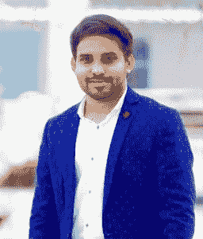
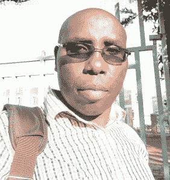
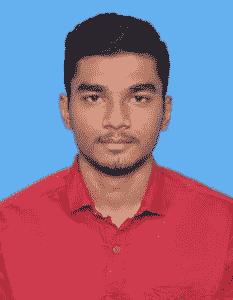

# 国际学生日:励志教育课程学习者的故事

> 原文：<https://www.edureka.co/blog/international-students-day-learners-stories/>

国际学生节到了！虽然全球范围内的每个人都准备庆祝这一事件，但我们 Edureka 决定庆祝我们的学员。

我们都从阅读伟大的成功故事中得到启发，并被激励去做得更好以实现我们的目标。考虑到这一点，我们决定与我们的一些学员取得联系，听听他们与 Edureka 的旅程，以及他们是如何实现自己的生活和职业目标的！

在这个博客中，我们将展示一些来自不同生活领域的最令人惊奇的学习者的故事。我们试图捕捉他们的旅程和改变生活的决定的本质。现在就让我们用他们自己的话来认识他们吧。

**手机座**

**认识赤拉尼维**

我的职业生涯始于大型机开发人员。正是我对大数据的兴趣激励我去了解更多，于是我决定选择 Edureka 的大数据项目。是的，“程序”到目前为止，我已经在 Edureka 完成了 Python for Big Data Analytics、Apache Spark 和 Scala 以及 AWS 架构师培训项目。那太多了。但当我开始时，我没有意识到这一点。嗯，我很高兴我没有，因为他们给我在云&大数据领域的 Innoscape 找到了一份梦寐以求的工作。

**与爱德华卡的旅程:**

选择 Edureka 课程无疑是一个改变人生的决定，因为它帮助我从大型机到大数据实现了成功的职业转型。

我真的很喜欢 Edureka 提供的内容，它是一切的一站式解决方案。除此之外，他们还有出色的技术支持和课程模块。毫无疑问，这是一个很好的学习平台。 我要感谢 Edureka 团队，感谢你们的大力支持。

完成大数据硕士课程后，我期待着在 Edureka 注册更多课程。

**subhashree**

**遇见 Subhasree**

我在印孚瑟斯公司担任 Linux 管理员。我报名参加了 Edureka 的 Java 和高级 Java 课程，因为这是在工作中与我的客户互动所必需的。我们与不同的客户进行面谈，可以在中到高难度之间进行评估。为了破解面试，我们必须精通不同的技术。所以，我决定是时候提高技能了，至少能够理解我们的客户使用的令人讨厌的词语。令我惊讶的是，我从课程中学到的知识确实帮助我破解了这些互动。

**与爱德华卡的旅程:**

我与 Edureka 的旅程可以追溯到 2014 年，当时我正在寻找一门 Android 课程来帮助我完成毕业设计。爱德华卡一直是我的头等大事。他们有一些最好的导师，很棒的互动直播。最棒的是，你可以终身使用购买的课程。我是说，你还需要什么？

到目前为止，我和 Edureka 的经历很不寻常。他们对您的所有技术或非技术问题都提供超级积极的客户支持，并尽一切可能为您提供帮助。

齐拉鲁夏·皮埃尔·瑟雷斯迪

**认识齐拉鲁夏:**

在 UNILAK(基加利基督复临会大学)担任讲师，我一直梦想着让每个人都能接触到技术，尤其是我的学生。作为一名教师，经常为学生着想是你的天性。坦率地说，这个梦想一直是我计划在大学引入 Python 的驱动因素。学习新事物和提高技能一直是我生活中的第一要务。为了解渴，我开始跟着爱德华卡学习。

**与爱德华卡的旅程:**

我在 Edureka 成功完成了数据科学、网络安全和机器学习的 Python 课程。这两个项目(Python 和数据科学&使用 Python 的机器学习)对我的博士项目(仍在进行中)都非常有帮助。

Edureka 课程质量很高，许多作业中都包含基于行业的案例研究。我喜欢 Edureka 团队的敬业精神，从无懈可击的 24/7 支持到直播课程结束后的一对一会议，一切都帮助我消除了疑虑。

万达纳·活女神

**遇见凡达娜:**

我一直在 L & T Infotech 做 Java 和 Springboot 微服务。我相信培养你的技能总是一个好主意，因为这不仅能让你在游戏中保持领先，还能让你的思维活跃。正是在产假期间，我决定充分利用这段时间，提升自己的技能。多亏了互联网，现在获取信息变得更加容易。当我遇到 Edureka 时，我对数据科学课程的追求结束了。

**与爱德华卡的旅程:**

我参加了 Edureka 的 Python 数据科学课程。它帮助我在产假后成功地恢复了我的职业生涯。我特别喜欢这门课的内容。他们也有一些非常好的教练，确保你努力训练。另一件有趣的事情是 Edureka 课程的设计方式适合各种各样的受众，甚至像我这样的初学者。

拉特希什瓦拉国王

**遇见**T2【Ratheeshwaraa:

我是一名计算机科学工程专业的毕业生，期待在机器学习和人工智能领域开创自己的事业。我一直对数据着迷，成为印度最好的数据科学家之一是我的激情所在。所以，当我决定选择这个领域的课程时，我浏览了 100 多个电子学习平台。说实话，不止这些。当我正在努力寻找一个时，我的朋友把我介绍给了 Edureka，把我从这个黑洞中拉了出来。剩下的就是历史了！

我完成了很多课程，如 Python 脚本认证培训、统计分析基础、JavaScript 和 JQuery 基础培训、Python 数据科学、使用 R 的数据科学认证课程、以及使用 Edureka 的 MySQL DBA 认证培训，并且没有计划就此停止。

**与爱德华卡的旅程:**

爱德华卡进入我的生活后，很多事情都变了。凭借从他们的课程中获得的知识，我参加了政府组织的黑客马拉松，并因展示了我的最终项目而获得了现金奖励。一家公司也给了我一份数据科学家的合同。

Edureka 增加了我的学习机会，并一直支持我发展事业。

因陀玛蒂

**遇见因陀玛蒂**

我做了将近 4 年的 ETL——应用开发专家。当今市场的竞争相当激烈，人们致力于不断提高自己的技能。所以，我决定加入这场比赛，并获得一个独特的趋势技能。那时我报名参加了 Edureka 的大数据课程。我很高兴我这么做了，因为这让我在德国的 Euroclear 找到了一份工作。

**与爱德华卡的旅程:**

老实说，一开始我有点不情愿，但互动直播是学习任何东西的最好方式。这位教练精通业务，经验丰富。我真的很喜欢 Edureka 课程让你从简单的事情到更高级的事情建立强大的基础。

这些是我们学生的一些故事。我们很荣幸能成为我们的学生已经开始的这些非凡旅程的一部分。他们已经证明，只要有激情和决心的正确组合，你就能实现你想要的目标和当之无愧的成功。恭喜所有人！我们希望这些鼓舞人心的学习者的故事能鼓励你，激励你去追寻你的梦想，永远不要放弃自己。