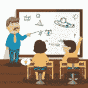
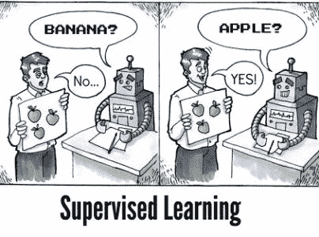
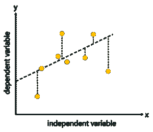
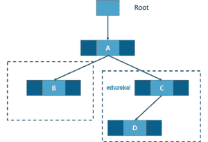
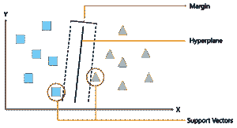

# 什么是监督学习及其不同类型？

> 原文：<https://www.edureka.co/blog/supervised-learning/>

机器学习。世界上几乎所有人都听说过这种东西，但不知道它到底是如何运作的。你想知道[机器学习](https://www.edureka.co/blog/machine-learning-tutorial/)是如何施展魔法的吗？机器学习有哪些不同的类型？你知道什么是监督学习吗？如果没有，让我通过这篇文章为你解答那些问题。

文章被分成以下几个部分:

*   [机器学习概述](#overview)
*   [什么是监督学习？](#supervised)
*   [为什么重要？](#importance)
*   [监督学习的类型](#types)
*   [应用](#applications)
*   [监督与非监督学习](#versus)
*   [监督学习的弊端](#disadv)

因此，准备好接触监督学习的所有知识吧。让我们开始吧:)

## **机器学习概述**

对于那些不知道什么是机器学习的人来说？机器学习，用最简单的术语来说，就是教你的机器一些东西。你收集数据，清理数据，创建[算法](https://www.edureka.co/blog/machine-learning-algorithms/)，从数据中教授算法基本模式，然后期待算法给你一个有用的答案。如果算法不辜负你的期望，你就成功教会了你的算法。如果没有，就废弃一切，从头开始。这就是这里的工作方式。哦，如果你正在寻找一个正式的定义，**机器学习是创建模型的过程，这些模型可以执行特定的任务，而不需要人类显式地对它编程来做某事**。

基于算法的创建方式，有 3 种类型的机器学习。他们是:

*   **监督学习**–你监督学习过程，这意味着你在这里收集的数据被标记，因此你知道什么输入需要映射到什么输出。如果你的算法在给你答案时出错，这有助于你纠正它。
*   [**无监督学习**](https://www.edureka.co/blog/unsupervised-learning/)——这里收集的数据没有标签，你不确定输出。因此，您对算法进行建模，使其能够理解数据中的模式，并输出所需的答案。当算法学习时，你不干涉。
*   [**强化学习**](https://www.edureka.co/blog/q-learning/)——这种学习没有数据，也不教算法任何东西。你给算法建模，让它与环境互动，如果算法做得好，你奖励它，否则惩罚它。随着不断的互动和学习，对于分配给它的问题，它会从不好变得最好。

既然你对什么是机器学习和不同类型的机器学习有了基本的概念，让我们深入讨论这里的实际话题，并回答什么是监督学习？监督学习用在哪里？监督学习有哪些类型？监督学习算法和更多！

## 什么是监督学习？

监督学习是制作算法来学习将输入映射到特定输出的过程。这是通过使用您收集的带标签的数据集实现的。如果映射正确，则该算法已经成功学习。否则，您需要对算法进行必要的更改，以便它能够正确学习。监督学习算法可以帮助我们对未来获得的新的未知数据进行预测。

这类似于师生场景。有一位老师指导学生从书本和其他材料中学习。然后对学生进行测试，如果正确，学生通过。否则，老师会调教学生，让学生从他或她过去犯的错误中学习。这是监督学习的基本原则。

我再举一个现实生活中的例子，可以帮助你理解监督学习到底是什么。

**监督学习的例子**

假设你有一个刚满 2 岁的侄女，正在学说话。她知道“爸爸”和“妈妈”这两个词，因为她的父母教过她如何称呼它们。你想教她什么是狗和猫。那你是做什么的？你要么给她看狗和猫的视频，要么带一只狗和一只猫在现实生活中给她看，这样她就能明白它们有什么不同。

现在你告诉她一些事情，让她明白这两种动物之间的区别。

*   狗和猫都有四条腿和一条尾巴。
*   狗有小有大。另一方面，猫总是很小。
*   狗的嘴巴长，而猫的嘴巴小。
*   狗叫，猫喵。
*   不同的狗有不同的耳朵，而猫有几乎相同的耳朵。

现在你带你的侄女回家，给她看不同的狗和猫的照片。如果她能够区分狗和猫，你就成功地教会了她。

这里发生了什么？你在那里引导她达到区分狗和猫的目标。你教会了她猫和狗的所有区别。然后你测试她是否能够学习。如果她能学会，她就把狗叫成狗，把猫叫成猫。如果没有，你教她更多，并且能够教她。你充当了监督者，你的侄女充当了必须学习的算法。你甚至知道什么是狗，什么是猫。确保她学的是正确的东西。这就是监督学习遵循的原则。

现在对监督学习有了基本的了解，让我们也了解一下这种学习的重要性。

## 为什么它很重要？

*   学习给予算法经验，该经验可用于输出对新的看不见的数据的预测
*   经验也有助于优化算法的性能
*   监督学习算法也可以处理现实世界的计算

了解了监督学习的重要性之后，让我们来看看监督学习的类型以及算法！

## **监督学习的类型**

监督学习大致分为两种类型。

*   **回归**
*   **分类**

回归是一种监督学习，它从带标签的数据集学习，然后能够为算法提供的新数据 **预测连续值输出** 。每当需要的输出是一个数字时，如钱或身高等，就使用它。 下面讨论一些流行的监督学习算法:

*   [**线性回归**](https://www.edureka.co/blog/linear-regression-in-python/)–该算法假设它所学习的数据的两个变量输入(X)和输出(Y)之间存在线性关系。将 **输入变量** 称为 *自变量* ，将 **输出变量** 称为 *因变量* 。当看不见的数据传递给算法时，它使用函数，计算并将输入映射为输出的连续值。
*   [**逻辑回归**](https://www.edureka.co/blog/logistic-regression-in-python/)–该算法预测传递给它的独立变量集的离散值。它通过将看不见的数据映射到已编程的 **逻辑函数** 来进行预测。该算法预测新数据的概率，因此其输出介于 0 和 1 之间。

另一方面，分类是一种学习，其中算法需要将获得的新数据映射到我们数据集中的两个类中的任何一个。这些类别需要被映射到 1 或 0，在现实生活中被翻译成“是”或“否”、“下雨”或“不下雨”等等。输出将是其中一个类，而不是回归中的数字。下面讨论一些最著名的算法:

*   [**决策树**](https://www.edureka.co/blog/decision-tree-algorithm/)——决策树根据特征值进行分类。他们使用 ***信息增益*** 的方法，找出数据集的哪个特征给出了最好的信息，将其作为根节点等等，直到他们能够对数据集的每个实例进行分类。决策树中的每个分支代表数据集的一个特征。它们是最广泛使用的分类算法之一。
*   [**朴素贝叶斯分类器**](https://www.edureka.co/blog/naive-bayes-tutorial/)–朴素贝叶斯算法假设数据集的所有特征都是相互独立的。它们非常适合大型数据集。有向无环图(DAG)用于分类的目的。
*   [**【SVM】**](https://www.edureka.co/blog/support-vector-machine-in-r/)——SVM 算法基于 Vap Nik 的统计学习理论。他们使用核心函数，这是大多数学习任务的核心概念。这些算法创建了一个超平面，用于将这两个类别相互分类。

因此，我希望你对监督学习的两种类型和其中一些最流行的算法有一个清晰的了解。让我们来看看它的应用。

**监督学习的应用**

监督学习算法被用于多种应用中。让我们来看看一些最著名的应用。

*   **生物信息学**——这是监督学习最著名的应用之一，因为我们大多数人在日常生活中都会用到它。生物信息学是存储我们人类的生物信息如指纹、虹膜纹理、耳垂等。今天的手机能够学习我们的生物信息，然后能够认证我们，带来系统的安全性。智能手机如 iPhones、谷歌 Pixel 能够进行面部识别，而一加、三星能够进行显示手指识别。
*   [**语音识别**](https://www.edureka.co/blog/speech-recognition-python/)——这是一种你教算法你的声音，它就能识别你的应用。最知名的现实世界应用是谷歌助手和 Siri 等虚拟助手，它们只会用你的声音唤醒关键词。
*   **垃圾邮件检测**–该应用程序用于阻止不真实或基于计算机的消息和电子邮件。G-Mail 有一种算法，可以学习不同的关键字，这些关键字可能是假的，如“你是某事的赢家”等等，并直接阻止这些消息。一加消息应用程序给用户的任务是让应用程序学习哪些关键字需要被阻止，该应用程序将阻止这些关键字的消息。
*   [**物体识别**](https://www.edureka.co/blog/tensorflow-object-detection-tutorial/) **用于视觉**——这种应用在你需要识别某物的时候使用。你有一个庞大的数据集，你用它来教你的算法，这可以用来识别一个新的实例。检测物体的 Raspberry Pi 算法是最著名的例子。

这些都是监督学习在当今现实世界中大放异彩并展现其勇气的地方。至此，让我们转到监督学习和非监督学习之间的区别。

## **监督与非监督学习**

| **参数** | **监督学习** | **无监督学习** |
| 数据集 | 标注为 | 未标记的 |
| 学习方法 | 引导式学习 | 该算法使用数据集进行自我学习 |
| 复杂度 | 更简单的方法 | 计算复杂 |
| 精度 | 更精确 | 不太准确 |

## **监督学习的缺点**

在使用这些算法时，监督学习有很多挑战和缺点。让我们看看这些。

*   你可以很容易地使你的算法溢出
*   需要使用好的例子来训练数据
*   监督学习的计算时间非常大
*   不需要的数据会降低精确度
*   数据预处理始终是一项挑战
*   如果数据集不正确，您会使您的算法学习不正确，这会带来损失

既然我们已经完成了所有的缺点，让我们回过头来总结一下今天所学的内容。

我们概述了什么是[机器学习](https://www.edureka.co/blog/videos/python-machine-learning/)及其各种类型。然后，我们深入了解了监督学习是什么，为什么它如此重要。后来，我们经历了各种类型的监督学习，即回归和分类。之后，我们讨论了各种算法，监督学习的应用，监督学习和非监督学习之间的差异，以及当您使用监督学习算法时可能面临的缺点。

这就把我们带到了文章的结尾。我希望它已经帮助你以一种清晰而精确的方式理解了什么是监督学习。下次再见，学习愉快！

*既然你已经知道了 S**supervised Learning**，那就来看看 Edureka 的 [**机器学习工程师硕士项目**](https://www.edureka.co/masters-program/machine-learning-engineer-training)* *，这是一家值得信赖的在线学习公司，拥有遍布全球的 25 万多名满意的学习者。*

*Edureka 的**机器学习工程师硕士项目**课程是为想要成为机器学习工程师的学生和专业人士设计的。本课程旨在让你精通监督学习、非监督学习和自然语言处理等技术。它包括人工智能&机器学习方面的最新进展和技术方法的培训，如深度学习、图形模型和强化学习。*

*有问题吗？请在这个“**的评论区提到它什么是监督学习，它是如何工作的？**“博客，我们会尽快回复您。*